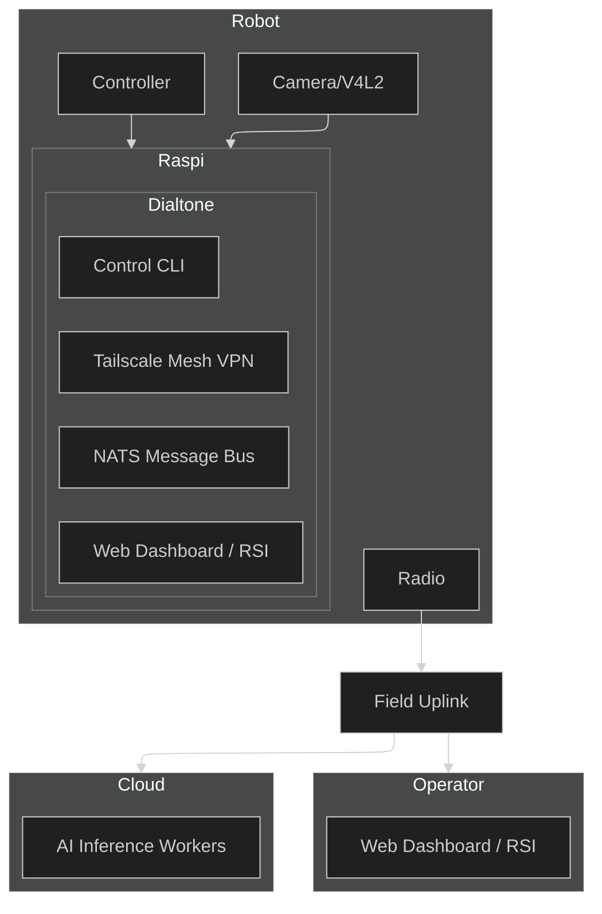

# [Dialtone](https://dialtone.earth)

### Current Purpose: 
Augment civic infrastructure and education by creating 
- An open source encrypted communications network
- `DIALTONE` a virtual librarian for mathematics, physics, and engineering
- Garage buildable kits for radios and robotic systems
- Plugins for tasks like education, engineering, policy and 
- `DIALTONE` skills for managing suppliy chains, maintenance and operations

### How you work
The Virtual Librarian helps you navigate the system step by step, turning questions into tickets, tickets into tests, and tests into safe deployable robotic systems.

### What it runs on
A CLI-first workflow paired with a secure mesh VPN and a global message bus for commands, telemetry, logs, and coordination.

### What you get
Reliable communication between robots and humans, from lab bench to field deployment.

### Earth Library
Dialtone includes a Earth library that mirrors global robotic activity and environments. This Earth library integrates telemetry, fleet location, and situational context directly into the library, making operations and coordination inherently spatial.

Get started:

```bash
git clone https://github.com/timcash/dialtone.git
cd dialtone
./dialtone.sh install
./dialtone.sh ticket start <ticket-name>
./dialtone.sh ticket next
```


# Vision
Dialtone is a virtual library for distributed robotic systems—and a foundation for marketplaces that support education, training, research, manufacturing, maintenance, and real-world operations. The vision is to make robotics work end-to-end by treating fleets as living systems: observable, upgradeable, secure, and learnable.

### Self-improving loop
As the network grows, Dialtone captures what works (tests, tickets, logs, telemetry) so new capabilities can be composed from proven building blocks instead of reinvented per robot.

### Open hardware + software
Robotics fails when stacks are locked to a vendor or a single lab. Openness enables interoperability, reproducibility, and a shared library of components that anyone can modify and deploy.

### Remote operations
Real robots live in the field. Supervising, teleoperating, and teaching remotely is what turns prototypes into systems that can be maintained and improved over time.

### Private, encrypted networking
Without secure identity and encrypted transport, you can’t safely control a fleet, move sensitive telemetry, or accept third-party integrations. Security is the prerequisite for scale.

### Field radios for real bandwidth
Operations require low-latency control plus high-rate video/telemetry where traditional links fail. Radios are the bridge between robots, edge compute, and operators in contested environments.

### Geospatial context
Robots act in physical space. A geospatial operating system provides shared ground truth—where assets are, what terrain means, and how to coordinate actions across an area.

### AI-assisted education
A library only matters if people can use it. Dialtone pairs operational tooling with guided learning so teams can understand the math and science behind the system as they build and deploy.

Together, these pieces create a reliable substrate—a “robotic internet”—that a **library** (reusable components, workflows, and validated upgrades) and a **marketplace** (parts, services, training, and integrations) can be built on top of with confidence.


# Development Hierarchy
1. **Tickets**: The first step of any change. Ideal for adding new code that can patch `core` or `plugin` code without changing it directly.
2. **Plugins**: The second step is integrating new code into specific feature areas.
3. **Core**: Core code is reserved for features dealing with networking and deployment (dialtone/dialtone-dev). It is the minimal code required to bootstrap the system.

# Tickets
Use the `ticket` command for new work. It enforces TDD and standardized markdown schemas.
```bash
./dialtone.sh ticket add <ticket-name>      # Scaffold src/tickets/
./dialtone.sh ticket start <ticket-name>    # Branch, push, and open Draft PR
./dialtone.sh ticket ask <question>         # Add a log.md entry for current ticket
./dialtone.sh ticket ask --subtask <subtask-name> <question> # Tie question to a subtask
./dialtone.sh ticket log <message>          # Add a general log entry for current ticket
./dialtone.sh plugin test <plugin-name>     # Run plugin tests
./dialtone.sh ticket next                   # Primary TDD driver: runs next test and updates state
./dialtone.sh ticket done                   # Final push, PR Ready-for-review, switch to main
```

### Ticket Structure
For tickets created via `./dialtone.sh ticket start <ticket-name>`:
```
src/tickets/<ticket-name>/
└── test/
    └── test.go        # Go integration tests (TDD loop)
└── ticket.md          # Ticket description and subtasks
```

# Plugins
Plugins are feature modules that extend Dialtone with specific operational capabilities. Each plugin packages code, tests, and tooling so you can add functionality without changing core networking and deployment primitives.

### Autocode
Implements ticket-driven, test-first code changes and validation loops so upgrades can be developed, reviewed, and rolled out consistently across machines.

### CLI
Provides the command surface for operators and automation, exposing common workflows (tickets, plugins, logs, build/deploy) through a single interface.

### AI
Integrates vision and language components to interpret operator intent, summarize state, and assist with planning and execution within the ticket/test workflow.

### VPN
Establishes private, identity-aware connectivity between nodes so control and telemetry can traverse networks securely without bespoke tunnel setup.

### RSI
Supports human + AI coordination primitives (shared plans, task decomposition, status) for multi-step work that spans fleets and environments.

### Marketplace
Defines interfaces and workflows for discovering, distributing, and operating third-party parts, services, training, and integrations on top of the base platform.

### Bus
Implements message transport patterns for commands, events, telemetry, logs, and streams so components can coordinate with low coupling and clear contracts.

### Radio
Adds field uplink support for deployments that require non-traditional links, keeping control and data flowing when standard connectivity is unavailable.

### Autoconfig
Automates node bring-up: discovery, configuration, and enrollment so new devices can join the network with minimal manual steps.

### Geo
Provides geospatial models and utilities for location-aware operations, enabling mapping, spatial queries, and coordinated actions over an area.

### CAD
Enables simulation-first validation and rollout safety checks so changes can be evaluated before they affect real hardware.

### Web
Delivers web-based visibility and control surfaces for operators, with status, dashboards, and workflows that complement the CLI.

### Social
Adds communication and coordination channels for teams, capturing context around operations and making collaboration auditable and searchable.

### Cyber
Implements security automation (scanning, hardening, monitoring) to reduce exposure and detect issues across distributed deployments.

### Maintenance
Tracks upkeep workflows—health checks, repair cycles, parts usage, and service history—so fleets remain operable over time.

### Mocks
Provides hardware-free simulations and mock interfaces to speed development, testing, and CI without requiring physical devices.

### Weather
Integrates weather data and forecasting inputs that affect safety, planning, routing, and mission scheduling.

### Plugin CLI
The `plugin` command is used to manage Dialtone plugins.
```bash
./dialtone.sh plugin add <plugin-name> # Add a README.md to src/plugins/<plugin-name>/README.md
./dialtone.sh plugin install <plugin-name> # Install dependencies
./dialtone.sh plugin build <plugin-name> # Build the plugin
./dialtone.sh plugin test <plugin-name> # Runs tests in src/plugins/<plugin-name>/test/
```
### Plugin Folder Structure
For new plugins created via `./dialtone.sh plugin create <plugin-name>`:
```
src/plugins/<name>/
├── app/               # Application code
├── cli/               # CLI command code
├── test/              # Plugin-specific tests
└── README.md          # Plugin documentation
```


# Logs
- Logs are used extensively in the system for live debugging and monitoring.
### Log Format
- The log format is: `[timestamp | level | file:function:line] message`

```shell
# Log Examples
[2026-02-03T12:00:00.123Z07:00 | INFO  | main.go:run:42] starting dialtone
[2026-02-03T12:00:01.004Z07:00 | WARN  | bus.go:connect:88] reconnecting to nats...
[2026-02-03T12:00:01.217Z07:00 | ERROR | vpn.go:up:133] failed to bring vpn up: permission denied
[2026-02-03T12:00:01.219Z07:00 | FATAL | main.go:run:57] unrecoverable error, exiting
```

```bash
./dialtone.sh logs # Tail and stream local logs
./dialtone.sh logs --remote # Tail and stream remote logs
./dialtone.sh logs --lines 10 # get the last 10 lines of local logs
./dialtone.sh logs --remote --lines 10 # get the last 10 lines of remote logs
```


# Build & Deploy
```bash
./dialtone.sh build         # Build Web UI + local CLI + robot binary
./dialtone.sh deploy        # Push to a remote robot
./dialtone.sh diagnostic    # Run tests on a remote robot
```

# GitHub & Pull Requests
```bash
./dialtone.sh github pr           # Create or update a pull request
./dialtone.sh github pr --draft   # Create as a draft
```

# Git Workflow
```bash
git status                        # Check git status
git add .                         # Add all changes
git commit -m "feat|fix|chore|docs: description" # Commit changes
git push --set-upstream origin <branch-name> # push branch to remote first time
git push                          # Push updated branch to remote
git pull origin main              # Pull changes
git merge main                    # Merge main into current branch
```

# Develop the WWW site
```bash
./dialtone.sh www dev # Start local development server
./dialtone.sh www build # Build the project locally
./dialtone.sh www publish # Deploy the webpage to Vercel
./dialtone.sh www logs <deployment-url-or-id> # View deployment logs
./dialtone.sh www domain [deployment-url] # Manage the dialtone.earth domain alias
./dialtone.sh www login # Login to Vercel
```

# Architecture
Dialtone is built on a "Network-First" architecture, prioritizing secure, low-latency communication between distributed components.




# Workflows
1. [Issue Review](docs/workflows/issue_review.md): Planning-only triage flow that audits issues, asks clarifying questions, and promotes validated tickets.
2. [Ticket](docs/workflows/ticket.md): Execution workflow for ticket-driven development using `ticket` from start through done with TDD and scope control.
3. [Subtask Expansion](docs/workflows/subtask_expand.md): Planning flow to refine or split subtasks into clear, testable 10-minute units.


# Join the Mission
Dialtone is an open project with an ambitious goal. We are looking for:
- **Robot Builders**: To integrate their hardware and test the system.
- **AI Researchers**: To deploy models into the RSI and automate tasks.
- **Developers**: To help us build the most accessible robotic network on Earth.