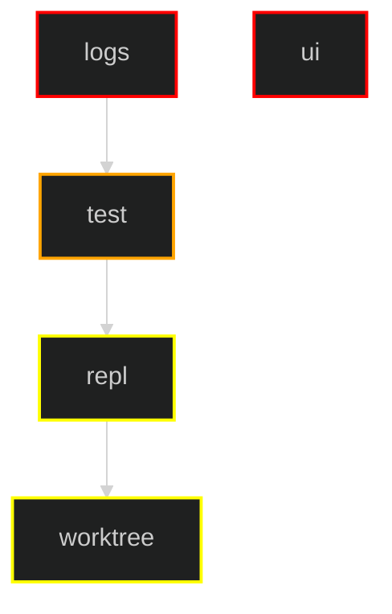

# Plugin Dependency DAG (logs, test, ui, repl, worktree)

This map focuses on cross-plugin coupling between:
- `logs`
- `test`
- `ui`
- `repl`
- `worktree`

## Legend
| Layer | Color | Meaning |
|---|---|---|
| **1. Foundation** | █ Red | Base/shared capability plugins |
| **2. Test Harness** | █ Orange | Reusable test orchestration |
| **3. Orchestration** | █ Yellow | User-facing orchestration plugins |

## Circularity Check
- No cycle among the mapped plugins after removing `logs -> test` coupling.
- Remaining direction is `logs -> test` only (the `test` plugin imports logs APIs).

## Notes Per Plugin
- `logs`:
  - Base rank plugin for logging infrastructure.
  - Does not depend on `test` plugin.
  - Is depended on by `test` for logging APIs.
- `test`:
  - Reused by `repl` tests (`src/plugins/repl/src_v1/test/test_ctx.go`).
- `ui`:
  - No direct coupling to the other four plugins in this set.
- `repl`:
  - Uses `test` for its test harness.
  - Orchestrates `worktree` commands at runtime/test flow level.
- `worktree`:
  - No direct Go import dependency on `test`, `logs`, or `ui` in current implementation.

## If You Want `logs` as Strict First Rank
`logs` is now strict first rank within this plugin set.
