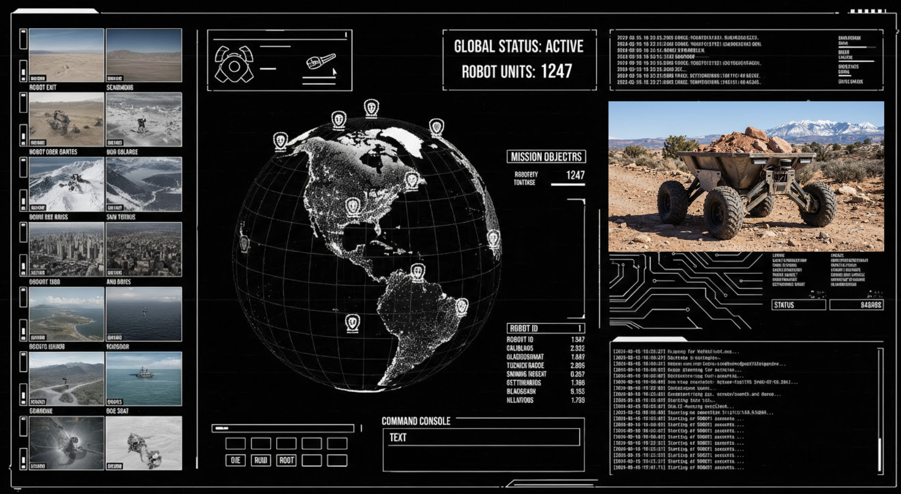
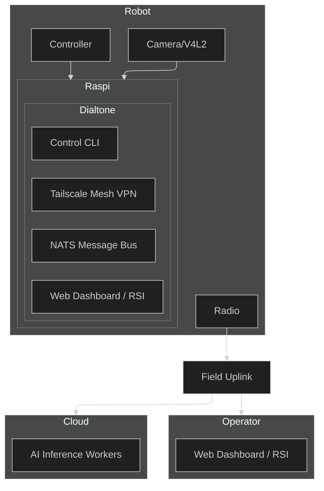

# Dialtone

Dialtone is aspirationally a **robotic video operations network** designed to allow humans and AI to cooperatively train and operate thousands of robots simultaneously with low latency.



# Vision`
The future of robotics is collaborative. Dialtone aims to combine human intuition and machine precision by providing a unified mesh network:
- **Humans** can remotely oversee, teleoperate, and teach robots from anywhere in the world.
- **AI Agents** can learn from human demonstrations, process complex sensory data, and execute tasks autonomously.
- **Open Radio Feild Uplink** open source radio and compute hardware to make relaying real-time video and telemetry possible.
- **Single Software Binary** a single binary that can run on any device to join the global robotic mesh.
- **Robotic Hardware** robotic hardware for factory, field civic and home automation becomes widley available.
- **Open Assembly Instructions** robot system can be assembled in a garage with the correct tools and parts.
- **Maintainable Parts and Code** robot parts and code are designed to be maintainable and upgradeable working in a cyclic ecosystem.


# Architecture Overview
Dialtone is built on a "Network-First" architecture, prioritizing secure, low-latency communication between distributed components.



# Features
0. Simple single binary CLI to connect and control any robot
    - Cross platform support for Windows, MacOS, and Linux
    - Single command builds and deploys for ARM64 targets like Raspberry Pi
1. Built in virtual private network and peer discovery
    - Users on the network are identified by unique IDs
    - Access control lists for users and robots
2. Scalable command and control data structures
    - Request/reply for commands
    - Queuing for fanout and load balancing 
    - Streaming for live or replay of telemetry and video
4. Automated discovery and configuration
    - **Sensors**: Plug-and-play support for cameras (V4L2), microphones, IMUs, and LIDAR.
    - **Actuators**: Unified control interface for PWM servos, stepper motors, and CAN-bus motor controllers.
    - **Compute**: Dynamic allocation of local and edge resources for AI inference and video encoding.
    - **Storage**: Automatic management of ring-buffer logs and cloud-synced telemetry.
    - **Network**: Zero-config peer-to-peer connectivity even behind restrictive NATs.

5. Vision and LLM AI assisted operation.
    - Real-time object detection and tracking for robot navigation.
    - Natural language commanding (e.g., "Go to the kitchen and find the blue mug").
    - Automated troubleshooting using onboard LLMs to analyze telemetry anomalies.

6. System-Tuned Language Model.
    - Integrated development assistant trained on Dialtone's source code and hardware specifications.
    - Context-aware code generation for new robot plugins and control logic.

7. Geospatial intelligence.
    - Integration with Google Earth Engine for environmental context and terrain analysis.
    - Intelligent alerting based on GPS boundaries and satellite imagery updates.
    - Global multi-robot fleet visualization on 3D maps.

8. CAD and Simulation.
    - Built-in modeling tools to assist with hardware modifications and 3D printing.
    - "Digital Twin" simulation to test control logic in a virtual environment before deployment.
    - Popular localisation and mapping algorithms pre integrated like PyCuVSLAM

9. Public Robot Presence.
    - Publicly accessible URLs at `https://<robot_id>.dialtone.computer` for live streaming and status.
    - Integrated WebRTC for low-latency remote control from any browser.

10. Collaborative RSI (Realtime Strategy Interface).
    - A strategic dashboard where humans and AI agents cooperatively manage robot swarms.
    - Drag-and-drop mission planning and real-time command override.

11. Community and Social.
    - One-click sharing of robot "moments" to social platforms to engage with the public.
    - Collaborative "Robot Parties" where multiple users can interact with a shared robot world.

# Documentation Map
Detailed information about System Architecture, Installation, and Development can be found in the [docs/](./docs) directory:

- **[System Design & Tech Stack](./docs/techstack.md)**: Hardware/Software stack overview.
- **[Installation & Setup](./docs/install.md)**: Prerequisites and environment configuration.
- **[Build & Deployment](./docs/cli.md)**: Native and containerized builds, WSL support, and deployment commands.
- **[Development Workflow](./docs/develop.md)**: TDD loop, code style, and logging.
- **[Networking (Tailscale)](./docs/tsnet.md)**: Identity-based networking and automated provisioning.
- **[Messaging (NATS)](./docs/nats.md)**: System message bus and real-time telemetry.
- **[Testing Guide](./docs/test.md)**: Unit tests, integration tests, and UI screenshots.
- **[TODO](./todo.md)**: List of features to implement.


# Quick Start (WSL/Linux No-Sudo)
The fastest way to get started on WSL or Linux without administrative privileges:
```bash
# Clone the repo
gh clone https://github.com/timcash/dialtone.git

# Environment setup if no previous install or cli binary is avaible to help with build
export CC="/home/user/.dialtone_env/zig/zig cc -target x86_64-linux-gnu"
export CGO_ENABLED=1
export CGO_CFLAGS="-I/home/user/.dialtone_env/usr/include -I/home/user/.dialtone_env/usr/include/x86_64-linux-gnu"
export PATH="/home/user/.dialtone_env/go/bin:/home/user/.dialtone_env/node/bin:$PATH"

# Install dependencies into ~/.dialtone_env (Go, Node, Zig, V4L2 headers)
go run . install-deps --linux-wsl

# Perform a native full-build (includes Web UI and Camera support)
go run . full-build -local

# Start the node locally
./bin/dialtone start -local-only
```

For standard ARM64 cross-compilation using Podman:

```bash
# Build the manager and deploy to a remote target
go build -o bin/dialtone .
bin/dialtone full-build
bin/dialtone deploy
```

## Why Dialtone uses Golang
1. Compiled language
2. Produces single binary executables that are easy to deploy
3. Concurrency Designed into the language
4. Excellent standard library with strong ecosystem
5. Cross compilation support
6. Type safety
7. Networking support

# Join the Mission
Dialtone is an open project with an ambitious goal. We are looking for:
- **Robot Builders**: To integrate their hardware and test the system.
- **AI Researchers**: To deploy models into the RSI and automate tasks.
- **Developers**: To help us build the most accessible robotic network on Earth.

Check out the [TODO.md](./todo.md) to see where you can contribute, or start by running the [Quick Start](#quick-start-wsllinux-no-sudo) guide.
