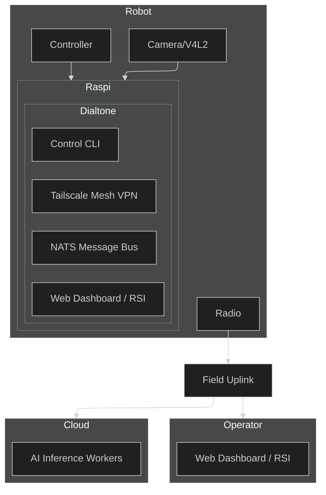

# [Dialtone](https://dialtone.earth)

Dialtone is aspirationally a **robotic video operations network** designed to allow humans and AI to cooperatively train and operate thousands of robots simultaneously with low latency. Dialtone is open source and free to use and lets people get paid to build, train and operate robots.


# Vision
Dialtone aims to combine human intuition and machine precision into a unified mesh network, making robotic hardware for factory, field, civic, and home automation widely available.
1. Humans can remotely oversee, teleoperate, and teach robots from anywhere in the world.
2. AI agents can learn from human demonstrations, process complex sensory data, and execute tasks autonomously.
3. Field Radio Uplinks (FRU) relay real-time video and telemetry through open-source radio and compute hardware.
4. A Single Software Binary (SSB) is simple to deploy and use.
5. With Open Assembly Instructions, the robot system can be assembled in a garage with the correct tools and parts.
6. Maintainable Parts and Code ensure robot parts and code are designed to be maintainable and upgradeable, working in a cyclic ecosystem.

## Features
### Dialtone Autocode: System-Tuned Language Model and Self-Modifying Code
- The CLI (Command Line Interface) contains a deep neural network to modify the source code when requested.
- It overcomes unforeseen challenges live by adapting the code with human-in-the-loop feedback.
- Code can be modified to fix bugs, improve performance, or add new features.
- It includes an integrated development assistant trained on Dialtone's source code and hardware specifications.
- It provides context-aware code generation for new robot plugins and control logic.
- Users can share `Dialtone Autocode` sessions with a web link.

### Dialtone CLI: Simple Single Binary to Connect and Control Any Robot
- It offers cross-platform support for Windows, macOS, and Linux.
- Single command builds and deploys for ARM64 targets like Raspberry Pi.
- The binary contains tools to connect and copy itself to other devices.

### Dialtone VPN: Built-in Virtual Private Network and Peer Discovery
- Users on the network are identified by unique IDs.
- It supports Access Control Lists (ACLs) for users and robots.

### Dialtone Bus: Scalable Command and Control Data Structures
- It uses request/reply patterns for commands.
- It supports queuing for fanout and load balancing.
- It enables streaming for live or replay of telemetry and video.

### Dialtone Autoconfig: Automated Discovery and Configuration
- **Sensors**: Plug-and-play support for cameras (V4L2), microphones, IMUs, and LIDAR.
- **Actuators**: Unified control interface for PWM servos, stepper motors, and CAN-bus motor controllers.
- **Compute**: Dynamic allocation of local and edge resources for AI inference and video encoding.
- **Storage**: Automatic management of ring-buffer logs and cloud-synced telemetry.
- **Network**: Zero-config peer-to-peer connectivity even behind restrictive NATs.

### Dialtone AI: Vision and LLM AI-Assisted Operation
- Real-time object detection and tracking for robot navigation.
- Natural language commanding (e.g., "Go to the kitchen and find the blue mug").
- Automated troubleshooting using onboard LLMs to analyze telemetry anomalies.

### Dialtone Geo: Geospatial Intelligence
- Integration with Google Earth Engine for environmental context and terrain analysis.
- Intelligent alerting based on GPS boundaries and satellite imagery updates.
- Global multi-robot fleet visualization on 3D maps.

### Dialtone CAD: CAD and Simulation
- Built-in modeling tools assist with hardware modifications and 3D printing.
- "Digital Twin" simulations test control logic in a virtual environment before deployment.
- Popular localization and mapping algorithms, like PyCuVSLAM, are pre-integrated.
- FEA (Finite Element Analysis) for stress testing and simulation.
- CFD (Computational Fluid Dynamics) for fluid dynamics simulation.
- Thermal, EMI (Electromagnetic Interference), and other physics simulations.
- Mesh transformation tools for moving between topologies like triangle and quad meshes, point clouds, and voxels.

### Dialtone Web: Public Robot Presence
- Publicly accessible URLs at `https://<robot_id>.dialtone.earth` for live streaming and status.
- Integrated WebRTC for low-latency remote control from any browser.

### Dialtone RSI: Collaborative RSI (Realtime Strategy Interface)
- A strategic dashboard where humans and AI agents cooperatively manage robot swarms.
- Drag-and-drop mission planning and real-time command override.

### Dialtone Social: Community and Social
- One-click sharing of robot "moments" to social platforms to engage with the public.
- Collaborative "Robot Parties" where multiple users can interact with a shared robot world.

### Dialtone Radio: Open Radio Field Uplink
- Open-source radio and compute hardware to make relaying real-time video and telemetry possible.

### Dialtone Cyber Defense: Security and Privacy
- Live monitoring of network traffic for anomalies.
- Automated response to security threats.
- Privacy-preserving design with end-to-end encryption.
- Automated key rotation.

### Dialtone Maintenance
- Supply chain tools.
- Detailed assembly and maintenance instructions.
- Automated software updates.
- Automated hardware diagnostics and repair via regional repair centers.

### Dialtone Marketplace
- Robotic parts and assemblies.
- Field services.
- Maintenance services.
- Engineering services like Electrical, Mechanical, and Software.
- Data services to store and analyze robot data.
- AI services to provide AI assistance.

# Test-Driven Development (TDD)
Dialtone is built with a "Test-First" philosophy. Every function, feature, and plugin must have automated tests. The system is designed such that the tests drive the development process.

### Development Hierarchy
1. **Ticket**: The first step of any change. Ideal for adding new code that can patch `core` or `plugin` code without changing it directly.
2. **Plugin**: The second step is integrating new code into specific feature areas.
3. **Core**: Core code is reserved for features dealing with networking and deployment (dialtone/dialtone-dev). It is the minimal code required to bootstrap the system.

# Overall Project Structure
1. `./tickets/<ticket_name>/ticket.md` - Contains a ticket description for any changes needed to the system.
2. `./src` - Contains all source code.
3. `./src/plugins` - Contains all plugins.
4. `./test` - Contains core test files.
5. `./docs` - Contains virtual machine and container code for assisting development and testing.
6. `./docs/vendor/<vendor_name>` - Contains vendor documentation.
7. `./example_code` - Contains example code for helping integration or guiding design.
8. `AGENT.md` - Contains information for code agents to understand this repo.
9. `README.md` - Contains information for users to understand this repo at a high level.
10. `dialtone.go` - Contains the main entry point for the system.
11. `dialtone-dev.go` - Contains the development entry point for the system.
12. `./dialtone.sh` - CLI tool for that wraps `dialtone-dev` development (Linux/macOS).
13. `./dialtone.ps1` - CLI tool for that wraps `dialtone-dev` development (Windows).

### Ticket Lifecycle
Tickets are the primary unit of work in the system. They are used to track changes to the system.
```bash
# 1a. Start Work
# Start work on a ticket (creates/certifies branch and files)
./dialtone.sh ticket start <ticket-name>

# 1b. Create Plugin (optional if the ticket needs it) 
# Create a new plugin to fill in files for the plugin structure
./dialtone.sh plugin create <plugin-name>

# 2. Test First
# Update a test before writing new code and run the test to show a failure.
./dialtone.sh ticket test <ticket-name>

# 3. Implement
# Change the system until the test passes.
# e.g. edit tickets/<ticket-name>/code/stage1.go

# 3. Test Again
# Show tests are now passing after the code changes.
# You can run ticket-specific tests:
./dialtone.sh ticket test <ticket-name>

# Or run tests for a specific plugin if applicable:
./dialtone.sh plugin test <plugin-name>

# Or run tests for a specific feature by name:
./dialtone.sh test <name>

# 4. Track
# Update tickets/<ticket-name>/ticket.md to reflect subtasks completed and those remaining.
# Update tickets/<ticket-name>/task.md for scratchpad notes.

# 5. Verify All Tests Pass
# Run all tests.
./dialtone.sh test

# 6. Git Hygiene
# Use git add to update git and ensure .gitignore is correct. Make atomic commits.
git add .
git commit -m "feat: description"

# 7. Create Pull Request
# Create a pull request for your changes.
./dialtone.sh github pull-request

# 8. Merge/Close Pull Request
# After review, merge or close the pull request.
./dialtone.sh github pull-request merge
# or
./dialtone.sh github pull-request close
```

### Ticket Structure
For tickets created via `./dialtone.sh ticket start <ticket-name>`:
1. `tickets/<ticket-name>/ticket.md` - The requirement doc (from template).
2. `tickets/<ticket-name>/task.md` - Scratchpad for tracking progress.
3. `tickets/<ticket-name>/code/` - Local code playground for the ticket.
4. `tickets/<ticket-name>/test/` - Ticket-specific verification tests.

### Plugin Development Structure
For new plugins created via `./dialtone.sh plugin create <plugin-name>`:
1. `src/plugins/<name>/app` - Application code.
2. `src/plugins/<name>/cli` - CLI command code.
3. `src/plugins/<name>/test` - Plugin-specific tests.
4. `src/plugins/<name>/README.md` - Plugin documentation.

## Quick Start (WSL/Linux No-Sudo)

The fastest way to get started on WSL or Linux without administrative privileges:
```bash
# Clone the repo
git clone https://github.com/timcash/dialtone.git
export DIALTONE_ENV="~/dialtone_env"

# Install dependencies, and setup environment (Linux/macOS)
./dialtone.sh install --linux-wsl

# Windows equivalent:
./dialtone.ps1 install --linux-wsl

# Perform a local build of the robot binary(includes Web UI and Camera support)
./dialtone.sh build

# Start the robot node locally (not the development cli)
./dialtone.sh robot start
```

# Join the Mission
Dialtone is an open project with an ambitious goal. We are looking for:
- **Robot Builders**: To integrate their hardware and test the system.
- **AI Researchers**: To deploy models into the RSI and automate tasks.
- **Developers**: To help us build the most accessible robotic network on Earth.


# Architecture Overview
Dialtone is built on a "Network-First" architecture, prioritizing secure, low-latency communication between distributed components.



