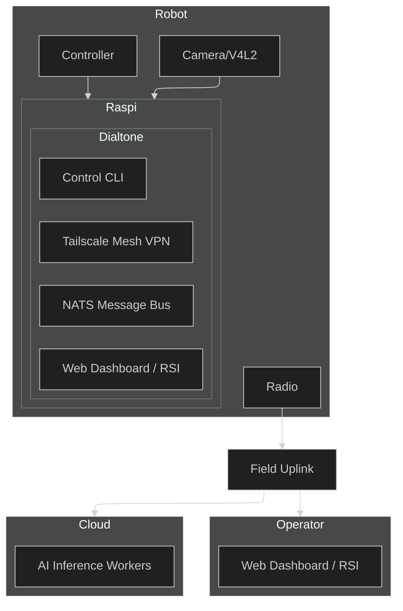

# [Dialtone](https://dialtone.earth)

Dialtone is a AI assisted Command Line Interface (CLI) for building, testing, and operating large robotic video and data networks.


# Vision
Dialtone is a clean-room build for robotic systems that scale through four concrete capabilities:
1. Open hardware and software so anyone can build, modify, and deploy the stack.
2. Human-in-the-loop remote operations so people can supervise, teleoperate, and teach robots.
3. Private, encrypted network communication that keeps fleets secure and coordinated.
4. Field radios that move real-time video and telemetry across open radio and compute hardware.
5. A geospatial operating system to manage robots across real-world terrain and context.
6. Self-adapting programs that learn, compose, and improve as the network grows.

# Skills
Skill are systems of systems that combine into valuable real world actions like navigating a robot or modifying and testing code.
1. Autocode: Fast, safe code evolution that scales AI-assisted control across large robot networks.
2. CLI: A single operational interface that standardizes control across distributed fleets.
3. AI: Vision and language assistance that turns operator intent into network-wide actions.
4. VPN: Private, identity-aware networking that keeps large robot networks connected and secure.
5. RSI: Collaborative planning that aligns humans and AI across multi-robot missions.
6. Marketplace: Parts and services access that scales buildout and support for large networks.
7. Bus: Scalable command and telemetry flow that coordinates many robots at once.
8. Radio: Field uplinks that maintain network control when traditional links fail.
9. Autoconfig: Automated device discovery that accelerates bringing new nodes into the network.
10. Geo: Geospatial context that enables coordinated operations over large areas.
11. CAD: Simulation-first validation that reduces risk when rolling updates across fleets.
12. Web: Public and operator visibility that extends network control beyond the CLI.
13. Social: Shared moments and coordination channels that strengthen network engagement.
14. Cyber: Security automation that constantly scan the network for threats.
15. Maintenance: Cyclic parts and repair supply chains that keep distributed fleets sustainable.
16. Mocks: Hardware-free simulations to speed testing and development.

# Binary Architecture: Production vs. Development
Both systems contain the same core code but differ in their capabilities.
1. `dialtone` a single binary with embeded vpn that networks robots together.
2. `dialtone-dev` developer workflows for installing, building, and testing the system.

# Test-Driven Development (TDD)
1. A test is created for every development task.
2. The test is written before the code therefor driving the design and implementation.

# `dialtone` development and CLI
1. Use only these two tools as much as possible `dialtone.sh` CLI and `git`
2. Always run `./dialtone.sh ticket start <ticket-name>` before making any changes.
3. `dialtone.sh` is a simple wrapper around `src/dev.go`

## Clone
```bash
git clone https://github.com/timcash/dialtone.git # Clone the repo
cd dialtone
```

## Installation & Setup
```bash
git pull origin main # update main so you can integrate it into your ticket
./dialtone.sh install # Install dev dependencies
./dialtone.sh install --remote # Install dev dependencies on remote robot
```


## Ticket Lifecycle
Use the `ticket` command for new work. It enforces TDD and standardized markdown schemas.
```bash
./dialtone.sh ticket add <ticket-name>      # Scaffold src/tickets/
./dialtone.sh ticket start <ticket-name>    # Branch, push, and open Draft PR
./dialtone.sh ticket ask <question>         # Add a log.md entry for current ticket
./dialtone.sh ticket ask --subtask <subtask-name> <question> # Tie question to a subtask
./dialtone.sh ticket log <message>          # Add a general log entry for current ticket
./dialtone.sh plugin test <plugin-name>     # Run plugin tests
./dialtone.sh ticket next                   # Primary TDD driver: runs next test and updates state
./dialtone.sh ticket done                   # Final push, PR Ready-for-review, switch to main
```

## Running Tests: Tests are the most important concept in `dialtone`
```bash
./dialtone.sh plugin test <plugin-name> # Run tests for a specific plugin
./dialtone.sh plugin test <plugin-name> --subtask <subtask-name> # Run specific subtask test
./dialtone.sh plugin test <plugin-name> --list  # List tests that would run
./dialtone.sh plugin test <plugin-name> # Run all tests for a plugin
```

## Logs
```bash
./dialtone.sh logs # Tail and stream local logs
./dialtone.sh logs --remote # Tail and stream remote logs
./dialtone.sh logs --lines 10 # get the last 10 lines of local logs
./dialtone.sh logs --remote --lines 10 # get the last 10 lines of remote logs
```

## Plugin Lifecycle
```bash
./dialtone.sh plugin add <plugin-name> # Add a README.md to src/plugins/<plugin-name>/README.md
./dialtone.sh plugin install <plugin-name> # Install dependencies
./dialtone.sh plugin build <plugin-name> # Build the plugin
./dialtone.sh plugin test <plugin-name> # Runs tests in src/plugins/<plugin-name>/test/
```

## Build & Deploy
```bash
./dialtone.sh build --full  # Build Web UI + local CLI + robot binary
./dialtone.sh deploy        # Push to remote robot
./dialtone.sh diagnostic    # Run tests on remote robot
./dialtone.sh logs --remote # Stream remote logs
```

## GitHub & Pull Requests
```bash
./dialtone.sh github pr           # Create or update a pull request
./dialtone.sh github pr --draft   # Create as a draft
```

## Git Workflow
```bash
git status                        # Check git status
git add .                         # Add all changes
git commit -m "feat|fix|chore|docs: description" # Commit changes
git push --set-upstream origin <branch-name> # push branch to remote first time
git push                          # Push updated branch to remote
git pull origin main              # Pull changes
git merge main                    # Merge main into current branch
```

## Develop the WWW site
```bash
./dialtone.sh www dev # Start local development server
./dialtone.sh www build # Build the project locally
./dialtone.sh www publish # Deploy the webpage to Vercel
./dialtone.sh www logs <deployment-url-or-id> # View deployment logs
./dialtone.sh www domain [deployment-url] # Manage the dialtone.earth domain alias
./dialtone.sh www login # Login to Vercel
```

# Development Hierarchy
1. **Ticket**: The first step of any change. Ideal for adding new code that can patch `core` or `plugin` code without changing it directly.
2. **Plugin**: The second step is integrating new code into specific feature areas.
3. **Core**: Core code is reserved for features dealing with networking and deployment (dialtone/dialtone-dev). It is the minimal code required to bootstrap the system.


## Architecture Overview
Dialtone is built on a "Network-First" architecture, prioritizing secure, low-latency communication between distributed components.



## Project Structure
```
dialtone/
├── src/               # All source code
│   ├── plugins/       # All plugins
│   └── tickets/       # Standardized tickets
├── docs/              # VM and container docs
│   └── vendor/<vendor_name>/  # Vendor docs
├── dialtone.sh        # CLI wrapper for `src/dev.go` (Linux/macOS/WSL)
└── README.md          # Repo overview
```

## Ticket Structure
For tickets created via `./dialtone.sh ticket start <ticket-name>`:
```
src/tickets/<ticket-name>/
└── test/
    └── test.go        # Go integration tests (TDD loop)
```

## Plugin Development Structure
For new plugins created via `./dialtone.sh plugin create <plugin-name>`:
```
src/plugins/<name>/
├── app/               # Application code
├── cli/               # CLI command code
├── test/              # Plugin-specific tests
└── README.md          # Plugin documentation
```

# Workflows
1. [Issue Review](docs/workflows/issue_review.md): Planning-only triage flow that audits issues, asks clarifying questions, and promotes validated tickets.
2. [Ticket](docs/workflows/ticket.md): Execution workflow for ticket-driven development using `ticket` from start through done with TDD and scope control.
3. [Subtask Expansion](docs/workflows/subtask_expand.md): Planning flow to refine or split subtasks into clear, testable 10-minute units.


# Join the Mission
Dialtone is an open project with an ambitious goal. We are looking for:
- **Robot Builders**: To integrate their hardware and test the system.
- **AI Researchers**: To deploy models into the RSI and automate tasks.
- **Developers**: To help us build the most accessible robotic network on Earth.