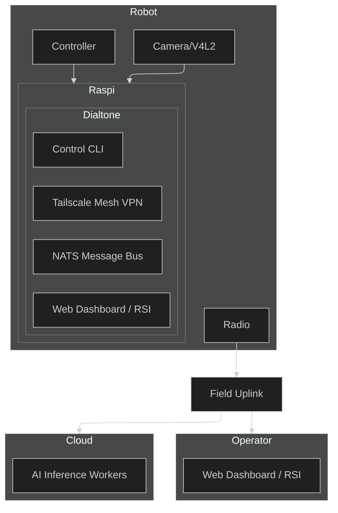

# [Dialtone](https://dialtone.earth)

Dialtone is aspirationally a **robotic video operations network** designed to allow humans and AI to cooperatively train and operate thousands of robots simultaneously with low latency. Dialtone is open source and free to use and lets people get paid to build, train and operate robots.


# Vision
Dialtone aims to combine human intuition and machine precision into a unified mesh network, making robotic hardware for factory, field, civic, and home automation widely available.
1. Humans can remotely oversee, teleoperate, and teach robots from anywhere in the world.
2. AI agents can learn from human demonstrations, process complex sensory data, and execute tasks autonomously.
3. Field Radio Uplinks (FRU) relay real-time video and telemetry through open-source radio and compute hardware.
4. A Single Software Binary (SSB) is simple to deploy and use.
5. Open Assembly Instructions allow the robot system to be assembled in a garage with the correct tools and parts.
6. Maintainable Parts and Code create a cyclic ecosystem.

## Features
### Dialtone Autocode: System-Tuned Language Model and Self-Modifying Code
- The CLI (Command Line Interface) contains a deep neural network to modify the source code when requested.
- Autocode overcomes unforeseen challenges live by adapting the code with human-in-the-loop feedback.
- Code can be modified to fix bugs, improve performance, or add new features.
- The Autocode assistant includes an integrated development assistant trained on Dialtone's source code and hardware specifications.
- Autocode provides context-aware code generation for new robot plugins and control logic.
- Users can share `Dialtone Autocode` sessions with a web link.

### Dialtone Mock Mode: Hardware-Free Development
- Develop and test the dashboard UI without physical hardware.
- Generates fake telemetry (heartbeat, attitude, GPS) and video streams (color gradient).
- Disables hardware drivers (camera, serial/UDP Mavlink) and AI features (OpenCode) for a lightweight, fast dev loop.
- Activate via `dialtone start --mock`.

### Dialtone CLI: Simple Single Binary to Connect and Control Any Robot
- Dialtone CLI offers cross-platform support for Windows, macOS, and Linux.
- Single command builds and deploys for ARM64 targets like Raspberry Pi.
- The binary contains tools to connect and copy itself to other devices.

### Dialtone VPN: Built-in Virtual Private Network and Peer Discovery
- Users on the network are identified by unique IDs.
- The VPN plugin supports Access Control Lists (ACLs) for users and robots.

### Dialtone Bus: Scalable Command and Control Data Structures
- Dialtone Bus uses request/reply patterns for commands.
- The Bus supports queuing for fanout and load balancing.
- The Data Bus enables streaming for live or replay of telemetry and video.

### Dialtone Autoconfig: Automated Discovery and Configuration
- **Sensors**: Plug-and-play support for cameras (V4L2), microphones, IMUs, and LIDAR.
- **Actuators**: Unified control interface for PWM servos, stepper motors, and CAN-bus motor controllers.
- **Compute**: Dynamic allocation of local and edge resources for AI inference and video encoding.
- **Storage**: Automatic management of ring-buffer logs and cloud-synced telemetry.
- **Network**: Zero-config peer-to-peer connectivity even behind restrictive NATs.

### Dialtone AI: Vision and LLM AI-Assisted Operation
- Real-time object detection and tracking for robot navigation.
- Natural language commanding (e.g., "Go to the kitchen and find the blue mug").
- Automated troubleshooting using onboard LLMs to analyze telemetry anomalies.

### Dialtone Geo: Geospatial Intelligence
- Integration with Google Earth Engine for environmental context and terrain analysis.
- Intelligent alerting based on GPS boundaries and satellite imagery updates.
- Global multi-robot fleet visualization on 3D maps.

### Dialtone CAD: CAD and Simulation
- Built-in modeling tools assist with hardware modifications and 3D printing.
- "Digital Twin" simulations test control logic in a virtual environment before deployment.
- Popular localization and mapping algorithms, like PyCuVSLAM, are pre-integrated.
- FEA (Finite Element Analysis) for stress testing and simulation.
- CFD (Computational Fluid Dynamics) for fluid dynamics simulation.
- Thermal, EMI (Electromagnetic Interference), and other physics simulations.
- Mesh transformation tools for moving between topologies like triangle and quad meshes, point clouds, and voxels.

### Dialtone Web: Public Robot Presence
- Publicly accessible URLs at `https://<robot_id>.dialtone.earth` for live streaming and status.
- Integrated WebRTC for low-latency remote control from any browser.

### Dialtone RSI: Collaborative RSI (Realtime Strategy Interface)
- A strategic dashboard where humans and AI agents cooperatively manage robot swarms.
- Drag-and-drop mission planning and real-time command override.

### Dialtone Social: Community and Social
- One-click sharing of robot "moments" to social platforms to engage with the public.
- Collaborative "Robot Parties" where multiple users can interact with a shared robot world.

### Dialtone Radio: Open Radio Field Uplink
- Open-source radio and compute hardware to make relaying real-time video and telemetry possible.

### Dialtone Cyber Defense: Security and Privacy
- Live monitoring of network traffic for anomalies.
- Automated response to security threats.
- Privacy-preserving design with end-to-end encryption.
- Automated key rotation.

### Dialtone Maintenance
- Supply chain tools.
- Detailed assembly and maintenance instructions.
- Automated software updates.
- Automated hardware diagnostics and repair via regional repair centers.

### Dialtone Marketplace
- Robotic parts and assemblies.
- Field services.
- Maintenance services.
- Engineering services like Electrical, Mechanical, and Software.
- Data services to store and analyze robot data.
- AI services to provide AI assistance.

# Binary Architecture: Production vs. Development

Dialtone uses a dual-binary approach to separate runtime efficiency from developer tooling. Both binaries rely on the same core code but expose different capabilities.

```text
+-----------------------+       +-----------------------+
|   Production Binary   |       |   Development Binary  |
|      (dialtone)       |       |    (dialtone-dev)     |
+-----------------------+       +-----------------------+
|  [ Runtime Core ]     |       |  [ Runtime Core ]     |
|   - start             |       |   - start             |
|   - vpn               |       |   - vpn               |
+-----------------------+       +-----------------------+
|                       |       |  [ Dev Tools ]        |
|                       |       |   - build             |
|                       |       |   - deploy            |
|                       |       |   - test              |
|                       |       |   - ticket            |
|                       |       |   - ...               |
+-----------------------+       +-----------------------+
```

| Feature | Production (`dialtone`) | Development (`dialtone-dev`) |
| :--- | :---: | :---: |
| **`start`** (Run Robot Software) | ✅ | ✅ |
| **`vpn`** (Run VPN Node) | ✅ | ✅ |
| **Developer Tools** (build, test, etc.) | ❌ | ✅ |

# Test-Driven Development (TDD)
Dialtone is built with a "Test-First" philosophy. Every function, feature, and plugin must have automated tests. The system is designed such that the tests drive the development process.

# `dialtone` development and CLI
1. Use only these two tools as much as possible `dialtone.sh` CLI and `git`
2. Always run `./dialtone.sh ticket start <ticket-name>` before making any changes.
3. `dialtone.sh` is a simple wrapper around `src/dev.go`

## Clone
```bash
git clone https://github.com/timcash/dialtone.git # Clone the repo
cd dialtone
```

## Installation & Setup
```bash
git pull origin main # update main so you can integrate it into your ticket
mv -n .env.example .env # Only if .env does not exists
./dialtone.sh install # Install dev dependencies
./dialtone.sh install --remote # Install dev dependencies on remote robot
```

## Ticket Lifecycle
```bash
./dialtone.sh ticket add <ticket-name> # Add a ticket.md to tickets/<ticket-name>/
./dialtone.sh ticket start <ticket-name> # Creates branch and draft pull-request
./dialtone.sh ticket subtask list <ticket-name> # List all subtasks in tickets/<ticket-name>/ticket.md
./dialtone.sh ticket subtask next <ticket-name> # prints the next todo or process subtask for this ticket
./dialtone.sh ticket subtask test <ticket-name> <subtask-name> # Runs the subtask test
./dialtone.sh ticket subtask done <ticket-name> <subtask-name> # mark a subtask as done
./dialtone.sh ticket done <ticket-name>  # Final verification and pull-request submission
```

## Running Tests: Tests are the most important concept in `dialtone`
```bash
./dialtone.sh test ticket <ticket-name> # Run all subtask tests for the specific ticket
./dialtone.sh test ticket <ticket-name> --subtask <subtask-name> # Run a specific subtask test
./dialtone.sh test plugin <plugin-name> # Run tests for a specific plugin
./dialtone.sh test tags [tag1 tag2 ...] # Run tests matching any of the specified tags
./dialtone.sh test --list               # List tests that would run
./dialtone.sh test                      # Run all tests
```

## Logs
```bash
./dialtone.sh logs # Tail and stream local logs
./dialtone.sh logs --remote # Tail and stream remote logs
./dialtone.sh logs --lines 10 # get the last 10 lines of local logs
./dialtone.sh logs --remote --lines 10 # get the last 10 lines of remote logs
```

## Plugin Lifecycle
```bash
./dialtone.sh plugin add <plugin-name> # Add a README.md to src/plugins/<plugin-name>/README.md
./dialtone.sh plugin install <plugin-name> # Install dependencies
./dialtone.sh plugin build <plugin-name> # Build the plugin
./dialtone.sh test plugin <plugin-name> # Runs tests in src/plugins/<plugin-name>/test/
```

## Build & Deploy
```bash
./dialtone.sh build --full  # Build Web UI + local CLI + robot binary
./dialtone.sh deploy        # Push to remote robot
./dialtone.sh diagnostic    # Run tests on remote robot
./dialtone.sh logs --remote # Stream remote logs
```

## GitHub & Pull Requests
```bash
./dialtone.sh github pr           # Create or update a pull request
./dialtone.sh github pr --draft   # Create as a draft
./dialtone.sh github check-deploy # Verify Vercel deployment status
```

## Git Workflow
```bash
git status                        # Check git status
git add .                         # Add all changes
git commit -m "feat|fix|chore|docs: description" # Commit changes
git push --set-upstream origin <branch-name> # push branch to remote first time
git push                          # Push updated branch to remote
git pull origin main              # Pull changes
git merge main                    # Merge main into current branch
```

## Develop the WWW site
```bash
./dialtone.sh www dev # Start local development server
./dialtone.sh www build # Build the project locally
./dialtone.sh www publish # Deploy the webpage to Vercel
./dialtone.sh www logs <deployment-url-or-id> # View deployment logs
./dialtone.sh www domain [deployment-url] # Manage the dialtone.earth domain alias
./dialtone.sh www login # Login to Vercel
```

# Development Hierarchy
1. **Ticket**: The first step of any change. Ideal for adding new code that can patch `core` or `plugin` code without changing it directly.
2. **Plugin**: The second step is integrating new code into specific feature areas.
3. **Core**: Core code is reserved for features dealing with networking and deployment (dialtone/dialtone-dev). It is the minimal code required to bootstrap the system.


## Architecture Overview
Dialtone is built on a "Network-First" architecture, prioritizing secure, low-latency communication between distributed components.



## Overall Project Structure
1. `./tickets` - Contains all tickets.
2. `./src` - Contains all source code.
3. `./src/plugins` - Contains all plugins.
4. `./test` - Contains core test files.
5. `./docs` - Contains virtual machine and container code for assisting development and testing.
6. `./docs/vendor/<vendor_name>` - Contains vendor documentation.
7. `./example_code` - Contains example code for helping integration or guiding design.
9. `README.md` - Contains information for users to understand this repo at a high level.
12. `./dialtone.sh` - CLI tool for that wraps `src/dev.go` development (Linux/macOS/WSL).

## Ticket Structure
For tickets created via `./dialtone.sh ticket start <ticket-name>`:
1. `tickets/<ticket-name>/ticket.md` - The requirement doc (from template).
2. `tickets/<ticket-name>/task.md` - Scratchpad for tracking progress.
3. `tickets/<ticket-name>/code/` - Local code playground for the ticket.
4. `tickets/<ticket-name>/test/` - Ticket-specific verification tests.

## Plugin Development Structure
For new plugins created via `./dialtone.sh plugin create <plugin-name>`:
1. `src/plugins/<name>/app` - Application code.
2. `src/plugins/<name>/cli` - CLI command code.
3. `src/plugins/<name>/test` - Plugin-specific tests.
4. `src/plugins/<name>/README.md` - Plugin documentation.


# Join the Mission
Dialtone is an open project with an ambitious goal. We are looking for:
- **Robot Builders**: To integrate their hardware and test the system.
- **AI Researchers**: To deploy models into the RSI and automate tasks.
- **Developers**: To help us build the most accessible robotic network on Earth.