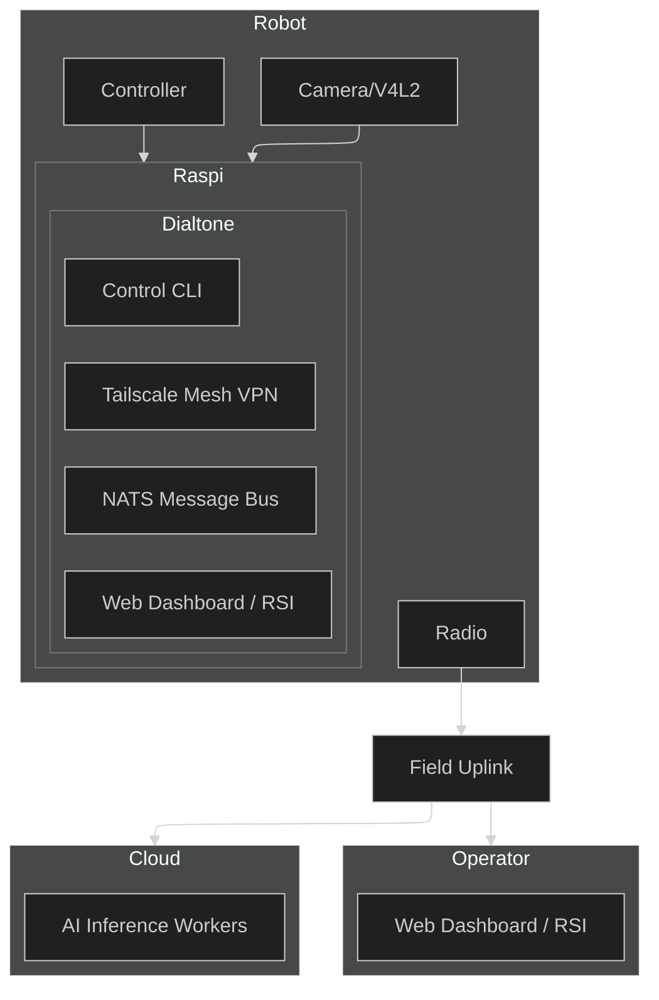

# [Dialtone](https://dialtone.earth)

Dialtone is aspirationally a **robotic video operations network** designed to allow humans and AI to cooperatively train and operate thousands of robots simultaneously with low latency.


# Vision
The future of robotics is collaborative. Dialtone aims to combine human intuition and machine precision by providing a unified mesh network:
- **Humans** can remotely oversee, teleoperate, and teach robots from anywhere in the world.
- **AI Agents** can learn from human demonstrations, process complex sensory data, and execute tasks autonomously.
- **Open Radio Feild Uplink** open source radio and compute hardware to make relaying real-time video and telemetry possible.
- **Single Software Binary** a single binary that can run on any device to join the global robotic mesh.
- **Robotic Hardware** robotic hardware for factory, field civic and home automation becomes widley available.
- **Open Assembly Instructions** robot system can be assembled in a garage with the correct tools and parts.
- Maintainable Parts and Code robot parts and code are designed to be maintainable and upgradeable working in a cyclic ecosystem.

# Architecture Overview
Dialtone is built on a "Network-First" architecture, prioritizing secure, low-latency communication between distributed components.



## Features
### Dialtone Autocode: System-Tuned Language Model and Self Modifying Code
- The CLI (command line interface) contains a deep neural network to modify the source code when requested
- Overcome unforeseen challenges live by adapting the code with human in the loop feedback
- Code can be modified to fix bugs, improve performance, or add new features
- Integrated development assistant trained on Dialtone's source code and hardware specifications.
- Context-aware code generation for new robot plugins and control logic.
- Share `Dialtone Autocode` sessions with a web link

### Dialtone CLI: Simple single binary CLI to connect and control any robot
- Cross platform support for Windows, MacOS, and Linux
- Single command builds and deploys for ARM64 targets like Raspberry Pi
- the binary contains tool to connect and copy itself to other devices

### Dialtone VPN: Built in virtual private network and peer discovery
- Users on the network are identified by unique IDs
- Access control lists for users and robots

### Dialtone Bus: Scalable command and control data structures
- Request/reply for commands
- Queuing for fanout and load balancing 
- Streaming for live or replay of telemetry and video

### Dialtone Autoconfig: Automated discovery and configuration
- Sensors: Plug-and-play support for cameras (V4L2), microphones, IMUs, and LIDAR.
- Actuators: Unified control interface for PWM servos, stepper motors, and CAN-bus motor controllers.
- Compute: Dynamic allocation of local and edge resources for AI inference and video encoding.
- Storage: Automatic management of ring-buffer logs and cloud-synced telemetry.
- Network: Zero-config peer-to-peer connectivity even behind restrictive NATs.

### Dialtone AI: Vision and LLM AI assisted operation.
- Real-time object detection and tracking for robot navigation.
- Natural language commanding (e.g., "Go to the kitchen and find the blue mug").
- Automated troubleshooting using onboard LLMs to analyze telemetry anomalies.

### Dialtone Geo: Geospatial intelligence.
- Integration with Google Earth Engine for environmental context and terrain analysis.
- Intelligent alerting based on GPS boundaries and satellite imagery updates.
- Global multi-robot fleet visualization on 3D maps.

### Dialtone CAD: CAD and Simulation.
- Built-in modeling tools to assist with hardware modifications and 3D printing.
- "Digital Twin" simulation to test control logic in a virtual environment before deployment.
- Popular localisation and mapping algorithms pre integrated like PyCuVSLAM
- FEA (Finite Element Analysis) for stress testing and simulation
- CFD (Computational Fluid Dynamics) for fluid dynamics simulation
- Thermal, EMI (Electromagnetic Interference), and other physics simulations
- Mesh transformation tools for moving between topologies like triangle and quad meshes, point clouds, and voxels

### Dialtone Web: Public Robot Presence.
- Publicly accessible URLs at `https://<robot_id>.dialtone.earth` for live streaming and status.
- Integrated WebRTC for low-latency remote control from any browser.

### Dialtone RSI: Collaborative RSI (Realtime Strategy Interface).
- A strategic dashboard where humans and AI agents cooperatively manage robot swarms.
- Drag-and-drop mission planning and real-time command override.

### Dialtone Social: Community and Social.
- One-click sharing of robot "moments" to social platforms to engage with the public.
- Collaborative "Robot Parties" where multiple users can interact with a shared robot world.

### Dialtone Radio: Open Radio Field Uplink.
- Open source radio and compute hardware to make relaying real-time video and telemetry possible.

### Dialtone Cyber Defense: Security and Privacy.
- Live monitoring of network traffic for anomalies
- Automated response to security threats
- Privacy preserving design with end-to-end encryption
- Automated key rotation

### Dialtone Maintainance
- Supply chain tools
- Detailed assembly and maintenance instructions
- Automated software updates
- Automated hardware diagnostics and repair via regional repair centers

### Dialtone Marketplace
- Robotic Parts and assemblies
- Field Services
- Maintenance Services
- Engineering Services like Electrical, Mechanical, and Software
- Data Services to store and analyze robot data
- AI Services to provide AI assistance

# Testing Driven Development
Dialtone is built with a "Test-First" philosophy. Every function, feature, and plugin must have automated tests. The system is designed such that the tests drive the development process.

### Development Hierarchy
1. **Ticket**: The first step of any change. Ideal for adding new code that can patch `core` or `plugin` code without changing it directly.
2. **Plugin**: The second step of integrating new code into specific feature areas.
3. **Core**: Core code is reserved for features dealing with networking and deployment (dialtone/dialtone-dev). It is the minimal code required to bootstrap the system.

### Ticket Lifecycle
1. **Create/Identify Ticket**: All work starts with a `ticket.md` in `./tickets/<ticket_name>/`.
2. **Start Ticket**: `go run dialtone-dev ticket start <ticket-name>` - This sets up the git branch and verifies the folder structure:
   - `ticket.md`: The requirement doc.
   - `task.md`: Scratchpad for tracking sub-progress.
   - `code/`: Local code playground for the ticket.
   - `test/`: Ticket-specific verification tests.
3. **Test First**: Update a test file in `test/` (or existing ones) to reflect the new feature. Run it to confirm it fails.
4. **Implement**: Write code until the test passes.
5. **Verify & Stage**: Run all relevant plugin and core tests before merging.

# Why Dialtone uses Golang
1. Go is a compiled language that provides the high-performance execution and efficient resource management required for real-time robotic operations.
2. The compilation process produces single, statically-linked binary executables, which dramatically simplifies deployment and consistency across thousands of distributed nodes.
3. Go's extensive standard library and robust ecosystem provide standardized tools for networking, cryptography, and testing that remain reliable as the codebase expands.
4. Native support for cross-compilation allows developers to build and deploy to a wide variety of hardware architectures from a single, unified development environment.
5. Strict type safety and clear, opinionated syntax ensure that large codebases remain maintainable by enforcing readability and catching potential errors at compile-time.
6. Built-in concurrency primitives like goroutines and channels enable high-performance, thread-safe handling of simultaneous robotic sensors and message streams.

# Project Structure
1. `./tickets/<ticket_name>/ticket.md` - contains a ticket description for any changes needed to the system
2. `./src` - contains all source code
3. `./src/plugins` - contains all plugins
4. `./test` - contains core test files for
5. `./docs` - virtual machine and container code for assisting development and testing
6. `./docs/vendor/<vendor_name>` - contains vendor documentation
7. `./example_code` - contains example code for helping integration or guiding design
8. `AGENT.md` - contains information for code agents to understand this repo
9. `README.md` - contains information for users to understand this repo at a high level
10. `dialtone.go` - contains the main entry point for the system
11. `dialtone-dev.go` - contains the development entry point for the system

# Plugin Structure
1. `./src/plugins/www` - contains the web dashboard
2. `./src/plugins/www/README.md` - contains information for users to understand the plugin at a high level
3. `./src/plugins/www/app` - contains a public website for the `dialtone.earth` domain
4. `./src/plugins/www/cli` - contains code for the cli command `dialtone-dev www`
5. `./src/plugins/www/test` - contains test files for the www plugin

# CLI Tools
1. `go run dialtone-dev.go` - CLI tool for development
2. `go run dialtone.go` - minimal binary for robotic deployment
3. `setup.sh` and `setup.ps1` - tools to bootstrap a new development environment

## Quick Start (WSL/Linux No-Sudo)

The fastest way to get started on WSL or Linux without administrative privileges:
```
# Clone the repo
git clone https://github.com/timcash/dialtone.git
export DIALTONE_ENV="~/dialtone_env"

# For bootstrapping only - Install go for linux and macos
./setup.sh

# For bootstrapping only - Install go for windows
./setup.ps1

# Environment setup if no previous install or cli binary is avaible to help with build
export CC="${DIALTONE_ENV}/zig/zig cc -target x86_64-linux-gnu"
export CGO_ENABLED=1
export CGO_CFLAGS="-I${DIALTONE_ENV}/usr/include -I${DIALTONE_ENV}/usr/include/x86_64-linux-gnu"
export PATH="${DIALTONE_ENV}/go/bin:${DIALTONE_ENV}/node/bin:$PATH"

# Install dependencies into ~/.dialtone_env (Go, Node, Zig, V4L2 headers)
go run dialtone-dev.go install --linux-wsl

# Perform a native build (includes Web UI and Camera support)
go run dialtone-dev.go build --local

# Start the node locally
go run dialtone.go start --local
```

# Join the Mission
Dialtone is an open project with an ambitious goal. We are looking for:
- **Robot Builders**: To integrate their hardware and test the system.
- **AI Researchers**: To deploy models into the RSI and automate tasks.
- **Developers**: To help us build the most accessible robotic network on Earth.
