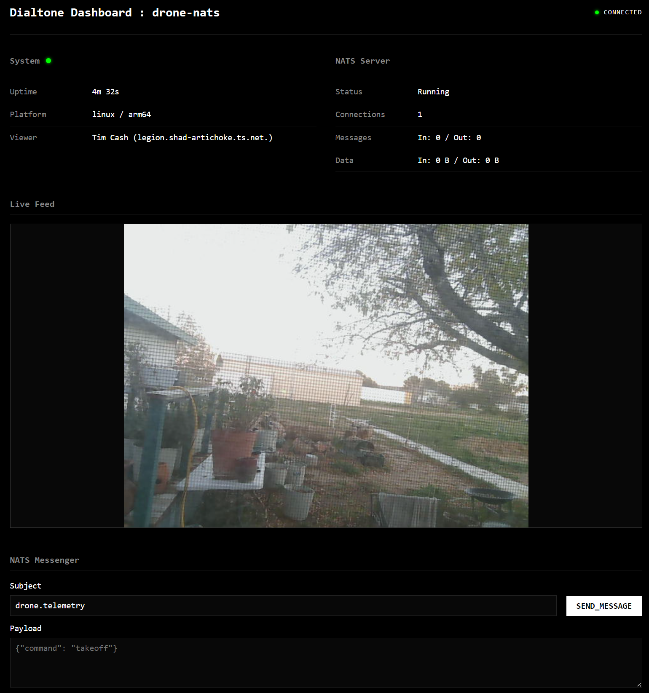

# Dialtone



Dialtone is a **video teleoperation network** designed for robotic coordination and allows people to work with and train **physical AI**. It provides a secure, encrypted, and low latency bridge between remote robotic hardware and humanoid/agentic control systems.

---

## 📚 Documentation Map

Detailed information about System Architecture, Installation, and Development can be found in the [docs/](./docs) directory:

- **[System Design & Tech Stack](./docs/techstack.md)**: Hardware/Software stack overview.
- **[Installation & Setup](./docs/install.md)**: Prerequisites and environment configuration.
- **[Build & Deployment](./docs/build.md)**: Containerized builds, ARM64 cross-compilation, and deployment commands.
- **[Development Workflow](./docs/develop.md)**: TDD loop, code style, and CLI options.
- **[Networking (Tailscale)](./docs/tsnet.md)**: Identity-based networking and automated provisioning.
- **[Messaging (NATS)](./docs/nats.md)**: System message bus and real-time telemetry.
- **[Testing Guide](./docs/test.md)**: Unit tests, integration tests, and UI screenshots.

---

## 🚀 Quick Start

Build the manager and deploy to a remote target:

```bash
# 1. Build the dialtone manager
go build -o bin/dialtone.exe .

# 2. Perform a full build (Web + ARM64 binary)
bin/dialtone.exe full-build

# 3. Deploy to the robot
bin/dialtone.exe deploy

# 4. Tail remote logs
bin/dialtone.exe logs
```

---

## 🛠 Features

- **Low-Latency MJPEG Streaming**: Real-time video feedback from V4L2 devices.
- **Secure by Default**: Zero-disk secret propagation via Tailscale/tsnet.
- **Hybrid Build Strategy**: Cross-compile for ARM64 using Podman containers.
- **Integrated Control**: Embedded NATS server for command and telemetry coordination.
