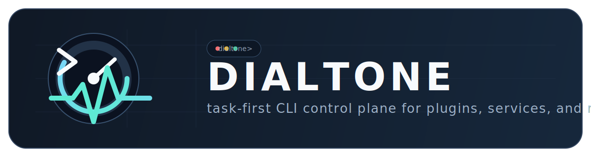

# Dialtone

Dialtone is a task-first plugin runtime.

The normal operating model is:

1. Use `dialtone.ps1` on Windows to start WSL, open a real WSL terminal, or send commands into a WSL tmux session.
2. Use `dialtone.sh` inside WSL or Linux as the public command contract.
3. Let the core plugins turn commands into tasks, services, logs, browser sessions, UI flows, and remote host work.

## Start Here

### `dialtone.ps1` on Windows

`dialtone.ps1` is the Windows host launcher. Its job is to get you into the real WSL runtime cleanly, not to replace `dialtone.sh`.

Use it to:

- start and stop WSL distros
- open a visible WSL terminal on the desktop
- send `./dialtone.sh ...` commands into a tmux session inside WSL

Common Windows commands:

```powershell
.\dialtone.ps1 wsl src_v3 start --name Ubuntu-24.04
.\dialtone.ps1 wsl src_v3 terminal --name Ubuntu-24.04

.\dialtone.ps1 tmux clean-state -Session dialtone -Distro Ubuntu-24.04 -Cwd /home/user/dialtone
.\dialtone.ps1 tmux send -Session dialtone -Distro Ubuntu-24.04 -Cwd /home/user/dialtone -- ./dialtone.sh cad src_v1 test
.\dialtone.ps1 tmux read -Session dialtone -Distro Ubuntu-24.04
```

For versioned mods from Windows, use `dialtone_mod.ps1`:

```powershell
.\dialtone_mod.ps1 db v1 test
.\dialtone_mod.ps1 db v1 run --benchmark
.\dialtone_mod.ps1 mod v1 list
.\dialtone_mod.ps1 status
.\dialtone_mod.ps1 read
```

Important rule:

- If the real runtime belongs in WSL, prefer `dialtone.ps1 tmux ... -- ./dialtone.sh ...`.
- Prefer `dialtone_mod.ps1 ...` over hand-typing `dialtone.ps1 tmux send -- ./dialtone_mod ...` when you want to work with versioned mods from Windows.
- The default `dialtone` tmux session is the same session opened by `.\dialtone.ps1 wsl src_v3 terminal --name Ubuntu-24.04`.
- Do not build a parallel workflow around raw `wsl.exe`, ad hoc PowerShell, or direct toolchain commands.

### `dialtone.sh` in WSL or Linux

`dialtone.sh` is the public Dialtone runtime entrypoint.

Use it to:

- load `env/dialtone.json`
- resolve managed paths and toolchains
- route commands through the REPL control plane
- open the shared REPL when run with no arguments

Common WSL or Linux commands:

```bash
./dialtone.sh
./dialtone.sh repl src_v3 task list
./dialtone.sh chrome src_v3 service --host legion --mode start --role dev
./dialtone.sh cad src_v1 test
./dialtone.sh robot src_v2 diagnostic --host rover --skip-ui --public-check=false
```

Important rules:

- Use one command per invocation.
- Prefer `./dialtone.sh <plugin> <src_vN> <command>` over raw `go`, `bun`, `vite`, `ssh`, `nats`, or browser launch commands.
- Keep shared configuration in `env/dialtone.json`.
- If a dependency is missing, bootstrap it through Dialtone instead of assuming a globally installed binary.

## Mods System

The versioned mods system lives under [`src/mods`](src/mods/README.md). Real mods use this layout:

```text
src/mods/<mod-name>/<version>/
```

Use these entrypoints:

- Windows: `.\dialtone_mod.ps1 <mod> <version> <command>`
- WSL or Linux: `./dialtone_mod <mod> <version> <command>`

The mods system uses a local SQLite control-plane database, usually `~/.dialtone/state.sqlite`, to keep the mod registry, dependency graph, runtime env, canonical `command_runs`, linked `shell_bus` transport rows, protocol runs, and test history in one durable place.

### Mods Command Flow

```text
./dialtone_mod <mod> <version> <command>
  -> src/mods.go
  -> open and sync ~/.dialtone/state.sqlite
  -> resolve the mod CLI wrapper from the SQLite registry
  -> either:
     - run direct control-plane mods immediately
     - or create/update a canonical command_runs row and queue a linked shell_bus row
  -> shell v1 worker reads the linked transport row
  -> tmux pane runs the visible command
  -> SQLite stores status, output summary, protocol rows, and test history
```

In practice, `command_runs` is the durable command ledger, `shell_bus` is the delivery mechanism, and SQLite is the handshake point between the launcher, the dispatcher, the visible tmux worker, and the inspection tools.

### Common Mods Workflows

Inspect and test one mod:

```bash
./dialtone_mod ssh v1 help
./dialtone_mod ssh v1 install
./dialtone_mod ssh v1 format
./dialtone_mod ssh v1 test
./dialtone_mod ssh v1 build
```

Inspect the SQLite-backed mods control plane:

```bash
./dialtone_mod mods v1 db path
./dialtone_mod mods v1 db sync
./dialtone_mod mods v1 db graph --format outline
./dialtone_mod mods v1 db runs --limit 10
./dialtone_mod mods v1 db run --id <run_id>
./dialtone_mod mods v1 db state
./dialtone_mod mods v1 db queue --limit 20
./dialtone_mod mods v1 db protocol-runs --limit 10
```

Use the shared test config when you want a clean Nix-oriented mods environment:

```bash
DIALTONE_ENV_FILE=env/test.dialtone.json ./dialtone_mod mods v1 db sync
DIALTONE_ENV_FILE=env/test.dialtone.json ./dialtone_mod mods v1 db runs --limit 10
DIALTONE_ENV_FILE=env/test.dialtone.json ./dialtone_mod db v1 test
```

Windows workflow with a visible WSL tmux session:

```powershell
.\dialtone.ps1 wsl src_v3 terminal --name Ubuntu-24.04
.\dialtone_mod.ps1 mod v1 list
.\dialtone_mod.ps1 db v1 test
.\dialtone_mod.ps1 read
```

Use [`src/mods/README.md`](src/mods/README.md) as the main mods-system guide. It covers the CLI contract, the direct-vs-routed split, the SQLite schema/control surface, and the expected workflow for extending mods.

## Core Flow

```text
Windows operator
  -> dialtone.ps1
  -> WSL tmux or WSL terminal
  -> ./dialtone.sh <plugin> <src_vN> <command>
  -> repl src_v3 task or service
  -> logs src_v1 over NATS
  -> plugin-specific work on WSL, remote Linux, or Windows hosts
```

A key Dialtone pattern is that WSL is often the caller even when Windows is the execution host. For example, `./dialtone.sh chrome src_v3 ...` may be launched from WSL, routed through `repl src_v3`, and then start a real Chrome daemon on the Windows node `legion` through the mesh transport.

## Core Plugins

These plugins describe the main patterns of the system and are the reference set for new plugin work.

| Plugin | Why it is core | Main pattern |
| --- | --- | --- |
| [`repl src_v3`](src/plugins/repl/src_v3/README.md) | Default control plane for Dialtone | Tasks, services, NATS, and KV-backed state |
| [`logs src_v1`](src/plugins/logs/src_v1/README.md) | Shared logging bus | Structured logs over NATS, not ad hoc stdout |
| [`test src_v1`](src/plugins/test/src_v1/README.md) | Shared integration test runtime | StepContext, reports, and browser-aware test flows |
| [`chrome src_v3`](src/plugins/chrome/src_v3/README.md) | Managed browser service | One daemon per role, one profile per role, REPL-managed lifecycle |
| [`ui src_v1`](src/plugins/ui/src_v1/README.md) | Shared UI shell and fixture suite | Reusable templates and attachable browser tests |
| [`ssh src_v1`](src/plugins/ssh/src_v1/README.md) | Mesh and remote execution layer | Host resolution, remote commands, and code sync |
| [`cad src_v1`](src/plugins/cad/src_v1/README.md) | Compact full-stack reference plugin | Go server, UI, browser smoke, and task logs |
| [`robot src_v2`](src/plugins/robot/src_v2/README.md) | Largest integrated reference plugin | Remote runtime, UI, browser, mesh, and artifact workflows |

Use these plugins to learn the shared shape of Dialtone:

- `repl` shows how commands become tasks and services.
- `logs` shows how output becomes NATS topics.
- `test` shows how suites, reports, and browser orchestration work.
- `chrome` shows how a long-lived remote daemon should be controlled.
- `ui` shows the shared frontend shell.
- `ssh` shows how to reach remote hosts.
- `cad` shows a small end-to-end app.
- `robot` shows a full production-style composition of the same patterns.

## Support Plugins

These are not the main reference set, but they support the core flow heavily:

- [`wsl src_v3`](src/plugins/wsl/src_v3/README.md): WSL lifecycle, UI, and Windows terminal support
- [`config src_v1`](src/plugins/config/README.md): runtime, path, and `env/dialtone.json` resolution
- `go src_v1`, `bun src_v1`, `pixi src_v1`: managed toolchain entrypoints

## Operating Rules

- Windows host work starts with `dialtone.ps1`.
- WSL and Linux runtime work starts with `dialtone.sh`.
- New plugin workflows should compose the core plugins instead of recreating their jobs.
- Long-lived processes should be modeled as services, not hidden background shells.
- Browser work should go through `chrome src_v3`.
- UI tests should go through `test src_v1` and `ui src_v1`.
- Remote host work should go through `ssh src_v1`.
- Logs should go through `logs src_v1`.
- Shared config should live in `env/dialtone.json`.
- [`src/plugins/README.md`](src/plugins/README.md) is the guide for building plugins that match the core plugins.

## Learn The System

- Start here: [`src/plugins/README.md`](src/plugins/README.md)
- Then read the core plugin docs in this order:

1. [`repl src_v3`](src/plugins/repl/src_v3/README.md)
2. [`logs src_v1`](src/plugins/logs/src_v1/README.md)
3. [`test src_v1`](src/plugins/test/src_v1/README.md)
4. [`chrome src_v3`](src/plugins/chrome/src_v3/README.md)
5. [`ui src_v1`](src/plugins/ui/src_v1/README.md)
6. [`ssh src_v1`](src/plugins/ssh/src_v1/README.md)
7. [`cad src_v1`](src/plugins/cad/src_v1/README.md)
8. [`robot src_v2`](src/plugins/robot/src_v2/README.md)
