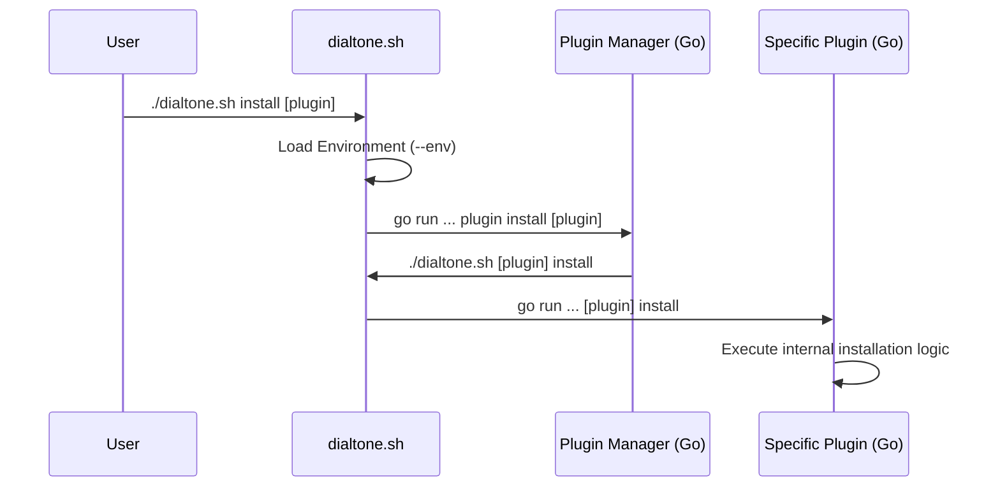

# Dialtone Plugin Installation Architecture

This document describes the decoupled installation architecture implemented to remove a central "manager" dependency and allow each plugin to own its lifecycle.

## 1. Overview

Previously, `src/plugins/install` was a monolithic package that handled installation for all plugins. This created static dependencies from the management layer to every plugin's CLI.

The new architecture uses **Shell Delegation** and **Plugin Ownership** to achieve true decoupling.

## 2. Key Components

### `dialtone.sh` (Shell Entry Point)
- **Environment Awareness**: Parses the `--env` flag early and sources the specified `.env` file.
- **Bootstrapping**: If a local Go toolchain is missing, it performs an initial installation of Go.
- **Dispatching**: Forwards plugin-specific commands (like `install` or `build`) to the compiled binary or `go run`.

### `plugin` Manager (`src/plugins/plugin`)
- **Management Layer**: Handles the generic `plugin add`, `plugin install`, and `plugin build` commands.
- **Decoupled execution**: Instead of importing other plugins, it executes `./dialtone.sh <plugin> <cmd>` via the shell. This ensures that the manager does not need to know about the internal implementation or static types of the plugins it manages.

### Plugin Ownership
- Each plugin (e.g., `ai`, `go`, `ui`) implements its own `install` and `build` subcommands.
- The manager simply assumes the plugin exists and can respond to these commands if called.

## 3. The Installation Flow

## 4. Benefits

1.  **Dependency Isolation**: The core tool no longer depends on heavy plugins like `ai` or `ui`.
2.  **Plugin Autonomy**: Adding a new plugin only requires registering its name in the shell dispatcher, without touching core Go code.
3.  **Cross-Platform Consistency**: By delegating to the same shell entry point, we ensure that environment variables and paths are consistent across recursive calls.
