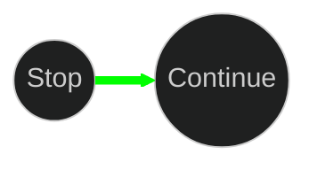
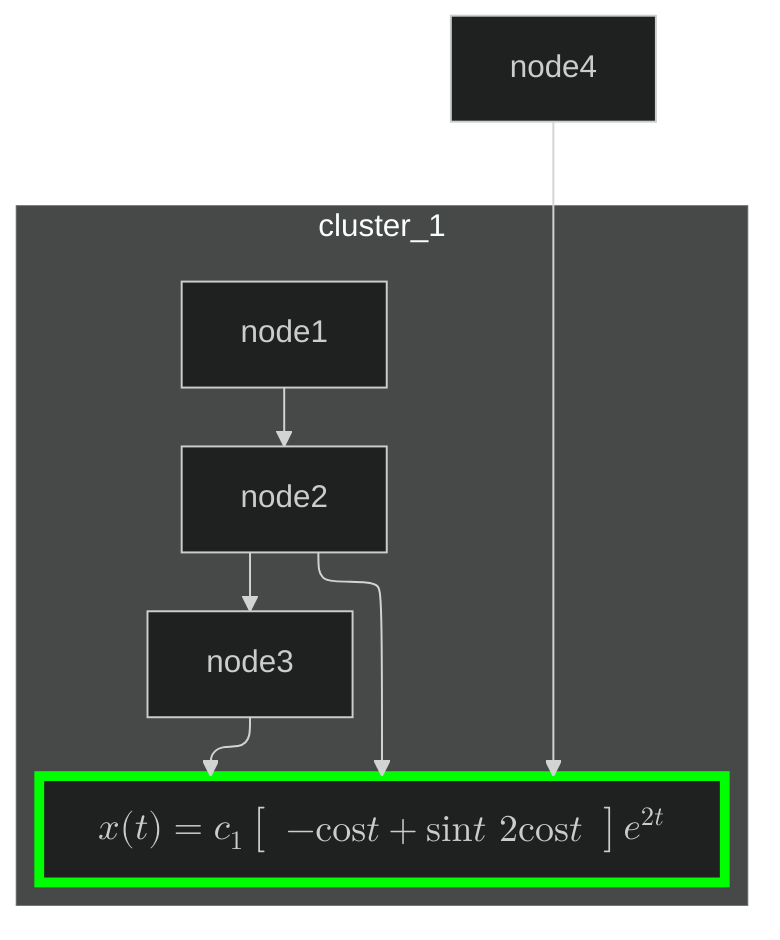

# graphs and networks

```
1. nodes
2. edges
3. paths
4. cycles
5. connected components
```

# mermaid diagram
1. nodes are the vertices of the graph
2. edges are the connections between the nodes
3. paths are the sequences of nodes and edges
4. cycles are the paths that start and end at the same node
5. connected components are the subgraphs that are connected to each other

## highlight one edge to be green


## subgraph with colored node and math equations for the label
