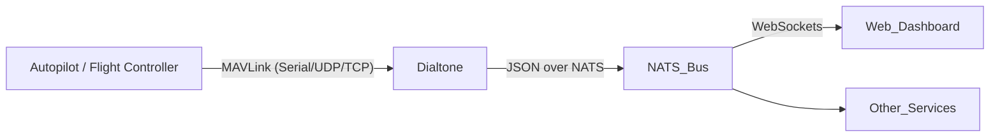

# MAVLink Integration

Dialtone includes a built-in MAVLink bridge that allows it to communicate with MAVLink-compatible autopilots (like ArduPilot or PX4). Currently, the integration focuses on monitoring system heartbeats and broadcasting them over the NATS message bus.

## Architecture

The MAVLink service runs as a subsystem within the Dialtone binary. It connects to a MAVLink source, decodes messages, and republishes relevant data to NATS subjects. This allows any NATS client (including the Web UI) to consume telemetry in real-time.



## Serial Setup (Raspberry Pi)

For Raspberry Pi targets, use `/dev/ttyAMA0` (hardware UART) or `/dev/serial0`.
1. Ensure `enable_uart=1` is set in `/boot/config.txt`.
2. Disable the serial console via `raspi-config`.

```bash
# Example configuration
MAVLINK_ENDPOINT=serial:/dev/ttyAMA0:57600
```

## Arming and Status

The Web UI provides buttons to **ARM** and **DISARM** the vehicle. 
- **Heartbeat**: Verified via `mavlink.heartbeat` subject.
- **Arming Errors**: If arming fails, check the "NATS Messenger" or "Log" section for `STATUSTEXT` messages from the flight controller (e.g., "Pre-arm: Yaw is not neutral").
- **Acknowledgements**: The system listens for `COMMAND_ACK` to confirm if a command was accepted.

### Troubleshooting
- **No Heartbeat**: Check physical UART wiring (TX/RX swapped?) and baud rate (usually 57600 or 115200).
- **Deployment**: Use `dialtone deploy` to automatically push the binary and web assets to the remote robot.
