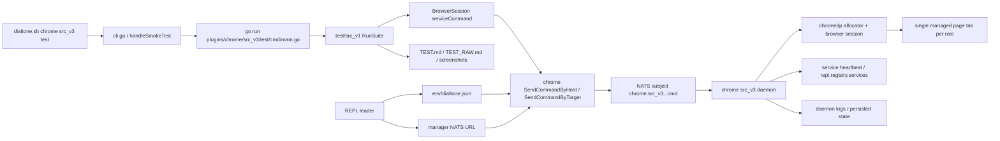

# Chrome `src_v3` System Map

## Purpose

This file is a working map of how `chrome/src_v3` behaves today.

The goals are:

- show the real control flow for `dialtone.sh chrome src_v3 test`
- map the REPL, runtime config, NATS, CLI, daemon, browser, tab, logs, and reports
- highlight the critical functions that shape behavior
- make it easier to spot brittle code and refactor targets
- suggest how the REPL could manage many remote processes more cleanly over NATS

This is intentionally a design-and-review outline, not a marketing document.

## One-Line Summary

Today the system is:

`dialtone.sh` -> `chrome src_v3` CLI -> test command -> `test/src_v1` browser session -> `chrome src_v3` NATS request/reply -> daemon -> managed Chrome process -> one managed page tab per role.

On remote hosts, the REPL and manager NATS act as the control plane that helps the CLI find, start, and talk to the daemon.

## Main Pieces

| Piece | What it does now | Main files |
| --- | --- | --- |
| CLI | Dispatches `chrome src_v3` subcommands and launches the smoke test runner | `cli.go` |
| Workflow/orchestration | Chooses local vs remote service path, starts services, retries deploy/start/status | `workflow.go`, `ops.go`, `local.go` |
| Runtime config | Reads and writes `env/dialtone.json`, especially REPL NATS URLs | `../config/src_v1/go/config.go` |
| REPL leader | Publishes current REPL manager/client NATS URLs into the active repo env file | `../repl/src_v3/go/repl/leader_state_v3.go` |
| Transport | Uses NATS request/reply for daemon commands and service heartbeat/registry updates | `daemon.go`, `client.go`, `ops.go` |
| Daemon | Owns browser lifecycle, tab lifecycle, command execution, and service heartbeat | `daemon.go`, `browser.go`, `actions.go`, `daemon_state.go` |
| Browser/runtime | Starts Chrome, attaches via DevTools, keeps one managed page target alive | `browser.go`, `process.go`, `actions.go` |
| Test harness | Runs steps, logs to report files and NATS, and uses shared browser sessions | `test/cmd/main.go`, `../test/src_v1/go/test.go` |
| Logs/artifacts | Mix of daemon stdout/stderr, persisted state, NATS test logs, markdown reports, screenshots | `local.go`, `ops.go`, `daemon_state.go`, `test/cmd/main.go` |

## Current Topology



## Core Invariants

The system is much easier to reason about if these remain true:

1. There is one daemon per `(host, role)`.
2. There is one Chrome browser process per `(host, role)`.
3. There is one managed content tab per `(host, role)`.
4. All remote control goes through a shared request/response envelope.
5. The REPL leader is the source of current manager NATS routing information.
6. Tests and operators look at the same logs and state when things fail.

If any new code breaks those invariants, it will usually create confusing bugs.

## End-To-End Flow

### 1. CLI dispatch

The CLI is a thin dispatcher. For the test path it shells into the dedicated Go test runner.

```go
func Run(args []string) error {
    switch strings.TrimSpace(args[0]) {
    case "daemon":
        return runDaemon(args[1:])
    case "test":
        return handleSmokeTest(args[1:])
    case "status":
        return handleRequestCommand("status", args[1:])
    case "open":
        return handleRequestCommand("open", args[1:])
    }
    return nil
}
```

`handleSmokeTest` is simple and important: it does not itself test Chrome. It starts the test binary that uses `test/src_v1`.

```go
func handleSmokeTest(args []string) error {
    runArgs := []string{"run", "./plugins/chrome/src_v3/test/cmd/main.go"}
    if !hasFlag(args, "--host") {
        if host := defaultChromeTestHost(); host != "" {
            runArgs = append(runArgs, "--host", host)
        }
    }
    runArgs = append(runArgs, args...)
    cmd := exec.Command(goBin, runArgs...)
    cmd.Dir = resolveSrcRoot()
    cmd.Stdout = os.Stdout
    cmd.Stderr = os.Stderr
    return cmd.Run()
}
```

Meaning:

- `dialtone.sh chrome src_v3 test` is a wrapper around the Go test command
- the real test logic lives in `test/cmd/main.go`
- failures may happen in the wrapper layer, test harness layer, service startup layer, or browser layer

### 2. Test command bootstraps a suite

The test command builds a `test/src_v1` registry, injects suite options, and writes reports.

```go
func main() {
    reg := testv1.NewRegistry()
    addChromeSuiteSteps(reg, hostValue, roleValue, *lines, actionOptions)

    if err := reg.Run(testv1.SuiteOptions{
        ReportPath:    "plugins/chrome/src_v3/TEST.md",
        RawReportPath: "plugins/chrome/src_v3/TEST_RAW.md",
        NATSURL:       resolveSuiteNATSURL(),
        NATSSubject:   "logs.test.chrome-src-v3",
        AutoStartNATS: true,
    }); err != nil {
        os.Exit(1)
    }
}
```

This means the Chrome test is not a direct daemon test. It is a service-backed browser test that reuses the shared `test/src_v1` framework.

### 3. `test/src_v1` turns browser actions into Chrome daemon messages

When the browser session is service-managed, `test/src_v1` does not drive `chromedp` directly. It sends `chrome src_v3` commands.

```go
func (s *BrowserSession) serviceCommand(req chrome.CommandRequest) (*chrome.CommandResponse, error) {
    req.Role = strings.TrimSpace(s.Session.Role)
    resp, err := chrome.SendCommandByHost(s.Session.Host, req)
    if err != nil {
        return nil, err
    }
    s.applyServiceResponse(resp)
    s.ingestServiceConsoleLines(resp.ConsoleLines)
    return resp, nil
}
```

The session also ensures there is an open page before steps proceed:

```go
func (s *BrowserSession) EnsureOpenPage() error {
    resp, err := s.refreshServiceStatus()
    if err == nil && resp != nil && resp.BrowserPID > 0 && !resp.Unhealthy {
        return nil
    }
    resp, err = chrome.SendCommandByHost(s.Session.Host, chrome.CommandRequest{
        Command: "open",
        Role:    strings.TrimSpace(s.Session.Role),
        URL:     "about:blank",
    })
    if err != nil {
        return err
    }
    s.applyServiceResponse(resp)
    return nil
}
```

Important consequence:

- the test plugin is a real client of the daemon protocol
- the daemon API is part of the testing surface, not just an internal detail
- if the command protocol is brittle, the test layer inherits that brittleness

### 4. Local vs remote service management

The workflow layer chooses whether to use a local daemon or a remote daemon.

```go
func EnsureServiceByTarget(host, role string, deploy bool) (*CommandResponse, error) {
    if isLocalHost(host) {
        if deploy {
            if err := deployTarget(host, role, true); err != nil {
                return nil, err
            }
        }
        if err := ensureLocalService(role); err != nil {
            return nil, err
        }
        return sendLocalCommand(commandRequest{Command: "status", Role: strings.TrimSpace(role)})
    }
    return EnsureRemoteServiceByHost(host, role, deploy)
}
```

Remote orchestration currently does a status/start/deploy/status loop:

```go
func EnsureRemoteServiceByHost(host, role string, deploy bool) (*CommandResponse, error) {
    resp, err := sendRemoteCommand(node, commandRequest{Command: "status", Role: role})
    if err == nil {
        return resp, nil
    }
    if err := startRemoteService(node, role); err != nil {
        if err := deployRemoteBinary(node, role, true); err != nil {
            return nil, err
        }
        return sendRemoteCommand(node, commandRequest{Command: "status", Role: role})
    }
    return sendRemoteCommand(node, commandRequest{Command: "status", Role: role})
}
```

This is one of the most important design hotspots:

- service discovery
- service start
- service deploy
- retry logic
- REPL registry lookup
- NATS routing

all meet here.

### 5. REPL leader provides the shared NATS config

The REPL writes live runtime state into the repo-local `env/dialtone.json`. Chrome and test read that state to find manager NATS.

```go
func syncLeaderRuntimeConfig(st LeaderState) error {
    updates := map[string]any{
        "DIALTONE_REPL_RUNNING":  "0",
        "DIALTONE_REPL_ROOM":     sanitizeRoom(st.Room),
        "DIALTONE_REPL_HOSTNAME": normalizePromptName(st.HostName),
    }
    if st.Running {
        updates["DIALTONE_REPL_RUNNING"] = "1"
        updates["DIALTONE_REPL_NATS_URL"] = strings.TrimSpace(st.NATSURL)
        updates["DIALTONE_REPL_MANAGER_NATS_URL"] = strings.TrimSpace(managerURL)
    }
    return configv1.UpdateEnvFileValues(configv1.ResolveEnvFilePath(""), updates)
}
```

This is the glue that lets:

- REPL
- Chrome daemon startup logic
- Chrome tests
- UI tests

share the same runtime control plane.

### 6. Daemon starts, subscribes, and publishes heartbeat

The daemon is the runtime center of gravity.

```go
func runDaemon(args []string) error {
    state := &daemonState{role: roleName, hostID: managerHostID, chromePort: chromePortValue}
    if err := state.init(); err != nil {
        return err
    }
    nc, err := nats.Connect(state.natsURL)
    if err != nil {
        return err
    }
    subjects := commandSubjects(state.hostID, state.role)
    for _, subject := range subjects {
        _, err = nc.Subscribe(subject, func(m *nats.Msg) {
            var req commandRequest
            _ = json.Unmarshal(m.Data, &req)
            state.reqMu.Lock()
            defer state.reqMu.Unlock()
            writeReply(m, state.handle(req))
        })
    }
    go publishServiceHeartbeat(state, nc)
    select {}
}
```

Notes:

- the daemon is single-threaded at request handling time via `reqMu`
- commands are processed serially
- heartbeat is separate from command handling
- the daemon is reachable on both a host-scoped and legacy subject

Subject routing today:

```go
func commandSubjects(hostID, role string) []string {
    primary := hostScopedCommandSubject(hostID, role)
    legacy := natsSubject(role)
    if primary == legacy {
        return []string{primary}
    }
    return []string{primary, legacy}
}
```

This compatibility behavior is convenient, but it also makes routing less explicit.

### 7. Daemon command handling

The command handler is a large string-based switch that owns browser and tab side effects.

```go
func (d *daemonState) handle(req commandRequest) commandResponse {
    resp := d.baseResponse()
    defer func() {
        if resp.OK && req.Command != "close" && req.Command != "shutdown" {
            _ = d.pruneExtraPageTargets()
            resp = d.refreshResponse(resp)
        }
    }()

    switch strings.TrimSpace(req.Command) {
    case "status":
        resp.OK = true
    case "open":
        resp.OK = d.handleOpen(req, &resp) == nil
    case "goto":
        resp.OK = d.navigateManaged(req.URL) == nil
    case "click-aria":
        resp.OK = d.clickAriaLabel(req.AriaLabel) == nil
    case "type-aria":
        resp.OK = d.typeAriaLabel(req.AriaLabel, req.Value) == nil
    case "screenshot":
        resp.OK = d.handleScreenshot(req, &resp) == nil
    }
    return resp
}
```

The strengths of this design:

- one narrow command surface for remote clients
- one place where state refresh happens
- easy to add new commands quickly

The weaknesses:

- commands are stringly typed
- the switch is getting large
- policy, transport, and browser behavior are coupled together

### 8. Browser creation is lazy

Chrome is not eagerly opened at daemon boot. It is created when a command needs it.

```go
func (d *daemonState) ensureBrowser() error {
    if pid > 0 && d.isBrowserAlive(pid, port) {
        if !hasTab {
            return d.ensureManagedTab()
        }
        return nil
    }

    pid, err := d.startBrowserProcess()
    if err != nil {
        return err
    }
    wsURL, err := waitForWebSocket(d.chromePort, 25*time.Second)
    if err != nil {
        _ = killPID(pid)
        return err
    }
    d.installAllocator(wsURL)
    return d.ensureManagedTab()
}
```

This has one big consequence:

- a daemon may be "up" before the browser is actually ready

That is a major source of user confusion and startup race conditions.

### 9. Managed tab behavior

The daemon tries to keep one primary content tab attached for the role.

```go
func (d *daemonState) ensureManagedTab() error {
    if d.tabCtx != nil {
        return nil
    }
    if targetID, err := d.firstPageTargetID(); err == nil && strings.TrimSpace(targetID) != "" {
        return d.attachManagedTab(targetID)
    }
    return d.createManagedTab()
}
```

After successful commands the daemon prunes extra page targets, which is the main safeguard against accidental tab growth.

### 10. Screenshot now uses the same managed tab

This is an important current behavior: screenshots now come from the same managed tab as the test actions, not from a temporary screenshot tab.

```go
func (d *daemonState) captureScreenshotB64() (string, error) {
    var buf []byte
    if err := d.withManagedContext(20*time.Second, func(ctx context.Context) error {
        return chromedp.Run(ctx,
            chromedp.WaitVisible("body", chromedp.ByQuery),
            chromedp.Sleep(300*time.Millisecond),
            chromedp.CaptureScreenshot(&buf),
        )
    }); err != nil {
        return "", err
    }
    return base64.StdEncoding.EncodeToString(buf), nil
}
```

That change matters because extra tabs make the remote browser much harder to trust visually.

### 11. The test harness avoids duplicate step screenshots

The shared test plugin now marks an explicit screenshot as satisfying the step screenshot requirement.

```go
func (sc *StepContext) CaptureScreenshot(path string) error {
    if err := b.CaptureScreenshot(path); err != nil {
        if recErr := b.EnsureOpenPage(); recErr != nil {
            return err
        }
        if retryErr := b.CaptureScreenshot(path); retryErr != nil {
            return err
        }
    }
    if err := sc.AddScreenshot(path); err != nil {
        return err
    }
    sc.autoShotDone = true
    return nil
}
```

This prevents the "why did it screenshot twice" problem.

## Message and Control Plane Map

### Command request/reply

The daemon protocol is a request/reply API over NATS.

Important request fields today:

- `Command`
- `Role`
- `URL`
- `AriaLabel`
- `Value`
- `Contains`
- `TimeoutMS`
- `Script`
- `ActionsPerSecond`

Important response fields today:

- `OK`
- `Error`
- `Host`
- `Role`
- `ServicePID`
- `BrowserPID`
- `ChromePort`
- `NATSPort`
- `CurrentURL`
- `ManagedTarget`
- `Tabs`
- `ConsoleLines`
- `ScreenshotB64`
- `ScreenshotPath`
- `Unhealthy`

### NATS subjects

Current command routing uses:

- host scoped: `chrome.src_v3.<host>.<role>.cmd`
- legacy: `chrome.src_v3.<role>.cmd`

Current service discovery and health are mixed across:

- daemon heartbeat publish path
- `repl.registry.services`
- persisted daemon state on disk
- CLI retry loops

This works, but it is more implicit than ideal.

## Logs, Reports, and State

### Where state lives

- daemon persisted state: `~/.dialtone/chrome-src-v3/<role>/state.json`
- browser profile and service dir: `~/.dialtone/chrome-v3/<role>/...`
- service logs: `~/.dialtone/chrome-v3/<role>/service/daemon.out.log` and `daemon.err.log`
- Chrome test reports: `plugins/chrome/src_v3/TEST.md` and `plugins/chrome/src_v3/TEST_RAW.md`
- suite log subject: `logs.test.chrome-src-v3`
- wrapper/subtone logs when invoked through `dialtone.sh`: `~/.dialtone/logs/subtone-*.log`

### What logs tell you

If something breaks, each source answers a different question:

| Source | Best for |
| --- | --- |
| daemon stdout/stderr | browser startup failures, command-level errors, Windows launch issues |
| `state.json` | last known browser PID, NATS URL, target ID, current URL |
| `TEST_RAW.md` | step-by-step test progress and failures |
| `TEST.md` | summarized report for humans |
| suite NATS logs | live test progress stream |
| subtone logs | what the wrapper launched and what it printed |

### Current logging weakness

There is no single correlation ID that ties together:

- one CLI invocation
- one NATS request
- one daemon log line
- one screenshot artifact
- one test step report entry

That makes multi-host debugging harder than it needs to be.

## Process Model

At runtime there are usually several separate processes involved:

1. `dialtone.sh` wrapper process
2. `go run` test process
3. REPL leader process
4. remote or local `dialtone_chrome_v3` daemon
5. Chrome browser process for the role
6. the DevTools-managed page target inside that browser

For remote Windows runs there is also a launcher path that bridges from the control plane into the Windows host process model.

## What Is Good About The Current Design

- The browser control surface is small and easy to understand.
- The daemon gives a clean seam between tests and the browser runtime.
- The same service can support direct CLI use, shared test use, and UI attach use.
- Shared config in `env/dialtone.json` is the right direction.
- The system already thinks in terms of role isolation, which is good for running more than one browser.

## Where The Code Feels Brittle

### 1. Startup readiness is not first-class

Today a daemon can be alive, heartbeating, and still not have a browser ready.

Symptoms:

- `status` may look okay while the first real browser command still has to do expensive startup work
- users expect headed Chrome to appear when the daemon starts, but it only appears lazily
- test and UI code end up acting as the thing that actually finishes startup

### 2. Orchestration logic is too spread out

The control plane lives across:

- `workflow.go`
- `ops.go`
- `local.go`
- REPL leader state
- config helpers

That makes failures harder to localize.

### 3. `ops.go` carries too many responsibilities

It mixes:

- REPL state lookup
- manager NATS routing
- remote registry lookup
- remote deploy
- remote service control
- Windows launcher details
- doctor/debug helpers

That is a code smell and a maintenance risk.

### 4. Subject compatibility adds ambiguity

Subscribing to both host-scoped and legacy subjects is practical, but it weakens routing clarity. For many remote services, explicit addressing becomes more important than backward compatibility.

### 5. State and log path naming drift

The system uses both `chrome-v3` and `chrome-src-v3` directories. That is survivable, but it makes manual debugging and tooling more confusing than necessary.

### 6. The daemon protocol is stringly typed

`handle()` is easy to extend, but the command surface is increasingly "switch on string plus optional fields". That makes validation, compatibility, and review harder.

### 7. There is no explicit service instance identity

The main identity is `(host, role)`. That is often enough, but for robust reconciliation and debugging it is helpful to also have:

- `service_instance_id`
- `build_version`
- `started_at`
- `desired_generation`

## Review Checklist For Finding Bad Code

When reviewing changes in this area, these questions tend to catch the real problems:

1. Does the new code preserve one managed browser and one managed content tab per role?
2. Does it go through the shared request/response path, or does it bypass the daemon in an ad hoc way?
3. Does it rely on environment variables that should really come from `env/dialtone.json`?
4. Does it assume that "daemon running" means "browser ready"?
5. Does it emit enough structured state to explain failures remotely?
6. Does it create another place where local and remote behavior diverge?
7. Does it put more orchestration logic into `ops.go` instead of separating concerns?
8. Does it add a new log or state location without making discovery easier?

## Suggestions To Make It More Robust

### A. Introduce explicit lifecycle states

The daemon should expose a clearer lifecycle:

- `starting`
- `nats_ready`
- `browser_launching`
- `browser_ready`
- `degraded`
- `stopping`
- `stopped`

`status` should report those states directly, instead of relying on inference from `BrowserPID` and `Unhealthy`.

### B. Make browser startup policy explicit

Pick one of these and document it:

1. daemon startup eagerly opens headed Chrome and keeps it alive
2. daemon startup is cheap and browser creation is lazy by design

Right now the code leans toward lazy startup, while user expectations often lean toward eager startup.

### C. Give every request and service instance a stable ID

Add fields like:

- `request_id`
- `trace_id`
- `service_instance_id`
- `host_id`
- `role`
- `build_version`

and include them in:

- request payloads
- replies
- daemon logs
- screenshot artifacts
- test step output

That would make remote debugging much cleaner.

### D. Separate transport from policy

Refactor toward clearer layers:

- transport: NATS request/reply, heartbeat, registry client
- lifecycle: ensure/start/stop/restart/reconcile
- browser runtime: browser and tab management
- CLI/test adapters: parsing flags, printing results, running suites

This would make `ops.go` much smaller.

### E. Make service discovery a first-class API

Instead of "heartbeat plus registry lookup plus disk state plus retry loops", define an explicit service API:

- `register(service_descriptor)`
- `heartbeat(service_status)`
- `lookup(service_query)`
- `watch(service_query)`
- `reconcile(desired_service_state)`

If NATS JetStream is available, a durable service registry or KV-backed state store would make this much more reliable than purely best-effort heartbeats.

### F. Add a host agent model for many remote services

If the REPL should manage many remote processes over NATS, the cleanest model is usually:

1. one leader control plane
2. one lightweight host agent per node
3. many service instances managed by that host agent

That lets the leader stop shelling directly into many process-specific commands and instead talk to a typed host runtime.

Possible shape:

- `repl.agent.<host>.desired`
- `repl.agent.<host>.status`
- `repl.agent.<host>.logs`
- `repl.agent.<host>.events`

Then the host agent owns:

- starting/stopping daemons
- log path normalization
- PID tracking
- restart policy
- version reconciliation

That is a better long-term pattern than every plugin owning its own ad hoc remote launcher.

### G. Reconcile desired state instead of only reacting

For many remote processes, the leader should be able to say:

- "host `legion` should have `chrome src_v3` role `dev` on build X"
- "host `legion` should have `chrome src_v3` role `dev-isolated` stopped"

and then let an agent reconcile that desired state continuously.

That creates:

- fewer race conditions
- better recovery after network hiccups
- less shell-based orchestration code

### H. Standardize log and artifact paths

Pick one root naming scheme and keep:

- service logs
- persisted state
- screenshots
- crash dumps
- temporary launch artifacts

under a consistent directory family.

### I. Replace string command switches with typed command handlers

The request surface can stay compact while becoming more structured. For example:

- typed command enums
- per-command validators
- per-command handler objects
- shared middleware for logging, timing, refresh, screenshot artifact writing

That would reduce the size and risk of `handle()`.

## Suggested Future Architecture For Many Remote Processes

If the goal is "the REPL should be able to manage many remote processes via NATS", this would be a strong direction:

### Control plane

- REPL leader writes the active manager NATS config into `env/dialtone.json`
- leader stores desired service state per host
- leader watches service heartbeats and health

### Host plane

- one host agent per machine
- host agent owns process spawning, logs, restart policy, and version checks
- plugin daemons become pure workers, not mini-orchestrators

### Service plane

- each service instance advertises a typed descriptor
- each instance has a stable `service_instance_id`
- each instance publishes heartbeat, health, and capabilities

### Command plane

- typed request envelope
- request id and trace id
- explicit host, role, service name, and instance id
- command timeout and retry policy carried in the envelope

### Observation plane

- structured logs over NATS
- durable service registry
- test step reports linked to request ids
- unified artifact index for screenshots and reports

## Recommended Refactor Order

If I were hardening this system, I would do it in this order:

1. Make daemon/browser lifecycle states explicit in `status`.
2. Decide eager vs lazy browser startup and make it intentional.
3. Add `request_id` and `service_instance_id` everywhere.
4. Split `ops.go` into transport, registry, launcher, and workflow pieces.
5. Unify log/state path conventions.
6. Introduce a host-agent model for multi-service remote management.
7. Replace the large string command switch with typed handlers.

## Short Take

The current system is workable and already has the right broad seams:

- CLI
- test harness
- request/reply daemon
- shared config
- REPL-managed control plane

The main weakness is not the idea. It is that startup, discovery, routing, and browser lifecycle are still too implicit and spread across too many places.

If the next design goal is "manage many remote processes reliably over NATS", the best move is to make the REPL control plane more explicit and move remote process supervision toward a typed host-agent model.
