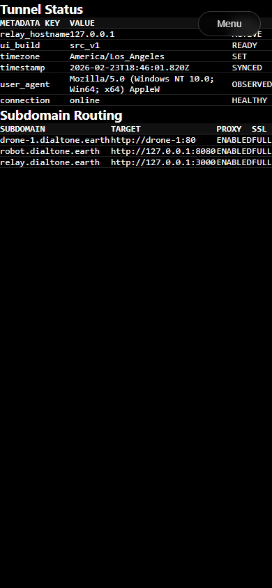
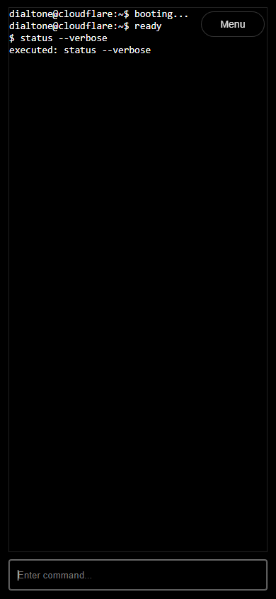

# Template Plugin v3 Test Report

**Generated at:** Sun, 15 Feb 2026 12:42:24 -0800
**Version:** `src_v1`
**Runner:** `test_v2`
**Status:** ✅ PASS
**Total Time:** `10.869s`

## Test Steps

| Step | Result | Duration |
|---|---|---|
| 01 Preflight (Go/UI) | ✅ PASS | `4.653s` |
| 02 Go Run | ✅ PASS | `790ms` |
| 03 UI Run | ✅ PASS | `531ms` |
| 04 Expected Errors (Proof of Life) | ✅ PASS | `1.408s` |
| 05 Dev Server Running (latest UI) | ✅ PASS | `520ms` |
| 06 Hero Section Validation | ✅ PASS | `117ms` |
| 07 Docs Section Validation | ✅ PASS | `322ms` |
| 08 Status Section Validation | ✅ PASS | `345ms` |
| 09 Three Section Validation | ✅ PASS | `362ms` |
| 10 Xterm Section Validation | ✅ PASS | `368ms` |
| 11 Lifecycle / Invariants | ✅ PASS | `1.274s` |
| 12 Cleanup Verification | ✅ PASS | `178ms` |

## Step Logs

### 01 Preflight (Go/UI)

```text
result: PASS
duration: 4.653s
```

#### Runner Output

```text
[T+0000] [TEST] RUN   01 Preflight (Go/UI)
[T+0000] >> [CLOUDFLARE] Fmt: src_v1
[T+0000] [2026-02-15T12:42:13.741-08:00 | INFO | go.go:RunGo:33] Running: go [fmt ./src/plugins/cloudflare/src_v1/...]
[T+0000] >> [CLOUDFLARE] Vet: src_v1
[T+0000] [2026-02-15T12:42:14.211-08:00 | INFO | go.go:RunGo:33] Running: go [vet ./src/plugins/cloudflare/src_v1/...]
[T+0001] >> [CLOUDFLARE] Go Build: src_v1
[T+0001] [2026-02-15T12:42:14.744-08:00 | INFO | go.go:RunGo:33] Running: go [build ./src/plugins/cloudflare/src_v1/...]
[T+0001] >> [CLOUDFLARE] Lint: src_v1
[T+0001]    [LINT] Running tsc...
[T+0002] $ tsc --noEmit
[T+0002] >> [CLOUDFLARE] Format: src_v1
[T+0002] $ echo format-ok
[T+0002] format-ok
[T+0003] >> [CLOUDFLARE] Build: src_v1
[T+0003] >> [CLOUDFLARE] Install: src_v1
[T+0003]    [CLOUDFLARE] Running bun install...
[T+0003] bun install v1.3.9 (cf6cdbbb)
[T+0003] Saved lockfile
[T+0003] 
[T+0003] + @types/three@0.182.0
[T+0003] + typescript@5.9.3
[T+0003] + vite@5.4.21
[T+0003] + @xterm/addon-fit@0.11.0
[T+0003] + @xterm/xterm@6.0.0
[T+0003] + three@0.182.0
[T+0003] 
[T+0003] 23 packages installed [38.00ms]
[T+0003]    [BUILD] Running UI build...
[T+0003] $ vite build
[T+0003] vite v5.4.21 building for production...
[T+0003] transforming...
[T+0004] ✓ 19 modules transformed.
[T+0004] rendering chunks...
[T+0004] computing gzip size...
[T+0004] dist/index.html                   2.85 kB │ gzip:   0.91 kB
[T+0004] dist/assets/index-6GBZ9nXN.css    5.24 kB │ gzip:   1.92 kB
[T+0004] dist/assets/index-mejO8pLL.css    5.78 kB │ gzip:   1.71 kB
[T+0004] dist/assets/index-Dbd9b_e5.js     0.08 kB │ gzip:   0.10 kB
[T+0004] dist/assets/index-BTTHdoMO.js     1.17 kB │ gzip:   0.65 kB
[T+0004] dist/assets/index-DYapDg3K.js     1.32 kB │ gzip:   0.78 kB
[T+0004] dist/assets/index-QxSzoUVb.js     9.58 kB │ gzip:   3.20 kB
[T+0004] dist/assets/index-BXSQAwOS.js   335.00 kB │ gzip:  85.16 kB
[T+0004] dist/assets/index-DRi6sDDg.js   492.59 kB │ gzip: 125.05 kB
[T+0004] ✓ built in 958ms
[T+0004] >> [CLOUDFLARE] Build successful
```

### 02 Go Run

```text
result: PASS
duration: 790ms
```

#### Runner Output

```text
[T+0004] [TEST] RUN   02 Go Run
[T+0004] >> [CLOUDFLARE] Serve: src_v1
[T+0005] [2026-02-15T12:42:18.452-08:00 | INFO | go.go:RunGo:33] Running: go [run src/plugins/cloudflare/src_v1/cmd/main.go]
[T+0005] Cloudflare Server starting on http://localhost:8080
```

### 03 UI Run

```text
result: PASS
duration: 531ms
```

#### Runner Output

```text
[T+0005] [TEST] RUN   03 UI Run
[T+0005] >> [CLOUDFLARE] UI Run: src_v1
[T+0005] $ vite --host "127.0.0.1" --port "44396"
[T+0005] 
[T+0005]   VITE v5.4.21  ready in 100 ms
[T+0005] 
[T+0005]   ➜  Local:   http://127.0.0.1:44396/
```

### 04 Expected Errors (Proof of Life)

```text
result: PASS
duration: 1.408s
```

#### Runner Output

```text
[T+0005] [TEST] RUN   04 Expected Errors (Proof of Life)
[T+0006] [2026-02-15T12:42:19.413-08:00 | INFO | chrome.go:StartSession:179] DEBUG: Launching Chrome: /mnt/c/Program Files/Google/Chrome/Application/chrome.exe [--remote-debugging-port=0 --remote-debugging-address=127.0.0.1 --remote-allow-origins=* --no-first-run --no-default-browser-check --user-data-dir=C:\Users\timca\AppData\Local\Temp\dialtone-chrome-test-port-43538 --new-window --dialtone-origin=true --dialtone-role=test --headless=new]
[T+0007] [BROWSER] [log] [SectionManager] URL PAGE reason=startup http://127.0.0.1:8080/ hash=(none) active=(none) target=hero
[T+0007] [BROWSER] [log] [SectionManager] URL SYNC #hero
[T+0007] [BROWSER] [log] [SectionManager] NAVIGATING TO #hero
[T+0007] [BROWSER] [log] [SectionManager] LOADING #hero
[T+0007] [BROWSER] [log] [SectionManager] URL PAGE reason=pageshow http://127.0.0.1:8080/ hash=(none) active=(none) target=hero
[T+0007] [BROWSER] [log] [SectionManager] URL SYNC #hero
[T+0007] [BROWSER] [log] [SectionManager] NAVIGATING TO #hero
[T+0007] [BROWSER] [log] [SectionManager] LOADED #hero
[T+0007] [BROWSER] [log] [SectionManager] START #hero
[T+0007] [BROWSER] [log] [SectionManager] NAVIGATE TO #hero
[T+0007] [BROWSER] [log] [SectionManager] NAVIGATE TO #hero
[T+0007] [BROWSER] [log] [SectionManager] RESUME #hero
[T+0007] [BROWSER] [log] [SectionManager] URL SYNC DONE target=hero active=hero
[T+0007] [BROWSER] [log] [SectionManager] RESUME #hero
[T+0007] [BROWSER] [log] [SectionManager] URL SYNC DONE target=hero active=hero
[T+0007] [BROWSER] [error] [PROOFOFLIFE] Intentional Browser Test Error
[T+0007] [BROWSER] [log] [SectionManager] URL PAGE reason=hashchange http://127.0.0.1:8080/#hero hash=hero active=hero target=hero
```

#### Browser Logs

```text
[T+0007] [log] [SectionManager] URL PAGE reason=startup http://127.0.0.1:8080/ hash=(none) active=(none) target=hero
[T+0007] [log] [SectionManager] URL SYNC #hero
[T+0007] [log] [SectionManager] NAVIGATING TO #hero
[T+0007] [log] [SectionManager] LOADING #hero
[T+0007] [log] [SectionManager] URL PAGE reason=pageshow http://127.0.0.1:8080/ hash=(none) active=(none) target=hero
[T+0007] [log] [SectionManager] URL SYNC #hero
[T+0007] [log] [SectionManager] NAVIGATING TO #hero
[T+0007] [log] [SectionManager] LOADED #hero
[T+0007] [log] [SectionManager] START #hero
[T+0007] [log] [SectionManager] NAVIGATE TO #hero
[T+0007] [log] [SectionManager] NAVIGATE TO #hero
[T+0007] [log] [SectionManager] RESUME #hero
[T+0007] [log] [SectionManager] URL SYNC DONE target=hero active=hero
[T+0007] [log] [SectionManager] RESUME #hero
[T+0007] [log] [SectionManager] URL SYNC DONE target=hero active=hero
[T+0007] [error] [PROOFOFLIFE] Intentional Browser Test Error
[T+0007] [log] [SectionManager] URL PAGE reason=hashchange http://127.0.0.1:8080/#hero hash=hero active=hero target=hero
```

#### Browser Errors

```text
[T+0007] [error] [PROOFOFLIFE] Intentional Browser Test Error
```

### 05 Dev Server Running (latest UI)

```text
result: PASS
duration: 520ms
```

#### Runner Output

```text
[T+0007] [TEST] RUN   05 Dev Server Running (latest UI)
[T+0007] >> [CLOUDFLARE] UI Run: src_v1
[T+0007] $ vite --host "127.0.0.1" --port "44918"
[T+0007] 
[T+0007]   VITE v5.4.21  ready in 99 ms
[T+0007] 
[T+0007]   ➜  Local:   http://127.0.0.1:44918/
```

### 06 Hero Section Validation

```text
result: PASS
duration: 117ms
section: hero
```

#### Runner Output

```text
[T+0007] [TEST] RUN   06 Hero Section Validation
```


### 07 Docs Section Validation

```text
result: PASS
duration: 322ms
section: docs
```

#### Runner Output

```text
[T+0008] [TEST] RUN   07 Docs Section Validation
```

#### Browser Logs

```text
[T+0008] [log] [SectionManager] NAVIGATING TO #docs
[T+0008] [log] [SectionManager] LOADING #docs
[T+0008] [log] [SectionManager] LOADED #docs
[T+0008] [log] [SectionManager] START #docs
[T+0008] [log] [SectionManager] NAVIGATE TO #docs
[T+0008] [log] [SectionManager] RESUME #docs
[T+0008] [log] [SectionManager] URL PAGE reason=hashchange http://127.0.0.1:8080/#docs hash=docs active=docs target=docs
```


### 08 Status Section Validation

```text
result: PASS
duration: 345ms
section: status
```

#### Runner Output

```text
[T+0008] [TEST] RUN   08 Status Section Validation
```

#### Browser Logs

```text
[T+0008] [log] [SectionManager] NAVIGATING TO #status
[T+0008] [log] [SectionManager] LOADING #status
[T+0008] [log] [SectionManager] LOADED #status
[T+0008] [log] [SectionManager] START #status
[T+0008] [log] [SectionManager] NAVIGATE TO #status
[T+0008] [log] [SectionManager] RESUME #status
[T+0008] [log] [SectionManager] URL PAGE reason=hashchange http://127.0.0.1:8080/#status hash=status active=status target=status
```



### 09 Three Section Validation

```text
result: PASS
duration: 362ms
section: three
```

#### Runner Output

```text
[T+0008] [TEST] RUN   09 Three Section Validation
[T+0009] [TEST] Three touch-test selected cube_left at (84,422)
[T+0009] [TEST] Three screenshot pixel check passed at (84,422)
```

#### Browser Logs

```text
[T+0008] [log] [SectionManager] NAVIGATING TO #three
[T+0008] [log] [SectionManager] LOADING #three
[T+0008] [log] [SectionManager] LOADED #three
[T+0008] [log] [SectionManager] START #three
[T+0008] [log] [SectionManager] NAVIGATE TO #three
[T+0008] [log] [SectionManager] RESUME #three
[T+0008] [log] [SectionManager] URL PAGE reason=hashchange http://127.0.0.1:8080/#three hash=three active=three target=three
[T+0008] [log] [Three #three] touch cube: cube_left
```


### 10 Xterm Section Validation

```text
result: PASS
duration: 368ms
section: xterm
```

#### Runner Output

```text
[T+0009] [TEST] RUN   10 Xterm Section Validation
```

#### Browser Logs

```text
[T+0009] [log] [SectionManager] NAVIGATING TO #xterm
[T+0009] [log] [SectionManager] LOADING #xterm
[T+0009] [log] [SectionManager] LOADED #xterm
[T+0009] [log] [SectionManager] START #xterm
[T+0009] [log] [SectionManager] NAVIGATE TO #xterm
[T+0009] [log] [SectionManager] RESUME #xterm
[T+0009] [log] [SectionManager] URL PAGE reason=hashchange http://127.0.0.1:8080/#xterm hash=xterm active=xterm target=xterm
```



### 11 Lifecycle / Invariants

```text
result: PASS
duration: 1.274s
```

#### Runner Output

```text
[T+0009] [TEST] RUN   11 Lifecycle / Invariants
```

#### Browser Logs

```text
[T+0009] [log] [SectionManager] NAVIGATING TO #hero
[T+0009] [log] [SectionManager] NAVIGATE AWAY #xterm
[T+0009] [log] [SectionManager] PAUSE #xterm
[T+0009] [log] [SectionManager] NAVIGATE TO #hero
[T+0009] [log] [SectionManager] RESUME #hero
[T+0009] [log] [SectionManager] URL PAGE reason=hashchange http://127.0.0.1:8080/#hero hash=hero active=hero target=hero
[T+0009] [log] [SectionManager] NAVIGATING TO #status
[T+0009] [log] [SectionManager] NAVIGATE AWAY #hero
[T+0009] [log] [SectionManager] PAUSE #hero
[T+0009] [log] [SectionManager] NAVIGATE TO #status
[T+0009] [log] [TableControl] renderVisibleRows, total rows: 100
[T+0009] [log] [SectionManager] RESUME #status
[T+0009] [log] [SectionManager] URL PAGE reason=hashchange http://127.0.0.1:8080/#status hash=status active=status target=status
[T+0009] [log] [SectionManager] NAVIGATING TO #docs
[T+0009] [log] [SectionManager] NAVIGATE AWAY #status
[T+0009] [log] [SectionManager] PAUSE #status
[T+0009] [log] [SectionManager] NAVIGATE TO #docs
[T+0009] [log] [SectionManager] RESUME #docs
[T+0009] [log] [SectionManager] URL PAGE reason=hashchange http://127.0.0.1:8080/#docs hash=docs active=docs target=docs
[T+0010] [log] [SectionManager] NAVIGATING TO #three
[T+0010] [log] [SectionManager] NAVIGATE AWAY #docs
[T+0010] [log] [SectionManager] PAUSE #docs
[T+0010] [log] [SectionManager] NAVIGATE TO #three
[T+0010] [log] [SectionManager] RESUME #three
[T+0010] [log] [SectionManager] URL PAGE reason=hashchange http://127.0.0.1:8080/#three hash=three active=three target=three
[T+0010] [log] [SectionManager] NAVIGATING TO #xterm
[T+0010] [log] [SectionManager] NAVIGATE AWAY #three
[T+0010] [log] [SectionManager] PAUSE #three
[T+0010] [log] [SectionManager] NAVIGATE TO #xterm
[T+0010] [log] [SectionManager] RESUME #xterm
[T+0010] [log] [SectionManager] URL PAGE reason=hashchange http://127.0.0.1:8080/#xterm hash=xterm active=xterm target=xterm
```

### 12 Cleanup Verification

```text
result: PASS
duration: 178ms
```

#### Runner Output

```text
[T+0010] [TEST] RUN   12 Cleanup Verification
[T+0010] Cleaning up stale Linux process on port 8080 (PID: 55578) via lsof...
```

## Artifacts

- `test.log`
- `error.log`
- `screenshots/test_step_1.png`
- `screenshots/test_step_2.png`
- `screenshots/test_step_3.png`
- `screenshots/test_step_4.png`
- `screenshots/test_step_5.png`
