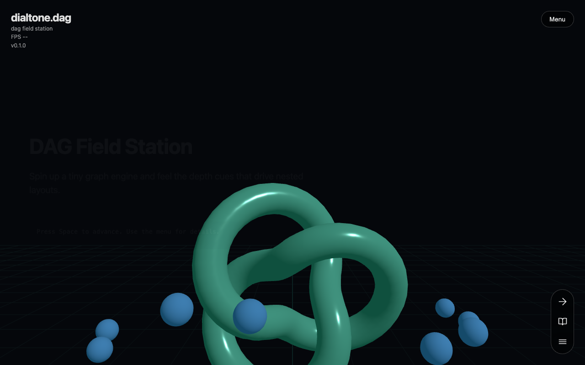
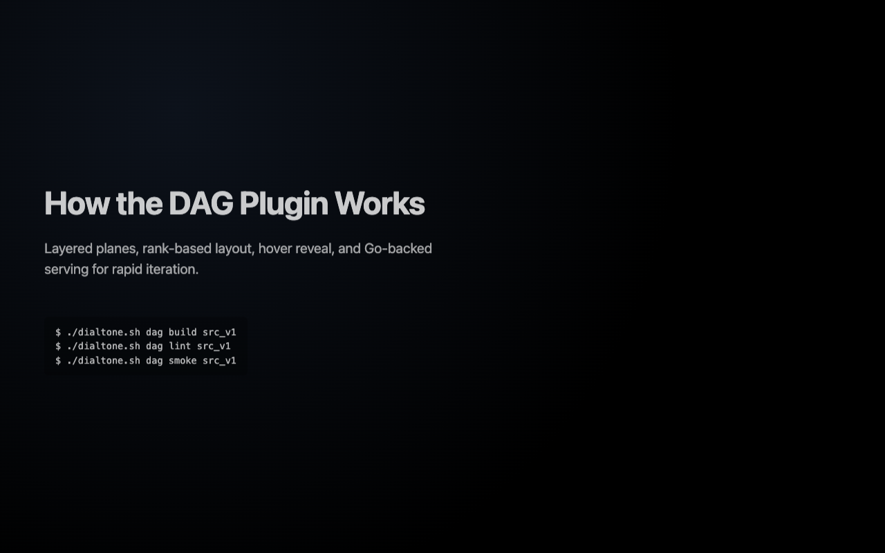
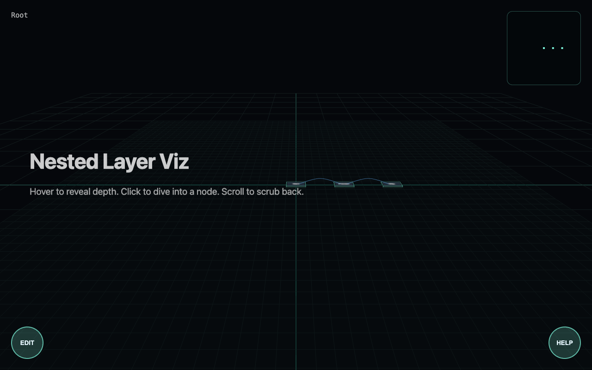
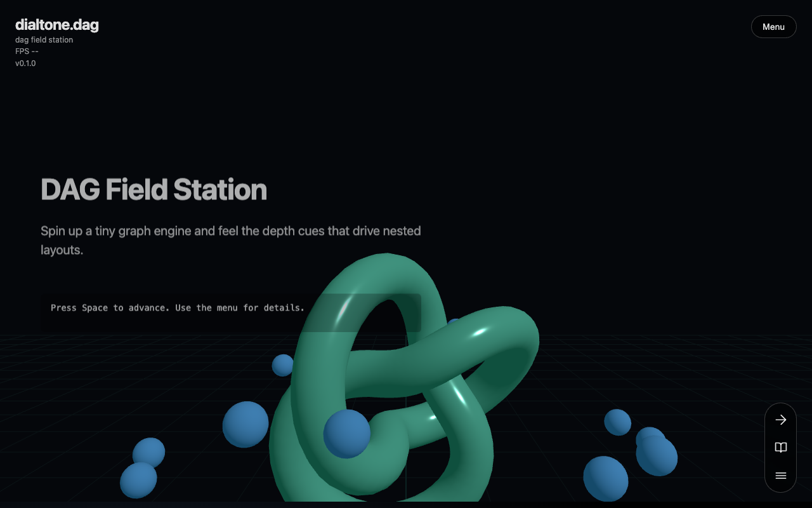

# DAG Smoke Test Report

**Started:** Tue, 10 Feb 2026 09:47:58 PST

## Preflight: Lint

**Status:** PASS

```log
[command] ./dialtone.sh go exec vet ./src/plugins/dag/...
[2026-02-10T09:47:58.832-08:00 | INFO | go.go:RunGo:30] Running: go [vet ./src/plugins/dag/...]

[pass] go vet

[command] ./dialtone.sh go exec fmt ./src/plugins/dag/...
[2026-02-10T09:47:59.333-08:00 | INFO | go.go:RunGo:30] Running: go [fmt ./src/plugins/dag/...]

[warn] go fmt modified files

[command] bun install
bun install v1.2.23 (cf136713)

Checked 122 installs across 169 packages (no changes) [4.00ms]

[pass] bun install

[command] bun run lint
$ eslint .

[pass] bun run lint
```

---
## Preflight: Build

**Status:** PASS

```log
[command] bun install
bun install v1.2.23 (cf136713)

Checked 122 installs across 169 packages (no changes) [3.00ms]

[pass] bun install

[command] bun run build
$ vite build
vite v5.4.21 building for production...

./style.css doesn't exist at build time, it will remain unchanged to be resolved at runtime
transforming...
✓ 20 modules transformed.
rendering chunks...
computing gzip size...
dist/index.html                         3.69 kB │ gzip:   1.22 kB
dist/assets/index-DM2PmASD.css          6.34 kB │ gzip:   1.91 kB
dist/assets/index-CgiRPmdK.js           0.09 kB │ gzip:   0.10 kB
dist/assets/index-c-OeEQOZ.js           2.02 kB │ gzip:   1.01 kB
dist/assets/index-BMV4y-i6.js           8.00 kB │ gzip:   3.07 kB
dist/assets/index-C5-ymLP-.js          11.07 kB │ gzip:   3.81 kB
dist/assets/three.module-BIu6T-o9.js  466.01 kB │ gzip: 117.99 kB
✓ built in 429ms

[pass] bun run build
```

---
### 1. Hero Section Renders

**Status:** PASS



---
### 2. Docs Section Content

**Status:** PASS



---
### 3. Layer Nest Visualization

**Status:** PASS



---
### 4. Return Hero

**Status:** PASS



---