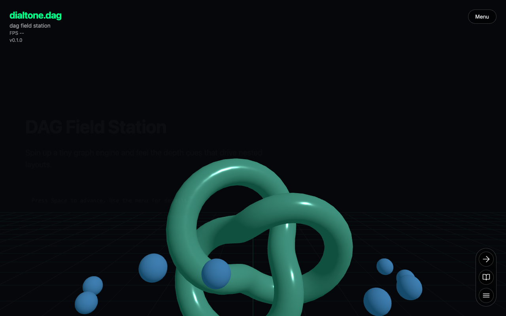
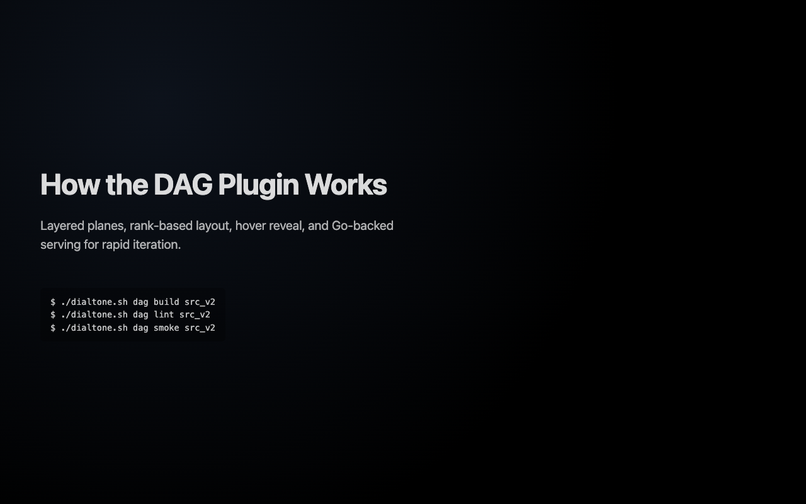
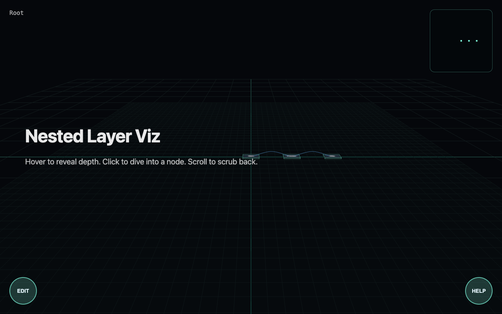
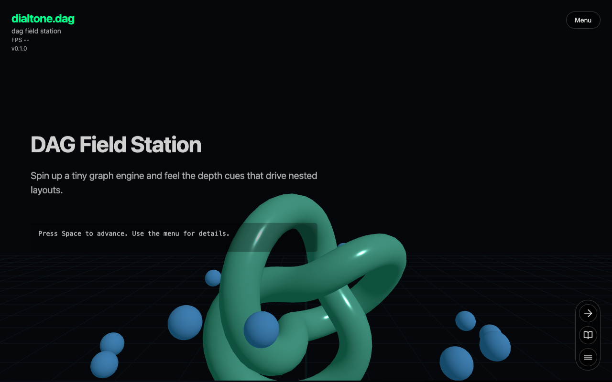

# Dag Plugin Smoke Test Report

**Generated at:** Wed, 11 Feb 2026 14:10:25 PST

## 1. Preflight: Go + TypeScript/JavaScript Checks

### Go Format: ✅ PASSED

```text
[dir] /Users/tim/code/dialtone/src/plugins/dag/src_v2
[cmd] go fmt ./...
[elapsed] 52ms
```

### Go Lint: ✅ PASSED

```text
[dir] /Users/tim/code/dialtone/src/plugins/dag/src_v2
[cmd] go vet ./...
[elapsed] 145ms
```

### Go Build: ✅ PASSED

```text
[dir] /Users/tim/code/dialtone/src/plugins/dag/src_v2
[cmd] go build ./...
[elapsed] 998ms
```

### UI Install: ✅ PASSED

```text
[dir] /Users/tim/code/dialtone
[cmd] /Users/tim/code/dialtone/dialtone.sh bun exec --cwd /Users/tim/code/dialtone/src/plugins/dag/src_v2/ui install --force
[elapsed] 499ms

bun install v1.3.9 (cf6cdbbb)
Saved lockfile

+ @eslint/js@9.39.2
+ @types/three@0.160.0
+ eslint@9.39.2
+ globals@15.15.0
+ typescript@5.9.3
+ typescript-eslint@8.55.0
+ vite@5.4.21
+ three@0.160.1

122 packages installed [176.00ms]
```

### UI TypeScript Lint: ✅ PASSED

```text
[dir] /Users/tim/code/dialtone
[cmd] /Users/tim/code/dialtone/dialtone.sh bun exec --cwd /Users/tim/code/dialtone/src/plugins/dag/src_v2/ui run lint
[elapsed] 1.105s

$ eslint .
```

### UI Build: ✅ PASSED

```text
[dir] /Users/tim/code/dialtone
[cmd] /Users/tim/code/dialtone/dialtone.sh bun exec --cwd /Users/tim/code/dialtone/src/plugins/dag/src_v2/ui run build
[elapsed] 1.521s

$ vite build
vite v5.4.21 building for production...
transforming...
✓ 27 modules transformed.
rendering chunks...
computing gzip size...
dist/index.html                         3.65 kB │ gzip:   1.21 kB
dist/assets/index-YPIPP1x9.css         11.20 kB │ gzip:   2.63 kB
dist/assets/index-CgiRPmdK.js           0.09 kB │ gzip:   0.10 kB
dist/assets/index-c-OeEQOZ.js           2.02 kB │ gzip:   1.01 kB
dist/assets/index-C5-ymLP-.js          11.07 kB │ gzip:   3.81 kB
dist/assets/index-D6z8qNSa.js          12.27 kB │ gzip:   4.17 kB
dist/assets/three.module-BIu6T-o9.js  466.01 kB │ gzip: 117.99 kB
✓ built in 480ms
```

### Source Prettier Format (JS/TS): ✅ PASSED

```text
[dir] /Users/tim/code/dialtone/src/plugins/dag/src_v2
[cmd] ./dialtone.sh bun exec --cwd /Users/tim/code/dialtone/src/plugins/dag/src_v2 x prettier --write ui/eslint.config.js

ui/eslint.config.js 14ms (unchanged)
```

### Source Prettier Lint (JS/TS): ✅ PASSED

```text
[dir] /Users/tim/code/dialtone/src/plugins/dag/src_v2
[cmd] ./dialtone.sh bun exec --cwd /Users/tim/code/dialtone/src/plugins/dag/src_v2 x prettier --check ui/eslint.config.js

Checking formatting...
All matched files use Prettier code style!
```

### Go Run: ✅ PASSED

```text
[dir] /Users/tim/code/dialtone/src/plugins/dag/src_v2
[cmd] go run cmd/main.go

DAG Server starting on http://localhost:8080

[probe-warning] timed out waiting for Go Run process shutdown
[probe-ready] port 8080 became reachable in 5.551s
```

### UI Run: ✅ PASSED

```text
[dir] /Users/tim/code/dialtone
[cmd] /Users/tim/code/dialtone/dialtone.sh bun exec --cwd /Users/tim/code/dialtone/src/plugins/dag/src_v2/ui run dev --host 127.0.0.1 --port 50046

$ vite --host "127.0.0.1" --port "50046"

  VITE v5.4.21  ready in 85 ms

  ➜  Local:   http://127.0.0.1:50046/

[probe-warning] timed out waiting for UI Run process shutdown
[probe-ready] port 50046 became reachable in 5.553s
```

---

## 2. Expected Errors (Proof of Life)

| Level | Message | Status |
|---|---|---|
| error | "[PROOFOFLIFE] Intentional Browser Test Error" | ✅ CAPTURED |
| error | [PROOFOFLIFE] Intentional Go Test Error | ✅ CAPTURED |

---

## 3. Real Errors & Warnings

### [error]
```text
"[SectionManager][INVARIANT][interval] hash/active mismatch: hash=#dag-hero active=#dag-layer-nest"
```

---

## 4. UI & Interactivity

### Lifecycle Verification Summary

| Event | Status | Description |
|---|---|---|
| LOADING | ✅ CAPTURED | Section chunk fetching initiated |
| LOADED | ✅ CAPTURED | Section code loaded into memory |
| START | ✅ CAPTURED | Section component initialized |
| RESUME / AWAKE | ✅ CAPTURED | Animation loop active and visible |
| PAUSE / SLEEP | ✅ CAPTURED | Animation loop suspended when off-screen |


### 1. Hero Section Validation: PASS ✅

**Console Logs:**
```text
[log] "[SectionManager] 🧭 INITIAL LOAD #dag-hero"
[log] "[SectionManager] 📦 LOADING #dag-hero..."
[log] "[SectionManager] 🧭 NAVIGATE TO #dag-hero"
[log] "[SectionManager] 📦 LOADING #dag-docs..."
[log] "[SectionManager] ✅ LOADED #dag-docs (1ms)"
[log] "[SectionManager] ✨ START #dag-docs"
[error] "[PROOFOFLIFE] Intentional Browser Test Error"
[log] "[SectionManager] ✅ LOADED #dag-hero (36ms)"
[log] "[SectionManager] ✨ START #dag-hero"
[log] "[SectionManager] 🚀 RESUME #dag-hero"
```



---

### 2. Docs Section Validation: PASS ✅

**Console Logs:**
```text
[log] "[SectionManager] 🧭 NAVIGATING TO #dag-docs"
[log] "[SectionManager] 🧭 NAVIGATING TO #dag-docs"
[log] "[SectionManager] 🧭 NAVIGATE AWAY #dag-hero"
[log] "[SectionManager] 🧭 NAVIGATE TO #dag-docs"
[log] "[SectionManager] 📦 LOADING #dag-layer-nest..."
[log] "[SectionManager] 🚀 RESUME #dag-docs"
[log] "[SectionManager] ✅ LOADED #dag-layer-nest (30ms)"
[log] "[SectionManager] ✨ START #dag-layer-nest"
[log] "[SectionManager] 💤 PAUSE #dag-hero"
```



---

### 3. Layer Section Validation: PASS ✅

**Console Logs:**
```text
[log] "[SectionManager] 🧭 NAVIGATING TO #dag-layer-nest"
[log] "[SectionManager] 🧭 NAVIGATING TO #dag-layer-nest"
[log] "[SectionManager] 🧭 NAVIGATE AWAY #dag-docs"
[log] "[SectionManager] 🧭 NAVIGATE TO #dag-layer-nest"
[log] "[SectionManager] 🚀 RESUME #dag-layer-nest"
[log] "[SectionManager] 💤 PAUSE #dag-docs"
```



---

### 4. Return Hero: PASS ✅

**Console Logs:**
```text
[log] "[SectionManager] 🧭 NAVIGATING TO #dag-hero"
[log] "[SectionManager] 🧭 NAVIGATING TO #dag-hero"
[error] "[SectionManager][INVARIANT][interval] hash/active mismatch: hash=#dag-hero active=#dag-layer-nest"
[log] "[SectionManager] 🧭 NAVIGATE AWAY #dag-layer-nest"
[log] "[SectionManager] 🧭 NAVIGATE TO #dag-docs"
[log] "[SectionManager] 🚀 RESUME #dag-docs"
[log] "[SectionManager] 💤 PAUSE #dag-layer-nest"
[log] "[SectionManager] 🧭 NAVIGATE AWAY #dag-docs"
[log] "[SectionManager] 🧭 NAVIGATE TO #dag-hero"
[log] "[SectionManager] 🚀 RESUME #dag-hero"
[log] "[SectionManager] 💤 PAUSE #dag-docs"
```



---
