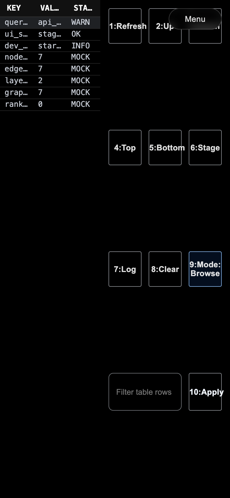
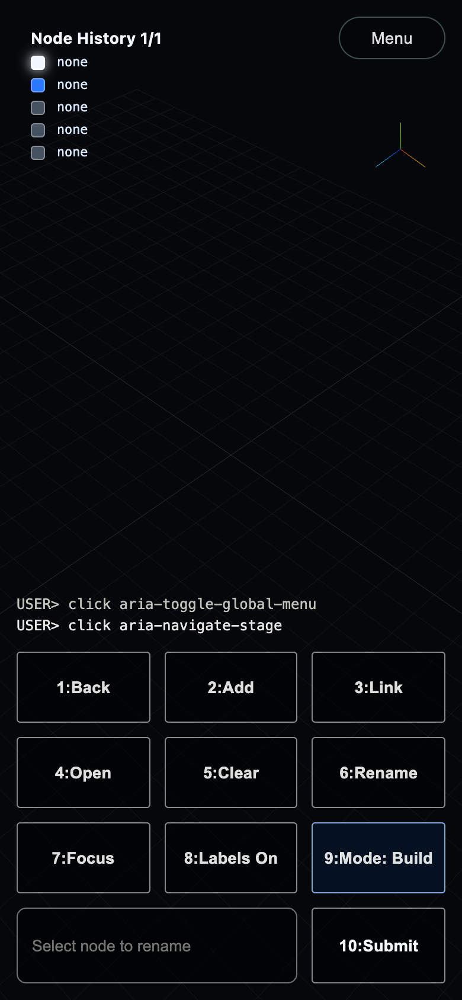
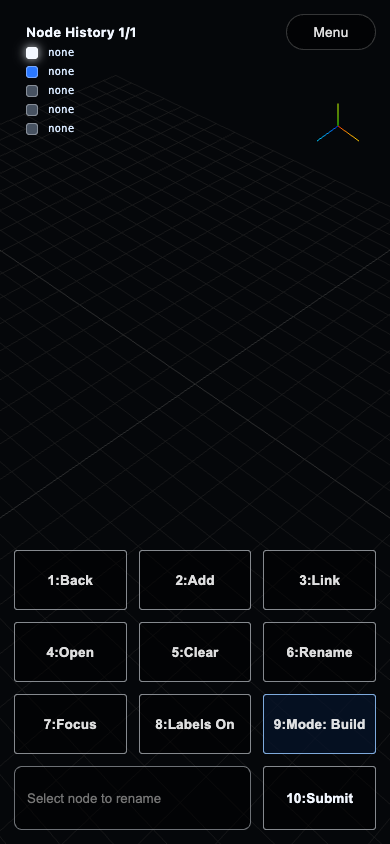

# Test Report: src_v3

- **Date**: Thu, 19 Feb 2026 18:58:13 PST
- **Total Duration**: 30.92453575s

## Summary

- **Steps**: 3 / 4 passed
- **Status**: FAILED

## Details

### 1. ✅ 01 DuckDB Graph Query Validation

- **Duration**: 132.282834ms
- **Report**: Validated core DAG graph queries in DuckDB/duckpgq for edge count, shortest path, rank rules, and input/output nested-node derivations.

---

### 2. ✅ 02 Preflight (Go/UI)

- **Duration**: 5.978152292s
- **Report**: Ran preflight pipeline (`fmt`, `vet`, `go-build`, `install`, `lint`, `format`, `build`) to verify toolchain and UI build health before browser steps.

---

### 3. ✅ 03 Startup: No Backend Menu -> Stage

- **Duration**: 3.651152333s
- **Report**: With backend unavailable, loaded dev app, opened menu, navigated to Stage, and verified stage section becomes active and ready.

#### Screenshots

---

### 4. ❌ 04 Startup: Menu -> Stage Fresh Load

- **Duration**: 21.162688042s
- **Error**: `timed out waiting for "App Header" attribute "data-boot" to be "true" after 20s`

#### Screenshots

---

