# Test Report: src_v3

- **Date**: Thu, 19 Feb 2026 19:46:09 PST
- **Total Duration**: 30.74082625s

## Summary

- **Steps**: 26 / 26 passed
- **Status**: PASSED

## Details

### 1. ✅ 00 Reset Workspace

- **Duration**: 544.086417ms
- **Report**: Reset workspace: cleaned ports 3000/8080 and removed UI dist for fresh build.

---

### 2. ✅ 01 DuckDB Graph Query Validation

- **Duration**: 70.217166ms
- **Report**: Validated core DAG graph queries in DuckDB/duckpgq for edge count, shortest path, rank rules, and input/output nested-node derivations.

---

### 3. ✅ 02 Preflight (Go/UI)

- **Duration**: 7.684043709s
- **Report**: Ran preflight pipeline (`fmt`, `vet`, `go-build`, `install`, `lint`, `format`, `build`) to verify toolchain and UI build health before browser steps.

---

### 4. ✅ 03 Startup: No Backend Menu -> Stage

- **Duration**: 5.024222708s
- **Report**: With backend unavailable, loaded dev app, opened menu, navigated to Stage, and verified stage section becomes active and ready.

#### Screenshots

---

### 5. ✅ 04 Startup: Menu -> Stage Fresh Load

- **Duration**: 3.848988166s
- **Report**: Fresh app startup opened menu immediately, used Navigate Stage, and verified the stage section becomes active and ready without requiring table readiness.

#### Screenshots

---

### 6. ✅ 05 DAG Table Section Validation

- **Duration**: 193.407416ms
- **Report**: Loaded the DAG table, waited for `data-ready=true`, validated API parity and row status content, then captured pre/post table screenshots.

#### Screenshots

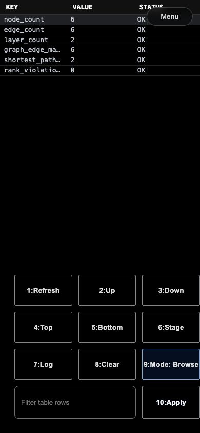

---

### 7. ✅ 06 Menu/Nav Section Switch Validation

- **Duration**: 509.625167ms
- **Report**: Opened global menu from table, navigated to stage through menu action, and verified the stage canvas becomes ready after section switch.

#### Screenshots

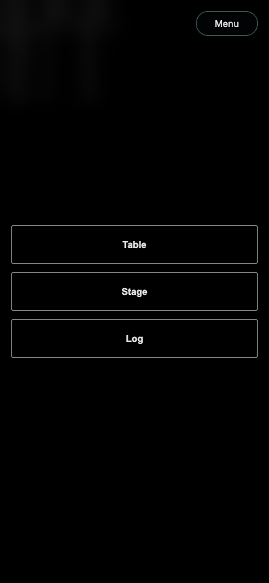
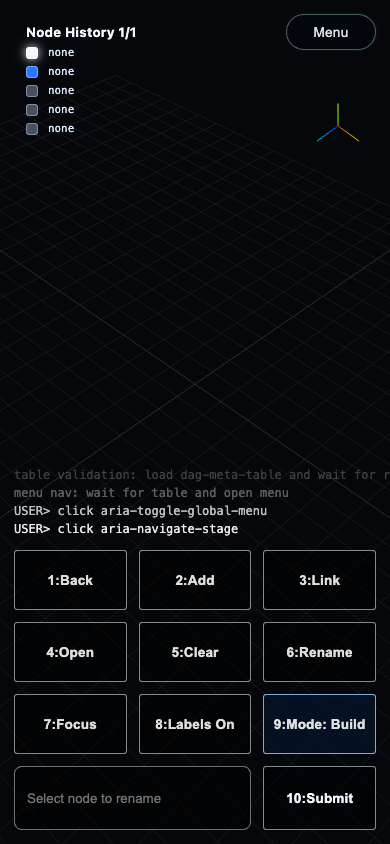

---

### 8. ✅ 07 Log Section Echo Command

- **Duration**: 220.725542ms
- **Report**: Navigated to `dag-log-xterm`, entered a command, and verified command echo in terminal output.

---

### 9. ✅ 07 Test-DAG: Program A Node

- **Duration**: 529.386292ms
- **Report**: Created and labeled the root `Program A` node, then validated camera/node projection from unified logs.

#### Screenshots

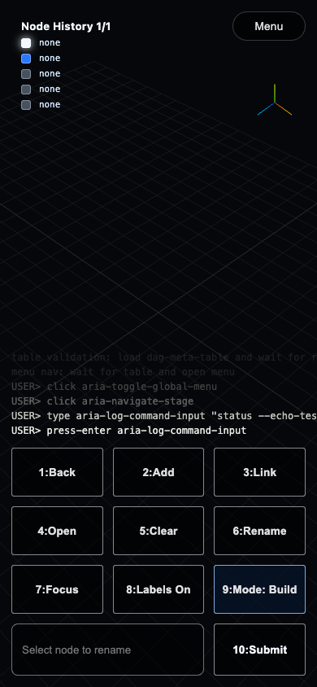
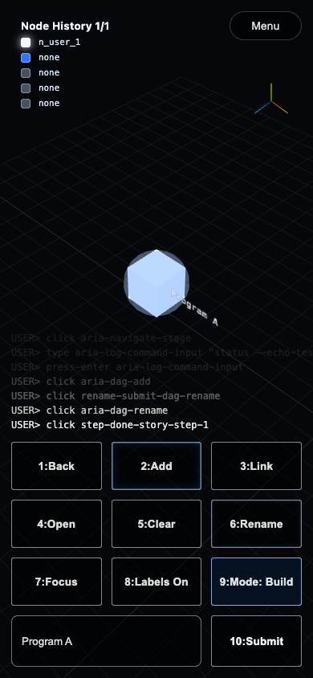

---

### 10. ✅ 08 Test-DAG: Program A -> Agent A

- **Duration**: 834.771625ms
- **Report**: Created `Agent A`, linked `Program A -> Agent A`, renamed it, and validated projection/camera logs.

#### Screenshots

---

### 11. ✅ 09 Test-DAG: Agent A -> Link

- **Duration**: 835.835333ms
- **Report**: Created `Link`, linked `Agent A -> Link`, renamed it, and validated projection/camera logs.

#### Screenshots

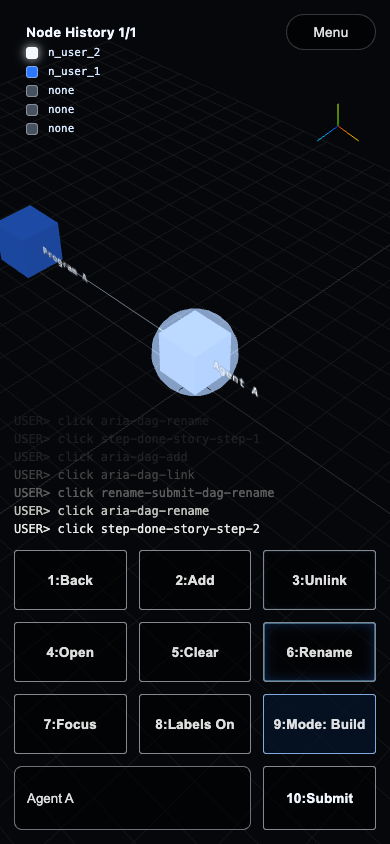
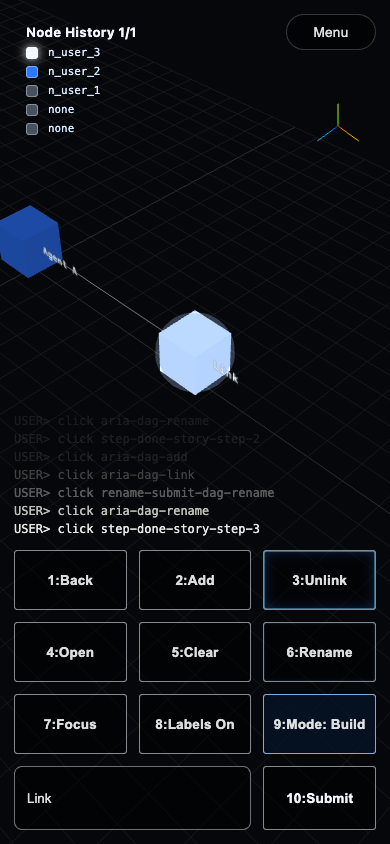

---

### 12. ✅ 10 Test-DAG: Link -> Agent B

- **Duration**: 831.409167ms
- **Report**: Created `Agent B`, linked `Link -> Agent B`, renamed it, and validated projection/camera logs.

#### Screenshots

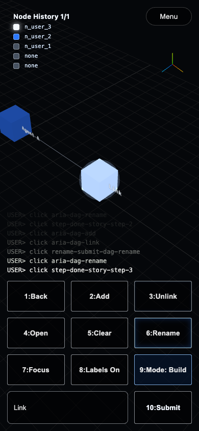
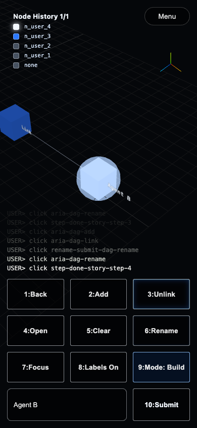

---

### 13. ✅ 11 Test-DAG: Agent B -> Program B

- **Duration**: 832.641667ms
- **Report**: Created `Program B`, linked `Agent B -> Program B`, renamed it, and validated projection/camera logs.

#### Screenshots

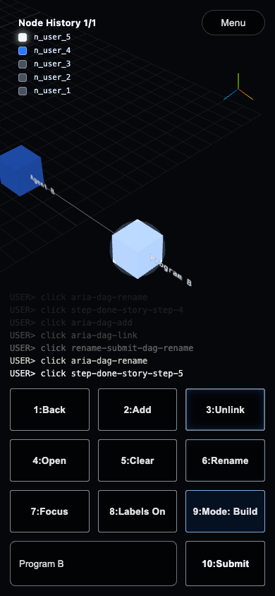

---

### 14. ✅ 12 Test-DAG: Open Link Protocol Layer

- **Duration**: 837.720708ms
- **Report**: Opened the nested protocol layer on `Link` with layer mode and verified nested-layer activation via unified logs.

#### Screenshots

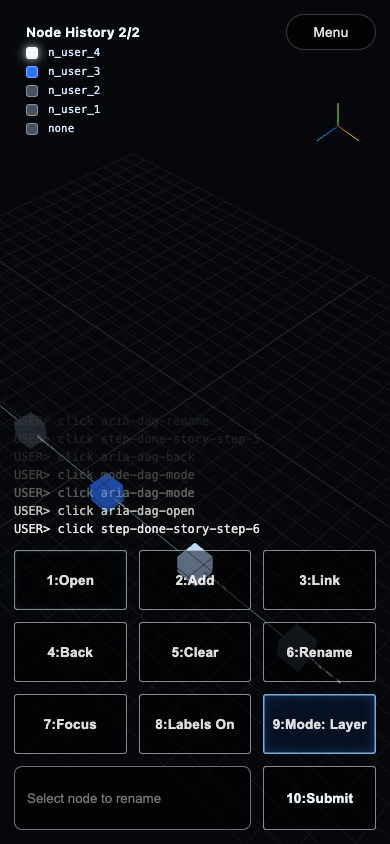

---

### 15. ✅ 13 Test-DAG: Build Protocol Tx/Rx

- **Duration**: 1.186471875s
- **Report**: Inside nested `Link` layer, created `Proto Tx` and `Proto Rx`, linked them, and validated projected node positions in viewport.

#### Screenshots

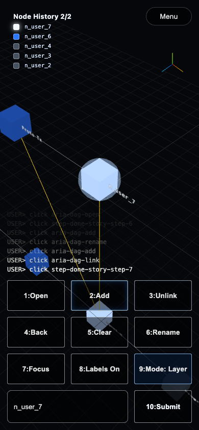

---

### 16. ✅ 14 Test-DAG: Close Protocol Layer

- **Duration**: 342.064084ms
- **Report**: Closed nested protocol layer back to `root` and verified the active-layer state via unified logs.

---

### 17. ✅ 15 Forms: Switch To Build Mode

- **Duration**: 339.043125ms
- **Report**: Confirmed the form calculator is in Build mode.

---

### 18. ✅ 16 Forms: Build Mode Buttons A

- **Duration**: 1.01057525s
- **Report**: Build mode used `Add`, `Link/Unlink`, `Rename`, and `Focus` with viewport projection validation.

---

### 19. ✅ 17 Forms: Build Mode Buttons B

- **Duration**: 1.008319667s
- **Report**: Build mode used `Open/Close`, `Back`, `Labels`, and `Clear`, and verified root-layer state.

---

### 20. ✅ 18 Forms: Switch To Layer Mode

- **Duration**: 8.003083ms
- **Report**: Confirmed the form calculator is in Layer mode.

---

### 21. ✅ 19 Forms: Layer Mode Buttons A

- **Duration**: 1.00969975s
- **Report**: Layer mode used `Add`, `Link/Unlink`, `Rename`, and `Focus` on a relay node with viewport projection validation.

---

### 22. ✅ 20 Forms: Layer Mode Buttons B

- **Duration**: 1.007945125s
- **Report**: Layer mode used `Open/Close`, `Back`, `Labels`, and `Clear`, and confirmed return to the root layer.

---

### 23. ✅ 21 Forms: Switch To View Mode

- **Duration**: 2.936792ms
- **Report**: Switched the form calculator from Layer mode to View mode.

---

### 24. ✅ 22 Forms: View Mode Buttons A

- **Duration**: 1.008292625s
- **Report**: View mode used camera orientation controls `Top`, `Iso`, `Side`, then `Focus` to reframe the active layer.

---

### 25. ✅ 23 Forms: View Mode Buttons B

- **Duration**: 1.01017725s
- **Report**: View mode used stateful camera offset controls `Left`, `Up`, `Right`, and `Down`.

---

### 26. ✅ 24 Finalize + Teardown

- **Duration**: 9.896042ms
- **Report**: Returned controls to Build mode and tore down shared browser/backend resources.

---

