# Dag Plugin src_v3 Test Report

**Generated at:** Tue, 17 Feb 2026 20:57:18 -0800
**Version:** `src_v3`
**Runner:** `test_v2`
**Status:** ✅ PASS
**Total Time:** `28.282s`

## Test Steps

| Step | Result | Duration |
|---|---|---|
| 01 DuckDB Graph Query Validation | ✅ PASS | `52ms` |
| 02 Preflight (Go/UI) | ✅ PASS | `8.916s` |
| 03 Startup: No Backend Menu -> Stage | ✅ PASS | `1.123s` |
| 04 Startup: Menu -> Stage Fresh Load | ✅ PASS | `1.27s` |
| 05 DAG Table Section Validation | ✅ PASS | `312ms` |
| 06 Menu/Nav Section Switch Validation | ✅ PASS | `541ms` |
| 07 Log Section Echo Command | ✅ PASS | `203ms` |
| 07 Test-DAG: Program A Node | ✅ PASS | `680ms` |
| 08 Test-DAG: Program A -> Agent A | ✅ PASS | `998ms` |
| 09 Test-DAG: Agent A -> Link | ✅ PASS | `955ms` |
| 10 Test-DAG: Link -> Agent B | ✅ PASS | `971ms` |
| 11 Test-DAG: Agent B -> Program B | ✅ PASS | `956ms` |
| 12 Test-DAG: Open Link Protocol Layer | ✅ PASS | `1.011s` |
| 13 Test-DAG: Build Protocol Tx/Rx | ✅ PASS | `1.31s` |
| 14 Test-DAG: Close Protocol Layer | ✅ PASS | `344ms` |
| 15 Thumbs: Switch To Build Mode | ✅ PASS | `342ms` |
| 16 Thumbs: Build Mode Buttons A | ✅ PASS | `1.017s` |
| 17 Thumbs: Build Mode Buttons B | ✅ PASS | `1.015s` |
| 18 Thumbs: Switch To Layer Mode | ✅ PASS | `11ms` |
| 19 Thumbs: Layer Mode Buttons A | ✅ PASS | `1.015s` |
| 20 Thumbs: Layer Mode Buttons B | ✅ PASS | `1.019s` |
| 21 Thumbs: Switch To View Mode | ✅ PASS | `6ms` |
| 22 Thumbs: View Mode Buttons A | ✅ PASS | `1.016s` |
| 23 Thumbs: View Mode Buttons B | ✅ PASS | `1.017s` |
| 24 Finalize + Teardown | ✅ PASS | `6ms` |

## Step Logs

### 01 DuckDB Graph Query Validation

```text
result: PASS
duration: 52ms
```

#### Step Story

Validated core DAG graph queries in DuckDB/duckpgq for edge count, shortest path, rank rules, and input/output nested-node derivations.

#### Runner Output

```text
[T+0000] [TEST] RUN   01 DuckDB Graph Query Validation
[T+0000] STEP> begin 01 DuckDB Graph Query Validation
[T+0000] [GRAPH] running: graph_edge_match_count
[T+0000] [GRAPH] running: shortest_path_hops_root_to_leaf
[T+0000] [GRAPH] running: rank_violation_count
[T+0000] [GRAPH] running: nested_nodes_for_n_mid_a
[T+0000] [GRAPH] running: input_nodes_for_n_leaf
[T+0000] [GRAPH] running: output_nodes_for_n_root
```

### 02 Preflight (Go/UI)

```text
result: PASS
duration: 8.916s
```

#### Step Story

Ran preflight pipeline (`fmt`, `vet`, `go-build`, `install`, `lint`, `format`, `build`) to verify toolchain and UI build health before browser steps.

#### Runner Output

```text
[T+0000] [TEST] RUN   02 Preflight (Go/UI)
[T+0000] STEP> begin 02 Preflight (Go/UI)
[T+0000] >> [DAG] Fmt: src_v3
[T+0000] [2026-02-17T20:56:50.334-08:00 | INFO | go.go:RunGo:33] Running: go [fmt ./src/plugins/dag/src_v3/...]
[T+0000] >> [DAG] Vet: src_v3
[T+0000] [2026-02-17T20:56:50.745-08:00 | INFO | go.go:RunGo:33] Running: go [vet ./src/plugins/dag/src_v3/...]
[T+0001] >> [DAG] Go Build: src_v3
[T+0001] [2026-02-17T20:56:51.292-08:00 | INFO | go.go:RunGo:33] Running: go [build ./src/plugins/dag/src_v3/...]
[T+0003] >> [DAG] Install: src_v3
[T+0003]    [DAG] duckdb already installed at /Users/dev/dialtone_dependencies/duckdb/bin/duckdb
[T+0003]    [DAG] Running version install hook: src/plugins/dag/src_v3/cmd/ops/install.go
[T+0003] [2026-02-17T20:56:53.917-08:00 | INFO | go.go:RunGo:33] Running: go [run src/plugins/dag/src_v3/cmd/ops/install.go]
[T+0004]    [DAG src_v3] Ensuring Go module dependency: github.com/marcboeker/go-duckdb
[T+0004] [2026-02-17T20:56:54.137-08:00 | INFO | go.go:RunGo:33] Running: go [mod download github.com/marcboeker/go-duckdb]
[T+0004] bun install v1.3.9 (cf6cdbbb)
[T+0004] 
[T+0004] + @types/three@0.182.0
[T+0004] + typescript@5.9.3
[T+0004] + vite@5.4.21
[T+0004] + @xterm/addon-fit@0.10.0
[T+0004] + @xterm/xterm@6.0.0
[T+0004] + three@0.182.0
[T+0004] 
[T+0004] 23 packages installed [163.00ms]
[T+0004] Saved lockfile
[T+0004] >> [DAG] Lint: src_v3
[T+0004] $ tsc --noEmit
[T+0006] >> [DAG] Format: src_v3
[T+0006] $ echo format-ok
[T+0006] format-ok
[T+0006] >> [DAG] Build: START for src_v3
[T+0006] >> [DAG] Installing UI dependencies in /Users/dev/code/dialtone/src/plugins/dag/src_v3/ui...
[T+0006] bun install v1.3.9 (cf6cdbbb)
[T+0006] Saved lockfile
[T+0006] 
[T+0006] + @types/three@0.182.0
[T+0006] + typescript@5.9.3
[T+0006] + vite@5.4.21
[T+0006] + @xterm/addon-fit@0.10.0
[T+0006] + @xterm/xterm@6.0.0
[T+0006] + three@0.182.0
[T+0006] 
[T+0006] 23 packages installed [161.00ms]
[T+0006] >> [DAG] Building UI in /Users/dev/code/dialtone/src/plugins/dag/src_v3/ui...
[T+0006] $ vite build
[T+0008] vite v5.4.21 building for production...
[T+0008] transforming...
[T+0008] ✓ 20 modules transformed.
[T+0008] rendering chunks...
[T+0008] computing gzip size...
[T+0008] dist/index.html                   5.76 kB │ gzip:   1.27 kB
[T+0008] dist/assets/xterm-6GBZ9nXN.css    5.24 kB │ gzip:   1.92 kB
[T+0008] dist/assets/index-B2teqiw3.css   10.77 kB │ gzip:   2.78 kB
[T+0008] dist/assets/index-C5DKmhci.js     6.95 kB │ gzip:   2.64 kB
[T+0008] dist/assets/index-CxBzxMHf.js     7.97 kB │ gzip:   2.51 kB
[T+0008] dist/assets/index-C-rBoJXv.js    14.54 kB │ gzip:   4.64 kB
[T+0008] dist/assets/xterm-CUq5R0Mv.js   332.43 kB │ gzip:  84.18 kB
[T+0008] dist/assets/index-DtAlXd6k.js   529.59 kB │ gzip: 134.88 kB
[T+0008] 
[T+0008] (!) Some chunks are larger than 500 kB after minification. Consider:
[T+0008] - Using dynamic import() to code-split the application
[T+0008] - Use build.rollupOptions.output.manualChunks to improve chunking: https://rollupjs.org/configuration-options/#output-manualchunks
[T+0008] - Adjust chunk size limit for this warning via build.chunkSizeWarningLimit.
[T+0008] ✓ built in 911ms
[T+0008] >> [DAG] Build: COMPLETE for src_v3
```

### 03 Startup: No Backend Menu -> Stage

```text
result: PASS
duration: 1.123s
section: dag-3d-stage
```

#### Step Story

With backend unavailable, loaded dev app, opened menu, navigated to Stage, and verified stage section becomes active and ready.

#### Runner Output

```text
[T+0008] [TEST] RUN   03 Startup: No Backend Menu -> Stage
[T+0008] STEP> begin 03 Startup: No Backend Menu -> Stage
[T+0009] WAIT> aria-toggle-global-menu (no-backend startup needs menu toggle)
[T+0009] USER> click aria-toggle-global-menu
[T+0009] CLICK> kind=aria target=Toggle Global Menu detail=open global menu without backend
[T+0009] WAIT> aria-navigate-stage (no-backend startup needs stage nav button)
[T+0009] USER> click aria-navigate-stage
[T+0009] CLICK> kind=aria target=Navigate Stage detail=switch to stage without backend
[T+0009] WAIT> aria-three-canvas (stage canvas should exist without backend)
[T+0009] WAIT> aria-three-section (stage section should be active without backend)
[T+0009] WAIT> aria-three-canvas (stage should report ready without backend)
```

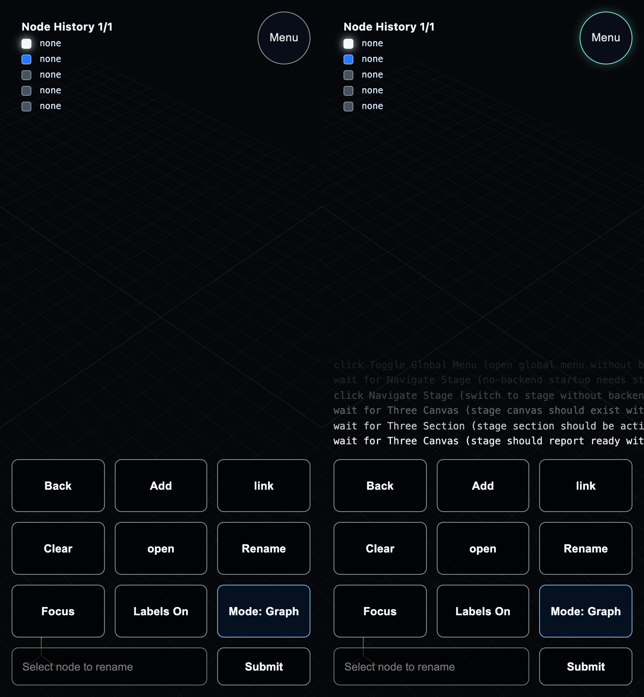

### 04 Startup: Menu -> Stage Fresh Load

```text
result: PASS
duration: 1.27s
section: dag-3d-stage
```

#### Step Story

Fresh app startup opened menu immediately, used Navigate Stage, and verified the stage section becomes active and ready without requiring table readiness.

#### Runner Output

```text
[T+0010] [TEST] RUN   04 Startup: Menu -> Stage Fresh Load
[T+0010] STEP> begin 04 Startup: Menu -> Stage Fresh Load
[T+0010] >> [DAG] Serve: src_v3
[T+0010] [2026-02-17T20:57:00.600-08:00 | INFO | go.go:RunGo:33] Running: go [run src/plugins/dag/src_v3/cmd/main.go]
[T+0010] DAG Server starting on http://localhost:8080
[T+0010] WAIT> aria-toggle-global-menu (fresh startup needs menu toggle)
[T+0011] USER> click aria-toggle-global-menu
[T+0011] CLICK> kind=aria target=Toggle Global Menu detail=open global menu from fresh startup
[T+0011] WAIT> aria-navigate-stage (fresh startup needs stage nav button)
[T+0011] USER> click aria-navigate-stage
[T+0011] CLICK> kind=aria target=Navigate Stage detail=switch to stage from menu
[T+0011] WAIT> aria-three-canvas (stage canvas should exist after menu nav)
[T+0011] WAIT> aria-three-section (stage section should be active)
[T+0011] WAIT> aria-three-canvas (stage should report ready)
```

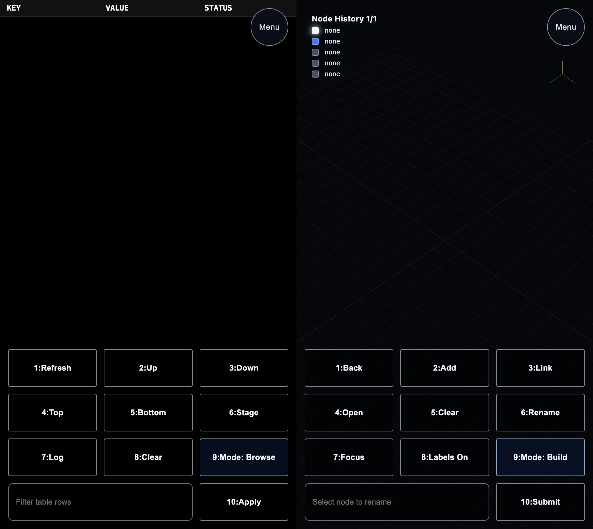

### 05 DAG Table Section Validation

```text
result: PASS
duration: 312ms
section: dag-meta-table
```

#### Step Story

Loaded the DAG table, waited for `data-ready=true`, validated API parity and row status content, then captured pre/post table screenshots.

#### Runner Output

```text
[T+0011] [TEST] RUN   05 DAG Table Section Validation
[T+0011] STEP> begin 05 DAG Table Section Validation
[T+0011] WAIT> aria-dag-table (need table element for validation)
[T+0011] WAIT> aria-dag-table (wait for table ready flag)
```

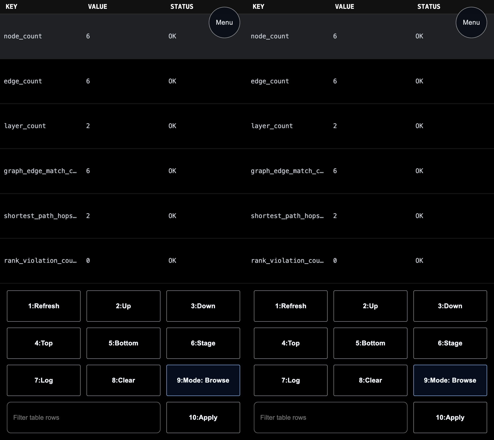

### 06 Menu/Nav Section Switch Validation

```text
result: PASS
duration: 541ms
section: dag-3d-stage
```

#### Step Story

Opened global menu from table, navigated to stage through menu action, and verified the stage canvas becomes ready after section switch.

#### Runner Output

```text
[T+0012] [TEST] RUN   06 Menu/Nav Section Switch Validation
[T+0012] STEP> begin 06 Menu/Nav Section Switch Validation
[T+0012] WAIT> aria-toggle-global-menu (need menu toggle)
[T+0012] WAIT> aria-dag-table (need table visible)
[T+0012] WAIT> aria-dag-table (wait for table ready)
[T+0012] USER> click aria-toggle-global-menu
[T+0012] CLICK> kind=aria target=Toggle Global Menu detail=open global menu
[T+0012] WAIT> aria-navigate-stage (need stage menu button)
[T+0012] USER> click aria-navigate-stage
[T+0012] CLICK> kind=aria target=Navigate Stage detail=switch section to stage
[T+0012] WAIT> aria-three-canvas (confirm stage visible after nav)
[T+0012] WAIT> aria-three-canvas (wait for stage ready after nav)
```

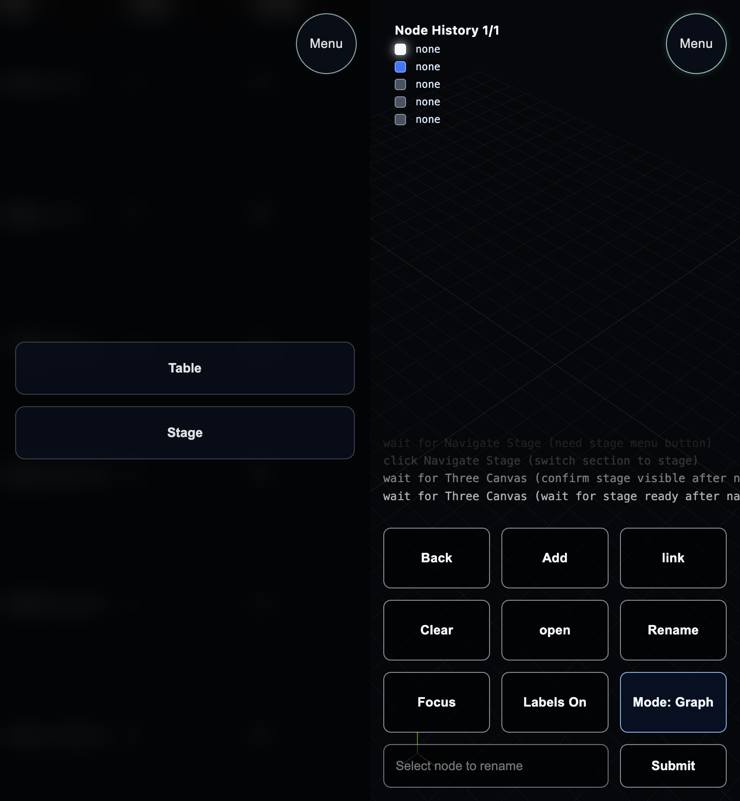

### 07 Log Section Echo Command

```text
result: PASS
duration: 203ms
section: dag-log-xterm
```

#### Step Story

Navigated to `dag-log-xterm`, entered a command, and verified command echo in terminal output.

#### Runner Output

```text
[T+0012] [TEST] RUN   07 Log Section Echo Command
[T+0012] STEP> begin 07 Log Section Echo Command
[T+0012] WAIT> aria-log-terminal (log section terminal should be visible)
[T+0013] WAIT> aria-log-command-input (log thumbs command input should be visible)
[T+0013] USER> type aria-log-command-input "status --echo-test"
[T+0013] TYPE> aria-log-command-input (enter log command)
[T+0013] USER> press-enter aria-log-command-input
[T+0013] KEY> enter aria-log-command-input (submit log command)
[T+0013] ASSERT> log-terminal contains "USER> status --echo-test"
```

### 07 Test-DAG: Program A Node

```text
result: PASS
duration: 680ms
section: dag-3d-stage
```

#### Step Story

Created and labeled the root `Program A` node, then validated camera/node projection from unified logs.

#### Runner Output

```text
[T+0013] [TEST] RUN   07 Test-DAG: Program A Node
[T+0013] STEP> begin 07 Test-DAG: Program A Node
[T+0013] STORY> step 1: computer A program node
[T+0013] STORY> user opens stage, adds first node, and names it Program A
[T+0013] WAIT> aria-three-canvas (need stage canvas before interactions)
[T+0013] WAIT> aria-three-canvas (wait for stage ready flag)
[T+0013] WAIT> aria-dag-mode (need mode button)
[T+0013] WAIT> aria-dag-add (need add thumb action)
[T+0013] WAIT> aria-dag-label-input (need rename input)
[T+0013] WAIT> aria-dag-add (action button must exist before click)
[T+0013] USER> click aria-dag-add
[T+0013] CLICK> kind=aria target=DAG Add detail=mode=graph;action=add;label=DAG Add
[T+0013] USER> click rename-submit-dag-rename
[T+0013] CLICK> kind=rename_submit target=DAG Rename detail=Program A
[T+0013] USER> click aria-dag-rename
[T+0013] CLICK> kind=aria target=DAG Rename detail=submit rename
[T+0013] ASSERT> node=n_user_1 projected=(252,376) canvas=(504,900)
[T+0013] ASSERT> camera_distance node=n_user_1 got=27.05 expected=27.00±4.00
[T+0013] USER> click step-done-story-step-1
[T+0013] CLICK> kind=step_done target=story_step_1 detail=ok
```

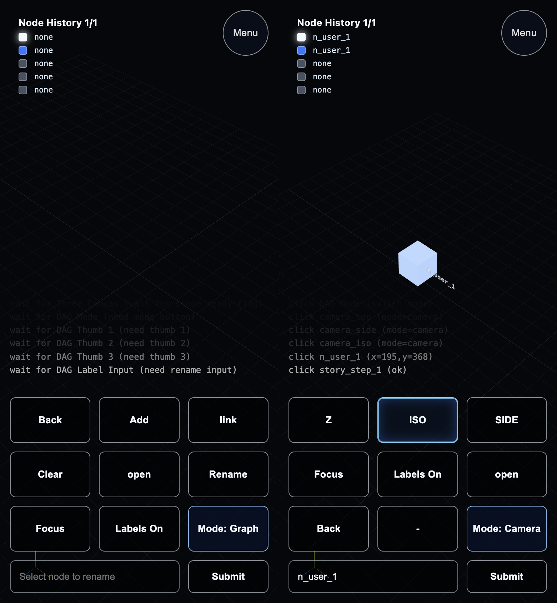

### 08 Test-DAG: Program A -> Agent A

```text
result: PASS
duration: 998ms
section: dag-3d-stage
```

#### Step Story

Created `Agent A`, linked `Program A -> Agent A`, renamed it, and validated projection/camera logs.

#### Runner Output

```text
[T+0014] [TEST] RUN   08 Test-DAG: Program A -> Agent A
[T+0014] STEP> begin 08 Test-DAG: Program A -> Agent A
[T+0014] STORY> step 2: build Program A -> Agent A
[T+0014] WAIT> aria-three-canvas (need canvas before story step2 actions)
[T+0014] WAIT> aria-dag-add (action button must exist before click)
[T+0014] USER> click aria-dag-add
[T+0014] CLICK> kind=aria target=DAG Add detail=mode=graph;action=add;label=DAG Add
[T+0014] WAIT> aria-dag-link (action button must exist before click)
[T+0014] USER> click aria-dag-link
[T+0014] CLICK> kind=aria target=DAG Link detail=mode=graph;action=link_or_unlink;label=DAG Link
[T+0014] USER> click rename-submit-dag-rename
[T+0014] CLICK> kind=rename_submit target=DAG Rename detail=Agent A
[T+0014] USER> click aria-dag-rename
[T+0014] CLICK> kind=aria target=DAG Rename detail=submit rename
[T+0014] ASSERT> node=n_user_2 projected=(252,376) canvas=(504,900)
[T+0014] ASSERT> camera_distance node=n_user_2 got=27.05 expected=27.00±4.00
[T+0014] USER> click step-done-story-step-2
[T+0014] CLICK> kind=step_done target=story_step_2 detail=ok
```

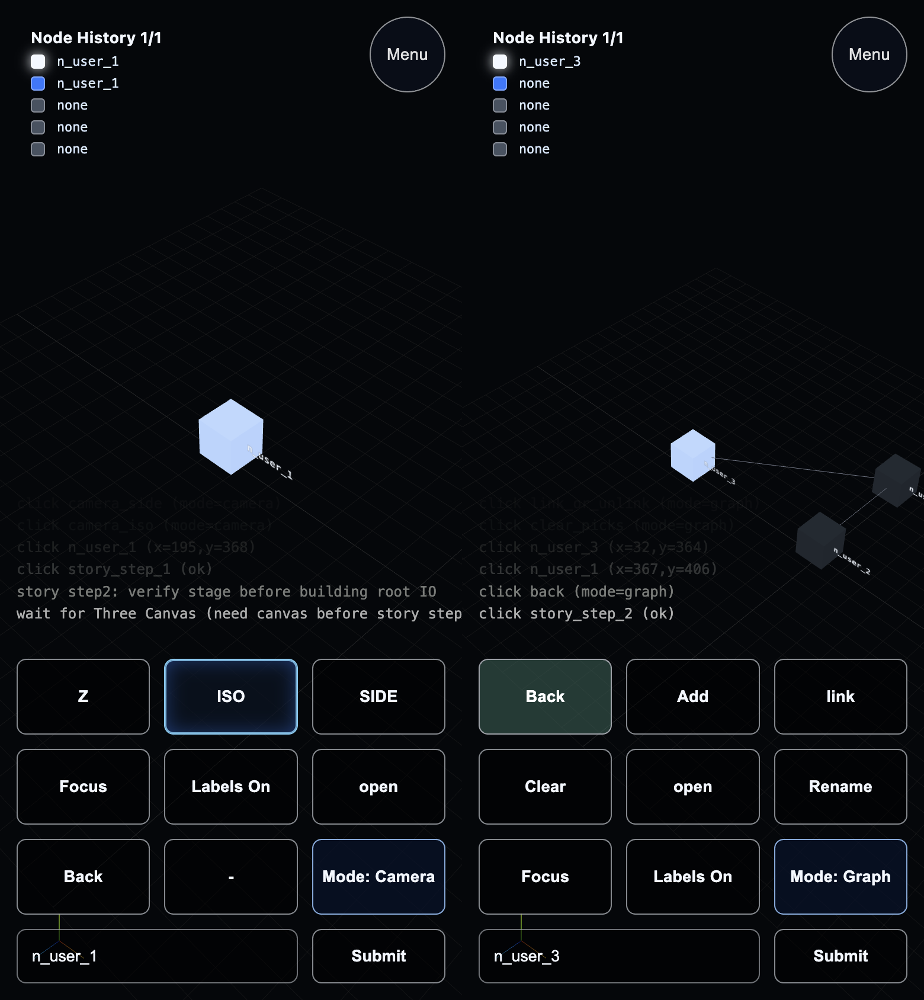

### 09 Test-DAG: Agent A -> Link

```text
result: PASS
duration: 955ms
section: dag-3d-stage
```

#### Step Story

Created `Link`, linked `Agent A -> Link`, renamed it, and validated projection/camera logs.

#### Runner Output

```text
[T+0015] [TEST] RUN   09 Test-DAG: Agent A -> Link
[T+0015] STEP> begin 09 Test-DAG: Agent A -> Link
[T+0015] STORY> step 3: build Agent A -> Link
[T+0015] WAIT> aria-dag-add (action button must exist before click)
[T+0015] USER> click aria-dag-add
[T+0015] CLICK> kind=aria target=DAG Add detail=mode=graph;action=add;label=DAG Add
[T+0015] WAIT> aria-dag-link (action button must exist before click)
[T+0015] USER> click aria-dag-link
[T+0015] CLICK> kind=aria target=DAG Link detail=mode=graph;action=link_or_unlink;label=DAG Link
[T+0015] USER> click rename-submit-dag-rename
[T+0015] CLICK> kind=rename_submit target=DAG Rename detail=Link
[T+0016] USER> click aria-dag-rename
[T+0016] CLICK> kind=aria target=DAG Rename detail=submit rename
[T+0016] ASSERT> node=n_user_3 projected=(252,376) canvas=(504,900)
[T+0016] ASSERT> camera_distance node=n_user_3 got=27.05 expected=27.00±4.00
[T+0016] USER> click step-done-story-step-3
[T+0016] CLICK> kind=step_done target=story_step_3 detail=ok
```

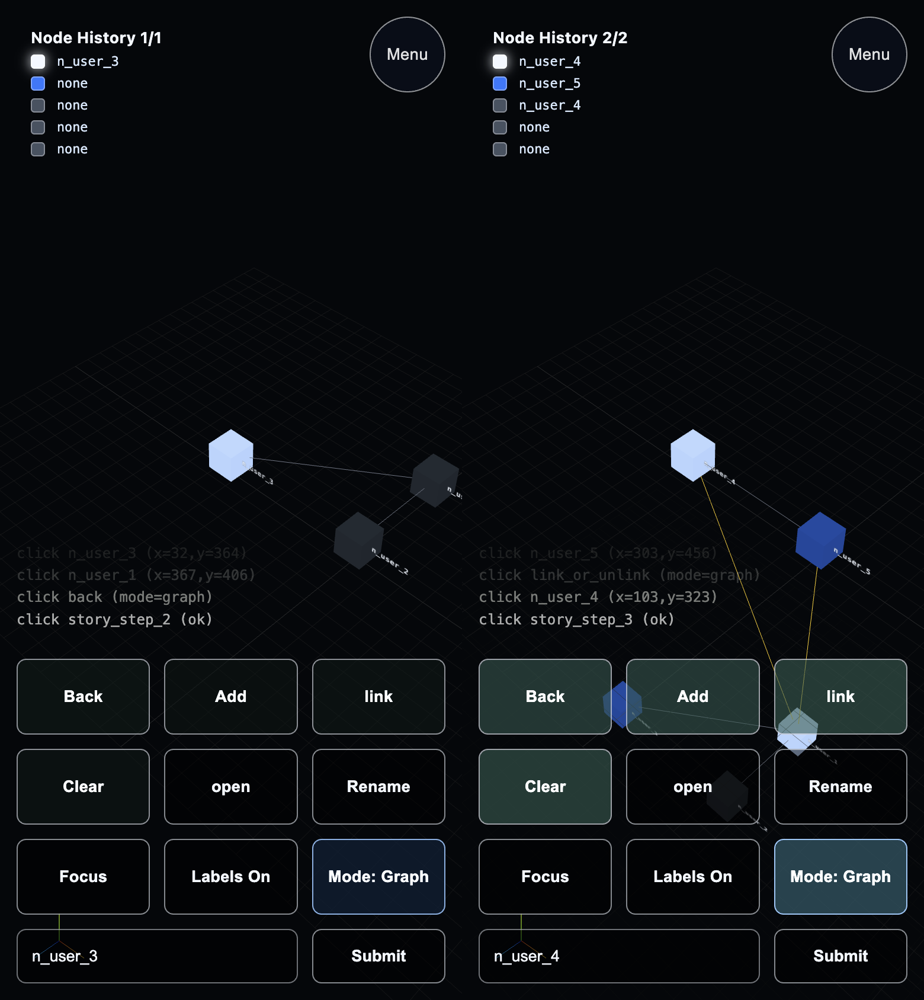

### 10 Test-DAG: Link -> Agent B

```text
result: PASS
duration: 971ms
section: dag-3d-stage
```

#### Step Story

Created `Agent B`, linked `Link -> Agent B`, renamed it, and validated projection/camera logs.

#### Runner Output

```text
[T+0016] [TEST] RUN   10 Test-DAG: Link -> Agent B
[T+0016] STEP> begin 10 Test-DAG: Link -> Agent B
[T+0016] STORY> step 4: build Link -> Agent B
[T+0016] WAIT> aria-dag-add (action button must exist before click)
[T+0016] USER> click aria-dag-add
[T+0016] CLICK> kind=aria target=DAG Add detail=mode=graph;action=add;label=DAG Add
[T+0016] WAIT> aria-dag-link (action button must exist before click)
[T+0016] USER> click aria-dag-link
[T+0016] CLICK> kind=aria target=DAG Link detail=mode=graph;action=link_or_unlink;label=DAG Link
[T+0016] USER> click rename-submit-dag-rename
[T+0016] CLICK> kind=rename_submit target=DAG Rename detail=Agent B
[T+0017] USER> click aria-dag-rename
[T+0017] CLICK> kind=aria target=DAG Rename detail=submit rename
[T+0017] ASSERT> node=n_user_4 projected=(252,376) canvas=(504,900)
[T+0017] ASSERT> camera_distance node=n_user_4 got=27.05 expected=27.00±4.00
[T+0017] USER> click step-done-story-step-4
[T+0017] CLICK> kind=step_done target=story_step_4 detail=ok
```

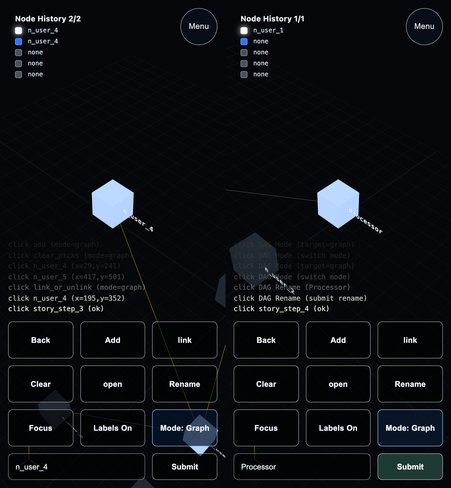

### 11 Test-DAG: Agent B -> Program B

```text
result: PASS
duration: 956ms
section: dag-3d-stage
```

#### Step Story

Created `Program B`, linked `Agent B -> Program B`, renamed it, and validated projection/camera logs.

#### Runner Output

```text
[T+0017] [TEST] RUN   11 Test-DAG: Agent B -> Program B
[T+0017] STEP> begin 11 Test-DAG: Agent B -> Program B
[T+0017] STORY> step 5: build Agent B -> Program B
[T+0017] WAIT> aria-dag-add (action button must exist before click)
[T+0017] USER> click aria-dag-add
[T+0017] CLICK> kind=aria target=DAG Add detail=mode=graph;action=add;label=DAG Add
[T+0017] WAIT> aria-dag-link (action button must exist before click)
[T+0018] USER> click aria-dag-link
[T+0018] CLICK> kind=aria target=DAG Link detail=mode=graph;action=link_or_unlink;label=DAG Link
[T+0018] USER> click rename-submit-dag-rename
[T+0018] CLICK> kind=rename_submit target=DAG Rename detail=Program B
[T+0018] USER> click aria-dag-rename
[T+0018] CLICK> kind=aria target=DAG Rename detail=submit rename
[T+0018] ASSERT> node=n_user_5 projected=(252,376) canvas=(504,900)
[T+0018] ASSERT> camera_distance node=n_user_5 got=27.05 expected=27.00±4.00
[T+0018] USER> click step-done-story-step-5
[T+0018] CLICK> kind=step_done target=story_step_5 detail=ok
```

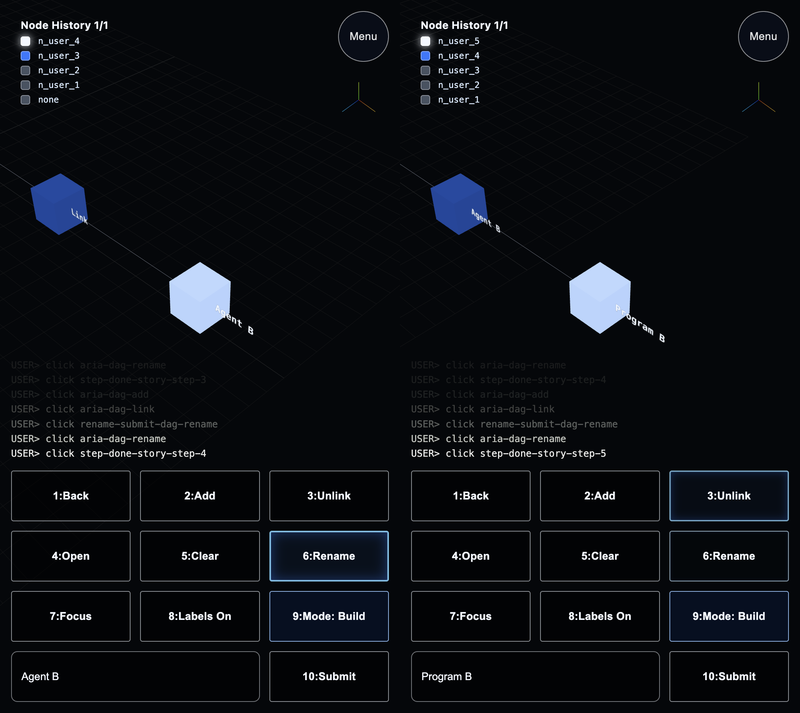

### 12 Test-DAG: Open Link Protocol Layer

```text
result: PASS
duration: 1.011s
section: dag-3d-stage
```

#### Step Story

Opened the nested protocol layer on `Link` with layer mode and verified nested-layer activation via unified logs.

#### Runner Output

```text
[T+0018] [TEST] RUN   12 Test-DAG: Open Link Protocol Layer
[T+0018] STEP> begin 12 Test-DAG: Open Link Protocol Layer
[T+0018] STORY> step 6: open nested protocol layer on Link
[T+0018] WAIT> aria-dag-back (action button must exist before click)
[T+0018] USER> click aria-dag-back
[T+0018] CLICK> kind=aria target=DAG Back detail=mode=graph;action=back;label=DAG Back
[T+0018] USER> click mode-dag-mode
[T+0018] CLICK> kind=mode target=DAG Mode detail=target=layer
[T+0019] USER> click aria-dag-mode
[T+0019] CLICK> kind=aria target=DAG Mode detail=switch mode
[T+0019] WAIT> aria-dag-open (action button must exist before click)
[T+0019] USER> click aria-dag-open
[T+0019] CLICK> kind=aria target=DAG Open detail=mode=layer;action=open_or_close_layer;label=DAG Open
[T+0019] ASSERT> history_depth=1
[T+0019] ASSERT> camera_above node=n_user_3 camY=41.40 nodeY=0.00 delta=41.40
[T+0019] USER> click step-done-story-step-6
[T+0019] CLICK> kind=step_done target=story_step_6 detail=ok
```

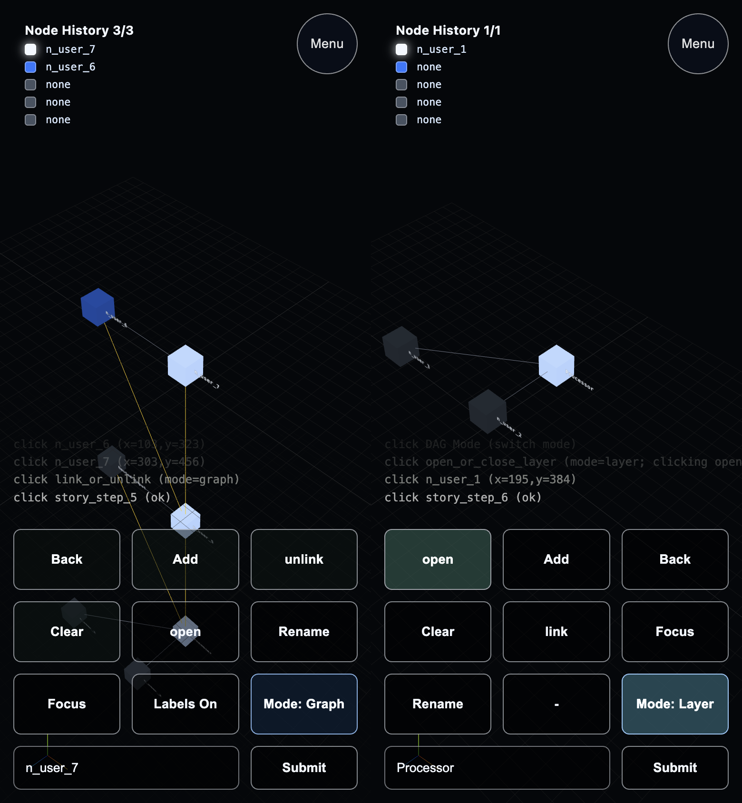

### 13 Test-DAG: Build Protocol Tx/Rx

```text
result: PASS
duration: 1.31s
section: dag-3d-stage
```

#### Step Story

Inside nested `Link` layer, created `Proto Tx` and `Proto Rx`, linked them, and validated projected node positions in viewport.

#### Runner Output

```text
[T+0019] [TEST] RUN   13 Test-DAG: Build Protocol Tx/Rx
[T+0019] STEP> begin 13 Test-DAG: Build Protocol Tx/Rx
[T+0019] STORY> step 7: nested protocol Tx/Rx inside Link layer
[T+0020] WAIT> aria-dag-add (action button must exist before click)
[T+0020] USER> click aria-dag-add
[T+0020] CLICK> kind=aria target=DAG Add detail=mode=layer;action=add;label=DAG Add
[T+0020] INPUT> dag-label-input="Proto Tx"
[T+0020] WAIT> aria-dag-rename (action button must exist before click)
[T+0020] USER> click aria-dag-rename
[T+0020] CLICK> kind=aria target=DAG Rename detail=mode=layer;action=rename;label=DAG Rename
[T+0020] WAIT> aria-dag-add (action button must exist before click)
[T+0020] USER> click aria-dag-add
[T+0020] CLICK> kind=aria target=DAG Add detail=mode=layer;action=add;label=DAG Add
[T+0020] WAIT> aria-dag-link (action button must exist before click)
[T+0021] USER> click aria-dag-link
[T+0021] CLICK> kind=aria target=DAG Link detail=mode=layer;action=link_or_unlink;label=DAG Link
[T+0021] ASSERT> node=n_user_6 projected=(75,258) canvas=(504,900)
[T+0021] ASSERT> node=n_user_7 projected=(252,376) canvas=(504,900)
[T+0021] USER> click step-done-story-step-7
[T+0021] CLICK> kind=step_done target=story_step_7 detail=ok
```

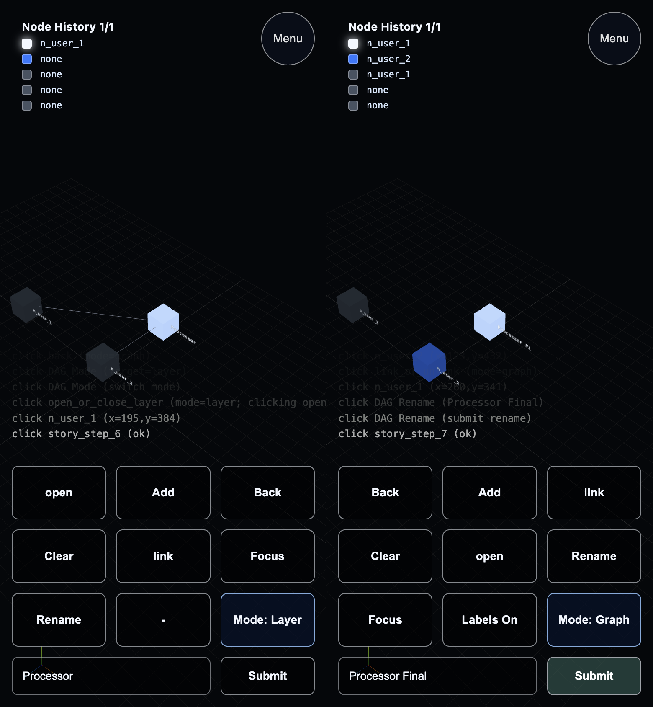

### 14 Test-DAG: Close Protocol Layer

```text
result: PASS
duration: 344ms
section: dag-3d-stage
```

#### Step Story

Closed nested protocol layer back to `root` and verified the active-layer state via unified logs.

#### Runner Output

```text
[T+0021] [TEST] RUN   14 Test-DAG: Close Protocol Layer
[T+0021] STEP> begin 14 Test-DAG: Close Protocol Layer
[T+0021] WAIT> aria-dag-back (action button must exist before click)
[T+0021] USER> click aria-dag-back
[T+0021] CLICK> kind=aria target=DAG Back detail=mode=layer;action=back;label=DAG Back
[T+0021] WAIT> aria-dag-close (action button must exist before click)
[T+0021] USER> click aria-dag-close
[T+0021] CLICK> kind=aria target=DAG Close detail=mode=layer;action=open_or_close_layer;label=DAG Close
[T+0021] ASSERT> active_layer=root
```

### 15 Thumbs: Switch To Build Mode

```text
result: PASS
duration: 342ms
section: dag-3d-stage
```

#### Step Story

Confirmed the thumb calculator is in Build mode.

#### Runner Output

```text
[T+0021] [TEST] RUN   15 Thumbs: Switch To Build Mode
[T+0021] STEP> begin 15 Thumbs: Switch To Build Mode
[T+0021] USER> click mode-dag-mode
[T+0021] CLICK> kind=mode target=DAG Mode detail=target=graph
[T+0021] USER> click aria-dag-mode
[T+0021] CLICK> kind=aria target=DAG Mode detail=switch mode
[T+0021] USER> click mode-dag-mode
[T+0021] CLICK> kind=mode target=DAG Mode detail=target=graph
[T+0022] USER> click aria-dag-mode
[T+0022] CLICK> kind=aria target=DAG Mode detail=switch mode
[T+0022] ASSERT> mode=graph
```

### 16 Thumbs: Build Mode Buttons A

```text
result: PASS
duration: 1.017s
section: dag-3d-stage
```

#### Step Story

Build mode used `Add`, `Link/Unlink`, `Rename`, and `Focus` with viewport projection validation.

#### Runner Output

```text
[T+0022] [TEST] RUN   16 Thumbs: Build Mode Buttons A
[T+0022] STEP> begin 16 Thumbs: Build Mode Buttons A
[T+0022] WAIT> aria-dag-add (action button must exist before click)
[T+0022] USER> click aria-dag-add
[T+0022] CLICK> kind=aria target=DAG Add detail=mode=graph;action=add;label=DAG Add
[T+0022] WAIT> aria-dag-link (action button must exist before click)
[T+0022] USER> click aria-dag-link
[T+0022] CLICK> kind=aria target=DAG Link detail=mode=graph;action=link_or_unlink;label=DAG Link
[T+0022] INPUT> dag-label-input="Build Relay"
[T+0022] WAIT> aria-dag-rename (action button must exist before click)
[T+0022] USER> click aria-dag-rename
[T+0022] CLICK> kind=aria target=DAG Rename detail=mode=graph;action=rename;label=DAG Rename
[T+0022] WAIT> aria-dag-focus (action button must exist before click)
[T+0023] USER> click aria-dag-focus
[T+0023] CLICK> kind=aria target=DAG Focus detail=mode=graph;action=focus;label=DAG Focus
[T+0023] ASSERT> node=n_user_8 projected=(252,376) canvas=(504,900)
```

### 17 Thumbs: Build Mode Buttons B

```text
result: PASS
duration: 1.015s
section: dag-3d-stage
```

#### Step Story

Build mode used `Open/Close`, `Back`, `Labels`, and `Clear`, and verified root-layer state.

#### Runner Output

```text
[T+0023] [TEST] RUN   17 Thumbs: Build Mode Buttons B
[T+0023] STEP> begin 17 Thumbs: Build Mode Buttons B
[T+0023] WAIT> aria-dag-open (action button must exist before click)
[T+0023] USER> click aria-dag-open
[T+0023] CLICK> kind=aria target=DAG Open detail=mode=graph;action=open_or_close_layer;label=DAG Open
[T+0023] WAIT> aria-dag-back (action button must exist before click)
[T+0023] USER> click aria-dag-back
[T+0023] CLICK> kind=aria target=DAG Back detail=mode=graph;action=back;label=DAG Back
[T+0023] WAIT> aria-dag-labels-on (action button must exist before click)
[T+0023] USER> click aria-dag-labels-on
[T+0023] CLICK> kind=aria target=DAG Labels On detail=mode=graph;action=toggle_labels;label=DAG Labels On
[T+0023] WAIT> aria-dag-clear (action button must exist before click)
[T+0024] USER> click aria-dag-clear
[T+0024] CLICK> kind=aria target=DAG Clear detail=mode=graph;action=clear_picks;label=DAG Clear
[T+0024] ASSERT> active_layer=root
```

### 18 Thumbs: Switch To Layer Mode

```text
result: PASS
duration: 11ms
section: dag-3d-stage
```

#### Step Story

Confirmed the thumb calculator is in Layer mode.

#### Runner Output

```text
[T+0024] [TEST] RUN   18 Thumbs: Switch To Layer Mode
[T+0024] STEP> begin 18 Thumbs: Switch To Layer Mode
[T+0024] USER> click mode-dag-mode
[T+0024] CLICK> kind=mode target=DAG Mode detail=target=layer
[T+0024] USER> click aria-dag-mode
[T+0024] CLICK> kind=aria target=DAG Mode detail=switch mode
[T+0024] ASSERT> mode=layer
```

### 19 Thumbs: Layer Mode Buttons A

```text
result: PASS
duration: 1.015s
section: dag-3d-stage
```

#### Step Story

Layer mode used `Add`, `Link/Unlink`, `Rename`, and `Focus` on a relay node with viewport projection validation.

#### Runner Output

```text
[T+0024] [TEST] RUN   19 Thumbs: Layer Mode Buttons A
[T+0024] STEP> begin 19 Thumbs: Layer Mode Buttons A
[T+0024] WAIT> aria-dag-add (action button must exist before click)
[T+0024] USER> click aria-dag-add
[T+0024] CLICK> kind=aria target=DAG Add detail=mode=layer;action=add;label=DAG Add
[T+0024] WAIT> aria-dag-link (action button must exist before click)
[T+0024] USER> click aria-dag-link
[T+0024] CLICK> kind=aria target=DAG Link detail=mode=layer;action=link_or_unlink;label=DAG Link
[T+0024] INPUT> dag-label-input="Layer Relay"
[T+0024] WAIT> aria-dag-rename (action button must exist before click)
[T+0024] USER> click aria-dag-rename
[T+0024] CLICK> kind=aria target=DAG Rename detail=mode=layer;action=rename;label=DAG Rename
[T+0024] WAIT> aria-dag-focus (action button must exist before click)
[T+0025] USER> click aria-dag-focus
[T+0025] CLICK> kind=aria target=DAG Focus detail=mode=layer;action=focus;label=DAG Focus
[T+0025] ASSERT> node=n_user_9 projected=(252,376) canvas=(504,900)
```

### 20 Thumbs: Layer Mode Buttons B

```text
result: PASS
duration: 1.019s
section: dag-3d-stage
```

#### Step Story

Layer mode used `Open/Close`, `Back`, `Labels`, and `Clear`, and confirmed return to the root layer.

#### Runner Output

```text
[T+0025] [TEST] RUN   20 Thumbs: Layer Mode Buttons B
[T+0025] STEP> begin 20 Thumbs: Layer Mode Buttons B
[T+0025] WAIT> aria-dag-open (action button must exist before click)
[T+0025] USER> click aria-dag-open
[T+0025] CLICK> kind=aria target=DAG Open detail=mode=layer;action=open_or_close_layer;label=DAG Open
[T+0025] WAIT> aria-dag-back (action button must exist before click)
[T+0025] USER> click aria-dag-back
[T+0025] CLICK> kind=aria target=DAG Back detail=mode=layer;action=back;label=DAG Back
[T+0025] WAIT> aria-dag-labels-off (action button must exist before click)
[T+0025] USER> click aria-dag-labels-off
[T+0025] CLICK> kind=aria target=DAG Labels Off detail=mode=layer;action=toggle_labels;label=DAG Labels Off
[T+0025] WAIT> aria-dag-clear (action button must exist before click)
[T+0026] USER> click aria-dag-clear
[T+0026] CLICK> kind=aria target=DAG Clear detail=mode=layer;action=clear_picks;label=DAG Clear
[T+0026] ASSERT> active_layer=root
```

### 21 Thumbs: Switch To View Mode

```text
result: PASS
duration: 6ms
section: dag-3d-stage
```

#### Step Story

Switched the thumb calculator from Layer mode to View mode.

#### Runner Output

```text
[T+0026] [TEST] RUN   21 Thumbs: Switch To View Mode
[T+0026] STEP> begin 21 Thumbs: Switch To View Mode
[T+0026] USER> click aria-dag-mode
[T+0026] CLICK> kind=aria target=DAG Mode detail=switch layer controls to view controls
[T+0026] ASSERT> mode=camera
```

### 22 Thumbs: View Mode Buttons A

```text
result: PASS
duration: 1.016s
section: dag-3d-stage
```

#### Step Story

View mode used camera orientation controls `Top`, `Iso`, `Side`, then `Focus` to reframe the active layer.

#### Runner Output

```text
[T+0026] [TEST] RUN   22 Thumbs: View Mode Buttons A
[T+0026] STEP> begin 22 Thumbs: View Mode Buttons A
[T+0026] WAIT> aria-dag-top (action button must exist before click)
[T+0026] USER> click aria-dag-top
[T+0026] CLICK> kind=aria target=DAG Top detail=mode=camera;action=camera_top;label=DAG Top
[T+0026] WAIT> aria-dag-iso (action button must exist before click)
[T+0026] USER> click aria-dag-iso
[T+0026] CLICK> kind=aria target=DAG Iso detail=mode=camera;action=camera_iso;label=DAG Iso
[T+0026] WAIT> aria-dag-side (action button must exist before click)
[T+0026] USER> click aria-dag-side
[T+0026] CLICK> kind=aria target=DAG Side detail=mode=camera;action=camera_side;label=DAG Side
[T+0026] WAIT> aria-dag-focus (action button must exist before click)
[T+0027] USER> click aria-dag-focus
[T+0027] CLICK> kind=aria target=DAG Focus detail=mode=camera;action=focus;label=DAG Focus
```

### 23 Thumbs: View Mode Buttons B

```text
result: PASS
duration: 1.017s
section: dag-3d-stage
```

#### Step Story

View mode used `Add`, `Open/Close`, `Labels`, and `Back`, then validated created-node projection in the current viewport.

#### Runner Output

```text
[T+0027] [TEST] RUN   23 Thumbs: View Mode Buttons B
[T+0027] STEP> begin 23 Thumbs: View Mode Buttons B
[T+0027] WAIT> aria-dag-add (action button must exist before click)
[T+0027] USER> click aria-dag-add
[T+0027] CLICK> kind=aria target=DAG Add detail=mode=camera;action=add;label=DAG Add
[T+0027] WAIT> aria-dag-open (action button must exist before click)
[T+0027] USER> click aria-dag-open
[T+0027] CLICK> kind=aria target=DAG Open detail=mode=camera;action=open_or_close_layer;label=DAG Open
[T+0027] WAIT> aria-dag-labels-on (action button must exist before click)
[T+0027] USER> click aria-dag-labels-on
[T+0027] CLICK> kind=aria target=DAG Labels On detail=mode=camera;action=toggle_labels;label=DAG Labels On
[T+0027] WAIT> aria-dag-back (action button must exist before click)
[T+0028] USER> click aria-dag-back
[T+0028] CLICK> kind=aria target=DAG Back detail=mode=camera;action=back;label=DAG Back
[T+0028] ASSERT> node=n_user_10 projected=(252,336) canvas=(504,900)
```

### 24 Finalize + Teardown

```text
result: PASS
duration: 6ms
```

#### Step Story

Returned controls to Build mode and tore down shared browser/backend resources.

#### Runner Output

```text
[T+0028] [TEST] RUN   24 Finalize + Teardown
[T+0028] STEP> begin 24 Finalize + Teardown
[T+0028] USER> click aria-dag-mode
[T+0028] CLICK> kind=aria target=DAG Mode detail=return to build mode before teardown
[T+0028] ASSERT> mode=graph
```

## Artifacts

- `test.log`
- `error.log`
- `screenshots/test_step_no_backend_menu_stage_grid.png`
- `screenshots/test_step_no_backend_menu_stage_pre.png`
- `screenshots/test_step_no_backend_menu_stage.png`
- `screenshots/test_step_startup_menu_stage_grid.png`
- `screenshots/test_step_startup_menu_stage_pre.png`
- `screenshots/test_step_startup_menu_stage.png`
- `screenshots/test_step_1_grid.png`
- `screenshots/test_step_1_pre.png`
- `screenshots/test_step_1.png`
- `screenshots/test_step_menu_nav_grid.png`
- `screenshots/test_step_menu_nav_pre.png`
- `screenshots/test_step_menu_nav.png`
- `screenshots/test_step_2_grid.png`
- `screenshots/test_step_2_pre.png`
- `screenshots/test_step_2.png`
- `screenshots/test_step_3_grid.png`
- `screenshots/test_step_3_pre.png`
- `screenshots/test_step_3.png`
- `screenshots/test_step_4_grid.png`
- `screenshots/test_step_4_pre.png`
- `screenshots/test_step_4.png`
- `screenshots/test_step_5_grid.png`
- `screenshots/test_step_5_pre.png`
- `screenshots/test_step_5.png`
- `screenshots/test_step_6_grid.png`
- `screenshots/test_step_6_pre.png`
- `screenshots/test_step_6.png`
- `screenshots/test_step_7_grid.png`
- `screenshots/test_step_7_pre.png`
- `screenshots/test_step_7.png`
- `screenshots/test_step_8_grid.png`
- `screenshots/test_step_8_pre.png`
- `screenshots/test_step_8.png`
