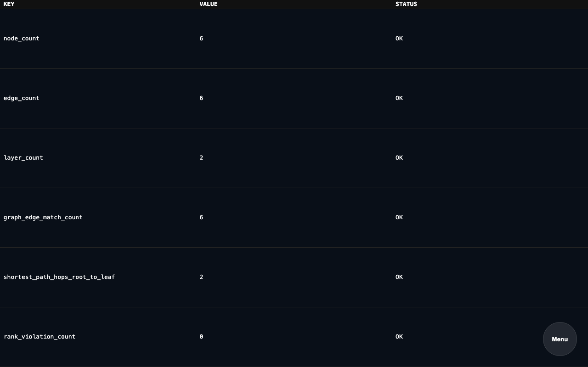
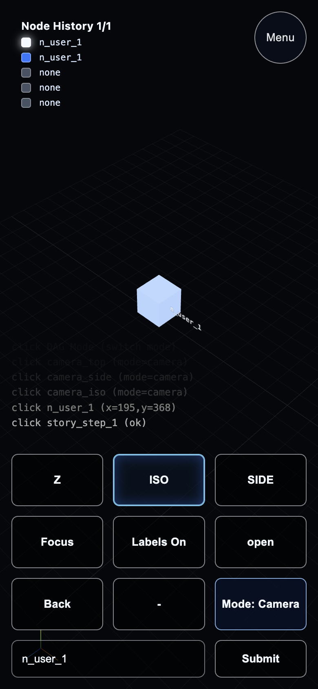
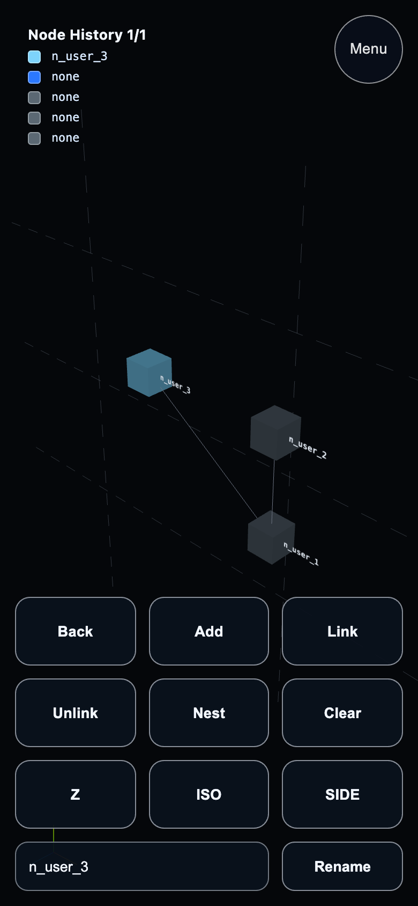
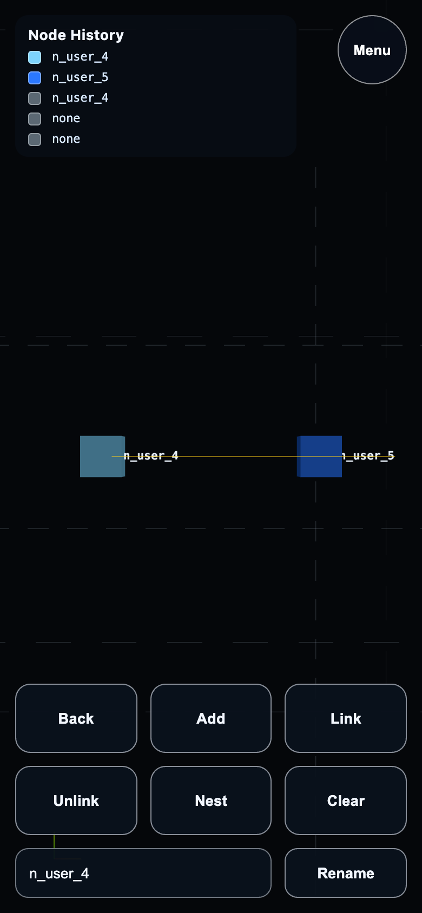
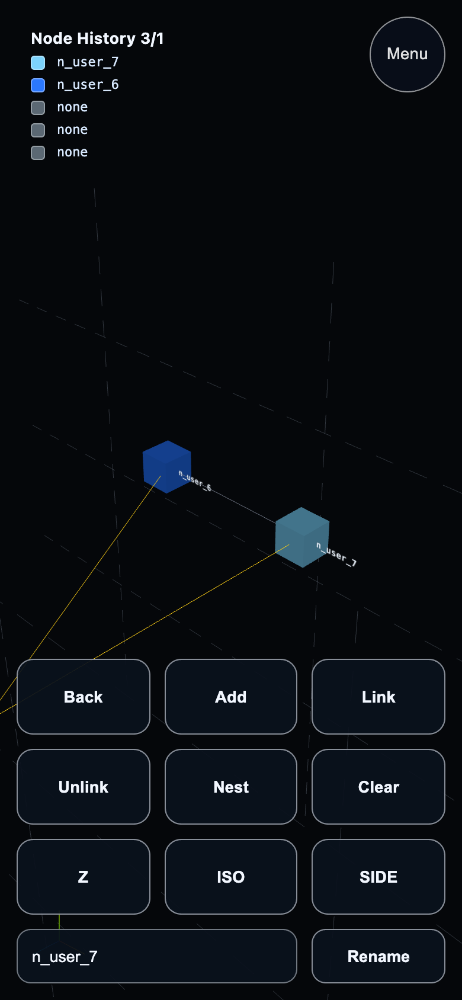
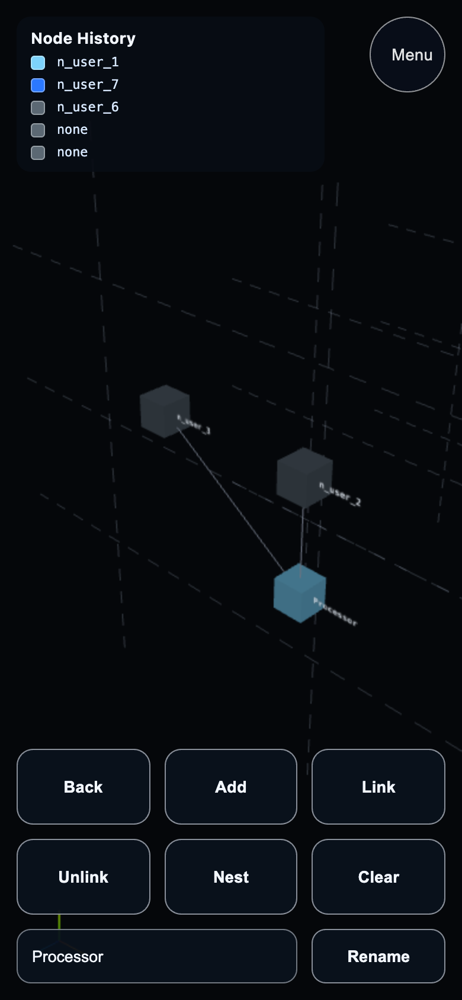
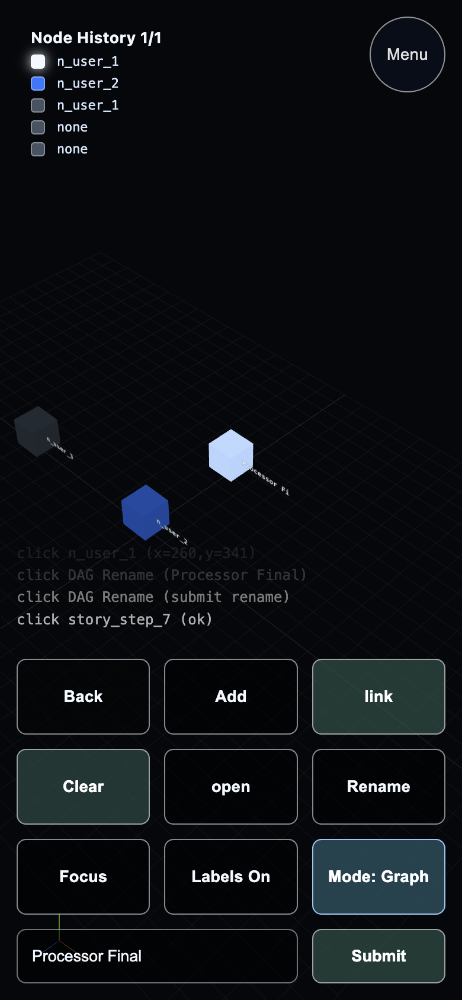

# Dag Plugin src_v3 Test Report

**Generated at:** Sun, 15 Feb 2026 23:07:22 -0800
**Version:** `src_v3`
**Runner:** `test_v2`
**Status:** ✅ PASS
**Total Time:** `14.86s`

## Test Steps

| Step | Result | Duration |
|---|---|---|
| 01 DuckDB Graph Query Validation | ✅ PASS | `156ms` |
| 02 Preflight (Go/UI) | ✅ PASS | `11.15s` |
| 03 DAG Table Section Validation | ✅ PASS | `2.872s` |
| 04 User Story: Empty DAG Start + First Node | ✅ PASS | `173ms` |
| 05 User Story: Build Root IO | ✅ PASS | `83ms` |
| 06 User Story: Nest + Dive + Nested Build | ✅ PASS | `85ms` |
| 07 User Story: Rename + Undive + Camera History | ✅ PASS | `84ms` |
| 08 User Story: Deep Nested Build | ✅ PASS | `82ms` |
| 09 User Story: Deep Undive + Camera History | ✅ PASS | `84ms` |
| 10 User Story: Unlink + Relabel + Camera Readability | ✅ PASS | `82ms` |
| 11 Cleanup Verification | ✅ PASS | `5ms` |

## Step Logs

### 01 DuckDB Graph Query Validation

```text
result: PASS
duration: 156ms
```

#### Runner Output

```text
[T+0000] [TEST] RUN   01 DuckDB Graph Query Validation
[T+0000] [GRAPH] running: graph_edge_match_count
[T+0000] [GRAPH] running: shortest_path_hops_root_to_leaf
[T+0000] [GRAPH] running: rank_violation_count
[T+0000] [GRAPH] running: nested_nodes_for_n_mid_a
[T+0000] [GRAPH] running: input_nodes_for_n_leaf
[T+0000] [GRAPH] running: output_nodes_for_n_root
```

### 02 Preflight (Go/UI)

```text
result: PASS
duration: 11.15s
```

#### Runner Output

```text
[T+0000] [TEST] RUN   02 Preflight (Go/UI)
[T+0000] >> [DAG] Fmt: src_v3
[T+0000] [2026-02-15T23:07:08.082-08:00 | INFO | go.go:RunGo:33] Running: go [fmt ./src/plugins/dag/src_v3/...]
[T+0001] >> [DAG] Vet: src_v3
[T+0001] [2026-02-15T23:07:08.597-08:00 | INFO | go.go:RunGo:33] Running: go [vet ./src/plugins/dag/src_v3/...]
[T+0001] >> [DAG] Go Build: src_v3
[T+0001] [2026-02-15T23:07:09.255-08:00 | INFO | go.go:RunGo:33] Running: go [build ./src/plugins/dag/src_v3/...]
[T+0005] >> [DAG] Install: src_v3
[T+0005]    [DAG] duckdb already installed at /Users/dev/dialtone_dependencies/duckdb/bin/duckdb
[T+0005]    [DAG] Running version install hook: src/plugins/dag/src_v3/cmd/ops/install.go
[T+0005] [2026-02-15T23:07:13.280-08:00 | INFO | go.go:RunGo:33] Running: go [run src/plugins/dag/src_v3/cmd/ops/install.go]
[T+0005]    [DAG src_v3] Ensuring Go module dependency: github.com/marcboeker/go-duckdb
[T+0006] [2026-02-15T23:07:13.530-08:00 | INFO | go.go:RunGo:33] Running: go [mod download github.com/marcboeker/go-duckdb]
[T+0006] bun install v1.3.9 (cf6cdbbb)
[T+0006] Saved lockfile
[T+0006] 
[T+0006] + @types/three@0.182.0
[T+0006] + typescript@5.9.3
[T+0006] + vite@5.4.21
[T+0006] + three@0.182.0
[T+0006] 
[T+0006] 21 packages installed [137.00ms]
[T+0006] >> [DAG] Lint: src_v3
[T+0006] $ tsc --noEmit
[T+0008] >> [DAG] Format: src_v3
[T+0008] $ echo format-ok
[T+0008] format-ok
[T+0008] >> [DAG] Build: START for src_v3
[T+0008] >> [DAG] Installing UI dependencies in /Users/dev/code/dialtone/src/plugins/dag/src_v3/ui...
[T+0008] bun install v1.3.9 (cf6cdbbb)
[T+0009] Saved lockfile
[T+0009] 
[T+0009] + @types/three@0.182.0
[T+0009] + typescript@5.9.3
[T+0009] + vite@5.4.21
[T+0009] + three@0.182.0
[T+0009] 
[T+0009] 21 packages installed [141.00ms]
[T+0009] >> [DAG] Building UI in /Users/dev/code/dialtone/src/plugins/dag/src_v3/ui...
[T+0009] $ vite build
[T+0010] vite v5.4.21 building for production...
[T+0010] transforming...
[T+0011] ✓ 13 modules transformed.
[T+0011] rendering chunks...
[T+0011] computing gzip size...
[T+0011] dist/index.html                   3.59 kB │ gzip:   0.88 kB
[T+0011] dist/assets/index-BuxUTH5y.css    7.08 kB │ gzip:   2.07 kB
[T+0011] dist/assets/index-DuTY0PV9.js     1.93 kB │ gzip:   0.86 kB
[T+0011] dist/assets/index-CllQMKhu.js     8.36 kB │ gzip:   2.88 kB
[T+0011] dist/assets/index-DdccNWYz.js   522.66 kB │ gzip: 132.44 kB
[T+0011] 
[T+0011] (!) Some chunks are larger than 500 kB after minification. Consider:
[T+0011] - Using dynamic import() to code-split the application
[T+0011] - Use build.rollupOptions.output.manualChunks to improve chunking: https://rollupjs.org/configuration-options/#output-manualchunks
[T+0011] - Adjust chunk size limit for this warning via build.chunkSizeWarningLimit.
[T+0011] ✓ built in 761ms
[T+0011] >> [DAG] Build: COMPLETE for src_v3
```

### 03 DAG Table Section Validation

```text
result: PASS
duration: 2.872s
section: dag-table
```

#### Runner Output

```text
[T+0011] [TEST] RUN   03 DAG Table Section Validation
[T+0011] >> [DAG] Serve: src_v3
[T+0011] [2026-02-15T23:07:19.086-08:00 | INFO | go.go:RunGo:33] Running: go [run src/plugins/dag/src_v3/cmd/main.go]
[T+0011] DAG Server starting on http://localhost:8080
[T+0012] [2026-02-15T23:07:19.439-08:00 | INFO | chrome.go:StartSession:179] DEBUG: Launching Chrome: /Applications/Google Chrome.app/Contents/MacOS/Google Chrome [--remote-debugging-port=0 --remote-debugging-address=127.0.0.1 --remote-allow-origins=* --no-first-run --no-default-browser-check --user-data-dir=/Users/dev/code/dialtone/.chrome_data/dialtone-chrome-test-port-62362 --new-window --dialtone-origin=true --dialtone-role=test --headless=new]
[T+0013] [BROWSER] [log] [SectionManager] NAVIGATING TO #three
[T+0013] [BROWSER] [log] [SectionManager] LOADING #three
[T+0013] [BROWSER] [log] [SectionManager] NAVIGATING TO #three
[T+0013] [BROWSER] [log] [SectionManager] LOADED #three
[T+0013] [BROWSER] [log] [SectionManager] START #three
[T+0013] [BROWSER] [log] [SectionManager] NAVIGATE TO #three
[T+0013] [BROWSER] [log] [SectionManager] NAVIGATE TO #three
[T+0013] [BROWSER] [log] [SectionManager] RESUME #three
[T+0013] [BROWSER] [log] [SectionManager] RESUME #three
[T+0013] [BROWSER] [error] [PROOFOFLIFE] Intentional Browser Test Error
[T+0013] [BROWSER] [log] [SectionManager] NAVIGATING TO #dag-table
[T+0013] [BROWSER] [log] [SectionManager] LOADING #dag-table
[T+0013] [BROWSER] [log] [SectionManager] NAVIGATING TO #dag-table
[T+0013] [BROWSER] [log] [SectionManager] LOADED #dag-table
[T+0013] [BROWSER] [log] [SectionManager] START #dag-table
[T+0013] [BROWSER] [log] [SectionManager] NAVIGATE AWAY #three
[T+0013] [BROWSER] [log] [SectionManager] PAUSE #three
[T+0013] [BROWSER] [log] [SectionManager] NAVIGATE TO #dag-table
[T+0013] [BROWSER] [log] [SectionManager] NAVIGATE AWAY #three
[T+0013] [BROWSER] [log] [SectionManager] NAVIGATE TO #dag-table
[T+0013] [BROWSER] [log] [SectionManager] RESUME #dag-table
[T+0013] [BROWSER] [log] [SectionManager] RESUME #dag-table
```

#### Browser Logs

```text
[T+0013] [log] [SectionManager] NAVIGATING TO #dag-table
[T+0013] [log] [SectionManager] LOADING #dag-table
[T+0013] [log] [SectionManager] NAVIGATING TO #dag-table
[T+0013] [log] [SectionManager] LOADED #dag-table
[T+0013] [log] [SectionManager] START #dag-table
[T+0013] [log] [SectionManager] NAVIGATE TO #dag-table
[T+0013] [log] [SectionManager] NAVIGATE TO #dag-table
[T+0013] [log] [SectionManager] RESUME #dag-table
[T+0013] [log] [SectionManager] RESUME #dag-table
```



### 04 User Story: Empty DAG Start + First Node

```text
result: PASS
duration: 173ms
section: three
```

#### Runner Output

```text
[T+0014] [TEST] RUN   04 User Story: Empty DAG Start + First Node
[T+0014] [THREE] story step1 description:
[T+0014] [THREE]   - In order to create a new node, the user taps Add.
[T+0014] [THREE]   - The user starts from an empty DAG in root layer and expects one selected node after add.
[T+0014] [THREE]   - Camera expectation: zoomed-out root framing with room for upcoming input/output nodes.
```

#### Browser Logs

```text
[T+0014] [log] [SectionManager] NAVIGATING TO #three
[T+0014] [log] [SectionManager] NAVIGATE TO #three
[T+0014] [log] [SectionManager] RESUME #three
[T+0014] [log] [Three #three] selected node: n_user_1
[T+0014] [log] [Three #three] action add node: n_user_1 on layer root
```



### 05 User Story: Build Root IO

```text
result: PASS
duration: 83ms
section: three
```

#### Runner Output

```text
[T+0014] [TEST] RUN   05 User Story: Build Root IO
[T+0014] [THREE] story step2 description:
[T+0014] [THREE]   - In order to add output, the user selects processor and taps Add.
[T+0014] [THREE]   - Add creates nodes only; user selects output=processor and input=output before tapping Link.
[T+0014] [THREE]   - In order to add input, the user clears selection, taps Add, then selects output=input and input=processor before tapping Link.
[T+0014] [THREE]   - Camera expectation: root layer remains fully readable while adding and linking nodes.
```

#### Browser Logs

```text
[T+0014] [log] [Three #three] selected node: n_user_1
[T+0014] [log] [Three #three] selected node: n_user_2
[T+0014] [log] [Three #three] action add node: n_user_2 near n_user_1
[T+0014] [log] [Three #three] selected node: n_user_1
[T+0014] [log] [Three #three] selected node: n_user_2
[T+0014] [log] [Three #three] action add edge: n_user_1 -> n_user_2
[T+0014] [log] [Three #three] selected node: n_user_3
[T+0014] [log] [Three #three] action add node: n_user_3 on layer root
[T+0014] [log] [Three #three] selected node: n_user_3
[T+0014] [log] [Three #three] selected node: n_user_1
[T+0014] [log] [Three #three] action add edge: n_user_3 -> n_user_1
[T+0014] [log] [Three #three] selected node: n_user_1
[T+0014] [log] [Three #three] selected node: n_user_3
[T+0014] [log] [Three #three] selected node: n_user_1
[T+0014] [log] [Three #three] back to selected node: n_user_3
```



### 06 User Story: Nest + Dive + Nested Build

```text
result: PASS
duration: 85ms
section: three
```

#### Runner Output

```text
[T+0014] [TEST] RUN   06 User Story: Nest + Dive + Nested Build
[T+0014] [THREE] story step3 description:
[T+0014] [THREE]   - In order to create a nested layer, the user selects processor and taps Nest.
[T+0014] [THREE]   - After dive, user builds nested nodes using Add, then links them explicitly.
[T+0014] [THREE]   - Camera expectation: on dive, framing shifts to nested layer and history depth increments.
```

#### Browser Logs

```text
[T+0014] [log] [Three #three] selected node: n_user_1
[T+0014] [log] [Three #three] enter nested layer: layer_nested_n_user_1
[T+0014] [log] [Three #three] selected node: n_user_4
[T+0014] [log] [Three #three] action add node: n_user_4 on layer layer_nested_n_user_1
[T+0014] [log] [Three #three] selected node: n_user_5
[T+0014] [log] [Three #three] action add node: n_user_5 near n_user_4
[T+0014] [log] [Three #three] selected node: n_user_4
[T+0014] [log] [Three #three] selected node: n_user_5
[T+0014] [log] [Three #three] action add edge: n_user_4 -> n_user_5
[T+0014] [log] [Three #three] selected node: n_user_4
```



### 07 User Story: Rename + Undive + Camera History

```text
result: PASS
duration: 84ms
section: three
```

#### Runner Output

```text
[T+0014] [TEST] RUN   07 User Story: Rename + Undive + Camera History
[T+0014] [THREE] story step4 description:
[T+0014] [THREE]   - In order to change labels, the user selects node, types name in bottom textbox, and taps Rename.
[T+0014] [THREE]   - In order to undive, the user taps Back once to return to root.
[T+0014] [THREE]   - Camera expectation: back navigation re-centers root layer and updates history to zero.
```

#### Browser Logs

```text
[T+0014] [log] [Three #three] selected node: n_user_4
[T+0014] [log] [Three #three] rename node: n_user_4 -> Nested Input
[T+0014] [log] [Three #three] back to layer: root
[T+0014] [log] [Three #three] selected node: n_user_1
[T+0014] [log] [Three #three] rename node: n_user_1 -> Processor
```


### 08 User Story: Deep Nested Build

```text
result: PASS
duration: 82ms
section: three
```

#### Runner Output

```text
[T+0014] [TEST] RUN   08 User Story: Deep Nested Build
[T+0014] [THREE] story step5 description:
[T+0014] [THREE]   - In order to dive into existing nested layer, user selects processor and taps Nest.
[T+0014] [THREE]   - In order to create second-level nested layer, user selects nested node and taps Nest.
[T+0014] [THREE]   - Camera expectation: each deeper dive keeps active layer centered and still comfortably zoomed out.
```

#### Browser Logs

```text
[T+0014] [log] [Three #three] selected node: n_user_1
[T+0014] [log] [Three #three] enter nested layer: layer_nested_n_user_1
[T+0014] [log] [Three #three] selected node: n_user_5
[T+0014] [log] [Three #three] enter nested layer: layer_nested_n_user_5
[T+0014] [log] [Three #three] selected node: n_user_6
[T+0014] [log] [Three #three] action add node: n_user_6 on layer layer_nested_n_user_5
[T+0014] [log] [Three #three] selected node: n_user_7
[T+0014] [log] [Three #three] action add node: n_user_7 near n_user_6
[T+0014] [log] [Three #three] selected node: n_user_6
[T+0014] [log] [Three #three] selected node: n_user_7
[T+0014] [log] [Three #three] action add edge: n_user_6 -> n_user_7
```



### 09 User Story: Deep Undive + Camera History

```text
result: PASS
duration: 84ms
section: three
```

#### Runner Output

```text
[T+0014] [TEST] RUN   09 User Story: Deep Undive + Camera History
[T+0014] [THREE] story step6 description:
[T+0014] [THREE]   - In order to unwind nested history, user taps Back repeatedly.
[T+0014] [THREE]   - Each back step must reduce history depth and reposition camera to the new current layer.
[T+0014] [THREE]   - Final expectation: root layer visible with processor input/output context intact.
```

#### Browser Logs

```text
[T+0014] [log] [Three #three] back to layer: layer_nested_n_user_1
[T+0014] [log] [Three #three] back to layer: root
[T+0014] [log] [Three #three] selected node: n_user_1
```



### 10 User Story: Unlink + Relabel + Camera Readability

```text
result: PASS
duration: 82ms
section: three
```

#### Runner Output

```text
[T+0014] [TEST] RUN   10 User Story: Unlink + Relabel + Camera Readability
[T+0014] [THREE] story step7 description:
[T+0014] [THREE]   - In order to remove edges, user selects output/input nodes and taps Unlink.
[T+0014] [THREE]   - User clears selections between unlink actions.
[T+0014] [THREE]   - User then renames processor again and expects camera to stay zoomed-out for full root readability.
```

#### Browser Logs

```text
[T+0014] [log] [Three #three] selected node: n_user_3
[T+0014] [log] [Three #three] selected node: n_user_1
[T+0014] [log] [Three #three] action remove edge: n_user_3 -> n_user_1
[T+0014] [log] [Three #three] selected node: n_user_1
[T+0014] [log] [Three #three] selected node: n_user_2
[T+0014] [log] [Three #three] action remove edge: n_user_1 -> n_user_2
[T+0014] [log] [Three #three] selected node: n_user_1
[T+0014] [log] [Three #three] rename node: n_user_1 -> Processor Final
```



### 11 Cleanup Verification

```text
result: PASS
duration: 5ms
```

#### Runner Output

```text
[T+0014] [TEST] RUN   11 Cleanup Verification
```

## Artifacts

- `test.log`
- `error.log`
- `screenshots/test_step_1.png`
- `screenshots/test_step_2.png`
- `screenshots/test_step_3.png`
- `screenshots/test_step_4.png`
- `screenshots/test_step_5.png`
- `screenshots/test_step_6.png`
- `screenshots/test_step_7.png`
- `screenshots/test_step_8.png`
