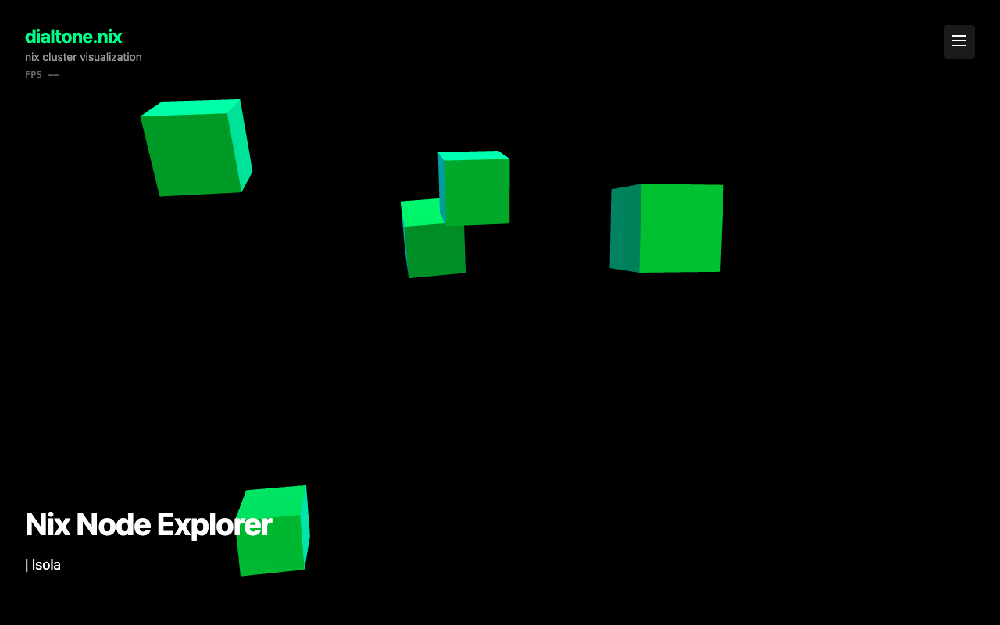
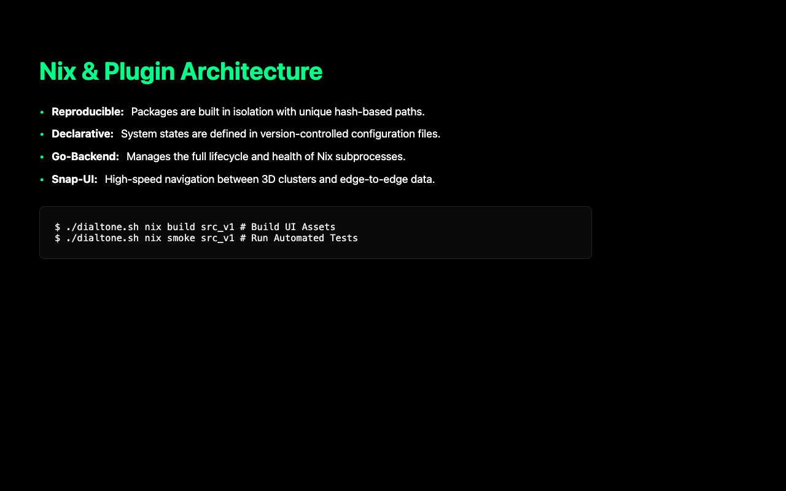
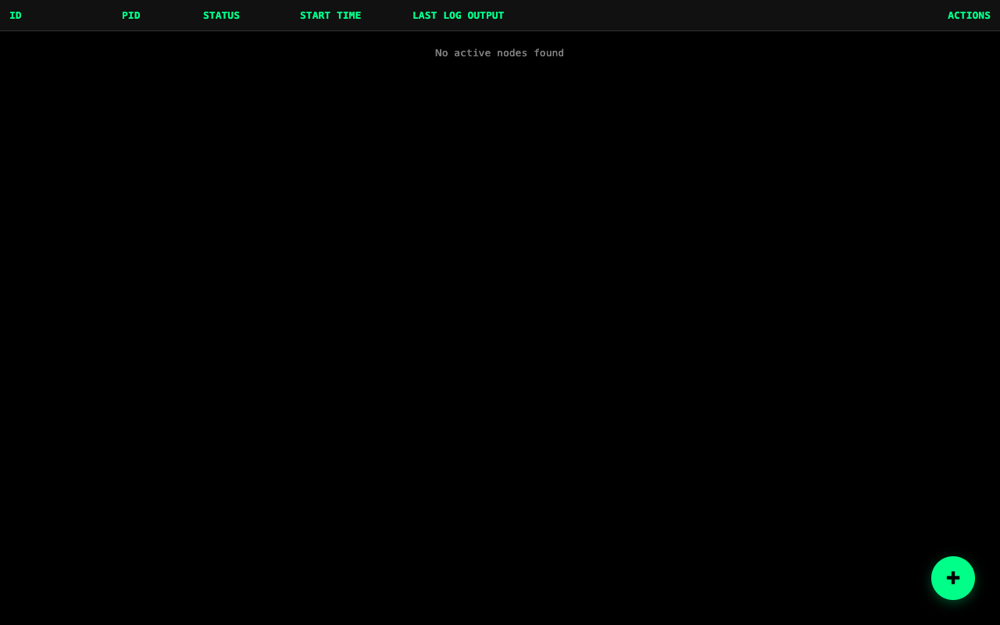
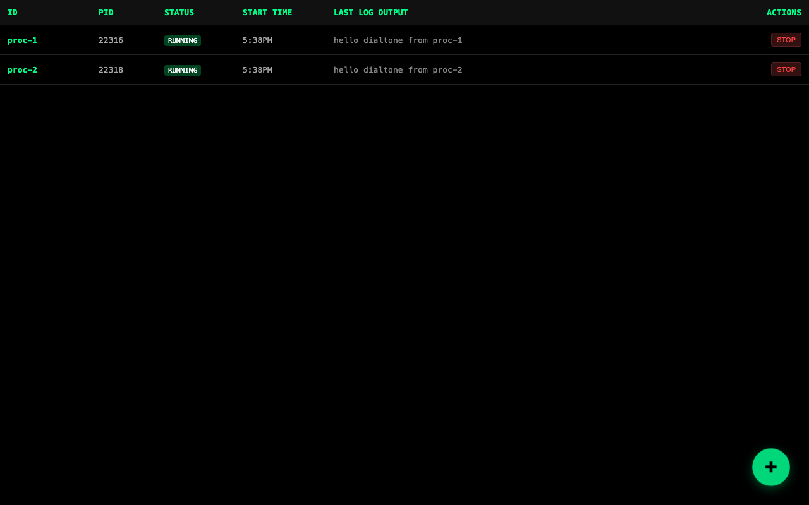
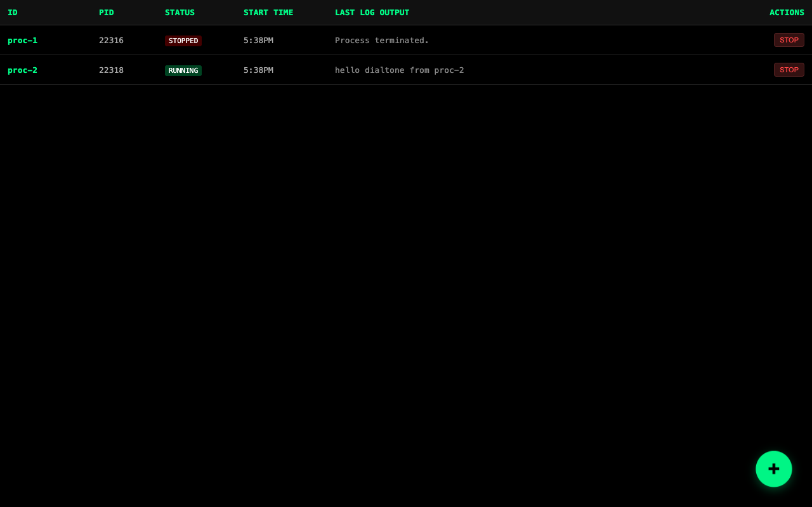

# Nix Robust Smoke Test Report

**Started:** Mon, 09 Feb 2026 18:29:38 PST

### 1. Hero Section Validation

---
### 2. Documentation Section Validation

---
### 3. Verify Header Hidden

---
### 4. Nix Table Rendering

---
### 5. Spawn Nix Nodes

---
### 6. Selective Termination

---
### 7. Verify Persistence

---