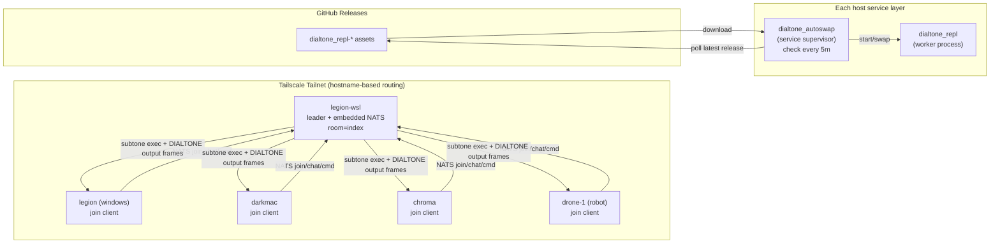

# REPL Plugin

`repl src_v1` is the shared multiplayer command bus for Dialtone.

- One host is the **leader** and is the only host that executes subtone commands.
- All hosts (including leader) publish/subscribe over NATS first, then print to stdout.
- Room traffic is topic-based: `repl.room.<room>`.
- Command traffic is global: `repl.cmd`.

Current deployment intent:
- `legion-wsl` runs leader.
- Other hosts (`legion`, `darkmac`, `chroma`, `drone-1`) run join clients and/or autoswap service.

## Architecture


## CLI Commands
Always use:
```bash
./dialtone.sh repl src_v1 <command> [args]
```

Commands:
```bash
./dialtone.sh repl src_v1 help
./dialtone.sh repl src_v1 version
./dialtone.sh repl src_v1 run
./dialtone.sh repl src_v1 leader --nats-url nats://0.0.0.0:4222 --room index --embedded-nats --tsnet --tsnet-nats-port 4222
./dialtone.sh repl src_v1 join --nats-url nats://<leader-tailnet-host>:4222 --name <hostname> index
./dialtone.sh repl src_v1 status

./dialtone.sh repl src_v1 service --mode install --repo timcash/dialtone --room index --check-interval 5m
./dialtone.sh repl src_v1 service --mode run --repo timcash/dialtone --room index --check-interval 5m
./dialtone.sh repl src_v1 service --mode status

./dialtone.sh repl src_v1 build
./dialtone.sh repl src_v1 deploy --host <host> --user <user> --pass <pass> --service
./dialtone.sh repl src_v1 release build v0.1.0
./dialtone.sh repl src_v1 release publish v0.1.0 timcash/dialtone

./dialtone.sh repl src_v1 test
./dialtone.sh repl src_v1 test multiplayer
```

## In-Session Commands
When inside a REPL prompt:

- `/repl src_v1 join <room-name>` switch rooms (single active room per client).
- `/repl src_v1 who` show connected clients plus daemon presence/version.
- `/repl src_v1 versions` show client versions by room.
- `/ps` list leader-managed subtones.
- `/kill <pid>` kill a subtone.
- `@<hostname> <command>` run command on a specific host REPL client as a host subtone (example: `@chroma ls` or `@legion dir`).
- `/<plugin> src_vN <command> ...` send command to leader for execution.
- `exit` or `quit` leave session.

## NATS Topics
- `repl.cmd`:
  - receives command/control frames.
  - consumed by leader command handler.
- `repl.room.<room>`:
  - receives `join`, `left`, `chat`, `line`, `server`, `control`, `daemon` frames.
  - consumed by all members of that room.

Behavior:
- Clients never execute Dialtone commands directly in multiplayer mode.
- Leader executes and publishes output lines back to room topics.
- `DIALTONE:PID>` lines are leader-formatted subtone output frames.
- Both `/...` and `@host ...` are sent to leader first over `repl.cmd`.
- Targeted host commands publish to `repl.cmd` as message text (`@<hostname> <command>`).
- Leader dispatches `@host ...` as a targeted control frame to the room.
- Only that host executes the command in its native shell (`sh -lc` on POSIX, `powershell -Command` on Windows).
- The host publishes compact lifecycle lines only: start, command, log path, and exit code.
- Full stdout/stderr stays in the subtone log file; it is not streamed to room output.

## Leader and Failure Model
- Exactly one active leader is intended for a shared room/domain.
- If leader goes down but NATS is up:
  - chat still flows in room topics.
  - command execution stops until leader returns.
- If NATS goes down:
  - no room traffic and no command execution.
  - clients must reconnect after broker recovers.

## Standalone Binary Names
`repl src_v1 build` outputs:

- `dialtone_repl`
- `dialtone_repl-linux-amd64`
- `dialtone_repl-linux-arm64`
- `dialtone_repl-darwin-amd64`
- `dialtone_repl-darwin-arm64`
- `dialtone_repl-windows-amd64.exe`

## Auto-Swap Service
`service` mode is the autoswap supervisor path.

- `--mode install` installs persistent OS service:
  - Linux: `dialtone_repl.service` (user systemd).
  - macOS: `dev.dialtone.dialtone_repl` (launchd agent).
- Poll interval defaults to `5m`.
- Supervisor downloads matching release assets into `~/.dialtone/repl/releases/`.
- Worker is hot-swapped through the `current` target.

Operational naming:
- Supervisor process/binary name: `dialtone_autoswap`.
- Worker process/binary name: `dialtone_repl`.

## Remote Deploy
`deploy` pushes `dialtone_repl` to remote host over SSH and can install service.

- Default env keys: `ROBOT_HOST`, `ROBOT_USER`, `ROBOT_PASSWORD`.
- Use hostname-based endpoints on tailnet; do not hardcode IPs.

## Test Suites
`./dialtone.sh repl src_v1 test` runs foundational suites then multiplayer:

- `src/plugins/repl/src_v1/test/01_repl_core/suite.go`
- `src/plugins/repl/src_v1/test/02_proc_plugin/suite.go`
- `src/plugins/repl/src_v1/test/03_logs_plugin/suite.go`
- `src/plugins/repl/src_v1/test/04_test_plugin/suite.go`
- `src/plugins/repl/src_v1/test/05_chrome_plugin/suite.go`
- `src/plugins/repl/src_v1/test/06_go_bun_plugins/suite.go`
- `src/plugins/repl/src_v1/test/99_multiplayer/suite.go`

`./dialtone.sh repl src_v1 test multiplayer`:

- runs deterministic multiplayer room/command flow.
- includes live robot join/chat/left verification when robot SSH/env is available.
