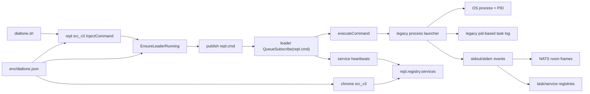

# REPL `src_v3` Design Map

## Purpose

This file maps the current `repl src_v3` runtime and proposes a more robust design for:

- task-id-first command handling
- immediate CLI return on every request
- NATS-backed task and service state
- a lighter `dialtone.sh` / REPL CLI wrapper
- better support for long-lived remote services like `chrome src_v3`

The goal is to make the REPL leader a real control plane, not just a process launcher with a shared room.

## Short Review Of The Current README

[README.md](/C:/Users/timca/dialtone/src/plugins/repl/src_v3/README.md) mostly matches the current code well.

It accurately describes:

- `./dialtone.sh <plugin> ...` flowing through the local REPL leader
- NATS as the control plane
- `dialtone>` as a short summary stream
- full detail living in task logs
- services as long-lived managed processes

But it also reveals the main current design constraint:

- identity is PID-first, not task-first
- log names are PID-based
- background mode is a special trailing `&`
- "foreground" work still means "launch now and stay coupled to that launch lifecycle"

That model works for a single-machine task runner, but it is the wrong center of gravity for a durable multi-host task system.

## Current One-Line Summary

Today the system is:

`dialtone.sh` -> `repl src_v3 inject` -> leader autostart if needed -> publish command frame to `repl.cmd` -> leader queue subscription -> `executeCommand(...)` -> legacy process launcher -> OS PID and PID-based log file -> in-memory task and service registries + NATS room messages.

For remote Chrome management, `chrome src_v3` uses this REPL control plane mostly for:

- finding the current manager NATS URL
- starting/restarting remote service processes
- querying `repl.registry.services`
- following service heartbeat state

## Current Topology



## Current Core Pieces

| Piece | What it does today | Main files |
| --- | --- | --- |
| CLI wrapper | Autostarts leader, injects commands, joins rooms, lists task logs | `run_commands_v3.go`, `inject_hosts_v3.go`, `subtone_logs_v3.go` |
| Leader | Owns REPL rooms, command intake, presence, registries, and execution dispatch | `core_runtime.go` |
| Config | Resolves repo roots and `env/dialtone.json`, reads current NATS config | `env_utils_v3.go`, `leader_state_v3.go` |
| Legacy task launcher | Starts real OS processes and emits lifecycle/stdout/stderr events | `../proc/src_v1/go/proc/subtone.go` |
| Task registry | In-memory PID-keyed record of recent one-shot tasks | `subtone_registry_v3.go` |
| Service registry | In-memory service-name-keyed record of long-lived services | `service_registry_v3.go` |
| Heartbeats | Publishes process/service health onto NATS subjects | `managed_heartbeat_v3.go` |
| Service daemon mode | Installs and supervises a leader worker as an OS service | `core_service.go` |

## Critical Current Functions

### 1. CLI injects commands into the leader

The current CLI publishes a command frame and waits only long enough to flush it.

```go
func InjectCommand(natsURL, room, user, host, command string) error {
    if err := EnsureLeaderRunning(natsURL, room); err != nil {
        return err
    }
    frame := busFrame{
        Type:    "command",
        From:    user,
        Room:    room,
        Message: command,
    }
    raw, _ := json.Marshal(frame)
    if err := nc.Publish(commandSubject, raw); err != nil {
        return err
    }
    return nc.FlushTimeout(1500 * time.Millisecond)
}
```

This is lightweight, which is good. But the command frame does not yet have a first-class task identity.

### 2. Leader autostart is local-process oriented

The CLI assumes one local leader and starts it if needed.

```go
func EnsureLeaderRunning(clientNATSURL, room string) error {
    if _, err := leaderHealth(clientNATSURL, 1200*time.Millisecond); err == nil {
        return nil
    }
    cmd, err := leaderAutostartCommand(repoRoot, srcRoot, listenURL, room)
    if err != nil {
        return err
    }
    if err := cmd.Start(); err != nil {
        return err
    }
    for time.Now().Before(deadline) {
        if _, err := leaderHealth(clientNATSURL, 1200*time.Millisecond); err == nil {
            return nil
        }
    }
    return fmt.Errorf("repl v3 leader did not start")
}
```

This is practical, but it couples CLI usability to a local bootstrap path.

### 3. The leader serializes command execution with `runMu`

Current command handling uses a single queue subscription and a process launch path guarded by a mutex.

```go
var runMu sync.Mutex
cmdSub, err := nc.QueueSubscribe(commandSubject, commandQueue, func(msg *nats.Msg) {
    frame, ok := decodeFrame(msg.Data)
    if !ok {
        return
    }
    go func(in BusFrame) {
        runMu.Lock()
        defer runMu.Unlock()
        executeCommand(in.Message, currentRoom, h, subtones, services, publish, emit)
    }(BusFrame{Message: raw})
})
```

What this means:

- intake is asynchronous
- actual command execution is serialized
- there is no durable queue object, only a mutex around execution
- the leader is both queue manager and launcher in one code path

### 4. `executeCommand` is still PID-first

The launch logic decides foreground/background/service mode, then starts a process and waits for actual process events.

```go
if isBackground || serviceName != "" {
    go runSubtoneWithEventsFn(args, onEvent)
    return
}
runSubtoneWithEventsFn(args, onEvent)
```

The problem is not only foreground waiting. The deeper issue is identity:

- no task object exists before process start
- no durable queue entry exists before process start
- no log path exists before process start
- PID becomes the first stable identifier

### 5. The process launcher creates PID-based logs

This is the current root of the legacy PID-first task identity model.

```go
func RunSubtoneWithEvents(args []string, onEvent SubtoneEventHandler) int {
    cmd := exec.Command(dialtoneSh, internalArgs...)
    return runCommandWithEvents(cmd, args, logDir, onEvent)
}

func NewSubtoneLogger(pid int, args []string, logDir string) (*SubtoneLogger, error) {
    name := fmt.Sprintf("subtone-%d-%s.log", pid, startedAt.Format("20060102-150405"))
    path := filepath.Join(logDir, name)
    logger.writef("started pid=%d args=%q", pid, args)
    return logger, nil
}
```

That makes PID discovery part of log discovery, which is exactly what we want to break apart.

### 6. Current registries are in-memory leader state

The current registries are useful, but they are leader-local caches, not the canonical system of record.

```go
func (r *subtoneRegistry) Started(room string, mode string, ev proc.SubtoneEvent) {
    r.entries[ev.PID] = &subtoneRegistryEntry{
        PID:      ev.PID,
        Command:  strings.Join(ev.Args, " "),
        LogPath:  ev.LogPath,
        Active:   true,
    }
}
```

```go
func (r *serviceRegistry) ObserveHeartbeat(h managedHeartbeat) {
    entry := r.entries[name]
    entry.PID = h.PID
    entry.LogPath = h.LogPath
    entry.Active = strings.EqualFold(h.State, "running")
}
```

Useful today, but not durable enough for a true control plane.

### 7. Chrome currently consumes REPL service state by lookup

The Chrome runtime relies on the REPL service registry contract.

```go
msg, err := nc.Request("repl.registry.services", raw, 2*time.Second)
```

That is the current bridge between the REPL control plane and remote `chrome src_v3` service management.

## Current Pain Points

### 1. The leader has no durable queued task model

It serializes launches, but it does not own a true queue entry with a stable identity and state machine.

### 2. PID is doing too much

PID currently acts as:

- task identity
- room identity
- log lookup key
- task list key
- task attach key

But PID is an execution detail, not the right primary key for a distributed control plane.

### 3. Task state is split across too many places

Today state is spread across:

- in-memory leader registries
- local log files
- transient NATS frames
- `leader.json`
- managed process inspection from `proc`
- service heartbeat subjects

This is good enough for local debugging, but not strong enough for durable orchestration.

### 4. Foreground semantics still imply launch coupling

Even though the leader has a mutex and background mode, the system still thinks in terms of:

- start a process
- get a PID
- then announce lifecycle

The desired design is:

- enqueue a task
- return task id immediately
- later assign PID if and when execution starts

### 5. The CLI is doing too much runtime coordination

The CLI currently:

- ensures the leader is running
- decides whether to autostart bootstrap HTTP
- can join rooms directly
- mixes operator functions with user task submission

That is workable, but not the cleanest split between control plane and client.

### 6. Remote service management is too implicit

For remote Chrome service control, the REPL is currently a mix of:

- command transport
- service heartbeat stream
- local registries
- remote launcher indirection

There is not yet a clean "desired service state" model.

## Target Design

## Core Idea

Every command submission should create a task in NATS first.

The CLI should always return immediately with:

- `task_id`
- `state=queued`
- `room`
- `log_key`

Then the leader should schedule, launch, monitor, and update the task in the background.

PID becomes a later field on the task, not the identity of the task.

The design should support two user-facing modes:

1. short-lived CLI submission with `./dialtone.sh <plugin> ...`
2. long-lived interactive REPL with plain `./dialtone.sh` and slash commands like `/chrome src_v3 status --host legion --role dev`

## New Rules

### 1. Every `dialtone.sh` request becomes a queued task

There should be no special trailing `&` mode for ordinary command submission.

From the user's point of view, every command is effectively backgrounded immediately.

`dialtone>` should say something like:

```text
host-name> /chrome src_v3 status --host legion --role dev
dialtone> Request received.
dialtone> Task queued as task-20260327-abc123.
dialtone> Task room: task.task-20260327-abc123
dialtone> Task log: ~/.dialtone/logs/task-20260327-abc123.log
```

No PID should be required at submission time.

The CLI should return as soon as the task is queued.

The leader should later emit lifecycle messages like:

```text
dialtone> Task task-20260327-abc123 assigned pid 25516 on legion.
dialtone> Task task-20260327-abc123 log confirmed at ~/.dialtone/logs/task-20260327-abc123.log
dialtone> Task task-20260327-abc123 exited with code 0.
```

### 2. Running plain `./dialtone.sh` opens a long-lived REPL session

The REPL session should:

- connect to the leader and room
- keep streaming `dialtone>` lifecycle output
- let the user submit commands with a leading slash
- keep accepting more commands after earlier tasks are queued or running

Expected shape:

```text
dialtone> Connected to repl.room.index via nats://127.0.0.1:46222
dialtone> Leader online on DIALTONE-SERVER
dialtone> Shared REPL session ready in room index.

host-name> /chrome src_v3 status --host legion --role dev
dialtone> Request received.
dialtone> Task queued as task-20260327-def456.
dialtone> Task room: task.task-20260327-def456
dialtone> Task log: ~/.dialtone/logs/task-20260327-def456.log
dialtone> Task task-20260327-def456 assigned pid 25516 on legion.
dialtone> chrome service on legion role=dev is healthy.
dialtone> Task task-20260327-def456 exited with code 0.
```

This REPL mode is where the user should naturally see:

- task submission
- PID assignment
- log paths
- running state
- stop/failure/exit codes

while still being able to type the next slash command.

### 2a. Parallel background tasks produce interleaved output

If the leader is running several background or service-class tasks in parallel, the top-level `dialtone>` stream is not globally deterministic.

Expected shape:

```text
dialtone> Connected to repl.room.index via nats://127.0.0.1:46222
dialtone> Leader online on DIALTONE-SERVER
dialtone> Shared REPL session ready in room index.

host-name> /proc src_v1 sleep 20
dialtone> Request received.
dialtone> Task queued as task-20260327-sleep01.

host-name> /ssh src_v1 run --host grey --cmd 'echo ready'
dialtone> Request received.
dialtone> Task queued as task-20260327-echo01.

host-name> /ssh src_v1 run --host grey --cmd 'echo boom >&2; exit 17'
dialtone> Request received.
dialtone> Task queued as task-20260327-fail01.

dialtone> Task task-20260327-echo01 assigned pid 51102 on grey.
dialtone> Task task-20260327-fail01 assigned pid 51108 on grey.
dialtone> Task task-20260327-sleep01 assigned pid 41122.
dialtone> Task task-20260327-echo01 exited with code 0.
dialtone> ERROR task task-20260327-fail01 on grey exited with code 17.
dialtone> ERROR task task-20260327-fail01 stderr: boom
dialtone> Task task-20260327-sleep01 exited with code 0.
```

Important implications:

- task ids must appear on every lifecycle and error line that matters
- the REPL transcript should be treated as a shared event stream, not a single ordered per-task log
- tests should assert per-task lifecycle invariants, not one global line order
- one task failing must not block or suppress output from other running tasks

### 3. The leader runs at most one foreground task at a time

Foreground should become a scheduling policy, not a CLI blocking mode.

Recommended meaning:

- `foreground`: single active slot per leader
- `background`: can run under a separate concurrency policy
- `service`: long-lived desired process owned by reconciliation

But even a foreground task should:

- queue immediately
- return immediately
- stream state later via NATS

Foreground serialization does not prevent interleaving in the shared transcript, because background tasks and service reconciliation work may still be active at the same time.

### 4. Task state lives in NATS

The leader should keep canonical task and service state in NATS, not only in memory.

Recommended model:

- append-only task event stream
- latest task snapshot per task id
- service desired state per `(host, service_name)`
- service observed state per `(host, service_name)`

If available, NATS JetStream/KV is the cleanest fit.

### 5. `env/dialtone.json` is the config source

All runtime config should come from the repo-local env file the REPL is operating under.

That includes:

- REPL NATS URL
- manager NATS URL
- queue concurrency
- host/agent settings
- bootstrap URLs
- log root overrides
- default room and hostname behavior

CLI flags can still override for debugging, but the normal path should resolve from `env/dialtone.json`.

### 6. `dialtone.sh` becomes a lightweight client and REPL entrypoint

The wrapper and REPL CLI should mostly:

- resolve config
- ensure a reachable leader or leader endpoint
- submit a task envelope
- print the task id and summary
- optionally tail task events when explicitly requested
- open a long-lived slash-command REPL when no plugin command is provided

They should not be responsible for process lifecycle beyond local bootstrap.

## Proposed NATS Model

### Task submission

- subject: `repl.task.submit`
- payload: `TaskSubmitRequest`
- reply: `TaskSubmitResponse`

### Task events

- subject: `repl.task.event.<task_id>`
- append-only lifecycle and log events

### Task state snapshots

- key: `repl.state.task.<task_id>`
- value: current task snapshot

### Queue state

- key: `repl.queue.foreground`
- value: ordered queued/running task ids

### Service desired state

- key: `repl.state.service.desired.<host>.<service_name>`

### Service observed state

- key: `repl.state.service.observed.<host>.<service_name>`

### Host agent command path

- subject: `repl.host.<host>.task.start`
- subject: `repl.host.<host>.service.reconcile`

This is the main shift from "rooms plus ad hoc heartbeats" to "stateful control plane plus events."

## Proposed Operator Query Surface

The operator should not need to infer long-running remote service state from one shared transcript alone.

Recommended query commands:

- `repl src_v3 task list`
- `repl src_v3 task show --task-id <task-id>`
- `repl src_v3 task log --task-id <task-id>`
- `repl src_v3 task kill --task-id <task-id>`
- `repl src_v3 service list [--host <host>]`
- `repl src_v3 service show --host <host> --name <service-name>`

Recommended `task list` fields:

- `task_id`
- `kind`
- `state`
- `host`
- `service_name` or `command_summary`
- `pid`
- `exit_code`
- `log_key`

Recommended `service list` fields:

- `host`
- `service_name`
- `role`
- `owner_task_id`
- `state`
- `pid`
- `health`
- `log_subject`

For remote Chrome, the operator should be able to see a row like:

```text
dialtone> TASK ID                  KIND      STATE    HOST    SERVICE/COMMAND           PID    EXIT
dialtone> task-20260327-chr001     service   running  legion  chrome-src-v3-dev        25516  -
```

and a matching service row like:

```text
dialtone> HOST    NAME               ROLE       STATE    OWNER TASK              PID    HEALTH
dialtone> legion  chrome-src-v3-dev  dev        running  task-20260327-chr001   25516  healthy
```

That makes remote PID, owning task id, and service identity visible in one place.

## Proposed Log Surfaces

The logging model should align with the logs plugin:

- producers publish to NATS
- `dialtone>` renders only short lifecycle summaries
- a task log writer persists a durable per-task record
- optional readers like `logs src_v1 stream` can attach live

Recommended log subjects:

- `logs.task.<task-id>`
- `logs.service.<host>.<service-name>`
- `logfilter.level.error.>`
- `logfilter.tag.fail.>`

Recommended split of responsibility:

- `dialtone>`:
  - request receipt
  - queue state
  - pid assignment
  - short success/failure lines
- `task log`:
  - durable task-specific execution history
- `logs src_v1 stream`:
  - live detailed NATS output for tasks and services
- `service show`:
  - latest observed service snapshot

This is important for long-lived daemons like `chrome src_v3`, where users need:

- the short REPL view
- the current service state
- the durable task log
- the live service log stream

## Proposed Task Model

Suggested task fields:

- `task_id`
- `request_id`
- `kind`: `command|service_reconcile|service_status|watch`
- `mode`: `foreground|background|service`
- `requested_by`
- `requested_at`
- `repo_root`
- `config_path`
- `host_target`
- `command`
- `args`
- `room`
- `log_key`
- `status`: `queued|assigned|starting|running|succeeded|failed|canceled`
- `pid`
- `exit_code`
- `service_name`
- `service_instance_id`
- `worker_host`
- `started_at`
- `finished_at`

Important point:

- `pid` is optional and late-bound
- `task_id` is primary from the start
- when a PID appears, it may be local to the leader host or remote to the task target, such as a Chrome daemon PID running on `legion`

## Proposed Service Model

For long-lived processes like remote `chrome src_v3`, the REPL should manage services as desired state.

Suggested service identity:

- `host`
- `service_name`
- `service_type`
- `role`
- `instance_id`

Suggested service state:

- desired version
- desired command
- desired env/config path
- desired enabled/running flag
- observed pid
- observed health
- observed last heartbeat
- observed log key
- observed chrome/browser-specific metadata if relevant

For Chrome specifically:

- `chrome src_v3 service --host legion --role dev --mode start`

should become:

1. submit service reconcile task
2. return `task_id` immediately
3. leader/host agent updates desired state in NATS
4. host agent starts or reuses the daemon
5. observed service state updates in NATS
6. `chrome src_v3 status` reads observed state, not only ad hoc process checks

## How This Helps Remote Chrome

The remote Chrome daemon is a strong test case because it needs:

- host targeting
- durable service identity
- status queries
- reuse of healthy instances
- reliable logs
- predictable restart behavior

Under the new model:

- Chrome service startup is a task submission, not a synchronous launch path
- Chrome service health is a service-state object in NATS
- `chrome src_v3` can read one canonical service state record
- the leader can reconcile desired service state across many remote hosts

That is a much cleaner control-plane fit than the current mixture of local registry, remote launch, heartbeat subjects, and process inspection.

## Recommended Runtime Roles

### 1. Thin CLI

Responsibilities:

- read `env/dialtone.json`
- submit tasks
- print task id quickly and return
- optionally query/tail task state

### 2. Interactive REPL client

Responsibilities:

- start when the user runs plain `./dialtone.sh`
- connect to the leader room
- accept slash commands
- show task lifecycle output as the leader emits it
- stay responsive while many tasks are queued or running

### 3. Leader daemon

Responsibilities:

- own queue state
- assign work
- maintain task and service state in NATS
- enforce "one foreground task at a time"
- coordinate host agents
- keep publishing operator-facing lifecycle lines such as queued, pid assigned, log path, running, stopped, and exit code

### 4. Host agent

Responsibilities:

- start local OS processes
- assign PID to task state once launched
- write task/service log output
- publish task/service lifecycle updates
- restart long-lived services when required

### 5. Plugin client

Responsibilities:

- use typed CLI or API wrappers
- read service state when needed
- submit reconcile/status tasks instead of launching directly where possible

## What Needs To Change

### A. Replace PID-based task identity with task-id-first identity

Current:

- legacy PID-based task log names
- PID-based task attachment
- registry keyed by PID

Target:

- `task-<task_id>.log`
- `/task-attach --task-id`
- registry keyed by task id
- PID becomes metadata on the task

### B. Replace in-memory registries as the primary store

Current:

- current in-memory task registry
- `serviceRegistry`

Target:

- NATS-backed snapshots as the source of truth
- optional in-memory cache in the leader for speed only

### C. Split intake from execution

Current:

- command callback parses and launches via `executeCommand`

Target:

- intake validates and persists a queued task
- scheduler later claims queued tasks
- launcher later starts the task

### D. Replace `runMu` with a scheduler

Current:

- mutex around execution

Target:

- explicit scheduler with:
  - foreground slot
  - optional background pool
  - service reconciler

### E. Move log naming to task creation time

Current:

- log file name depends on PID

Target:

- log file name depends on `task_id`
- once a PID exists, it is recorded in task metadata and optionally in the log header

### F. Add a typed task submit API

Current:

- generic `busFrame` with `Type=command`

Target:

- typed submit request/reply with validation and compatibility control

### G. Make service reconciliation first-class

Current:

- `service-start` and `service-stop` wrap process launch/kill behavior

Target:

- desired service state object
- reconciler loop
- observed service state separate from desired

### H. Update `chrome src_v3` integration

Current Chrome depends on:

- REPL manager NATS URL in config
- `repl.registry.services`
- heartbeat observation

Target Chrome should depend on:

- service desired/observed state APIs
- task ids for start/restart operations
- task/service log keys instead of PID-based log names

### I. Update user-facing REPL commands

Recommended replacements:

- `subtone-list` -> `task-list`
- `subtone-log --pid` -> `task-log --task-id`
- `subtone-attach --pid` -> `task-attach --task-id`

`service-list` can remain, but should read the canonical service state store.

## Suggested New CLI Contract

Normal command:

```text
host-name> /chrome src_v3 status --host legion --role dev
dialtone> Request received.
dialtone> Task queued as task-20260327-abc123.
dialtone> Type: command
dialtone> Room: task.task-20260327-abc123
dialtone> Log: ~/.dialtone/logs/task-20260327-abc123.log
```

Later leader lifecycle for that same task:

```text
dialtone> Task task-20260327-abc123 assigned pid 25516 on legion.
dialtone> chrome service on legion role=dev is healthy.
dialtone> Task task-20260327-abc123 exited with code 0.
```

Service command:

```text
host-name> /chrome src_v3 service --host legion --mode start --role dev
dialtone> Request received.
dialtone> Task queued as task-20260327-def456.
dialtone> Type: service_reconcile
dialtone> Service: chrome-src-v3-dev on legion
dialtone> Log: ~/.dialtone/logs/task-20260327-def456.log
```

Interactive REPL session:

```text
dialtone> Connected to repl.room.index via nats://127.0.0.1:46222
dialtone> Leader online on DIALTONE-SERVER
dialtone> Shared REPL session ready in room index.

host-name> /chrome src_v3 status --host legion --role dev
dialtone> Request received.
dialtone> Task queued as task-20260327-ghi789.
dialtone> Room: task.task-20260327-ghi789
dialtone> Log: ~/.dialtone/logs/task-20260327-ghi789.log
dialtone> Task task-20260327-ghi789 assigned pid 25516 on legion.
dialtone> chrome service on legion role=dev is healthy.
dialtone> Task task-20260327-ghi789 exited with code 0.
```

The important contract is:

- short-lived CLI calls return quickly once the task is queued
- the long-lived REPL keeps streaming the later lifecycle messages
- both modes use the same task ids, log keys, and NATS-backed task/service state

Follow-up inspection:

```bash
./dialtone.sh repl src_v3 task-status --task-id task-20260327-def456
./dialtone.sh repl src_v3 task-log --task-id task-20260327-def456 --lines 200
./dialtone.sh repl src_v3 service-status --host legion --name chrome-src-v3-dev
```

## Suggested Refactor Order

1. Add task ids and NATS task snapshots without removing existing PID flows yet.
2. Change log naming to task-id-first while still recording PID.
3. Add task submit reply so CLI can print `task_id` immediately.
4. Move queue state and task lifecycle to NATS-backed storage.
5. Replace `runMu` with a scheduler.
6. Convert the legacy `subtone-*` commands to `task-*` commands.
7. Introduce desired/observed service state and service reconciliation.
8. Update Chrome remote service control to read the new service state.
9. Simplify `dialtone.sh` and `repl src_v3` into thin typed clients.

## High-Level Recommendation

The current REPL already has the right broad idea:

- one leader
- one shared control plane
- short `dialtone>` messages
- detailed logs elsewhere
- NATS as the bus

What it lacks is a first-class task model.

The single best change is:

make `task_id` the identity at submission time, make the leader own queue and service state in NATS, and make PID only an observed runtime field that appears later if execution begins.

That change would make the REPL much more durable, make `chrome src_v3` service control more predictable, and make `dialtone.sh` feel like a fast control-plane client instead of a process-coupled launcher.
