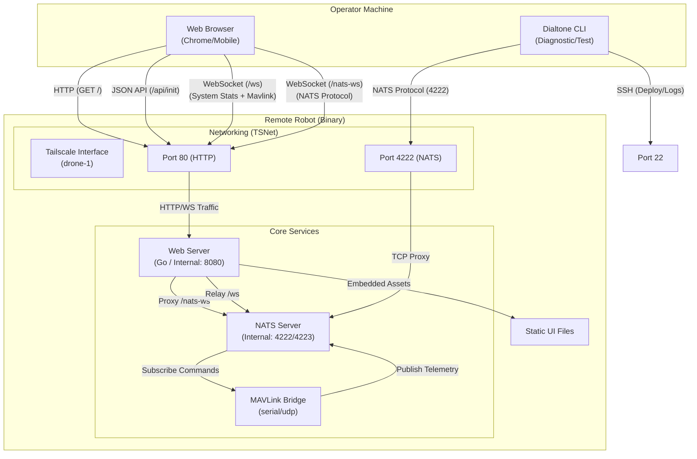

# Robot Plugin Architecture (DAG)

This document describes how the `robot` plugin integrates multiple services into a single self-contained binary and how those services interact with each other and the browser.

## Architectural Overview

The robot plugin is a Go-based service that encapsulates a **NATS Server**, a **Tailscale Node (tsnet)**, and a **Web Server** (serving a Vite-built React/TypeScript UI). All UI assets are bundled into the binary using `go:embed`.

## Port Configuration

| Service | Protocol | Internal Port | External (TSNet) | Description |
| :--- | :--- | :--- | :--- | :--- |
| **Web UI** | HTTP | 8080 | 80 | Primary dashboard and API entry point. |
| **NATS** | TCP | 4222 | 4222 | Native NATS protocol for CLI and inter-service comms. |
| **NATS WS** | WebSocket | 4223 | N/A (Proxied) | NATS via WebSockets, handled internally by Go. |
| **Relay WS** | WebSocket | 8080/ws | 80/ws | Custom JSON relay for system stats & Mavlink telemetry. |

## Communication Flows

### 1. UI Initialization
1.  **Browser** requests `http://drone-1/`.
2.  **Web Server** serves embedded `index.html` and bundled JS/CSS.
3.  **UI** calls `GET /api/init` to discover NATS and WebSocket endpoints.

### 2. Telemetry Streaming
*   **MAVLink Bridge** reads serial data from the flight controller and publishes to NATS subjects like `mavlink.attitude`.
*   **WebSocket Relay (`/ws`)**: A Go routine in the web server subscribes to `mavlink.>` and `nats.>` via a local NATS connection and pushes JSON payloads to the browser. This includes system stats (CPU, Uptime) not present in NATS.
*   **Direct NATS WS (`/nats-ws`)**: The browser can also use the `nats.ws` library to connect directly to the NATS server via a reverse proxy in the Go web server.

### 3. Command Execution
1.  **User** clicks "ARM" in the UI.
2.  **UI** publishes a JSON message to NATS subject `rover.command` (via `/nats-ws`).
3.  **MAVLink Bridge** receives the message and sends the corresponding MAVLink packet to the flight controller.

### 4. Binary Composition
The binary is built with `CGO_ENABLED=1` to support hardware communication and includes:
*   `src_v1/ui/dist`: All frontend assets (HTML/JS/SVG).
*   `gomavlib`: For MAVLink parsing.
*   `nats-server/v2`: The full NATS broker.
*   `tsnet`: The userspace Tailscale stack.