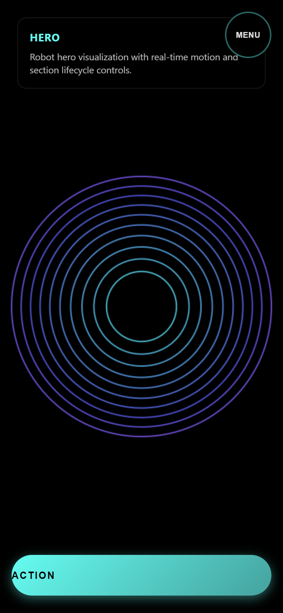
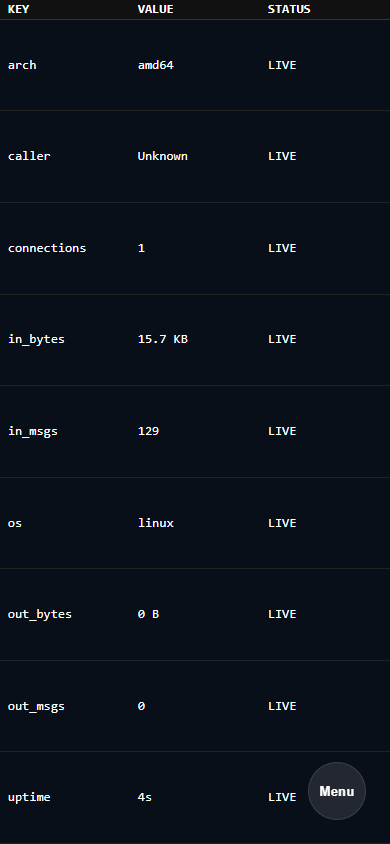
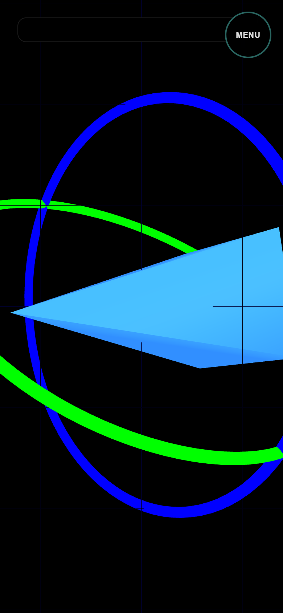

# Robot Plugin src_v1 Test Report

**Generated at:** Sun, 15 Feb 2026 17:35:08 -0800
**Version:** `src_v1`
**Runner:** `test_v2`
**Status:** ✅ PASS
**Total Time:** `17.691s`

## Test Steps

| Step | Result | Duration |
|---|---|---|
| 01 Preflight (Go/UI) | ✅ PASS | `9.685s` |
| 02 Go Run | ✅ PASS | `801ms` |
| 03 UI Run | ✅ PASS | `517ms` |
| 04 Expected Errors (Proof of Life) | ✅ PASS | `1.452s` |
| 05 Dev Server Running (latest UI) | ✅ PASS | `524ms` |
| 06 Hero Section Validation | ✅ PASS | `124ms` |
| 07 Docs Section Validation | ✅ PASS | `330ms` |
| 08 Table Section Validation | ✅ PASS | `1.345s` |
| 09 Three Section Validation | ✅ PASS | `386ms` |
| 10 Xterm Section Validation | ✅ PASS | `348ms` |
| 11 Video Section Validation | ✅ PASS | `379ms` |
| 12 Lifecycle / Invariants | ✅ PASS | `1.556s` |
| 13 Cleanup Verification | ✅ PASS | `242ms` |

## Step Logs

### 01 Preflight (Go/UI)

```text
result: PASS
duration: 9.685s
```

#### Runner Output

```text
[T+0000] [TEST] RUN   01 Preflight (Go/UI)
[T+0000] bun install v1.3.9 (cf6cdbbb)
[T+0000] 
[T+0000] + @types/three@0.182.0
[T+0000] + typescript@5.9.3
[T+0000] + vite@5.4.21
[T+0000] + @xterm/addon-fit@0.11.0
[T+0000] + @xterm/xterm@6.0.0
[T+0000] + three@0.182.0
[T+0000] 
[T+0000] 23 packages installed [94.00ms]
[T+0000] Saved lockfile
[T+0000] >> [Robot] Fmt: src_v1
[T+0000] [2026-02-15T17:34:53.375-08:00 | INFO | go.go:RunGo:33] Running: go [fmt ./src/plugins/robot/src_v1/...]
[T+0001] >> [Robot] Vet: src_v1
[T+0001] [2026-02-15T17:34:53.862-08:00 | INFO | go.go:RunGo:33] Running: go [vet ./src/plugins/robot/src_v1/...]
[T+0001] >> [Robot] Go Build: src_v1
[T+0001] [2026-02-15T17:34:54.419-08:00 | INFO | go.go:RunGo:33] Running: go [build ./src/plugins/robot/src_v1/...]
[T+0002] >> [Robot] Lint: src_v1
[T+0002] $ tsc --noEmit
[T+0003] >> [Robot] Format: src_v1
[T+0003] $ echo format-ok
[T+0003] format-ok
[T+0003] >> [Robot] Building UI: src_v1
[T+0003] $ vite build
[T+0003] vite v5.4.21 building for production...
[T+0003] transforming...
[T+0004] ✓ 20 modules transformed.
[T+0004] rendering chunks...
[T+0004] computing gzip size...
[T+0004] dist/index.html                   2.78 kB │ gzip:   0.95 kB
[T+0004] dist/assets/index-6GBZ9nXN.css    5.24 kB │ gzip:   1.92 kB
[T+0004] dist/assets/index-Ccf8p0iw.css    5.78 kB │ gzip:   1.71 kB
[T+0004] dist/assets/index-Dbd9b_e5.js     0.08 kB │ gzip:   0.10 kB
[T+0004] dist/assets/index-DP7yMgmI.js     0.79 kB │ gzip:   0.44 kB
[T+0004] dist/assets/index-DhBM0cMr.js     1.17 kB │ gzip:   0.67 kB
[T+0004] dist/assets/index-BTTHdoMO.js     1.17 kB │ gzip:   0.65 kB
[T+0004] dist/assets/index-Cu3jqA40.js     9.97 kB │ gzip:   3.26 kB
[T+0004] dist/assets/index-BFRwSQ3x.js   334.99 kB │ gzip:  85.16 kB
[T+0004] dist/assets/index-DBjX7kzU.js   492.58 kB │ gzip: 125.04 kB
[T+0004] ✓ built in 956ms
[T+0004] >> [Robot] Building Dialtone Binary into src/plugins/robot/bin
[T+0005] [2026-02-15T17:34:57.984-08:00 | INFO | build.go:RunBuild:110] Building Dialtone for Linux amd64 using Podman (gcc, g++)...
[T+0005] [2026-02-15T17:34:58.367-08:00 | INFO | build.go:RunBuild:110] Using optimized 'dialtone-builder' image (skipping apt-get install)
[T+0005] [2026-02-15T17:34:58.367-08:00 | INFO | build.go:RunBuild:110] Running: podman [run --rm -v /home/user/dialtone:/src:Z -v dialtone-go-build-cache:/root/.cache/go-build:Z -w /src -e GOOS=linux -e GOARCH=amd64 -e CGO_ENABLED=1 -e CC=gcc -e CXX=g++ dialtone-builder bash -c go build -buildvcs=false -o src/plugins/robot/bin/dialtone-amd64 src/cmd/dialtone/main.go]
[T+0009] [2026-02-15T17:35:02.243-08:00 | INFO | build.go:RunBuild:110] Build successful: bin/dialtone-amd64
```

### 02 Go Run

```text
result: PASS
duration: 801ms
```

#### Runner Output

```text
[T+0009] [TEST] RUN   02 Go Run
[T+0009] [2026-02-15T17:35:00.714-08:00 | INFO | robot.go:RunRobot:62] [WARNING] Process is not running as a systemd service. Consider running via systemctl.
[T+0010] [2026-02-15T17:35:00.866-08:00 | INFO | robot.go:RunStart:185] NATS server started on port 4222 (local only)
[T+0010] [2026-02-15T17:35:00.866-08:00 | INFO | robot.go:runLocalOnly:210] NATS WS proxy ports: external=4223 internal=4223
[T+0010] [2026-02-15T17:35:00.866-08:00 | INFO | robot.go:runLocalOnly:210] Using provided static web assets
[T+0010] [2026-02-15T17:35:00.866-08:00 | INFO | robot.go:runLocalOnly:212] NATS WS proxy ports: external=4223 internal=4223
[T+0010] [2026-02-15T17:35:00.866-08:00 | INFO | robot.go:runLocalOnly:212] Using provided static web assets
[T+0010] [2026-02-15T17:35:00.866-08:00 | INFO | robot.go:RunStart:185] Web UI (Local Only): Serving at http://0.0.0.0:8080
[T+0010] [2026-02-15T17:35:00.866-08:00 | INFO | asm_amd64.s:goexit:1693] Starting Mock Mavlink Publisher...
```

### 03 UI Run

```text
result: PASS
duration: 517ms
```

#### Runner Output

```text
[T+0010] [TEST] RUN   03 UI Run
[T+0010] >> [Robot] UI Run: src_v1
[T+0010] $ vite --host "127.0.0.1" --port "44194"
[T+0010] 
[T+0010]   VITE v5.4.21  ready in 95 ms
[T+0010] 
[T+0010]   ➜  Local:   http://127.0.0.1:44194/
```

### 04 Expected Errors (Proof of Life)

```text
result: PASS
duration: 1.452s
```

#### Runner Output

```text
[T+0011] [TEST] RUN   04 Expected Errors (Proof of Life)
[T+0011] [2026-02-15T17:35:01.822-08:00 | INFO | chrome.go:StartSession:179] DEBUG: Launching Chrome: /mnt/c/Program Files/Google/Chrome/Application/chrome.exe [--remote-debugging-port=0 --remote-debugging-address=127.0.0.1 --remote-allow-origins=* --no-first-run --no-default-browser-check --user-data-dir=C:\Users\timca\AppData\Local\Temp\dialtone-chrome-test-port-45074 --new-window --dialtone-origin=true --dialtone-role=test --headless=new]
[T+0012] [BROWSER] [log] [SectionManager] URL PAGE reason=startup http://127.0.0.1:8080/ hash=(none) active=(none) target=hero
[T+0012] [BROWSER] [log] [SectionManager] URL SYNC #hero
[T+0012] [BROWSER] [log] [SectionManager] NAVIGATING TO #hero
[T+0012] [BROWSER] [log] [SectionManager] LOADING #hero
[T+0012] [BROWSER] [log] [SectionManager] URL PAGE reason=pageshow http://127.0.0.1:8080/ hash=(none) active=(none) target=hero
[T+0012] [BROWSER] [log] [SectionManager] URL SYNC #hero
[T+0012] [BROWSER] [log] [SectionManager] NAVIGATING TO #hero
[T+0012] [BROWSER] [log] [SectionManager] LOADED #hero
[T+0012] [BROWSER] [log] [SectionManager] START #hero
[T+0012] [BROWSER] [log] [SectionManager] NAVIGATE TO #hero
[T+0012] [BROWSER] [log] [SectionManager] NAVIGATE TO #hero
[T+0012] [BROWSER] [error] [PROOFOFLIFE] Intentional Browser Test Error
```

#### Browser Logs

```text
[T+0012] [log] [SectionManager] URL PAGE reason=startup http://127.0.0.1:8080/ hash=(none) active=(none) target=hero
[T+0012] [log] [SectionManager] URL SYNC #hero
[T+0012] [log] [SectionManager] NAVIGATING TO #hero
[T+0012] [log] [SectionManager] LOADING #hero
[T+0012] [log] [SectionManager] URL PAGE reason=pageshow http://127.0.0.1:8080/ hash=(none) active=(none) target=hero
[T+0012] [log] [SectionManager] URL SYNC #hero
[T+0012] [log] [SectionManager] NAVIGATING TO #hero
[T+0012] [log] [SectionManager] LOADED #hero
[T+0012] [log] [SectionManager] START #hero
[T+0012] [log] [SectionManager] NAVIGATE TO #hero
[T+0012] [log] [SectionManager] NAVIGATE TO #hero
[T+0012] [error] [PROOFOFLIFE] Intentional Browser Test Error
```

#### Browser Errors

```text
[T+0012] [error] [PROOFOFLIFE] Intentional Browser Test Error
```

### 05 Dev Server Running (latest UI)

```text
result: PASS
duration: 524ms
```

#### Runner Output

```text
[T+0012] [TEST] RUN   05 Dev Server Running (latest UI)
[T+0012] >> [Robot] UI Run: src_v1
[T+0012] $ vite --host "127.0.0.1" --port "44356"
[T+0012] 
[T+0012]   VITE v5.4.21  ready in 102 ms
[T+0012] 
[T+0012]   ➜  Local:   http://127.0.0.1:44356/
```

#### Browser Logs

```text
[T+0012] [log] [SectionManager] RESUME #hero
[T+0012] [log] [SectionManager] URL SYNC DONE target=hero active=hero
[T+0012] [log] [SectionManager] RESUME #hero
[T+0012] [log] [SectionManager] URL SYNC DONE target=hero active=hero
[T+0012] [log] [SectionManager] URL PAGE reason=hashchange http://127.0.0.1:8080/#hero hash=hero active=hero target=hero
```

### 06 Hero Section Validation

```text
result: PASS
duration: 124ms
section: hero
```

#### Runner Output

```text
[T+0012] [TEST] RUN   06 Hero Section Validation
```



### 07 Docs Section Validation

```text
result: PASS
duration: 330ms
section: docs
```

#### Runner Output

```text
[T+0013] [TEST] RUN   07 Docs Section Validation
```

#### Browser Logs

```text
[T+0013] [log] [SectionManager] NAVIGATING TO #docs
[T+0013] [log] [SectionManager] LOADING #docs
[T+0013] [log] [SectionManager] LOADED #docs
[T+0013] [log] [SectionManager] START #docs
[T+0013] [log] [SectionManager] NAVIGATE TO #docs
[T+0013] [log] [SectionManager] RESUME #docs
[T+0013] [log] [SectionManager] URL PAGE reason=hashchange http://127.0.0.1:8080/#docs hash=docs active=docs target=docs
```


### 08 Table Section Validation

```text
result: PASS
duration: 1.345s
section: table
```

#### Runner Output

```text
[T+0013] [TEST] RUN   08 Table Section Validation
```

#### Browser Logs

```text
[T+0013] [log] [SectionManager] NAVIGATING TO #table
[T+0013] [log] [SectionManager] LOADING #table
[T+0013] [log] [SectionManager] LOADED #table
[T+0013] [log] [SectionManager] START #table
[T+0013] [log] [SectionManager] NAVIGATE TO #table
[T+0013] [log] [SectionManager] RESUME #table
[T+0013] [log] [SectionManager] URL PAGE reason=hashchange http://127.0.0.1:8080/#table hash=table active=table target=table
```



### 09 Three Section Validation

```text
result: PASS
duration: 386ms
section: three
```

#### Runner Output

```text
[T+0014] [TEST] RUN   09 Three Section Validation
[T+0015] [TEST] Three touch-test selected cube_left at (84,422)
[T+0015] [TEST] Three screenshot pixel check passed at (84,422)
```

#### Browser Logs

```text
[T+0014] [log] [SectionManager] NAVIGATING TO #three
[T+0014] [log] [SectionManager] LOADING #three
[T+0014] [log] [SectionManager] LOADED #three
[T+0014] [log] [SectionManager] START #three
[T+0014] [log] [SectionManager] NAVIGATE TO #three
[T+0014] [log] [SectionManager] RESUME #three
[T+0014] [log] [SectionManager] URL PAGE reason=hashchange http://127.0.0.1:8080/#three hash=three active=three target=three
[T+0015] [log] [Three #three] touch cube: cube_left
```



### 10 Xterm Section Validation

```text
result: PASS
duration: 348ms
section: xterm
```

#### Runner Output

```text
[T+0015] [TEST] RUN   10 Xterm Section Validation
```

#### Browser Logs

```text
[T+0015] [log] [SectionManager] NAVIGATING TO #xterm
[T+0015] [log] [SectionManager] LOADING #xterm
[T+0015] [log] [SectionManager] LOADED #xterm
[T+0015] [log] [SectionManager] START #xterm
[T+0015] [log] [SectionManager] NAVIGATE TO #xterm
[T+0015] [log] [SectionManager] RESUME #xterm
[T+0015] [log] [SectionManager] URL PAGE reason=hashchange http://127.0.0.1:8080/#xterm hash=xterm active=xterm target=xterm
```


### 11 Video Section Validation

```text
result: PASS
duration: 379ms
section: video
```

#### Runner Output

```text
[T+0015] [TEST] RUN   11 Video Section Validation
```

#### Browser Logs

```text
[T+0015] [log] [SectionManager] NAVIGATING TO #video
[T+0015] [log] [SectionManager] LOADING #video
[T+0015] [log] [SectionManager] LOADED #video
[T+0015] [log] [SectionManager] START #video
[T+0015] [log] [SectionManager] NAVIGATE TO #video
[T+0015] [log] [SectionManager] RESUME #video
[T+0015] [log] [SectionManager] URL PAGE reason=hashchange http://127.0.0.1:8080/#video hash=video active=video target=video
```


### 12 Lifecycle / Invariants

```text
result: PASS
duration: 1.556s
```

#### Runner Output

```text
[T+0015] [TEST] RUN   12 Lifecycle / Invariants
```

#### Browser Logs

```text
[T+0015] [log] [SectionManager] NAVIGATING TO #hero
[T+0015] [log] [SectionManager] NAVIGATE AWAY #video
[T+0015] [log] [SectionManager] PAUSE #video
[T+0015] [log] [SectionManager] NAVIGATE TO #hero
[T+0015] [log] [SectionManager] RESUME #hero
[T+0015] [log] [SectionManager] URL PAGE reason=hashchange http://127.0.0.1:8080/#hero hash=hero active=hero target=hero
[T+0016] [log] [SectionManager] NAVIGATING TO #docs
[T+0016] [log] [SectionManager] NAVIGATE AWAY #hero
[T+0016] [log] [SectionManager] PAUSE #hero
[T+0016] [log] [SectionManager] NAVIGATE TO #docs
[T+0016] [log] [SectionManager] RESUME #docs
[T+0016] [log] [SectionManager] URL PAGE reason=hashchange http://127.0.0.1:8080/#docs hash=docs active=docs target=docs
[T+0016] [log] [SectionManager] NAVIGATING TO #table
[T+0016] [log] [SectionManager] NAVIGATE AWAY #docs
[T+0016] [log] [SectionManager] PAUSE #docs
[T+0016] [log] [SectionManager] NAVIGATE TO #table
[T+0016] [log] [SectionManager] RESUME #table
[T+0016] [log] [SectionManager] URL PAGE reason=hashchange http://127.0.0.1:8080/#table hash=table active=table target=table
[T+0016] [log] [SectionManager] NAVIGATING TO #three
[T+0016] [log] [SectionManager] NAVIGATE AWAY #table
[T+0016] [log] [SectionManager] PAUSE #table
[T+0016] [log] [SectionManager] NAVIGATE TO #three
[T+0016] [log] [SectionManager] RESUME #three
[T+0016] [log] [SectionManager] URL PAGE reason=hashchange http://127.0.0.1:8080/#three hash=three active=three target=three
[T+0016] [log] [SectionManager] NAVIGATING TO #xterm
[T+0016] [log] [SectionManager] NAVIGATE AWAY #three
[T+0016] [log] [SectionManager] PAUSE #three
[T+0016] [log] [SectionManager] NAVIGATE TO #xterm
[T+0016] [log] [SectionManager] RESUME #xterm
[T+0016] [log] [SectionManager] URL PAGE reason=hashchange http://127.0.0.1:8080/#xterm hash=xterm active=xterm target=xterm
[T+0017] [log] [SectionManager] NAVIGATING TO #video
[T+0017] [log] [SectionManager] NAVIGATE AWAY #xterm
[T+0017] [log] [SectionManager] PAUSE #xterm
[T+0017] [log] [SectionManager] NAVIGATE TO #video
[T+0017] [log] [SectionManager] RESUME #video
[T+0017] [log] [SectionManager] URL PAGE reason=hashchange http://127.0.0.1:8080/#video hash=video active=video target=video
```

### 13 Cleanup Verification

```text
result: PASS
duration: 242ms
```

#### Runner Output

```text
[T+0017] [TEST] RUN   13 Cleanup Verification
[T+0017] Cleaning up stale Linux process on port 8080 (PID: 89736) via lsof...
```

## Artifacts

- `test.log`
- `error.log`
- `screenshots/test_step_1.png`
- `screenshots/test_step_2.png`
- `screenshots/test_step_3.png`
- `screenshots/test_step_4.png`
- `screenshots/test_step_5.png`
- `screenshots/test_step_6.png`
