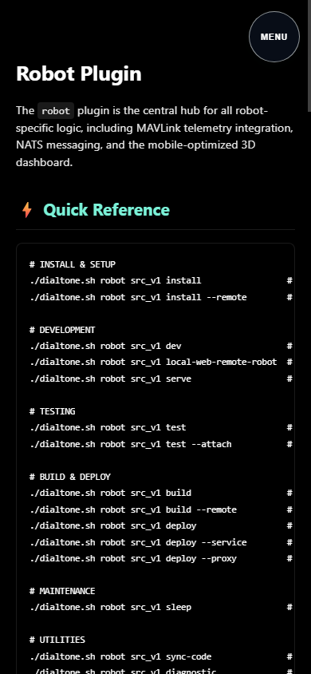
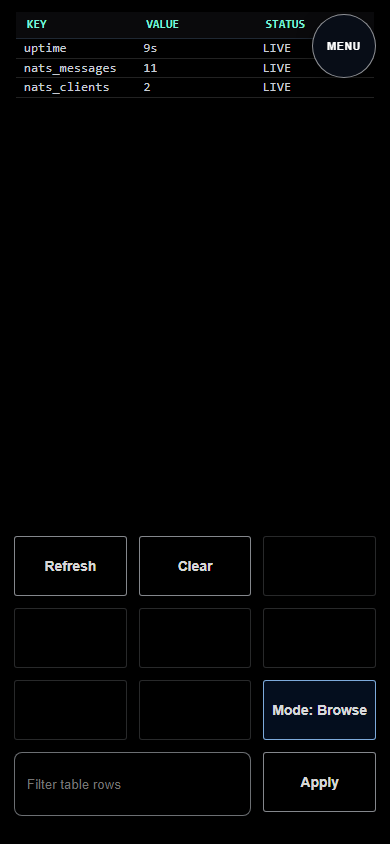
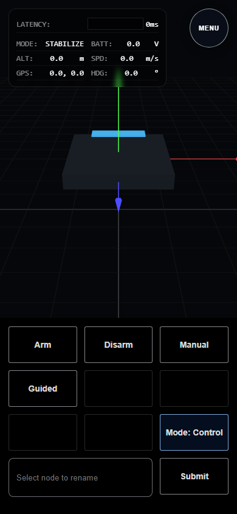
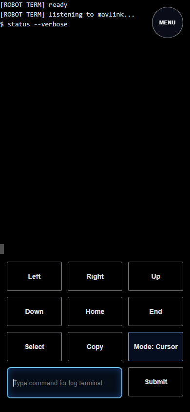
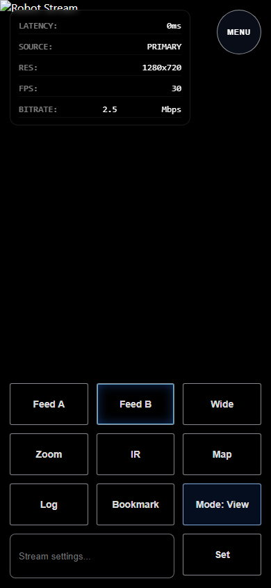
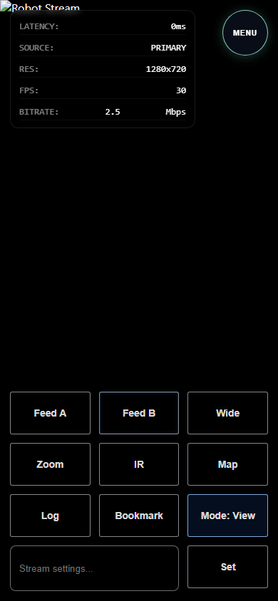
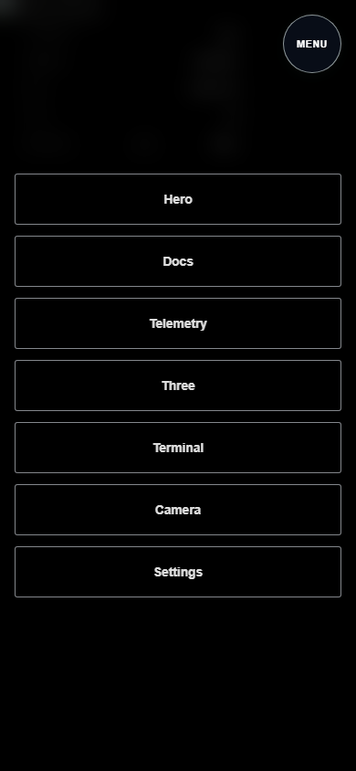
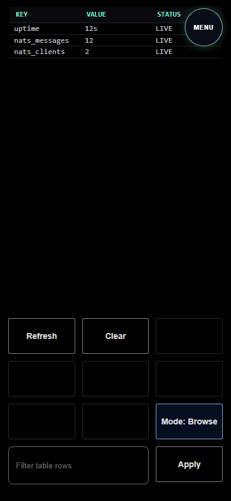

# Test Report: src_v1

- **Date**: Sun, 22 Feb 2026 21:14:18 PST
- **Total Duration**: 22.814740065s

## Summary

- **Steps**: 15 / 15 passed
- **Status**: PASSED

## Details

### 1. ✅ 00 Reset Workspace

- **Duration**: 721.718254ms
- **Report**: Reset workspace: cleaned ports 3000/test-web.

---

### 2. ✅ 01 Preflight (Go/UI)

- **Duration**: 6.929991582s
- **Report**: Preflight checks passed.

---

### 3. ✅ 02 Go Run (Mock Server Check)

- **Duration**: 605.566762ms
- **Report**: Go server running.

---

### 4. ✅ 03 UI Run

- **Duration**: 505.602575ms
- **Report**: UI server check passed.

---

### 5. ✅ 04 Expected Errors (Proof of Life)

- **Duration**: 4.441976115s
- **Report**: Proof of life errors detected.

---

### 6. ✅ 05 Dev Server Running (latest UI)

- **Duration**: 1.031062136s
- **Report**: Dev server serves latest UI.

---

### 7. ✅ 06 Hero Section Validation

- **Duration**: 133.735904ms
- **Report**: Hero section and canvas validated visible.

#### Screenshots

---

### 8. ✅ 07 Docs Section Validation

- **Duration**: 558.906502ms
- **Report**: Docs section navigation and content validated.

#### Screenshots

---

### 9. ✅ 08 Table Section Validation

- **Duration**: 1.77293918s
- **Report**: Table section validated with data rows.

#### Screenshots

---

### 10. ✅ 09 Three Section Validation

- **Duration**: 524.689385ms
- **Report**: Three section navigation and canvas validated.

#### Screenshots

---

### 11. ✅ 10 Xterm Section Validation

- **Duration**: 881.691735ms
- **Report**: Xterm section validated with command execution.

#### Screenshots

---

### 12. ✅ 11 Video Section Validation

- **Duration**: 936.199285ms
- **Report**: Video section validated with playback.

#### Screenshots

---

### 13. ✅ 12 Lifecycle / Invariants

- **Duration**: 3.031555855s
- **Report**: Lifecycle invariants maintained.

---

### 14. ✅ 13 Menu Navigation Validation

- **Duration**: 729.735859ms
- **Report**: Menu navigation flow validated.

#### Screenshots

---

### 15. ✅ 14 Cleanup Verification

- **Duration**: 3.68946ms
- **Report**: Cleanup successful (teardown called, web port=43510).

---

