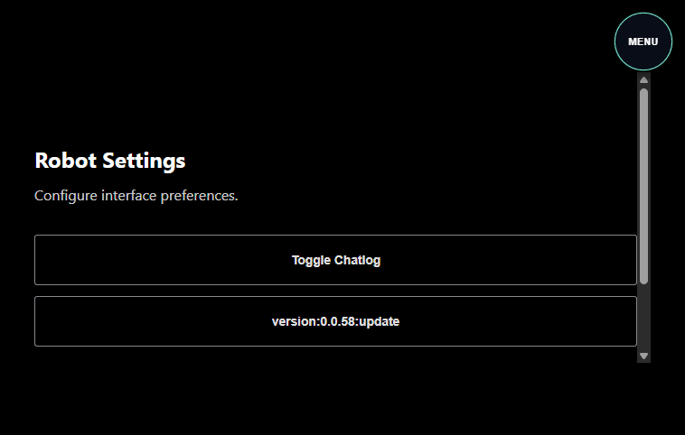

# Test Report: robot-src-v2-diagnostic-ui

- **Date**: Sun, 01 Mar 2026 11:43:59 PST
- **Total Duration**: 22.372924715s

## Summary

- **Steps**: 0 / 1 passed
- **Status**: FAILED

## Details

### 1. ❌ robot-src-v2-diagnostic-ui-menu

- **Duration**: 22.372917913s
- **Error**: `settings section version button did not converge to backend version; debug={"active":"true","buttons":[{"text":"Toggle Chatlog","aria":""},{"text":"version:0.0.58:update","aria":""}],"allButtons":[{"text":"Hero","aria":"Navigate Hero"},{"text":"Docs","aria":"Navigate Docs"},{"text":"Telemetry","aria":"Navigate Telemetry"},{"text":"Steering","aria":"Navigate Steering Settings"},{"text":"Key Params","aria":"Navigate Key Params"},{"text":"Three","aria":"Navigate Three"},{"text":"Terminal","aria":"Navigate Terminal"},{"text":"Camera","aria":"Navigate Camera"},{"text":"Settings","aria":"Navigate Settings"},{"text":"Menu","aria":"Toggle Global Menu"},{"text":"Close","aria":"Toggle Mode Form"},{"text":"Close","aria":"Toggle Mode Form"}]}`

#### Logs

```text
INFO: [ACTION] ensure browser role=test remote_node= url=about:blank
INFO: ERROR_PING: start browser_subject=logs.test.robot-src-v2-diagnostic-ui.robot-src-v2-diagnostic-ui-menu.browser error_subject=logs.test.robot-src-v2-diagnostic-ui.error
INFO: ERROR_PING: browser-topic-ok marker=__DIALTONE_ERROR_PING__:1772394223362274716
INFO: ERROR_PING: error-topic-ok marker=__DIALTONE_ERROR_PING__:1772394223362274716:error
INFO: ERROR_PING: pass browser_topic=true error_topic=true
INFO: [ACTION] browser ready
INFO: [ACTION] navigated to robot ui
INFO: [ACTION] hero section visible
INFO: [ACTION] hero section active
INFO: [ACTION] menu toggle visible
INFO: [ACTION] menu opened
INFO: [ACTION] settings nav visible
INFO: [ACTION] settings nav clicked
INFO: [ACTION] settings section visible
INFO: [ACTION] settings section active
```

#### Errors

```text
FAIL: [TEST][FAIL] [STEP:robot-src-v2-diagnostic-ui-menu] failed: settings section version button did not converge to backend version; debug={"active":"true","buttons":[{"text":"Toggle Chatlog","aria":""},{"text":"version:0.0.58:update","aria":""}],"allButtons":[{"text":"Hero","aria":"Navigate Hero"},{"text":"Docs","aria":"Navigate Docs"},{"text":"Telemetry","aria":"Navigate Telemetry"},{"text":"Steering","aria":"Navigate Steering Settings"},{"text":"Key Params","aria":"Navigate Key Params"},{"text":"Three","aria":"Navigate Three"},{"text":"Terminal","aria":"Navigate Terminal"},{"text":"Camera","aria":"Navigate Camera"},{"text":"Settings","aria":"Navigate Settings"},{"text":"Menu","aria":"Toggle Global Menu"},{"text":"Close","aria":"Toggle Mode Form"},{"text":"Close","aria":"Toggle Mode Form"}]}
```

#### Browser Logs

```text
INFO: CONSOLE:log: "__DIALTONE_ERROR_PING__:1772394223362274716"
ERROR: CONSOLE:error: "__DIALTONE_ERROR_PING__:1772394223362274716:error"
INFO: CONSOLE:log: "[SectionManager] NAVIGATING TO #robot-hero-stage"
INFO: CONSOLE:log: "[SectionManager] LOADING #robot-hero-stage"
INFO: CONSOLE:log: "[SectionManager] NAVIGATING TO #robot-hero-stage"
INFO: CONSOLE:log: "[SW] Unregistering stale worker: https://rover-1.dialtone.earth/"
INFO: CONSOLE:log: "[SectionManager] ctl.load() RESOLVED for #robot-hero-stage"
INFO: CONSOLE:log: "[SectionManager] LOADED #robot-hero-stage"
INFO: CONSOLE:log: "[SectionManager] START #robot-hero-stage"
INFO: CONSOLE:log: "[SectionManager] Setting data-ready=true on #robot-hero-stage"
INFO: CONSOLE:log: "[SectionManager] NAVIGATE TO #robot-hero-stage"
INFO: CONSOLE:log: "[SectionManager] NAVIGATE TO #robot-hero-stage"
INFO: CONSOLE:log: "[SectionManager] RESUME #robot-hero-stage"
INFO: CONSOLE:log: "[SectionManager] RESUME #robot-hero-stage"
INFO: CONSOLE:log: "[TEST_ACTION] click aria=Toggle Global Menu"
INFO: CONSOLE:log: "[TEST_ACTION] click aria=Navigate Settings"
INFO: CONSOLE:log: "[SectionManager] NAVIGATING TO #robot-settings-button-list"
INFO: CONSOLE:log: "[SectionManager] LOADING #robot-settings-button-list"
INFO: CONSOLE:log: "[SectionManager] ctl.load() RESOLVED for #robot-settings-button-list"
INFO: CONSOLE:log: "[SectionManager] LOADED #robot-settings-button-list"
INFO: CONSOLE:log: "[SectionManager] START #robot-settings-button-list"
INFO: CONSOLE:log: "[SectionManager] Setting data-ready=true on #robot-settings-button-list"
INFO: CONSOLE:log: "[SectionManager] NAVIGATE AWAY #robot-hero-stage"
INFO: CONSOLE:log: "[SectionManager] PAUSE #robot-hero-stage"
INFO: CONSOLE:log: "[SectionManager] NAVIGATE TO #robot-settings-button-list"
INFO: CONSOLE:log: "[SectionManager] RESUME #robot-settings-button-list"
INFO: CONSOLE:log: "[NATS] Connecting to wss://rover-1.dialtone.earth/natsws..."
INFO: CONSOLE:log: "[NATS] Connected."
```

#### Screenshots



---

