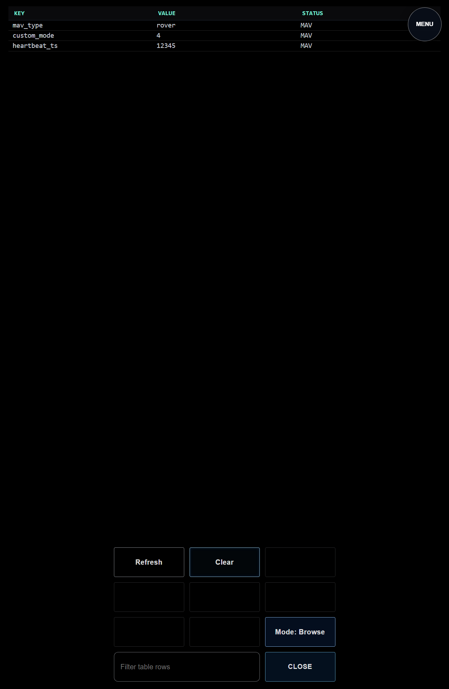
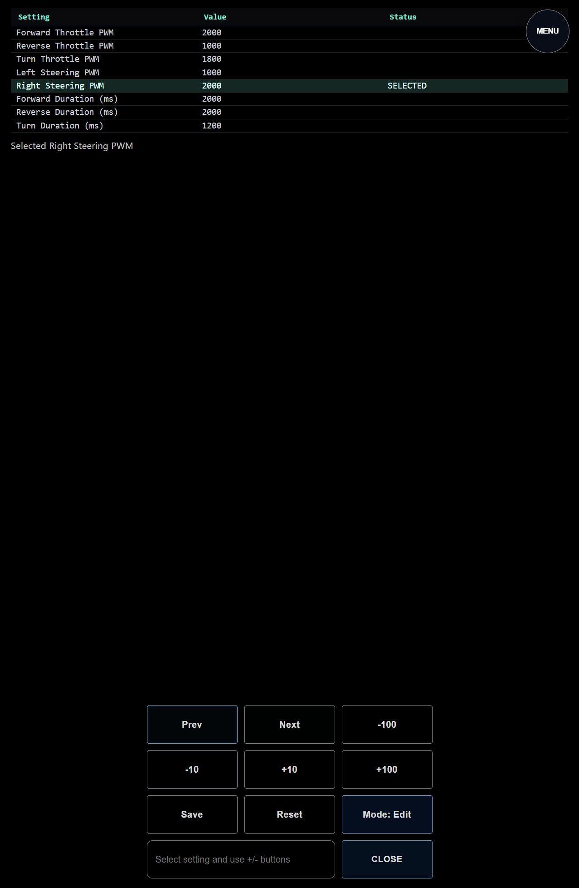
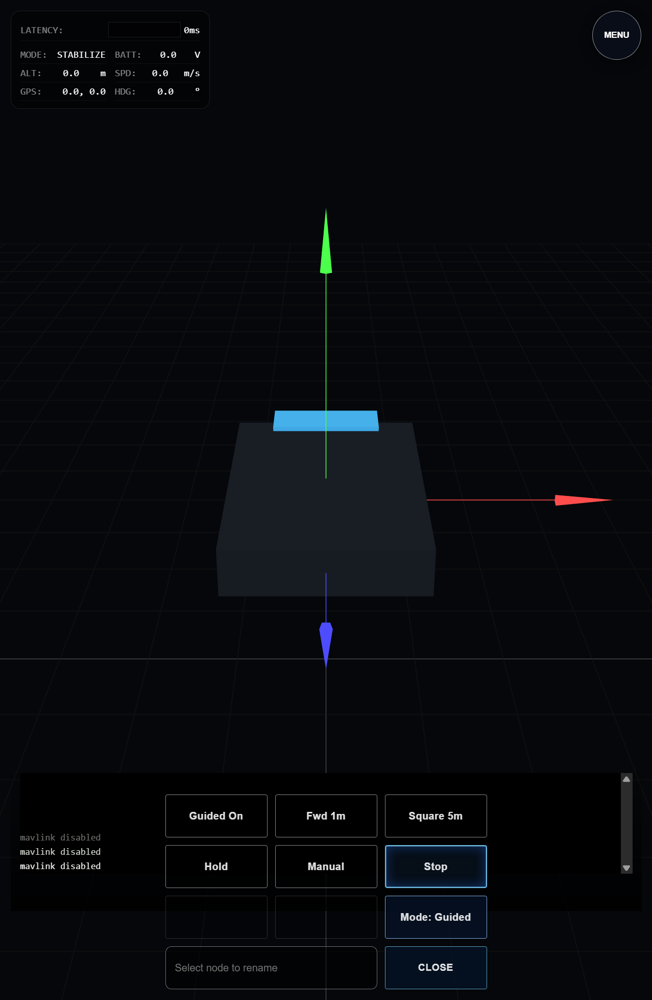
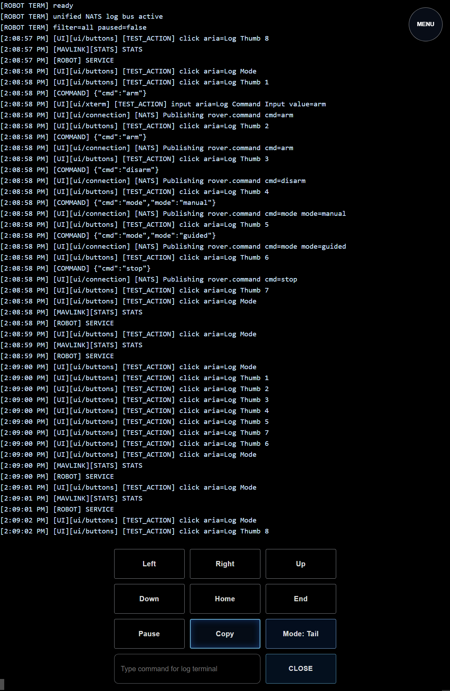
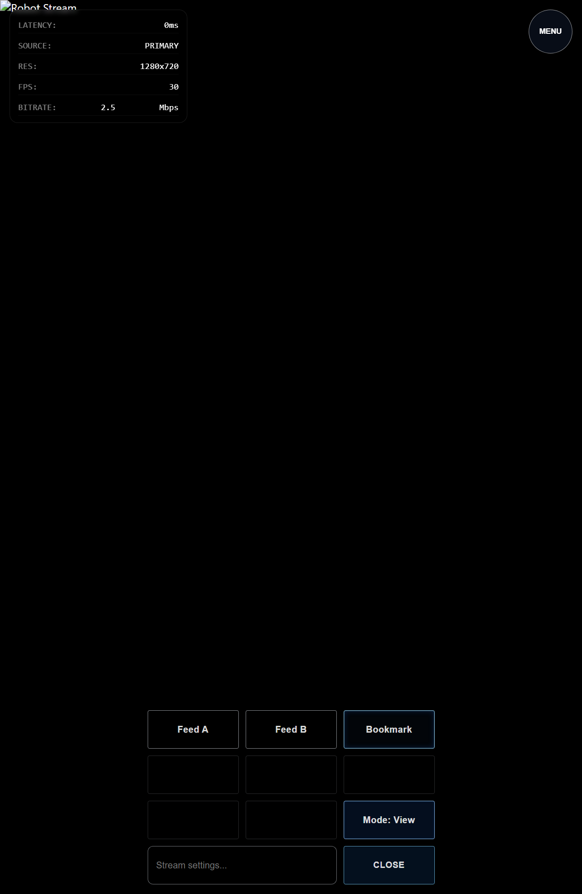
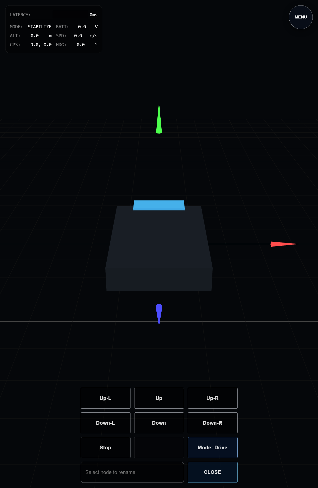

# Test Report: robot-src-v2

- **Date**: Sun, 08 Mar 2026 14:09:20 PDT
- **Total Duration**: 40.604843113s

## Summary

- **Steps**: 6 / 7 passed
- **Status**: FAILED

## Details

### 1. ✅ 04-ui-section-navigation

- **Duration**: 3.874190515s
- **Report**: UI section navigation verified on http://127.0.0.1:18083

#### Logs

```text
INFO: ui build complete
WARN: ERROR_PING: skipped for chrome src_v3 NATS-managed browser session
INFO: report: UI section navigation verified on http://127.0.0.1:18083
PASS: [TEST][PASS] [STEP:04-ui-section-navigation] report: UI section navigation verified on http://127.0.0.1:18083
```

#### Browser Logs

```text
<empty>
```

#### Screenshots


---

### 2. ✅ 05-ui-table-buttons

- **Duration**: 2.313379216s
- **Report**: Telemetry section buttons verified

#### Logs

```text
INFO: ui build complete
INFO: report: Telemetry section buttons verified
PASS: [TEST][PASS] [STEP:05-ui-table-buttons] report: Telemetry section buttons verified
```

#### Browser Logs

```text
<empty>
```

#### Screenshots



---

### 3. ✅ 06-ui-steering-settings-buttons

- **Duration**: 2.474526081s
- **Report**: Steering settings buttons verified

#### Logs

```text
INFO: ui build complete
INFO: report: Steering settings buttons verified
PASS: [TEST][PASS] [STEP:06-ui-steering-settings-buttons] report: Steering settings buttons verified
```

#### Browser Logs

```text
<empty>
```

#### Screenshots



---

### 4. ✅ 07-ui-three-buttons-three-system-arm

- **Duration**: 5.1751453s
- **Report**: Three section buttons verified, including system arm flow

#### Logs

```text
INFO: ui build complete
INFO: report: Three section buttons verified, including system arm flow
PASS: [TEST][PASS] [STEP:07-ui-three-buttons-three-system-arm] report: Three section buttons verified, including system arm flow
```

#### Browser Logs

```text
<empty>
```

#### Screenshots




---

### 5. ✅ 08-ui-terminal-routing-and-buttons

- **Duration**: 9.09862543s
- **Report**: Terminal section buttons and MAVLink routing verified

#### Logs

```text
INFO: ui build complete
INFO: report: Terminal section buttons and MAVLink routing verified
PASS: [TEST][PASS] [STEP:08-ui-terminal-routing-and-buttons] report: Terminal section buttons and MAVLink routing verified
```

#### Browser Logs

```text
<empty>
```

#### Screenshots




---

### 6. ✅ 09-ui-video-buttons

- **Duration**: 2.478818321s
- **Report**: Video section buttons verified

#### Logs

```text
INFO: ui build complete
INFO: report: Video section buttons verified
PASS: [TEST][PASS] [STEP:09-ui-video-buttons] report: Video section buttons verified
```

#### Browser Logs

```text
<empty>
```

#### Screenshots



---

### 7. ❌ 10-ui-settings-and-keyparams

- **Duration**: 15.186867964s
- **Error**: `context deadline exceeded`

#### Logs

```text
INFO: ui build complete
```

#### Errors

```text
FAIL: [TEST][FAIL] [STEP:10-ui-settings-and-keyparams] failed: context deadline exceeded
```

#### Browser Logs

```text
<empty>
```

#### Screenshots



---

<!-- DIALTONE_CHROME_REPORT_START -->

## Chrome Report

- hostnode: `legion`
- chrome_count: `4`

| PID | ROLE | PORT |
| --- | --- | --- |
| 18892 | `unlabeled` | 19464 |
| 23912 | `unlabeled` | 19464 |
| 29344 | `robot-test` | 19464 |
| 29508 | `unlabeled` | 19464 |

<!-- DIALTONE_CHROME_REPORT_END -->
