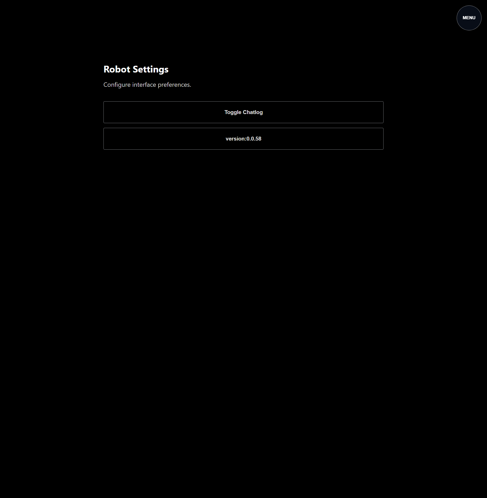

# Test Report: robot-src-v2

- **Date**: Sat, 07 Mar 2026 18:32:40 PST
- **Total Duration**: 6.221486277s

## Summary

- **Steps**: 5 / 5 passed
- **Status**: PASSED

## Details

### 1. ✅ 01-build-robot-v2-binary

- **Duration**: 315.641801ms
- **Report**: binary build verified

#### Logs

```text
INFO: [ACTION] build robot src_v2 server binary
INFO: build complete
INFO: report: binary build verified
PASS: [TEST][PASS] [STEP:01-build-robot-v2-binary] report: binary build verified
```

#### Browser Logs

```text
<empty>
```

---

### 2. ✅ 02-server-health-and-root-behavior

- **Duration**: 1.035842887s
- **Report**: server runtime smoke verified

#### Logs

```text
INFO: [ACTION] probe /health on http://127.0.0.1:18082
INFO: health ok
INFO: [ACTION] probe / expecting 200 (ui dist present) or 503 (scaffold)
INFO: root behavior verified
INFO: [ACTION] probe /api/init scaffold payload
INFO: api init returned wsPath
INFO: [ACTION] websocket dial /natsws
INFO: natsws websocket connected
INFO: [ACTION] probe /stream scaffold behavior
INFO: stream returned 503
INFO: [ACTION] probe /api/integration-health scaffold payload
INFO: integration health reported degraded
INFO: report: server runtime smoke verified
PASS: [TEST][PASS] [STEP:02-server-health-and-root-behavior] report: server runtime smoke verified
```

#### Browser Logs

```text
<empty>
```

---

### 3. ✅ 03-manifest-has-required-sync-artifacts

- **Duration**: 560.226µs
- **Report**: manifest sync artifact contract verified

#### Logs

```text
INFO: manifest contains required artifact keys
INFO: report: manifest sync artifact contract verified
PASS: [TEST][PASS] [STEP:03-manifest-has-required-sync-artifacts] report: manifest sync artifact contract verified
```

#### Browser Logs

```text
<empty>
```

---

### 4. ✅ 04-local-ui-mock-e2e-smoke

- **Duration**: 3.616000078s
- **Report**: local UI mock E2E smoke verified

#### Logs

```text
INFO: ui build complete
INFO: ui root returned 200
WARN: ERROR_PING: skipped for chrome src_v3 NATS-managed browser session
INFO: browser ui checks passed
INFO: mock nats publish ok
INFO: report: local UI mock E2E smoke verified
PASS: [TEST][PASS] [STEP:04-local-ui-mock-e2e-smoke] report: local UI mock E2E smoke verified
```

#### Browser Logs

```text
<empty>
```

#### Screenshots



---

### 5. ✅ 05-autoswap-compose-run-smoke

- **Duration**: 1.250535134s
- **Report**: autoswap manifest composition run verified

#### Logs

```text
INFO: autoswap compose run passed
INFO: report: autoswap manifest composition run verified
PASS: [TEST][PASS] [STEP:05-autoswap-compose-run-smoke] report: autoswap manifest composition run verified
```

#### Browser Logs

```text
<empty>
```

---

<!-- DIALTONE_CHROME_REPORT_START -->

## Chrome Report

- hostnode: `legion`
- chrome_count: `unknown`
- error: `remote browser inventory on legion failed: powershell command failed: exit status 1`

<!-- DIALTONE_CHROME_REPORT_END -->
