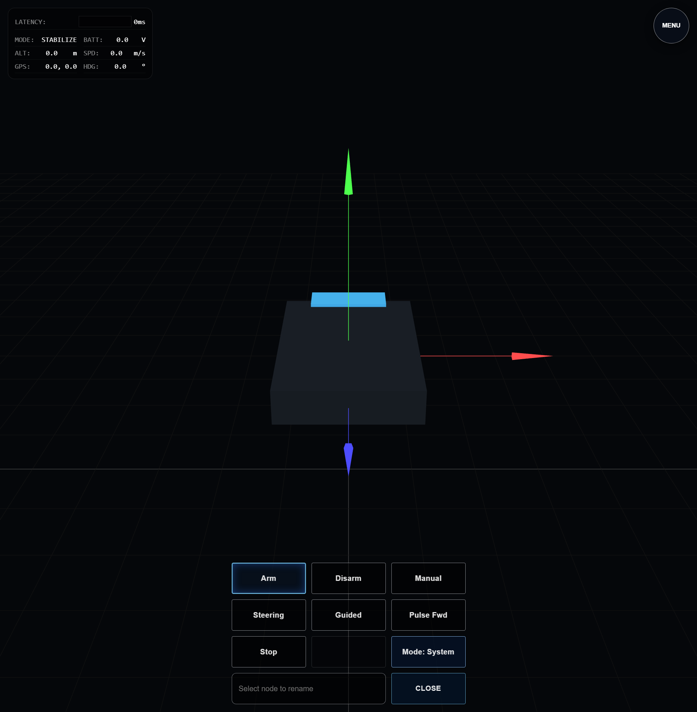

# Test Report: robot-src-v2

- **Date**: Sun, 08 Mar 2026 13:18:18 PDT
- **Total Duration**: 4.706916766s

## Summary

- **Steps**: 1 / 1 passed
- **Status**: PASSED

## Details

### 1. ✅ 04-three-system-arm-cli

- **Duration**: 4.69217404s
- **Report**: three system arm CLI flow verified

#### Logs

```text
INFO: ui build complete
WARN: ERROR_PING: skipped for chrome src_v3 NATS-managed browser session
INFO: three arm command published
INFO: report: three system arm CLI flow verified
PASS: [TEST][PASS] [STEP:04-three-system-arm-cli] report: three system arm CLI flow verified
```

#### Browser Logs

```text
INFO: CONSOLE:log: "[SectionManager] LOADING #robot-xterm-xterm"
INFO: CONSOLE:log: "[SectionManager] ctl.load() RESOLVED for #robot-xterm-xterm"
INFO: CONSOLE:log: "[SectionManager] LOADED #robot-xterm-xterm"
INFO: CONSOLE:log: "[SectionManager] START #robot-xterm-xterm"
INFO: CONSOLE:log: "[SectionManager] Setting data-ready=true on #robot-xterm-xterm"
INFO: CONSOLE:log: "[SectionManager] NAVIGATE AWAY #robot-three-stage"
INFO: CONSOLE:log: "[SectionManager] PAUSE #robot-three-stage"
INFO: CONSOLE:log: "[SectionManager] NAVIGATE TO #robot-xterm-xterm"
INFO: CONSOLE:log: "[TEST_ACTION] click aria=Toggle Global Menu"
INFO: CONSOLE:log: "[SectionManager] RESUME #robot-xterm-xterm"
INFO: CONSOLE:log: "[TEST_ACTION] click aria=Navigate Camera"
INFO: CONSOLE:log: "[SectionManager] NAVIGATING TO #robot-video-video"
INFO: CONSOLE:log: "[SectionManager] LOADING #robot-video-video"
INFO: CONSOLE:log: "[Video] Switching to feed: Primary"
INFO: CONSOLE:log: "[SectionManager] ctl.load() RESOLVED for #robot-video-video"
INFO: CONSOLE:log: "[SectionManager] LOADED #robot-video-video"
INFO: CONSOLE:log: "[SectionManager] START #robot-video-video"
INFO: CONSOLE:log: "[SectionManager] Setting data-ready=true on #robot-video-video"
INFO: CONSOLE:log: "[SectionManager] NAVIGATE AWAY #robot-xterm-xterm"
INFO: CONSOLE:log: "[SectionManager] PAUSE #robot-xterm-xterm"
INFO: CONSOLE:log: "[SectionManager] NAVIGATE TO #robot-video-video"
INFO: CONSOLE:log: "[TEST_ACTION] click aria=Navigate Settings"
INFO: CONSOLE:log: "[SectionManager] NAVIGATING TO #robot-settings-button-list"
INFO: CONSOLE:log: "[SectionManager] LOADING #robot-settings-button-list"
INFO: CONSOLE:log: "[SectionManager] RESUME #robot-video-video"
INFO: CONSOLE:log: "[SectionManager] ctl.load() RESOLVED for #robot-settings-button-list"
INFO: CONSOLE:log: "[SectionManager] LOADED #robot-settings-button-list"
INFO: CONSOLE:log: "[SectionManager] START #robot-settings-button-list"
INFO: CONSOLE:log: "[SectionManager] Setting data-ready=true on #robot-settings-button-list"
INFO: CONSOLE:log: "[SectionManager] NAVIGATE AWAY #robot-video-video"
INFO: CONSOLE:log: "[SectionManager] PAUSE #robot-video-video"
INFO: CONSOLE:log: "[SectionManager] NAVIGATE TO #robot-settings-button-list"
INFO: CONSOLE:log: "[TEST_ACTION] click aria=Navigate Three"
INFO: CONSOLE:log: "[SectionManager] NAVIGATING TO #robot-three-stage"
INFO: CONSOLE:log: "[SectionManager] NAVIGATE AWAY #robot-settings-button-list"
INFO: CONSOLE:log: "[SectionManager] NAVIGATE TO #robot-three-stage"
INFO: CONSOLE:log: "[TEST_ACTION] click aria=Three Mode"
INFO: CONSOLE:log: "[TEST_ACTION] click aria=Three Thumb 1"
INFO: CONSOLE:log: "[NATS] Publishing rover.command cmd=arm"
INFO: CONSOLE:log: "[TEST_ACTION] click aria=Navigate Terminal"
INFO: CONSOLE:log: "[SectionManager] NAVIGATING TO #robot-xterm-xterm"
INFO: CONSOLE:log: "[SectionManager] RESUME #robot-settings-button-list"
INFO: CONSOLE:log: "[SectionManager] RESUME #robot-three-stage"
INFO: CONSOLE:log: "[SectionManager] LOADING #robot-three-stage"
INFO: CONSOLE:log: "[NATS] Connecting to ws://127.0.0.1:18083/natsws..."
INFO: CONSOLE:log: "[SectionManager] ctl.load() RESOLVED for #robot-three-stage"
INFO: CONSOLE:log: "[SectionManager] LOADED #robot-three-stage"
INFO: CONSOLE:log: "[SectionManager] START #robot-three-stage"
INFO: CONSOLE:log: "[SectionManager] Setting data-ready=true on #robot-three-stage"
INFO: CONSOLE:log: "[NATS] Connected."
INFO: CONSOLE:log: "[SectionManager] NAVIGATING TO #robot-hero-stage"
INFO: CONSOLE:log: "[SectionManager] LOADING #robot-hero-stage"
INFO: CONSOLE:log: "[SectionManager] ctl.load() RESOLVED for #robot-hero-stage"
INFO: CONSOLE:log: "[SectionManager] LOADED #robot-hero-stage"
INFO: CONSOLE:log: "[SectionManager] START #robot-hero-stage"
INFO: CONSOLE:log: "[SectionManager] Setting data-ready=true on #robot-hero-stage"
INFO: CONSOLE:log: "[SectionManager] NAVIGATE TO #robot-hero-stage"
INFO: CONSOLE:log: "[SectionManager] RESUME #robot-hero-stage"
INFO: CONSOLE:log: "[TEST_ACTION] click aria=Navigate Docs"
INFO: CONSOLE:log: "[SectionManager] NAVIGATING TO #robot-docs-docs"
INFO: CONSOLE:log: "[SectionManager] LOADING #robot-docs-docs"
INFO: CONSOLE:log: "[SectionManager] ctl.load() RESOLVED for #robot-docs-docs"
INFO: CONSOLE:log: "[SectionManager] LOADED #robot-docs-docs"
INFO: CONSOLE:log: "[SectionManager] START #robot-docs-docs"
INFO: CONSOLE:log: "[SectionManager] Setting data-ready=true on #robot-docs-docs"
INFO: CONSOLE:log: "[SectionManager] NAVIGATE AWAY #robot-hero-stage"
INFO: CONSOLE:log: "[SectionManager] PAUSE #robot-hero-stage"
INFO: CONSOLE:log: "[SectionManager] NAVIGATE TO #robot-docs-docs"
INFO: CONSOLE:log: "[SectionManager] RESUME #robot-docs-docs"
INFO: CONSOLE:log: "[TEST_ACTION] click aria=Navigate Telemetry"
INFO: CONSOLE:log: "[SectionManager] NAVIGATING TO #robot-table-table"
INFO: CONSOLE:log: "[SectionManager] LOADING #robot-table-table"
INFO: CONSOLE:log: "[SectionManager] ctl.load() RESOLVED for #robot-table-table"
INFO: CONSOLE:log: "[SectionManager] LOADED #robot-table-table"
INFO: CONSOLE:log: "[SectionManager] START #robot-table-table"
INFO: CONSOLE:log: "[SectionManager] Setting data-ready=true on #robot-table-table"
INFO: CONSOLE:log: "[SectionManager] NAVIGATE AWAY #robot-docs-docs"
INFO: CONSOLE:log: "[SectionManager] PAUSE #robot-docs-docs"
INFO: CONSOLE:log: "[SectionManager] NAVIGATE TO #robot-table-table"
INFO: CONSOLE:log: "[SectionManager] RESUME #robot-table-table"
INFO: CONSOLE:log: "[SectionManager] NAVIGATE AWAY #robot-table-table"
INFO: CONSOLE:log: "[SectionManager] PAUSE #robot-table-table"
INFO: CONSOLE:log: "[SectionManager] PAUSE #robot-settings-button-list"
INFO: CONSOLE:log: "[SW] Unregistering stale worker: http://127.0.0.1:18083/"
```

#### Screenshots




---

<!-- DIALTONE_CHROME_REPORT_START -->

## Chrome Report

- hostnode: `legion`
- chrome_count: `4`

| PID | ROLE | PORT |
| --- | --- | --- |
| 18892 | `unlabeled` | 19464 |
| 23912 | `unlabeled` | 19464 |
| 29344 | `robot-test` | 19464 |
| 29508 | `unlabeled` | 19464 |

<!-- DIALTONE_CHROME_REPORT_END -->
