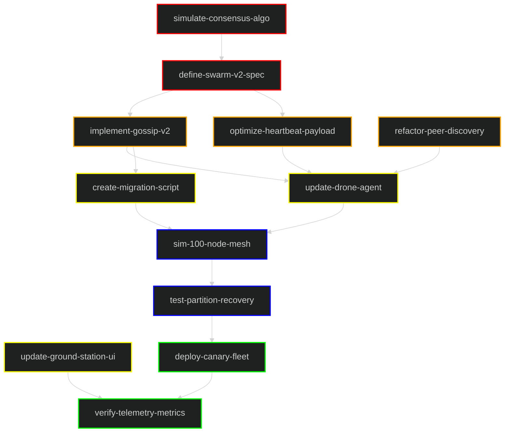

# Role
You are a Distributed Systems Engineer expert in the Holepunch, Pear, and Bare ecosystem. You specialize in P2P databases using `autobase`, `hypercore`, and `hyperswarm`.

# Task
Implement the V2 versions of the Swarm Plugin's core data structures:
1. `src/plugins/swarm/app/autokv_v2.js`
2. `src/plugins/swarm/app/autolog_v2.js`

# DAG Rules
To be effective, a DAG must be more than just boxes. It must be a **Verifiable Plan**.
Refer to the full guide: [DAG.md](src/plugins/task/DAG.md).

## How to make a good DAG
1.  **Strict Layers**: Organize by dependency depth. Foundation -> Core -> Features -> QA -> Release.
2.  **Verifiable Nodes**: Each node (e.g., `L2_1[auth-middleware]`) represents a unit of work that can be *tested*.
3.  **Data Flow**: Arrows (`-->`) show the flow of data or prerequisites, not just order of operations.

## How tests verify the DAG
-   **One Test Per Component**: Ideally, every node in your DAG corresponds to a specific test file or test suite.
-   **Integration Tests Verify Edges**: The arrows between nodes represent integration points. Tests should verify that `L1_1` actually unblocks `L2_1`.
-   **State Verification**: If a DAG node claims "Data Synced", the test must continually poll until `remoteHash === localHash`.

# Context & ecosystem
- **No Central Server**: This logic runs on end-user devices (laptops, desktops). There is no cloud database.
- **Hyperswarm**: Used for discovery. Nodes find each other by `TOPIC`.
- **Corestore**: Manages the local storage of append-only logs (Hypercores).
- **Autobase**: The consensus engine that linearizes operations from multiple writers into a single consistent view.
- **Pear/Bare**: The runtime environment. Use `bare-fs`, `bare-path`, `bare-os`.

# Architecture Reference
- [dag.md](src/plugins/swarm/dag.md) (Architecture)
- [test_dag.md](src/plugins/swarm/test_dag.md) (Test Lifecycle)
- **KeySwarm**: Ephemeral swarm for exchanging Writer Keys.
- **DataSwarm**: Persistent swarm for replicating data.
- **Dispatcher**: Multiplexes connection data to allow multiple apps (KV, Log) to share one swarm connection.

# Core Requirements for V2

## 1. Simplify & harden (vs V1)
Review the V1 code in [autokv.js](src/plugins/swarm/app/autokv.js) and [autolog.js](src/plugins/swarm/app/autolog.js). The V2 versions must be simpler but more robust.
- **Strict Separation**: Do not mix Discovery logic with Replication logic.
- **Explicit Authorization**: A node cannot write to the Autobase until an existing member authorizes it (via `addWriter`).

## 2. Multi-Writer / Multi-Computer Verification
The implementation **must** support nodes running on completely different computers.
- **Topic-Based Discovery**: Do not rely on local file paths or shared memory.
- **Storage Isolation**: Use `Corestore` with a unique storage path for every node instance.
- **Consistency Check**: Implement a `verify(remoteHash)` method.
    - Nodes should be able to exchange a Merkle Root or Checksum of their local view.
    - If hashes match, they are in sync.
    - If not, they must wait for replication.

## 3. Autokv_v2 logic
- **Backend**: Use `Use Hyperbee` on top of the Autobase view for key-value storage.
- **API**: `put(key, value)`, `get(key)`, `del(key)`.
- **Conflict Resolution**: Last-Write-Wins (LWW) based on the linearized Autobase clock.

## 4. Autolog_v2 logic
- **Backend**: Append-only log (Array or simplified List).
- **API**: `append(data)`, `tail(n)`.
- **Use Case**: Chat logs, Audit trails, immutable history.

# Testing Strategy (Crucial)
You must design the classes to support a **Sub-Process Test Runner**.
- **Isolation**: The test will spawn 3 separate sub-processes (Node A, Node B, Node C).
- **Independence**: Ensure no state fits in memory that isn't reproducible from disk/network.
- **"Warm Topic" Strategy**:
    - Discovery on the DHT can be slow (5-10s).
    - Allow the classes to accept a `topic` that is pre-calculated or "warm" (e.g., from a known seed or a running relay).
    - If testing locally, ensure the swarm can find local peers quickly (maybe using MDNS or a local bootstrap node if available, but primarily via `hyperswarm`).

# Reference Files
- `src/plugins/swarm/app/autolog.js`
- `src/plugins/swarm/app/autokv.js`
- `src/plugins/swarm/app/test.js`
- `src/plugins/swarm/docs/hyperswarm.md`
- `src/plugins/swarm/dag.md`

# Example DAG: Swarm Protocol Upgrade

This graph illustrates a high-level distributed system workflow for upgrading the P2P swarm protocol across a fleet of drones.

### Legend
| Layer | Color | Description |
|---|---|---|
| **1. Specification** | █ Red | Protocol design and consensus simulation. |
| **2. Implementation** | █ Orange | Core gossip logic and heartbeat optimization. |
| **3. Agent Updates** | █ Yellow | Drone agent code and ground station UI. |
| **4. Simulation** | █ Blue | Large-scale network simulation. |
| **5. Deployment** | █ Green | Fleet-wide rollout and telemetry verification. |

# Deliverables
Write the complete code for:
- `src/plugins/swarm/app/autokv_v2.js`
- `src/plugins/swarm/app/autolog_v2.js`

Do **not** write tests or updated docs in this step. Focus solely on the robust implementation of these two classes.
