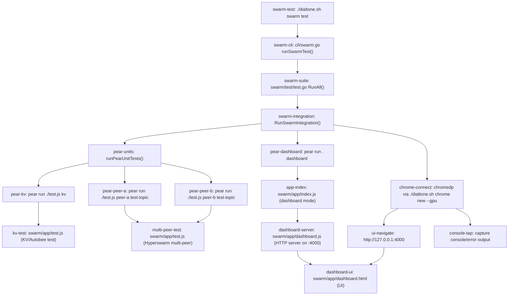

# Swarm Plugin Help

Usage: `./dialtone.sh swarm [COMMAND] [ARGS]`

## Commands

| Command | Description |
| :--- | :--- |
| `install` | Install dependencies (npm) |
| `dashboard` | Launch web dashboard (http://127.0.0.1:4000) |
| `start <topic> [name]` | Start a background node for a topic |
| `stop <pid>` | Stop a background node by PID |
| `list` | List all managed nodes |
| `status` | Show live peer counts and latency |
| `test` | Run integration tests (Pear + chromedp) |

# User Guide

## 1. Starting the Swarm

 Initialize the swarm environment and start the dashboard to visualize the network.

```shell
# Install dependencies
./dialtone.sh swarm install

# Start the dashboard (runs on http://127.0.0.1:4000)
./dialtone.sh swarm dashboard

# Start a background node on the 'index' topic
./dialtone.sh swarm start index "main-node"

# Check status of running nodes
./dialtone.sh swarm status
```

## 2. Adding a Task (Design)
Tasks are the unit of work in Dialtone v2. They are broadcast over topics.

```shell
# Add a new task to the 'sessions' topic
# Note: This uses the 'task' plugin alias (proposed)
./dialtone.sh task add "fix-login-bug" \
  --topic sessions \
  --title "Fix login timeout issue" \
  --tags "bug,high-priority"

# Claim a task
./dialtone.sh task claim "fix-login-bug"

# Mark as done (requires signature)
./dialtone.sh task --sign "fix-login-bug"
```

## 3. K/V Store (Hyperbee + Autobase)
The K/V store is a distributed, multi-writer database where all peers converge to the same state using Autobase (causal ordering) and Hyperbee (B-tree index).

### How it works
1.  **Writes**: Peers append operations to their local input log.
2.  **Sync**: Autobase linearizes all input logs into a global order.
3.  **Index**: Hyperbee consumes the linearized view to update the B-tree.
4.  **Result**: Eventual consistency where all peers see the same data.

### Running the K/V Demo
We have a demonstration using ephemeral storage (fast, memory-like) to show concurrent convergence.

```shell
# Run the K/V simulation test
# This starts 2 peers, performs concurrent writes, and verifies convergence.
cd src/plugins/swarm/app
pear run ./test.js kv
```

## 4. Running Tests
Validate the swarm infrastructure using Pear (p2p) plus chromedp (browser UI).

```shell
# Run Pear unit tests + dashboard + chromedp UI checks
./dialtone.sh swarm test
```

## 5. Tests ↔ Code Map



## 6. Node.js Compatibility
Pear apps use the Bare runtime, which provides mostly compatible `bare-*` modules for Node.js core APIs (e.g., `bare-fs` instead of `fs`).

### Import Maps (`package.json`)
To use standard Node.js imports like `import fs from 'fs'`, map them in your `package.json`:

```json
{
  "imports": {
    "fs": {
      "bare": "bare-fs",
      "default": "fs"
    }
  },
  "dependencies": {
    "bare-fs": "^2.1.5"
  }
}
```

### Deviant Mappings
Most modules map directly (e.g., `path` -> `bare-path`), but some have different names:
*   `http` -> `bare-http1`
*   `child_process` -> `bare-subprocess`
*   `detached` -> `bare-daemon`

See [Pear Node.js Compatibility](https://docs.pears.com/reference/node-compat.html) for full details.

## 7. Pear FAQ Highlights
Key questions answered in the [official FAQ](https://docs.pears.com/reference/faq.html):
*   **How Do I Get a List of Pear Applications I've Installed?** (`pear data apps`)
*   **How Do I Uninstall a Pear Application?** (Currently not supported, use `pear drop` to reset storage)
*   **Where is the Pear Application stored?** (Operating system dependent, e.g., `~/.config/pear`)
*   **Can Pear be used with X language?** (Mostly JavaScript/TypeScript, others via native addons)
*   **How Do I Write an Application Once So It Can Be Run on Desktop, Mobile, etc?** (Separate "Pear-end" logic from UI)
*   **How is my Application Distributed?** (Via the swarm, ensure `pear seed` is running)
*   **Why Is NPM Used For Dependencies?** (Bootstrap and package management)
*   **How Do I Distribute a Binary Version?** (Use `pear-appling`)
*   **Can Peers Know My IP Address?** (Yes, IP is exchanged for P2P connection)

## 8. Recommended Practices
Key best practices from the [official guide](https://docs.pears.com/reference/recommended-practices.html):
*   **One Corestore per App**: Reduces file handles and storage duplication.
*   **One Hyperswarm per App**: Efficiently manages connections and DHT lookups.
*   **No Remote Code**: Never load JS over HTTP(S) to prevent supply chain attacks.
*   **Prune Dev Dependencies**: Run `npm prune --omit=dev` before staging to reduce bundle size.
*   **Exclude .git**: Ensure `.git` is ignored in your stage configuration.

