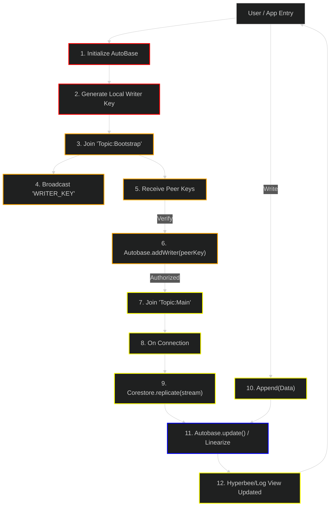

# Swarm Plugin: Decentralized Architecture (v2)

This DAG illustrates the "Dual-Swarm" architecture required for `autokv_v2` and `autolog_v2`. It separates **Discovery/Authorization** from **Replication/Data**.

## Legend
| Layer | Color | Description |
|---|---|---|
| **1. Initialization** | █ Red | Local setup, key generation, and Autobase handling. |
| **2. Discovery** | █ Orange | KeySwarm operations, handshake, and authorization logic. |
| **3. Replication** | █ Yellow | DataSwarm connection and Corestore replication streams. |
| **4. Operations** | █ Blue | App-level reads/writes (Append, Get, Put) and linearization. |

## Architecture Flow

