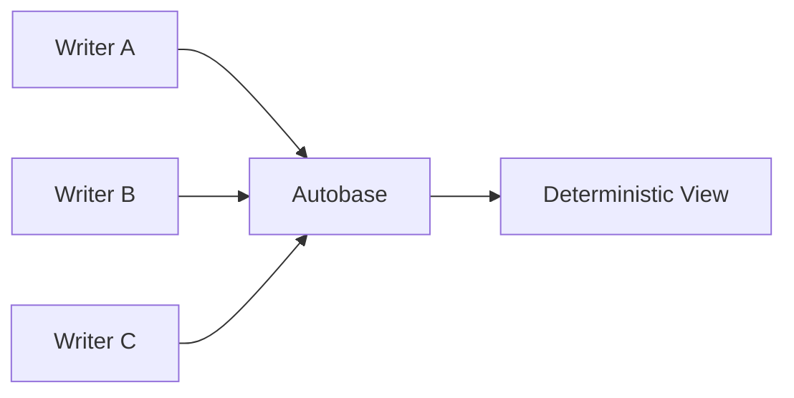

# Autobase (multiwriter log)

Autobase is a multiwriter data structure built on Hypercore. Multiple writers append to their own cores, and Autobase linearizes those entries into an eventually consistent log used to build a deterministic view. See the upstream project for full API details: [holepunchto/autobase](https://github.com/holepunchto/autobase).

## Why it matters for Dialtone
- Multiple peers can write concurrently.
- A single, deterministic view can be built from the shared log.
- Reordering is expected as causal information arrives.

## Minimal usage

```javascript
const Corestore = require('corestore')
const Autobase = require('autobase')

const store = new Corestore('./data')
const base = new Autobase(store, null, { open, apply })
await base.ready()

await base.append({ type: 'task.add', taskId: 't-1' })
await base.update()

function open (store) {
  return store.get('tasks-view')
}

async function apply (nodes, view, host) {
  for (const { value } of nodes) {
    await view.append(value)
  }
}
```

## Replicating over Hyperswarm

```javascript
const Hyperswarm = require('hyperswarm')
const swarm = new Hyperswarm()

swarm.join(base.discoveryKey)
swarm.on('connection', (conn) => store.replicate(conn))
```

## Reordering behavior
Autobase may reorder nodes when new causal data arrives. Only build your view from the provided `view` argument in `apply`, and ensure updates are deterministic so replays are safe.

## Data flow


