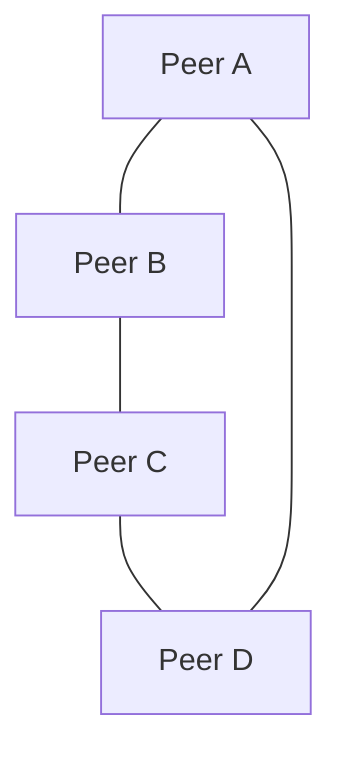

# Hyperswarm (P2P discovery + transport)

Hyperswarm is a peer-to-peer discovery network used to connect nodes by topic. Dialtone's swarm plugin uses Hyperswarm to join a shared topic and replicate data between peers.

## Join a topic

```javascript
const Hyperswarm = require('hyperswarm')
const swarm = new Hyperswarm()

const topic = Buffer.from('dialtone-task-log')
swarm.join(topic, { server: true, client: true })

swarm.on('connection', (conn) => {
  console.log('peer connected', conn.remotePublicKey.toString('hex'))
})
```

## Replicate a Corestore

```javascript
const Corestore = require('corestore')
const store = new Corestore('./data')

swarm.on('connection', (conn) => {
  store.replicate(conn)
})
```

## Typical mesh topology



## Notes
- Topics are binary buffers, usually derived from a stable string or hash.
- All peers on the same topic can discover and connect to each other.
- Use deterministic replication streams for shared logs or views.
