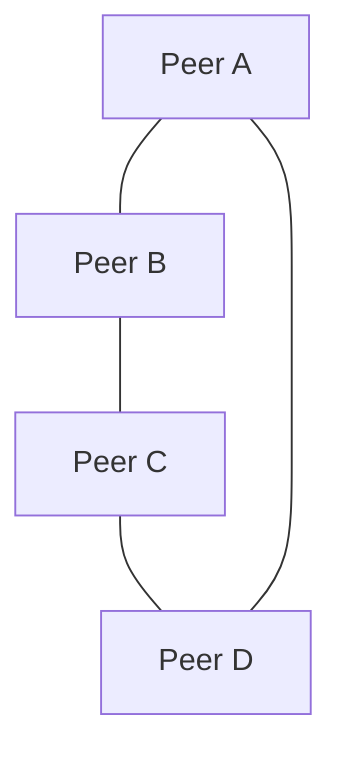

# Hyperswarm (P2P discovery + transport)

Hyperswarm is a peer-to-peer discovery network used to connect nodes by topic. Dialtone's swarm plugin uses Hyperswarm to join a shared topic and replicate data between peers.

## The "Dual-Swarm" Architecture (V2)

To solve the "Bootstrapping Problem" in decentralized databases (Autobase), we use two distinct swarm modes:

1.  **KeySwarm (Discovery & Auth)**:
    -   **Topic**: Derived from `ApplicationTopic + ":bootstrap"`.
    -   **Purpose**: Ephemeral exchange of small metadata (Writer Keys).
    -   **Data**: JSON or line-delimited text (`WRITER_KEY:xyz`).
    -   **Traffic**: Low bandwidth, high latency tolerance.

2.  **DataSwarm (Replication)**:
    -   **Topic**: The actual `ApplicationTopic`.
    -   **Purpose**: High-throughput replication of `Corestore` (Hypercores).
    -   **Data**: Binary streams (Hypercore Protocol).
    -   **Traffic**: High bandwidth, strictly binary.

## Multiplexing & Dispatcher Pattern

When multiple plugins (e.g., `AutoKV` and `AutoLog`) run in the same app, they often share a single `Hyperswarm` instance to save resources. To prevent cross-talk, we use a **Dispatcher**:

### 1. The Handshake Protocol
All messages on the `KeySwarm` MUST be prefixed with the Topic ID to allow routing:

```text
TOPIC:dialtone-chat
WRITER_KEY:a1b2c3...
BASE_KEY:d4e5f6...
```

### 2. Dispatcher Logic
```javascript
socket.on('data', (data) => {
  const lines = parseLines(data)
  for (const line of lines) {
    if (line.startsWith('TOPIC:dialtone-chat')) {
      // Route to Chat Plugin
      chatPlugin.handleHandshake(line)
    } else if (line.startsWith('TOPIC:dialtone-kv')) {
      // Route to KV Plugin
      kvPlugin.handleHandshake(line)
    }
  }
})
```

## Basic Usage

### Join a topic
```javascript
const Hyperswarm = require('hyperswarm')
const swarm = new Hyperswarm()

const topic = Buffer.from('dialtone-task-log')
swarm.join(topic, { server: true, client: true })

swarm.on('connection', (conn) => {
  console.log('peer connected', conn.remotePublicKey.toString('hex'))
})
```

### Replicate a Corestore
```javascript
const Corestore = require('corestore')
const store = new Corestore('./data')

swarm.on('connection', (conn) => {
  store.replicate(conn)
})
```

## Typical mesh topology


## Notes
- Topics are binary buffers, usually derived from a stable string or hash.
- All peers on the same topic can discover and connect to each other.
- Use deterministic replication streams for shared logs or views.
