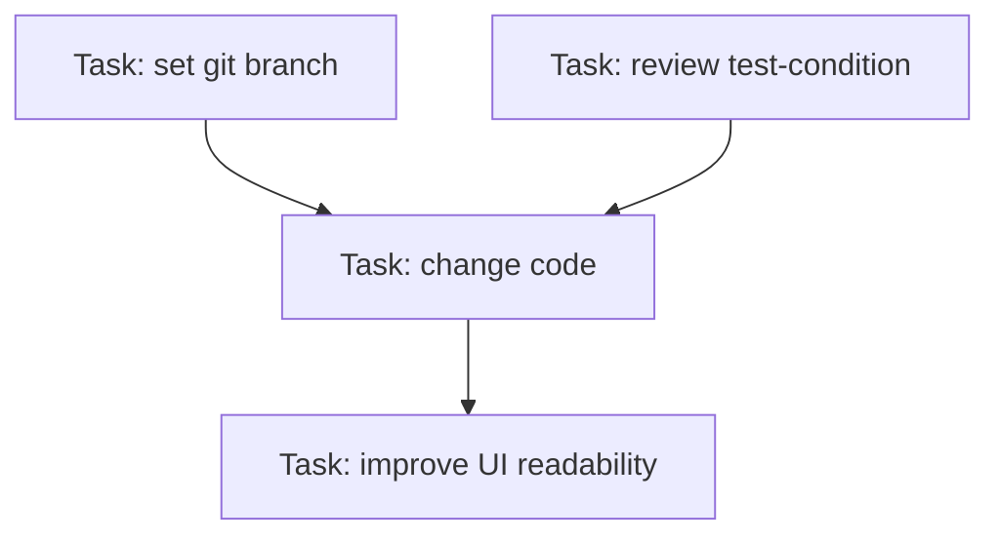
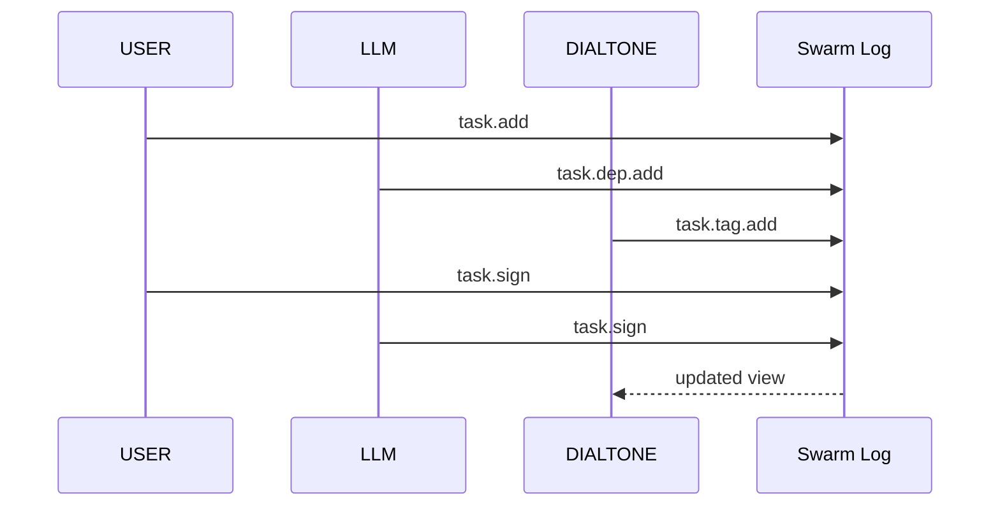

# Task DAG over a mesh log stream

This document describes how multiple writers in different places share a mesh log stream and collaboratively build a task DAG. The log is append-only, and the DAG is a deterministic view derived from that log.

## Writers and roles
- `USER:` proposes and signs tasks.
- `LLM:` proposes tasks, dependencies, and tags.
- `DIALTONE:` brokers the log, provides context, and enforces rules.

All three act as writers. Any writer can append new tasks or updates.

## Log entries
Every task change is a log entry:
- `task.add`
- `task.dep.add`
- `task.tag.add`
- `task.claim`
- `task.sign`

The view replays entries into a DAG state.

## Example log append (JavaScript)

```javascript
await base.append({
  type: 'task.add',
  taskId: 't-42',
  title: 'Review test-condition',
  topic: 'tasks/review',
  budget: 2,
  score: 0.71,
  success_probability: 0.9,
  signatures_required: 2
})

await base.append({
  type: 'task.dep.add',
  taskId: 't-42',
  dependsOn: 't-12'
})

await base.append({
  type: 'task.tag.add',
  taskId: 't-42',
  tag: 'needs-review'
})
```

## Deterministic view (apply)

```javascript
async function apply (nodes, view) {
  for (const { value } of nodes) {
    await view.append(value)
  }
}
```

## Task completion rule
A task is marked `done` when:
- all dependencies are `done`
- required signatures are present

Signatures are added via:

```javascript
await base.append({ type: 'task.sign', taskId: 't-42', signer: 'USER' })
```

## Task DAG shape



## Mesh stream overview



## Implementation notes
- The log stream is the source of truth.
- The DAG is derived state and can be rebuilt from the log.
- Reordering is expected; apply logic must be deterministic.
