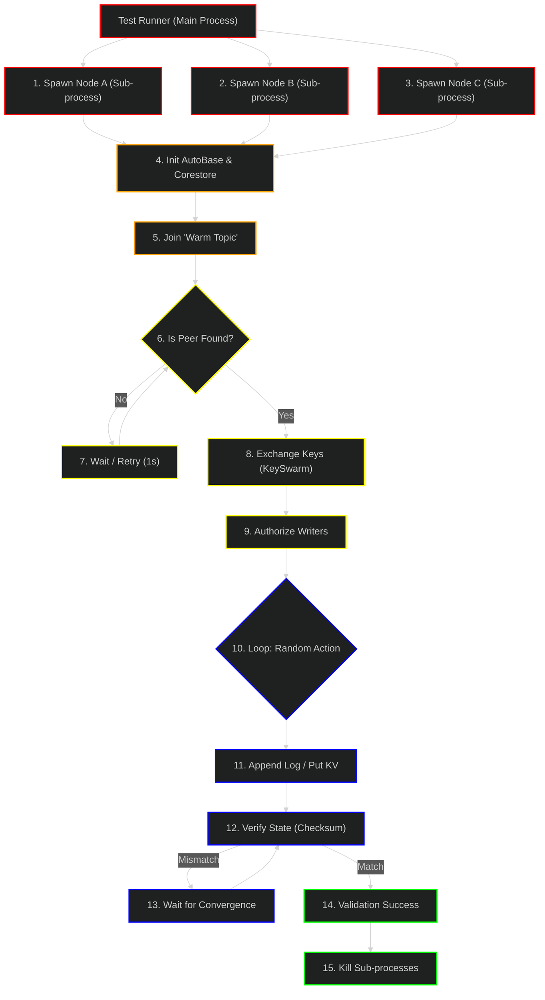

# Swarm Plugin: Test Lifecycle DAG

This DAG illustrates the testing flow for `autokv` and `autolog` in a multi-process environment. It focuses on the **Sub-Process Test Runner** strategy to ensure independent verification.

## Legend
| Layer | Color | Description |
|---|---|---|
| **1. Orchestrator** | █ Red | The main test runner spawning sub-processes. |
| **2. Initialization** | █ Orange | Sub-process startup, config, and topic derivation. |
| **3. Discovery Loop** | █ Yellow | The "Warm Topic" wait loop and peer finding logic. |
| **4. Interaction** | █ Blue | Random reads/writes and state verification. |
| **5. Cleanup** | █ Green | Process termination and artifact removal. |

## Test Flow

