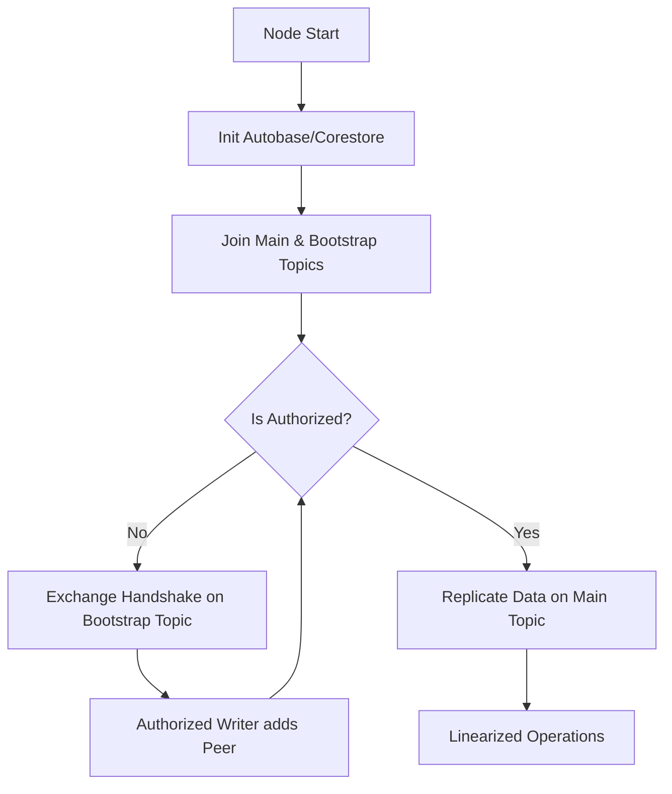

# Swarm Plugin V2: Design Document

This document outlines the architecture of the V2 Swarm Plugin, focusing on reliability, multi-writer synchronization, and DHT performance using a Persistent Dual-Topic pattern.

## 1. Persistent Dual-Topic Architecture

V2 uses two distinct Hyperswarm topics per data structure, both joined persistently by a single swarm instance. This avoids the overhead of ephemeral "discovery swarms" while keeping authorization and replication concerns separate.

### Bootstrap Topic
*   **Topic**: `baseTopic + ":bootstrap"`
*   **Role**: Persistent handshake and authorization layer.
*   **Mechanism**: Peers exchange `WRITER_KEY` and `BASE_KEY` as plain-text lines.
*   **Persistence**: Handshakes are sent periodically (every 5s) to ensure eventually consistent writer lists.

### Data Topic
*   **Topic**: `baseTopic`
*   **Role**: Persistent data replication layer.
*   **Mechanism**: Once authorized, the socket is piped to `store.replicate(stream)` to sync all underlying Hypercores.
*   **Persistence**: Ensures data availability even during peer churn.

## 2. Multi-Writer Lifecycle

The lifecycle of a V2 node follows these verifiable stages:

