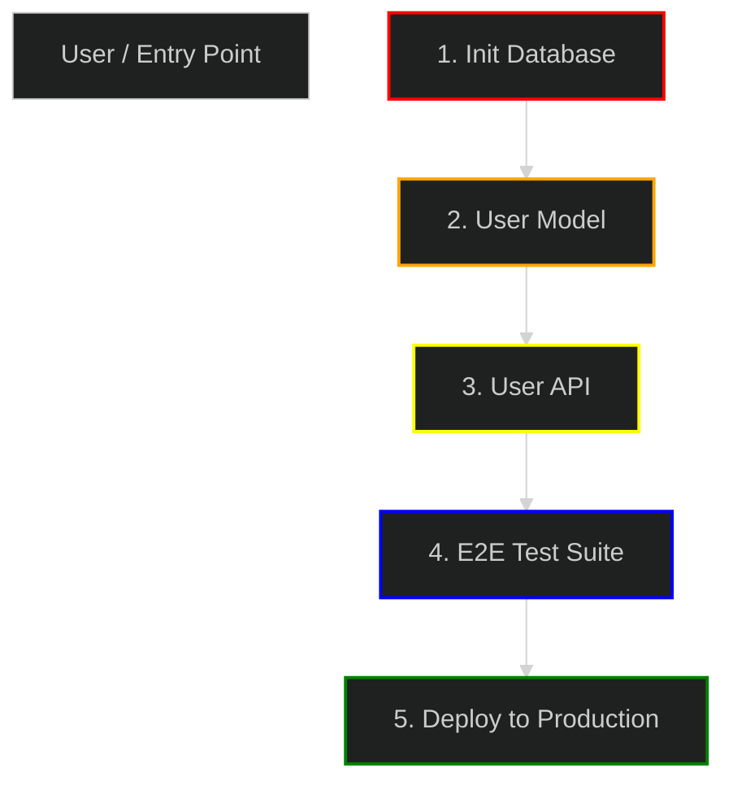
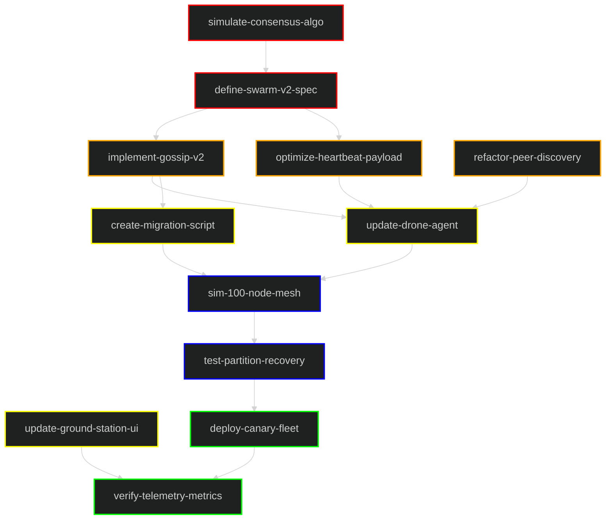

# How to Create a Meaningful DAG

This guide explains how to construct a **Task Dependency Graph (DAG)** that serves as a verifiable plan for architecture and testing.

## The Golden Rule
**A DAG Node must be testable.**

If you cannot write a test case for a node, it does not belong in the DAG. The DAG is not just a picture; it is a map of your test suite.

## DAG Structure Rules

### 1. Layers (The "Why" and "When")
Organize your nodes into strict horizontal layers. This enforces dependency discipline and shows what can be built in parallel.

-   **Layer 1: Foundation** (Red)
    -   *What*: Config, Environment, Basic Setup.
    -   *Test*: Can I load the config? Is the DB reachable?
-   **Layer 2: Core Logic** (Orange)
    -   *What*: Distributed Systems logic, State Machines, Algorithms.
    -   *Test*: Unit tests, State transition tests.
-   **Layer 3: Features / API** (Yellow)
    -   *What*: Public Interfaces, HTTP Routes, CLI Commands.
    -   *Test*: Integration tests, API endpoint tests.
-   **Layer 4: Verification / QA** (Blue)
    -   *What*: End-to-End flows, Load Tests, Security Scans.
    -   *Test*: The test runner outcome itself.
-   **Layer 5: Release** (Green)
    -   *What*: Deployment, Final Sign-off.
    -   *Test*: Deployment verification scripts.

### 2. Node Naming (The "What")
Use structured IDs and identifying names.
-   **Bad**: `A-->B`
-   **Good**: `L1_1["Init DB"] --> L2_1["User Model"]`

### 3. Verification Guidelines (The "Proving It")
Every arrow `-->` implies a contract.
-   **Sync**: If `L1 --> L2`, then `L2` cannot start until `L1` is verifiable.
-   **State**: If a node claims "Data Replicated", there must be a test that asserts `checksum(A) == checksum(B)`.

## Example Template

Copy this pattern for your own DAGs:

## Swarm Example: Protocol Upgrade

This graph illustrates a high-level distributed system workflow for upgrading the P2P swarm protocol across a fleet of drones.

### Legend
| Layer | Color | Description |
|---|---|---|
| **1. Specification** | █ Red | Protocol design and consensus simulation. |
| **2. Implementation** | █ Orange | Core gossip logic and heartbeat optimization. |
| **3. Agent Updates** | █ Yellow | Drone agent code and ground station UI. |
| **4. Simulation** | █ Blue | Large-scale network simulation. |
| **5. Deployment** | █ Green | Fleet-wide rollout and telemetry verification. |

