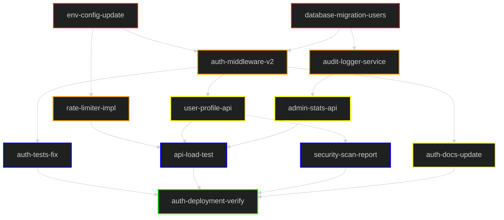

# Task Dependency Graph

The following graph illustrates the 5-layer dependency structure for the "Secure API V2 Rollout".

## Legend
| Layer | Color | Description |
|---|---|---|
| **1. Foundation** | █ Red | Initial setup, config, and database migrations. |
| **2. Core Logic** | █ Orange | Backend services, middleware, and core business logic. |
| **3. Features** | █ Yellow | User-facing APIs and documentation updates. |
| **4. QA** | █ Blue | Testing, security scans, and performance verification. |
| **5. Release** | █ Green | Final deployment verification and sign-off. |

