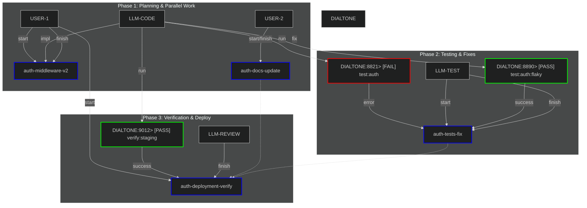

# Task Flow

```mermaid
---
config:
  theme: dark
---
flowchart TD
    %% Global Nodes
    U1[USER-1]
    U2[USER-2]
    LC[LLM-CODE]
    LT[LLM-TEST]
    LR[LLM-REVIEW]
    DT[DIALTONE]

    T1[auth-middleware-v2]
    T2[auth-docs-update]
    T3[auth-tests-fix]
    T4[auth-deployment-verify]

    P1["DIALTONE:8821> [FAIL] test:auth"]
    P2["DIALTONE:8890> [PASS] test:auth:flaky"]
    P3["DIALTONE:9012> [PASS] verify:staging"]

    %% Subgraphs
    subgraph "Phase 1: Planning & Parallel Work"
        U1 -- start --> T1
        U2 -- start/finish --> T2
        LC -- impl --> T1
    end

    subgraph "Phase 2: Testing & Fixes"
        LC -- run --> P1
        P1 -- error --> T3
        LT -- start --> T3
        LC -- fix --> P2
        P2 -- success --> T3
        LT -- finish --> T3
    end

    subgraph "Phase 3: Verification & Deploy"
        U1 -- start --> T4
        LC -- run --> P3
        P3 -- success --> T4
        LR -- finish --> T4
        U1 -- finish --> T1
    end

    %% Dependencies
    T2 -.-> T4
    T3 -.-> T4

    %% Styles
    classDef red stroke:#FF0000,stroke-width:2px;
    classDef green stroke:#00FF00,stroke-width:2px;
    classDef blue stroke:#0000FF,stroke-width:2px;

    class P1 red;
    class P2,P3 green;
    class T1,T2,T3,T4 blue;
```
