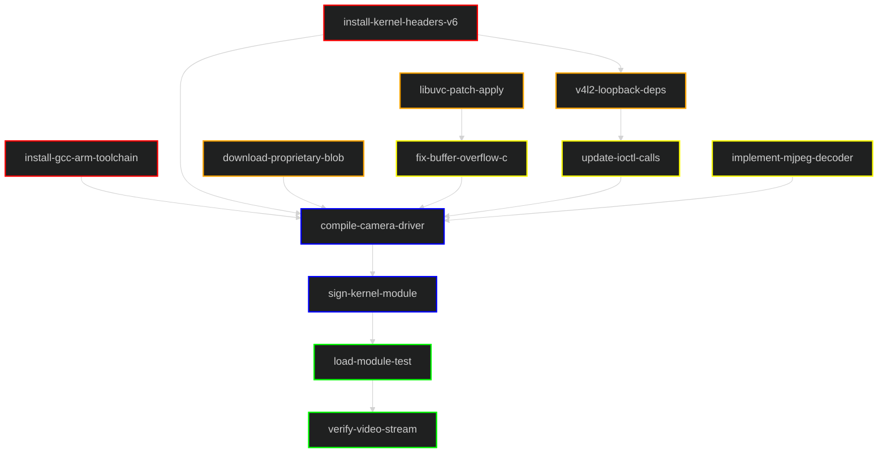

# Task Dependency Graph: Camera Driver Fix

This graph illustrates a low-level C development workflow involving driver compilation, dependency patching, and kernel module signing.

## Legend
| Layer | Color | Description |
|---|---|---|
| **1. Environment** | █ Red | Toolchain setup and headers. |
| **2. Dependencies** | █ Orange | Third-party libraries (libuvc, v4l2) and patching. |
| **3. C Code** | █ Yellow | Driver source code modifications. |
| **4. Build & Comp** | █ Blue | Compilation, linking, and module signing. |
| **5. Verification** | █ Green | Loading modules and stream verification. |

