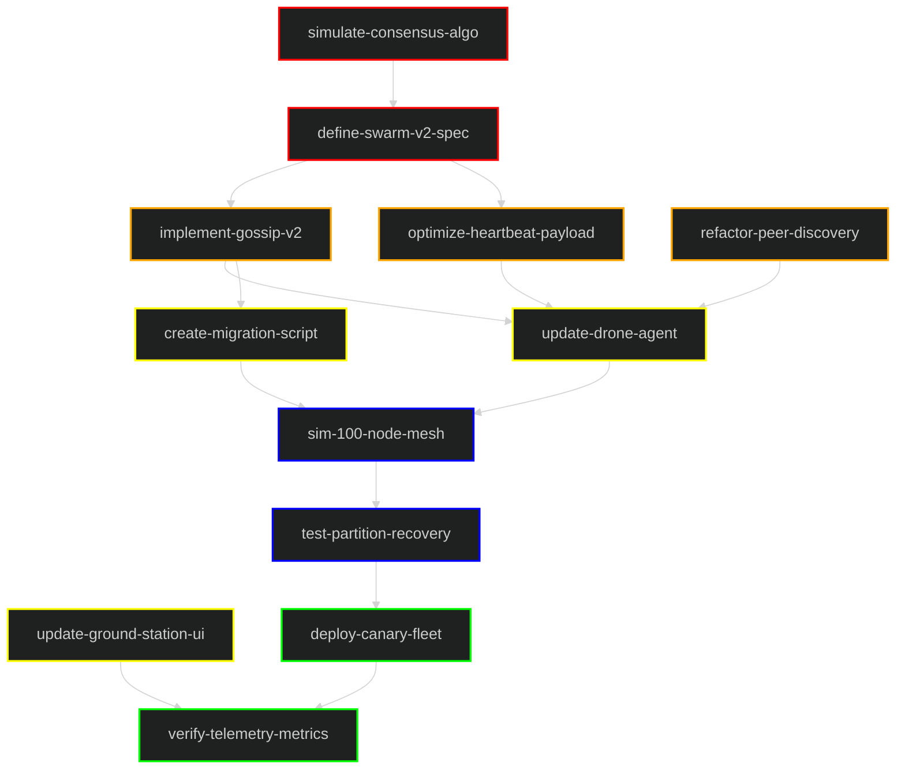

# Task Dependency Graph: Swarm Protocol Upgrade

This graph illustrates a high-level distributed system workflow for upgrading the P2P swarm protocol across a fleet of drones.

## Legend
| Layer | Color | Description |
|---|---|---|
| **1. Specification** | █ Red | Protocol design and consensus simulation. |
| **2. Implementation** | █ Orange | Core gossip logic and heartbeat optimization. |
| **3. Agent Updates** | █ Yellow | Drone agent code and ground station UI. |
| **4. Simulation** | █ Blue | Large-scale network simulation. |
| **5. Deployment** | █ Green | Fleet-wide rollout and telemetry verification. |

