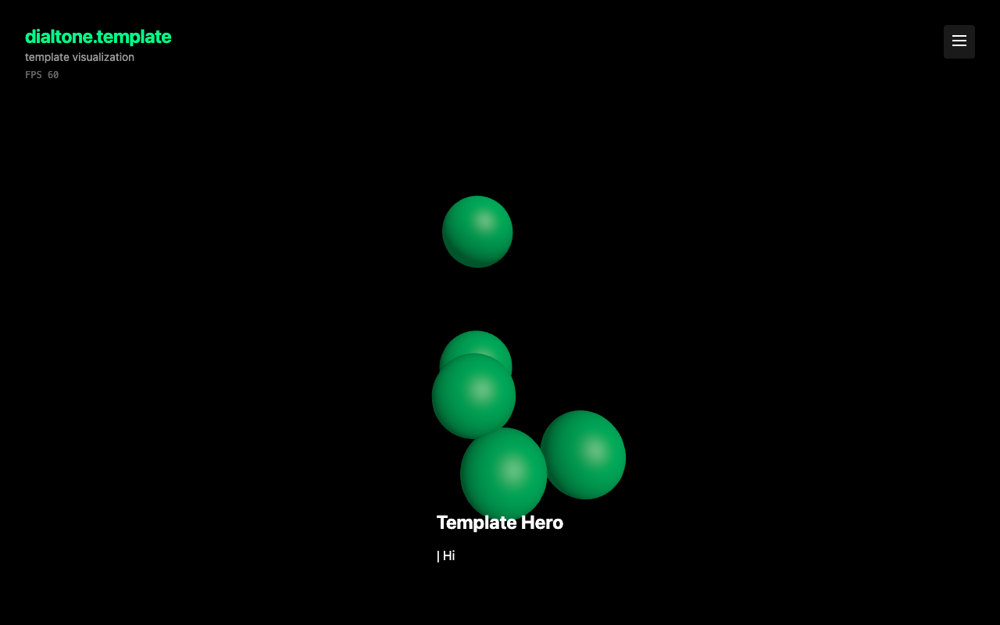
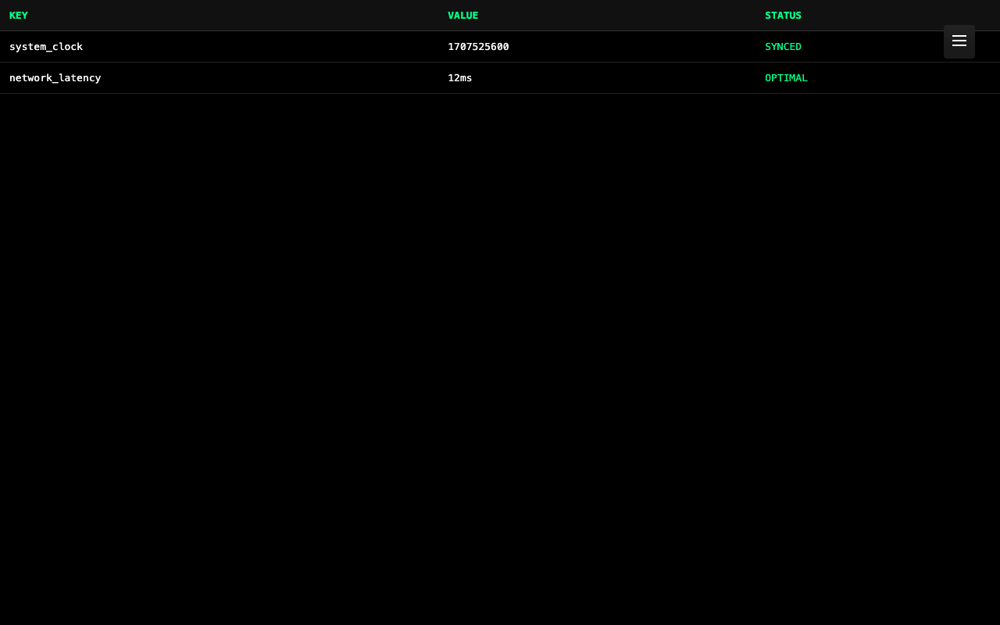
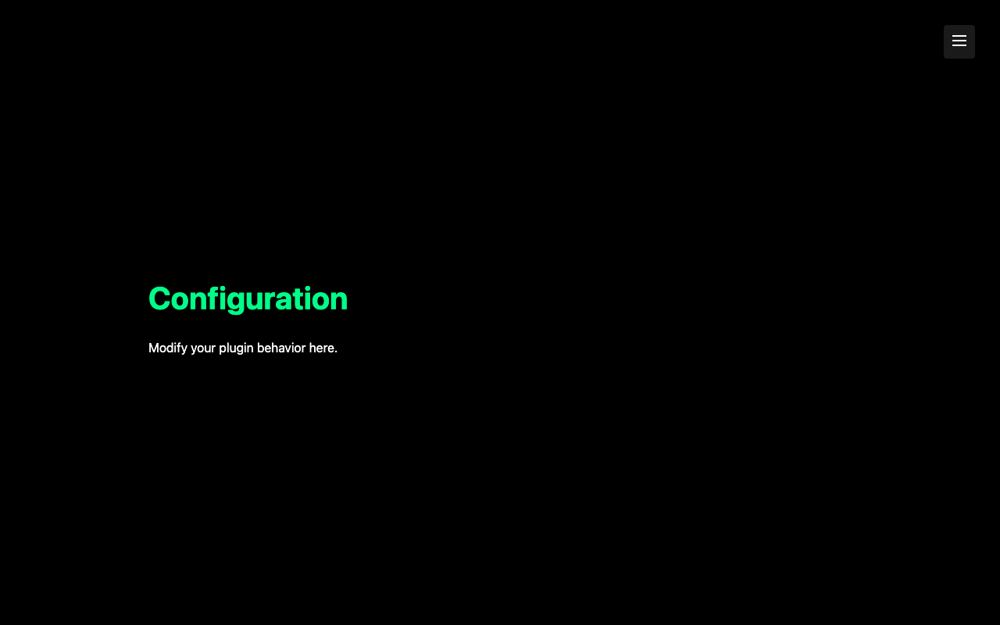
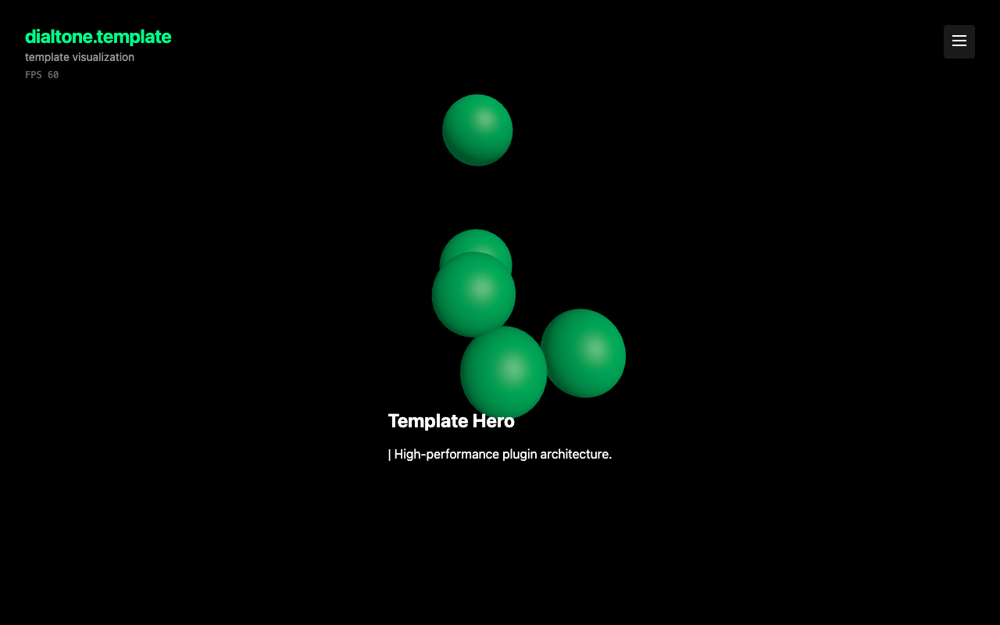

# Template Plugin Smoke Test Report

**Generated at:** Tue, 10 Feb 2026 17:01:05 PST

## 1. Expected Errors (Proof of Life)

| Level | Message | Status |
|---|---|---|
| error | "[PROOFOFLIFE] Intentional Browser Test Error" | ✅ CAPTURED |
| error | [PROOFOFLIFE] Intentional Go Test Error | ✅ CAPTURED |

---

## 2. Real Errors & Warnings

✅ No actual issues detected.

---

## 3. Preflight: Environment & Build

### Install: ✅ PASSED

```text
bun install v1.2.22 (6bafe260)

Checked 20 installs across 67 packages (no changes) [32.00ms]
```

### Lint: ✅ PASSED

```text
$ tsc --noEmit
```

### Build: ✅ PASSED

```text
$ vite build
vite v5.4.21 building for production...
transforming...
✓ 13 modules transformed.
rendering chunks...
computing gzip size...
dist/index.html                   3.68 kB │ gzip:   1.24 kB
dist/assets/index-D7bkFwZf.css    2.27 kB │ gzip:   0.88 kB
dist/assets/index-kxM_pO4c.js   474.07 kB │ gzip: 120.40 kB
✓ built in 611ms
```

---

## 4. UI & Interactivity

### Lifecycle Verification Summary

| Event | Status | Description |
|---|---|---|
| LOADING | ❌ MISSING | Section chunk fetching initiated |
| LOADED | ❌ MISSING | Section code loaded into memory |
| START | ❌ MISSING | Section component initialized |
| RESUME / AWAKE | ❌ MISSING | Animation loop active and visible |
| PAUSE / SLEEP | ❌ MISSING | Animation loop suspended when off-screen |


### 1. Hero Section Validation: PASS ✅

**Console Logs:**
```text
[error] "[PROOFOFLIFE] Intentional Browser Test Error"
```



---

### 2. Documentation Section Validation: PASS ✅


---

### 3. Table Section Validation: PASS ✅

**Console Logs:**
```text
[log] "Table mounted"
```



---

### 4. Verify Header Hidden on Table: FAIL ❌

**Error:** `element .header-title should be hidden (last display: block)`


---

### 5. Settings Section Validation: PASS ✅

**Console Logs:**
```text
[log] "Settings mounted"
```



---

### 6. Return Home: PASS ✅



---
