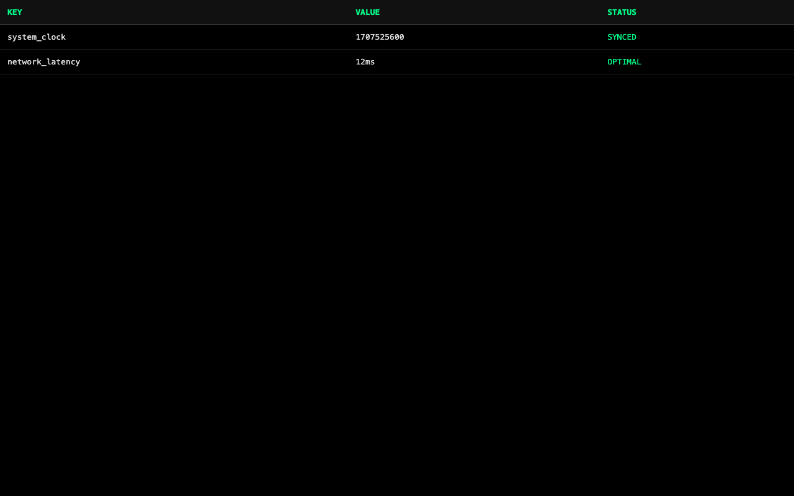

# Template Plugin Smoke Test Report

**Generated at:** Wed, 11 Feb 2026 11:03:32 PST

## 1. Preflight: Go + TypeScript/JavaScript Checks

### Go Format: ✅ PASSED

```text
[dir] /Users/tim/code/dialtone/src/plugins/template/src_v2
[cmd] go fmt ./...
[elapsed] 50ms
```

### Go Lint: ✅ PASSED

```text
[dir] /Users/tim/code/dialtone/src/plugins/template/src_v2
[cmd] go vet ./...
[elapsed] 186ms
```

### Go Build: ✅ PASSED

```text
[dir] /Users/tim/code/dialtone/src/plugins/template/src_v2
[cmd] go build ./...
[elapsed] 1.006s
```

### UI Install: ✅ PASSED

```text
[dir] /Users/tim/code/dialtone
[cmd] /Users/tim/code/dialtone/dialtone.sh bun exec --cwd /Users/tim/code/dialtone/src/plugins/template/src_v2/ui install --force
[elapsed] 946ms

bun install v1.3.9 (cf6cdbbb)
Saved lockfile

+ @types/three@0.170.0
+ three@0.170.0
+ typescript@5.9.3
+ vite@5.4.21

20 packages installed [78.00ms]
```

### UI TypeScript Lint: ✅ PASSED

```text
[dir] /Users/tim/code/dialtone
[cmd] /Users/tim/code/dialtone/dialtone.sh bun exec --cwd /Users/tim/code/dialtone/src/plugins/template/src_v2/ui run lint
[elapsed] 933ms

$ tsc --noEmit
```

### UI Build: ✅ PASSED

```text
[dir] /Users/tim/code/dialtone
[cmd] /Users/tim/code/dialtone/dialtone.sh bun exec --cwd /Users/tim/code/dialtone/src/plugins/template/src_v2/ui run build
[elapsed] 1.534s

$ vite build
vite v5.4.21 building for production...
transforming...
✓ 18 modules transformed.
rendering chunks...
computing gzip size...
dist/index.html                   2.93 kB │ gzip:   1.05 kB
dist/assets/index-QymdLqyU.css    5.42 kB │ gzip:   1.74 kB
dist/assets/index-C7Zm7Aig.js     0.41 kB │ gzip:   0.29 kB
dist/assets/index-BZGnm6Y2.js     0.42 kB │ gzip:   0.29 kB
dist/assets/Typing-BI9S19x9.js    0.56 kB │ gzip:   0.34 kB
dist/assets/index-BfHV85E1.js     0.66 kB │ gzip:   0.43 kB
dist/assets/index-AdF7upE3.js    12.35 kB │ gzip:   4.17 kB
dist/assets/index-CjtBLtEp.js   468.29 kB │ gzip: 118.39 kB
✓ built in 477ms
```

### Source Prettier Format (JS/TS): ✅ PASSED

```text
[dir] /Users/tim/code/dialtone/src/plugins/template/src_v2
[cmd] ./dialtone.sh bun exec x prettier --write <files>

no JS/TS files found
```

### Source Prettier Lint (JS/TS): ✅ PASSED

```text
[dir] /Users/tim/code/dialtone/src/plugins/template/src_v2
[cmd] ./dialtone.sh bun exec x prettier --check <files>

no JS/TS files found
```

### Go Run: ✅ PASSED

```text
[dir] /Users/tim/code/dialtone/src/plugins/template/src_v2
[cmd] go run cmd/main.go

Template Server starting on http://localhost:8080

[probe-warning] timed out waiting for Go Run process shutdown
[probe-ready] port 8080 became reachable in 5.532s
```

### UI Run: ✅ PASSED

```text
[dir] /Users/tim/code/dialtone
[cmd] /Users/tim/code/dialtone/dialtone.sh bun exec --cwd /Users/tim/code/dialtone/src/plugins/template/src_v2/ui run dev --host 127.0.0.1 --port 63937

$ vite --host "127.0.0.1" --port "63937"
Re-optimizing dependencies because vite config has changed

  VITE v5.4.21  ready in 90 ms

  ➜  Local:   http://127.0.0.1:63937/

[probe-warning] timed out waiting for UI Run process shutdown
[probe-ready] port 63937 became reachable in 5.545s
```

---

## 2. Expected Errors (Proof of Life)

| Level | Message | Status |
|---|---|---|
| error | "[PROOFOFLIFE] Intentional Browser Test Error" | ✅ CAPTURED |
| error | [PROOFOFLIFE] Intentional Go Test Error | ✅ CAPTURED |

---

## 3. Real Errors & Warnings

### [error]
```text
"[SectionManager][INVARIANT][interval] more than one section marked visible: table, settings"
```
### [error]
```text
"[SectionManager][INVARIANT][interval] more than one section resumed: table, settings"
```

---

## 4. UI & Interactivity

### Lifecycle Verification Summary

| Event | Status | Description |
|---|---|---|
| LOADING | ✅ CAPTURED | Section chunk fetching initiated |
| LOADED | ✅ CAPTURED | Section code loaded into memory |
| START | ✅ CAPTURED | Section component initialized |
| RESUME / AWAKE | ✅ CAPTURED | Animation loop active and visible |
| PAUSE / SLEEP | ✅ CAPTURED | Animation loop suspended when off-screen |


### 1. Hero Section Validation: PASS ✅

**Console Logs:**
```text
[log] "[SectionManager] 🧭 INITIAL LOAD #home"
[log] "[SectionManager] 📦 LOADING #home..."
[error] "[PROOFOFLIFE] Intentional Browser Test Error"
[log] "[SectionManager] 🧭 NAVIGATE TO #home"
[log] "[SectionManager] 📦 LOADING #docs..."
[log] "[SectionManager] ✅ LOADED #home (40ms)"
[log] "[SectionManager] ✨ START #home"
[log] "[hero-viz] SLEEP"
[log] "[SectionManager] 🚀 RESUME #home"
[log] "[hero-viz] AWAKE"
[log] "[SectionManager] ✅ LOADED #docs (31ms)"
[log] "[SectionManager] ✨ START #docs"
[log] "[docs-viz] SLEEP"
```


---

### 2. Documentation Section Validation: PASS ✅

**Console Logs:**
```text
[log] "[SectionManager] 🧭 NAVIGATING TO #docs"
[log] "[SectionManager] 🧭 NAVIGATING TO #docs"
[log] "[SectionManager] 🧭 NAVIGATE AWAY #home"
[log] "[SectionManager] 🧭 NAVIGATE TO #docs"
[log] "[SectionManager] 📦 LOADING #table..."
[log] "[SectionManager] 🚀 RESUME #docs"
[log] "[docs-viz] AWAKE"
[log] "[SectionManager] ✅ LOADED #table (1ms)"
[log] "[SectionManager] ✨ START #table"
[log] "[table-viz] SLEEP"
[log] "[SectionManager] 💤 PAUSE #home"
[log] "[hero-viz] SLEEP"
```


---

### 3. Table Section Validation: PASS ✅

**Console Logs:**
```text
[log] "[SectionManager] 🧭 NAVIGATING TO #table"
[log] "[SectionManager] 🧭 NAVIGATING TO #table"
[log] "[SectionManager] 🧭 NAVIGATE AWAY #docs"
[log] "[SectionManager] 🧭 NAVIGATE TO #table"
[log] "[SectionManager] 📦 LOADING #settings..."
[log] "[SectionManager] 🚀 RESUME #table"
[log] "[table-viz] AWAKE"
[log] "[SectionManager] ✅ LOADED #settings (1ms)"
[log] "[SectionManager] ✨ START #settings"
[log] "[settings-viz] SLEEP"
[log] "[SectionManager] 💤 PAUSE #docs"
[log] "[docs-viz] SLEEP"
```



---

### 4. Verify Header Hidden on Table: PASS ✅


---

### 5. Settings Section Validation: PASS ✅

**Console Logs:**
```text
[log] "[SectionManager] 🧭 NAVIGATING TO #settings"
[log] "[SectionManager] 🧭 NAVIGATING TO #settings"
[log] "[SectionManager] 🧭 NAVIGATE AWAY #table"
[log] "[SectionManager] 🧭 NAVIGATE TO #settings"
[log] "[SectionManager] 🚀 RESUME #settings"
[log] "[settings-viz] AWAKE"
[error] "[SectionManager][INVARIANT][interval] more than one section marked visible: table, settings"
[error] "[SectionManager][INVARIANT][interval] more than one section resumed: table, settings"
[log] "[SectionManager] 💤 PAUSE #table"
[log] "[table-viz] SLEEP"
```


---

### 6. Return Home: PASS ✅

**Console Logs:**
```text
[log] "[SectionManager] 🧭 NAVIGATING TO #home"
[log] "[SectionManager] 🧭 NAVIGATING TO #home"
[log] "[SectionManager] 🧭 NAVIGATE AWAY #settings"
[log] "[SectionManager] 🧭 NAVIGATE TO #table"
[log] "[SectionManager] 🚀 RESUME #table"
[log] "[table-viz] AWAKE"
[log] "[SectionManager] 💤 PAUSE #settings"
[log] "[settings-viz] SLEEP"
[log] "[SectionManager] 🧭 NAVIGATE AWAY #table"
[log] "[SectionManager] 🧭 NAVIGATE TO #docs"
[log] "[SectionManager] 🚀 RESUME #docs"
[log] "[docs-viz] AWAKE"
[log] "[SectionManager] 💤 PAUSE #table"
[log] "[table-viz] SLEEP"
[log] "[SectionManager] 🧭 NAVIGATE AWAY #docs"
[log] "[SectionManager] 🧭 NAVIGATE TO #home"
[log] "[SectionManager] 🚀 RESUME #home"
[log] "[hero-viz] AWAKE"
[log] "[SectionManager] 💤 PAUSE #docs"
[log] "[docs-viz] SLEEP"
```


---
