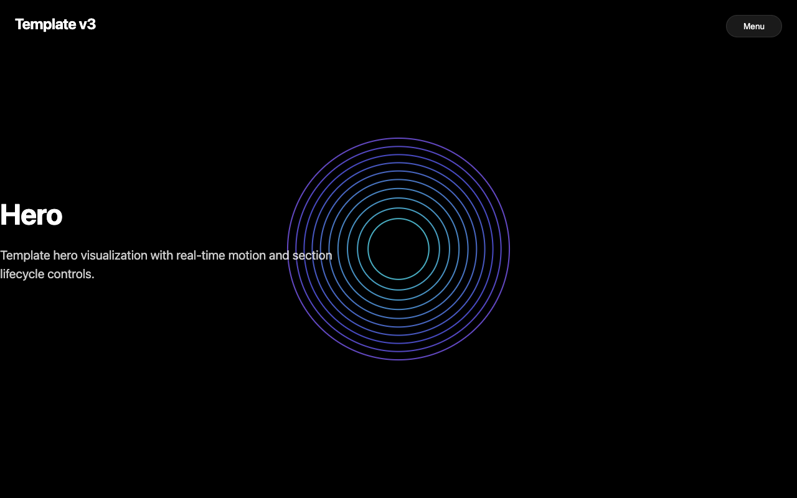
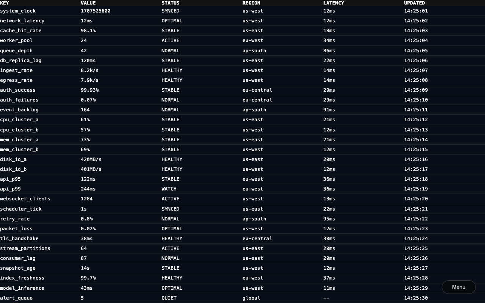
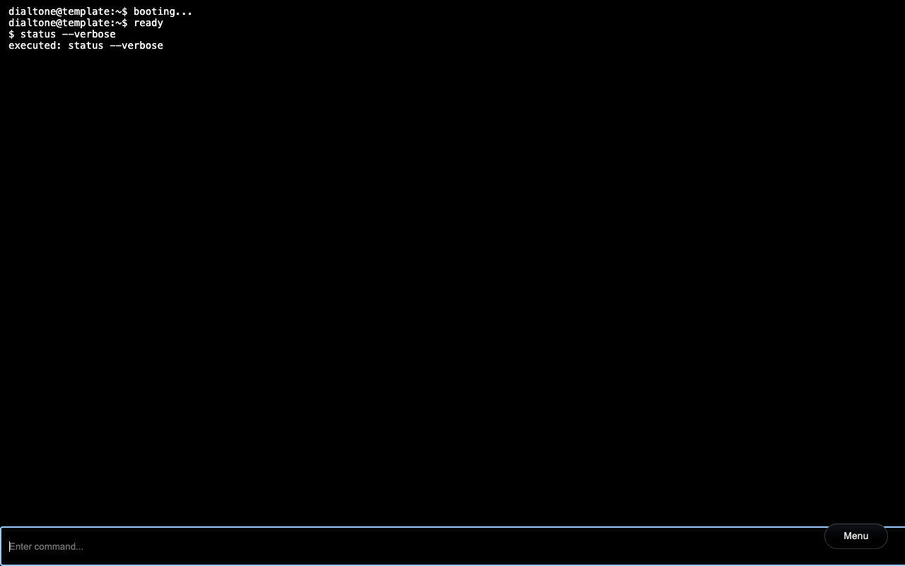
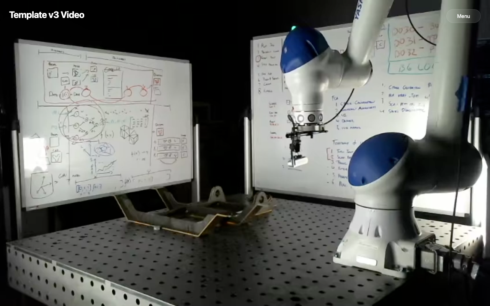

# Template Plugin v3 Test Report

**Generated at:** Fri, 13 Feb 2026 11:24:08 -0800
**Version:** `src_v3`
**Runner:** `test_v2`
**Status:** ✅ PASS
**Total Time:** `12.796s`

## Test Steps

| Step | Result | Duration |
|---|---|---|
| 01 Preflight (Go/UI) | ✅ PASS | `5.651s` |
| 02 Go Run | ✅ PASS | `626ms` |
| 03 UI Run | ✅ PASS | `754ms` |
| 04 Expected Errors (Proof of Life) | ✅ PASS | `1.328s` |
| 05 Dev Server Running (latest UI) | ✅ PASS | `774ms` |
| 06 Hero Section Validation | ✅ PASS | `61ms` |
| 07 Docs Section Validation | ✅ PASS | `313ms` |
| 08 Table Section Validation | ✅ PASS | `336ms` |
| 09 Three Section Validation | ✅ PASS | `338ms` |
| 10 Xterm Section Validation | ✅ PASS | `315ms` |
| 11 Video Section Validation | ✅ PASS | `413ms` |
| 12 Lifecycle / Invariants | ✅ PASS | `1.681s` |
| 13 Cleanup Verification | ✅ PASS | `204ms` |

## Step Logs

### 01 Preflight (Go/UI)

```text
result: PASS
duration: 5.651s
```

#### Runner Output

```text
[T+0000] [TEST] RUN   01 Preflight (Go/UI)
[T+0000] >> [TEMPLATE] Fmt: src_v3
[T+0000] [2026-02-13T11:23:55.889-08:00 | INFO | go.go:RunGo:33] Running: go [fmt ./src/plugins/template/src_v3/...]
[T+0000] >> [TEMPLATE] Vet: src_v3
[T+0001] [2026-02-13T11:23:56.498-08:00 | INFO | go.go:RunGo:33] Running: go [vet ./src/plugins/template/src_v3/...]
[T+0001] >> [TEMPLATE] Go Build: src_v3
[T+0001] [2026-02-13T11:23:57.201-08:00 | INFO | go.go:RunGo:33] Running: go [build ./src/plugins/template/src_v3/...]
[T+0003] >> [TEMPLATE] Lint: src_v3
[T+0003] $ tsc --noEmit
[T+0004] >> [TEMPLATE] Format: src_v3
[T+0004] $ echo format-ok
[T+0004] format-ok
[T+0004] >> [TEMPLATE] Build: src_v3
[T+0004] $ vite build
[T+0004] vite v5.4.21 building for production...
[T+0004] transforming...
[T+0005] ✓ 22 modules transformed.
[T+0005] rendering chunks...
[T+0005] computing gzip size...
[T+0005] dist/index.html                   5.75 kB │ gzip:   1.46 kB
[T+0005] dist/assets/index-6GBZ9nXN.css    5.24 kB │ gzip:   1.92 kB
[T+0005] dist/assets/index-BvYeilGj.css    5.65 kB │ gzip:   1.70 kB
[T+0005] dist/assets/index-Dbd9b_e5.js     0.08 kB │ gzip:   0.10 kB
[T+0005] dist/assets/index-CG3KstkX.js     0.24 kB │ gzip:   0.20 kB
[T+0005] dist/assets/index-CslqoKFv.js     0.81 kB │ gzip:   0.37 kB
[T+0005] dist/assets/index-BTTHdoMO.js     1.17 kB │ gzip:   0.65 kB
[T+0005] dist/assets/index-BMvtsZ9G.js     9.95 kB │ gzip:   3.22 kB
[T+0005] dist/assets/index-BFRwSQ3x.js   334.99 kB │ gzip:  85.16 kB
[T+0005] dist/assets/index-BFuguuOd.js   488.28 kB │ gzip: 124.04 kB
[T+0005] ✓ built in 672ms
```

### 02 Go Run

```text
result: PASS
duration: 626ms
```

#### Runner Output

```text
[T+0005] [TEST] RUN   02 Go Run
[T+0005] >> [TEMPLATE] Serve: src_v3
[T+0006] [2026-02-13T11:24:01.592-08:00 | INFO | go.go:RunGo:33] Running: go [run src/plugins/template/src_v3/cmd/main.go]
[T+0006] Template Server starting on http://localhost:8080
```

### 03 UI Run

```text
result: PASS
duration: 754ms
```

#### Runner Output

```text
[T+0006] [TEST] RUN   03 UI Run
[T+0006] >> [TEMPLATE] UI Run: src_v3
[T+0006] $ vite --host "127.0.0.1" --port "64240"
[T+0006] 
[T+0006]   VITE v5.4.21  ready in 82 ms
[T+0006] 
[T+0006]   ➜  Local:   http://127.0.0.1:64240/
```

### 04 Expected Errors (Proof of Life)

```text
result: PASS
duration: 1.328s
```

#### Runner Output

```text
[T+0007] [TEST] RUN   04 Expected Errors (Proof of Life)
[T+0007] [2026-02-13T11:24:02.427-08:00 | INFO | chrome.go:StartSession:179] DEBUG: Launching Chrome: /Applications/Google Chrome.app/Contents/MacOS/Google Chrome [--remote-debugging-port=0 --remote-debugging-address=127.0.0.1 --remote-allow-origins=* --no-first-run --no-default-browser-check --user-data-dir=/Users/tim/code/dialtone/.chrome_data/dialtone-chrome-test-port-64245 --new-window --dialtone-origin=true --dialtone-role=test --headless=new]
[T+0008] [BROWSER] [log] [SectionManager] INITIAL LOAD #hero
[T+0008] [BROWSER] [log] [SectionManager] NAVIGATING TO #hero
[T+0008] [BROWSER] [log] [SectionManager] LOADING #hero
[T+0008] [BROWSER] [log] [SectionManager] LOADED #hero
[T+0008] [BROWSER] [log] [SectionManager] START #hero
[T+0008] [BROWSER] [log] [SectionManager] NAVIGATE TO #hero
[T+0008] [BROWSER] [log] [SectionManager] RESUME #hero
[T+0008] [BROWSER] [error] [PROOFOFLIFE] Intentional Browser Test Error
```

#### Browser Logs

```text
[T+0008] [log] [SectionManager] INITIAL LOAD #hero
[T+0008] [log] [SectionManager] NAVIGATING TO #hero
[T+0008] [log] [SectionManager] LOADING #hero
[T+0008] [log] [SectionManager] LOADED #hero
[T+0008] [log] [SectionManager] START #hero
[T+0008] [log] [SectionManager] NAVIGATE TO #hero
[T+0008] [log] [SectionManager] RESUME #hero
[T+0008] [error] [PROOFOFLIFE] Intentional Browser Test Error
```

#### Browser Errors

```text
[T+0008] [error] [PROOFOFLIFE] Intentional Browser Test Error
```

### 05 Dev Server Running (latest UI)

```text
result: PASS
duration: 774ms
```

#### Runner Output

```text
[T+0008] [TEST] RUN   05 Dev Server Running (latest UI)
[T+0008] >> [TEMPLATE] UI Run: src_v3
[T+0008] $ vite --host "127.0.0.1" --port "64271"
[T+0008] 
[T+0008]   VITE v5.4.21  ready in 84 ms
[T+0008] 
[T+0008]   ➜  Local:   http://127.0.0.1:64271/
```

### 06 Hero Section Validation

```text
result: PASS
duration: 61ms
section: hero
```

#### Runner Output

```text
[T+0009] [TEST] RUN   06 Hero Section Validation
```



### 07 Docs Section Validation

```text
result: PASS
duration: 313ms
section: docs
```

#### Runner Output

```text
[T+0009] [TEST] RUN   07 Docs Section Validation
```

#### Browser Logs

```text
[T+0009] [log] [SectionManager] NAVIGATING TO #docs
[T+0009] [log] [SectionManager] LOADING #docs
[T+0009] [log] [SectionManager] LOADED #docs
[T+0009] [log] [SectionManager] START #docs
[T+0009] [log] [SectionManager] NAVIGATE TO #docs
[T+0009] [log] [SectionManager] RESUME #docs
```


### 08 Table Section Validation

```text
result: PASS
duration: 336ms
section: table
```

#### Runner Output

```text
[T+0009] [TEST] RUN   08 Table Section Validation
```

#### Browser Logs

```text
[T+0009] [log] [SectionManager] NAVIGATING TO #table
[T+0009] [log] [SectionManager] LOADING #table
[T+0009] [log] [SectionManager] LOADED #table
[T+0009] [log] [SectionManager] START #table
[T+0009] [log] [SectionManager] NAVIGATE TO #table
[T+0009] [log] [SectionManager] RESUME #table
```



### 09 Three Section Validation

```text
result: PASS
duration: 338ms
section: three
```

#### Runner Output

```text
[T+0009] [TEST] RUN   09 Three Section Validation
```

#### Browser Logs

```text
[T+0009] [log] [SectionManager] NAVIGATING TO #three
[T+0009] [log] [SectionManager] LOADING #three
[T+0009] [log] [SectionManager] LOADED #three
[T+0009] [log] [SectionManager] START #three
[T+0009] [log] [SectionManager] NAVIGATE TO #three
[T+0009] [log] [SectionManager] RESUME #three
```


### 10 Xterm Section Validation

```text
result: PASS
duration: 315ms
section: xterm
```

#### Runner Output

```text
[T+0010] [TEST] RUN   10 Xterm Section Validation
```

#### Browser Logs

```text
[T+0010] [log] [SectionManager] NAVIGATING TO #xterm
[T+0010] [log] [SectionManager] LOADING #xterm
[T+0010] [log] [SectionManager] LOADED #xterm
[T+0010] [log] [SectionManager] START #xterm
[T+0010] [log] [SectionManager] NAVIGATE TO #xterm
[T+0010] [log] [SectionManager] RESUME #xterm
```



### 11 Video Section Validation

```text
result: PASS
duration: 413ms
section: video
```

#### Runner Output

```text
[T+0010] [TEST] RUN   11 Video Section Validation
```

#### Browser Logs

```text
[T+0010] [log] [SectionManager] NAVIGATING TO #video
[T+0010] [log] [SectionManager] LOADING #video
[T+0010] [log] [SectionManager] LOADED #video
[T+0010] [log] [SectionManager] START #video
[T+0010] [log] [SectionManager] NAVIGATE TO #video
[T+0010] [log] [SectionManager] RESUME #video
```



### 12 Lifecycle / Invariants

```text
result: PASS
duration: 1.681s
```

#### Runner Output

```text
[T+0010] [TEST] RUN   12 Lifecycle / Invariants
```

#### Browser Logs

```text
[T+0010] [log] [SectionManager] NAVIGATING TO #hero
[T+0010] [log] [SectionManager] NAVIGATE AWAY #video
[T+0010] [log] [SectionManager] PAUSE #video
[T+0010] [log] [SectionManager] NAVIGATE TO #hero
[T+0010] [log] [SectionManager] RESUME #hero
[T+0011] [log] [SectionManager] NAVIGATING TO #docs
[T+0011] [log] [SectionManager] NAVIGATE AWAY #hero
[T+0011] [log] [SectionManager] PAUSE #hero
[T+0011] [log] [SectionManager] NAVIGATE TO #docs
[T+0011] [log] [SectionManager] RESUME #docs
[T+0011] [log] [SectionManager] NAVIGATING TO #table
[T+0011] [log] [SectionManager] NAVIGATE AWAY #docs
[T+0011] [log] [SectionManager] PAUSE #docs
[T+0011] [log] [SectionManager] NAVIGATE TO #table
[T+0011] [log] [SectionManager] RESUME #table
[T+0011] [log] [SectionManager] NAVIGATING TO #three
[T+0011] [log] [SectionManager] NAVIGATE AWAY #table
[T+0011] [log] [SectionManager] PAUSE #table
[T+0011] [log] [SectionManager] NAVIGATE TO #three
[T+0011] [log] [SectionManager] RESUME #three
[T+0012] [log] [SectionManager] NAVIGATING TO #xterm
[T+0012] [log] [SectionManager] NAVIGATE AWAY #three
[T+0012] [log] [SectionManager] PAUSE #three
[T+0012] [log] [SectionManager] NAVIGATE TO #xterm
[T+0012] [log] [SectionManager] RESUME #xterm
[T+0012] [log] [SectionManager] NAVIGATING TO #video
[T+0012] [log] [SectionManager] NAVIGATE AWAY #xterm
[T+0012] [log] [SectionManager] PAUSE #xterm
[T+0012] [log] [SectionManager] NAVIGATE TO #video
[T+0012] [log] [SectionManager] RESUME #video
```

### 13 Cleanup Verification

```text
result: PASS
duration: 204ms
```

#### Runner Output

```text
[T+0012] [TEST] RUN   13 Cleanup Verification
[T+0012] Cleaning up stale process on port 8080 (PID: 92852)...
```

## Artifacts

- `test.log`
- `error.log`
- `screenshots/test_step_1.png`
- `screenshots/test_step_2.png`
- `screenshots/test_step_3.png`
- `screenshots/test_step_4.png`
- `screenshots/test_step_5.png`
- `screenshots/test_step_6.png`
