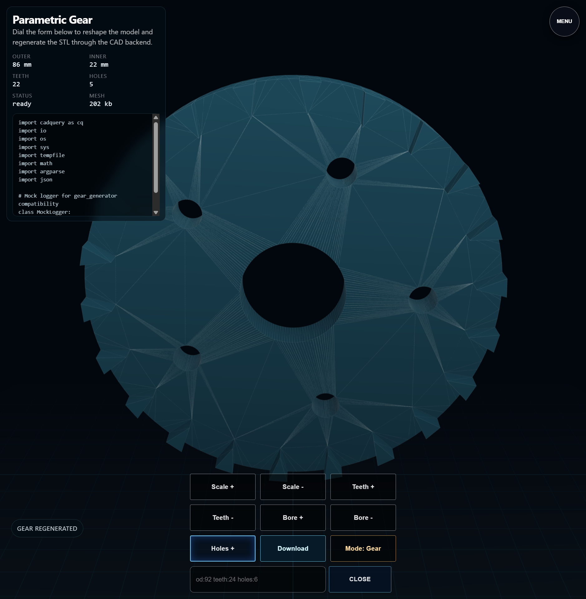

# Test Report: cad-src-v1

- **Date**: Wed, 18 Mar 2026 14:54:05 PDT
- **Total Duration**: 9.25849658s

## Summary

- **Steps**: 1 / 1 passed
- **Status**: PASSED

## Details

### 1. ✅ cad-ui-browser-smoke-src-v1

- **Duration**: 9.250423706s
- **Report**: CAD UI loaded in chrome src_v3 with no browser exceptions and STL model reached ready state

#### Logs

```text
INFO: cad browser smoke server ready at http://127.0.0.1:43923
WARN: ERROR_PING: skipped for chrome src_v3 NATS-managed browser session
INFO: report: CAD UI loaded in chrome src_v3 with no browser exceptions and STL model reached ready state
PASS: [TEST][PASS] [STEP:cad-ui-browser-smoke-src-v1] report: CAD UI loaded in chrome src_v3 with no browser exceptions and STL model reached ready state
```

#### Browser Logs

```text
INFO: CONSOLE:log: "[SectionManager] NAVIGATING TO #cad-three-stage"
INFO: CONSOLE:log: "[SectionManager] LOADING #cad-three-stage"
INFO: CONSOLE:log: "[SectionManager] ctl.load() RESOLVED for #cad-three-stage"
INFO: CONSOLE:log: "[SectionManager] LOADED #cad-three-stage"
INFO: CONSOLE:log: "[SectionManager] START #cad-three-stage"
INFO: CONSOLE:log: "[SectionManager] Setting data-ready=true on #cad-three-stage"
INFO: CONSOLE:log: "[SectionManager] NAVIGATE TO #cad-three-stage"
INFO: CONSOLE:log: "[SectionManager] RESUME #cad-three-stage"
INFO: CONSOLE:log: "cad-model-ready:1"
INFO: CONSOLE:log: "cad-model-ready:2"
INFO: CONSOLE:log: "cad-model-ready:3"
INFO: CONSOLE:log: "cad-model-ready:4"
INFO: CONSOLE:log: "cad-model-ready:5"
```

#### Screenshots




---

<!-- DIALTONE_CHROME_REPORT_START -->

## Chrome Report

- hostnode: `legion`
- chrome_count: `4`

| PID | ROLE | PORT |
| --- | --- | --- |
| 4716 | `unlabeled` | 19464 |
| 7768 | `cad-smoke` | 19464 |
| 15112 | `unlabeled` | 19464 |
| 23192 | `unlabeled` | 19464 |

<!-- DIALTONE_CHROME_REPORT_END -->
