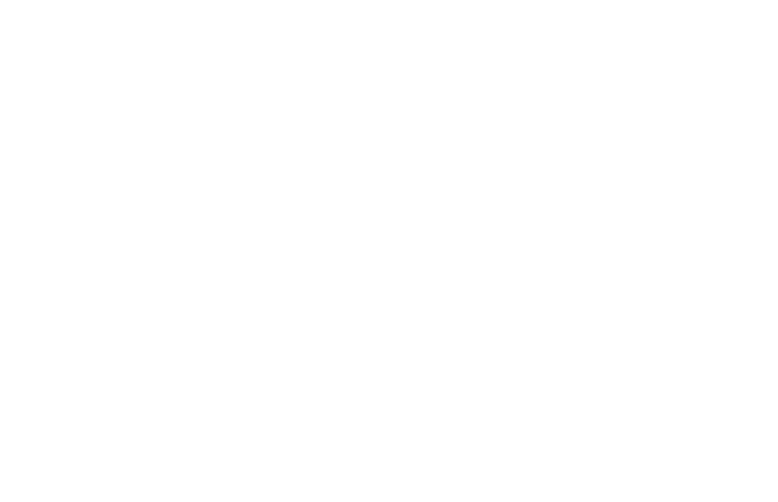

# Test Report: src-v1-self-check

- **Date**: Sat, 28 Feb 2026 09:05:54 PST
- **Total Duration**: 32.216219171s

## Summary

- **Steps**: 10 / 10 passed
- **Status**: PASSED

## Details

### 1. ✅ ctx-logging-and-waits

- **Duration**: 4.67781ms
- **Report**: StepContext log methods + wait helpers verified

#### Logs

```text
INFO: ctx info message
WARN: ctx warn message
INFO: ctx info format check
WARN: ctx warn format check
INFO: report: StepContext log methods + wait helpers verified
PASS: [TEST][PASS] [STEP:ctx-logging-and-waits] report: StepContext log methods + wait helpers verified
```

#### Errors

```text
ERROR: ctx error message
ERROR: ctx error message
ERROR: ctx error format check
```

#### Browser Logs

```text
<empty>
```

---

### 2. ✅ ctx-subjects-populated

- **Duration**: 202.578µs
- **Report**: StepContext subjects available for plugin tests

#### Logs

```text
INFO: report: StepContext subjects available for plugin tests
PASS: [TEST][PASS] [STEP:ctx-subjects-populated] report: StepContext subjects available for plugin tests
```

#### Browser Logs

```text
<empty>
```

---

### 3. ✅ example-template-step

- **Duration**: 1.131155ms
- **Report**: template-style test step ran in shared process

#### Logs

```text
INFO: template plugin info
INFO: report: template-style test step ran in shared process
PASS: [TEST][PASS] [STEP:example-template-step] report: template-style test step ran in shared process
```

#### Errors

```text
ERROR: template plugin error
```

#### Browser Logs

```text
<empty>
```

---

### 4. ✅ example-browser-stepcontext-api

- **Duration**: 19.937700751s
- **Report**: skipped browser helper example (aria wait failed)

#### Logs

```text
INFO: ERROR_PING: start browser_subject=logs.test.src-v1-self-check.example-browser-stepcontext-api.browser error_subject=logs.test.src-v1-self-check.error
INFO: ERROR_PING: browser-topic-ok marker=__DIALTONE_ERROR_PING__:1772298331578623430
INFO: ERROR_PING: browser-topic-ok marker=__DIALTONE_ERROR_PING__:1772298331578623430
INFO: ERROR_PING: error-topic-ok marker=__DIALTONE_ERROR_PING__:1772298331578623430:error
INFO: ERROR_PING: pass browser_topic=true error_topic=true
WARN: browser aria wait failed: timed out waiting for aria-label "Do Thing" after 10s
INFO: report: skipped browser helper example (aria wait failed)
PASS: [TEST][PASS] [STEP:example-browser-stepcontext-api] report: skipped browser helper example (aria wait failed)
```

#### Browser Logs

```text
INFO: CONSOLE:log: "__DIALTONE_ERROR_PING__:1772298331578623430"
ERROR: CONSOLE:error: "__DIALTONE_ERROR_PING__:1772298331578623430:error"
```

#### Screenshots


---

### 5. ✅ browser-stepcontext-aria-and-console

- **Duration**: 3.611339198s
- **Report**: StepContext browser API verified: aria wait timeout, aria click, type+enter, coordinate click/tap, browser console logs via NATS waits

#### Logs

```text
INFO: report: StepContext browser API verified: aria wait timeout, aria click, type+enter, coordinate click/tap, browser console logs via NATS waits
PASS: [TEST][PASS] [STEP:browser-stepcontext-aria-and-console] report: StepContext browser API verified: aria wait timeout, aria click, type+enter, coordinate click/tap, browser console logs via NATS waits
```

#### Browser Logs

```text
INFO: CONSOLE:log: "clicked-smoke"
INFO: CONSOLE:log: "coord-hit-1"
INFO: CONSOLE:log: "coord-hit-2"
INFO: CONSOLE:log: "search-enter:dialtone"
```

#### Screenshots



---

### 6. ✅ nats-step-wait-patterns

- **Duration**: 2.722517ms
- **Report**: StepContext NATS wait patterns verified (step/error/custom/all)

#### Logs

```text
INFO: step-msg-one
INFO: multi-a
INFO: multi-b
INFO: direct-step-hit
INFO: report: StepContext NATS wait patterns verified (step/error/custom/all)
PASS: [TEST][PASS] [STEP:nats-step-wait-patterns] report: StepContext NATS wait patterns verified (step/error/custom/all)
```

#### Errors

```text
ERROR: expected-step-error
```

#### Browser Logs

```text
<empty>
```

---

### 7. ✅ browser-lifecycle-setup-options

- **Duration**: 2.748553463s
- **Report**: browser options + aria-click helper verified

#### Logs

```text
INFO: report: browser options + aria-click helper verified
PASS: [TEST][PASS] [STEP:browser-lifecycle-setup-options] report: browser options + aria-click helper verified
```

#### Browser Logs

```text
INFO: CONSOLE:log: "option-clicked"
```

#### Screenshots


---

### 8. ✅ browser-lifecycle-reuse-shared-session

- **Duration**: 2.698046228s
- **Report**: shared suite browser session reuse verified across steps

#### Logs

```text
INFO: report: shared suite browser session reuse verified across steps
PASS: [TEST][PASS] [STEP:browser-lifecycle-reuse-shared-session] report: shared suite browser session reuse verified across steps
```

#### Browser Logs

```text
INFO: CONSOLE:log: "shared-session-ok"
```

#### Screenshots


---

### 9. ✅ auto-screenshot-uses-browser

- **Duration**: 2.686747657s
- **Report**: browser used; auto screenshot should be captured after step

#### Logs

```text
INFO: report: browser used; auto screenshot should be captured after step
PASS: [TEST][PASS] [STEP:auto-screenshot-uses-browser] report: browser used; auto screenshot should be captured after step
```

#### Browser Logs

```text
<empty>
```

#### Screenshots


---

### 10. ✅ auto-screenshot-file-exists

- **Duration**: 233.294µs
- **Report**: auto screenshot file exists

#### Logs

```text
INFO: report: auto screenshot file exists
PASS: [TEST][PASS] [STEP:auto-screenshot-file-exists] report: auto screenshot file exists
```

#### Browser Logs

```text
<empty>
```

---

