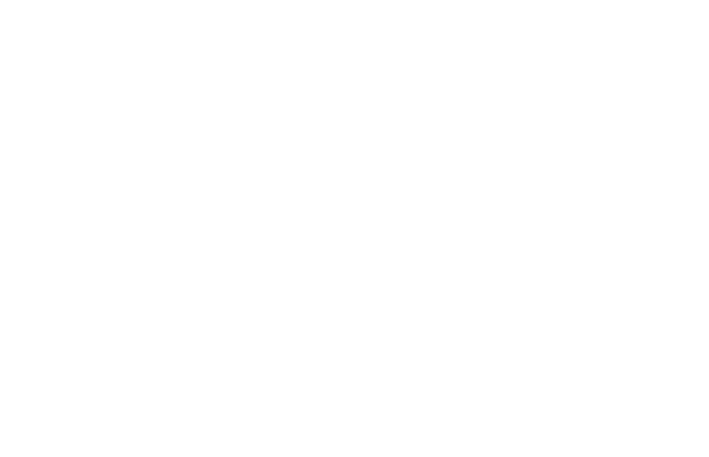
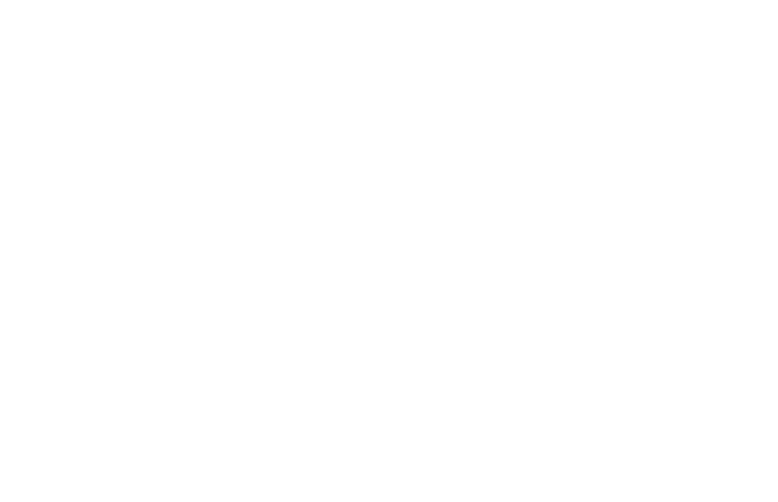
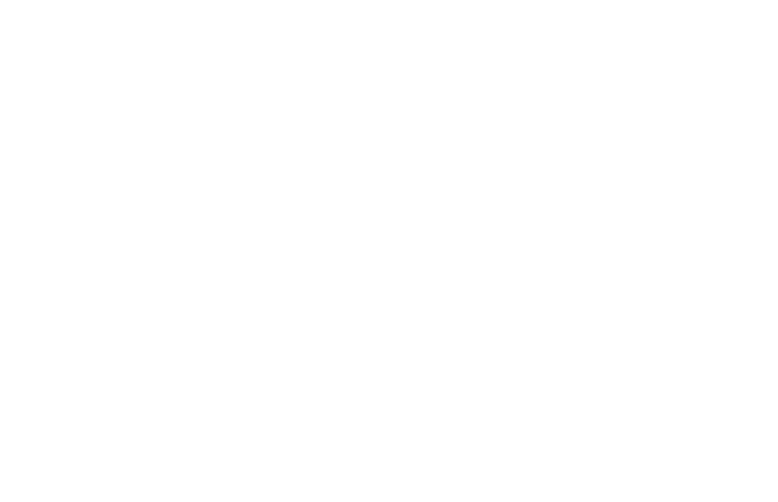
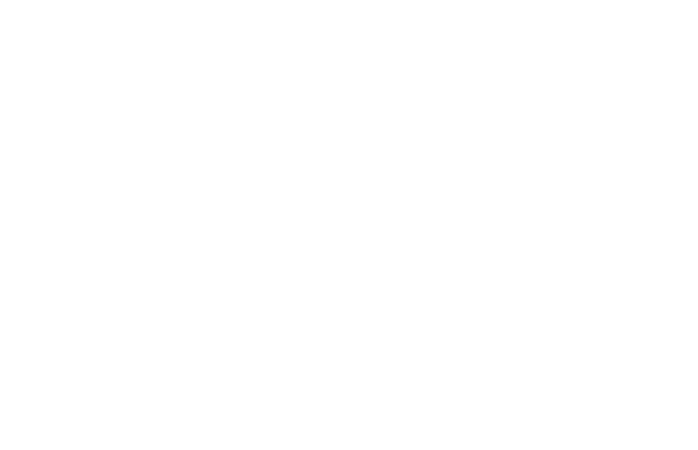

# UI Plugin src_v1 Test Report

## Test Environment

```text
<empty>
```

**Generated at:** Sat, 28 Feb 2026 09:00:39 -0800
**Version:** `ui-src-v1`
**Runner:** `test/src_v1`
**Status:** ✅ PASS
**Total Time:** `44.180031752s`

## Test Steps

| Step | Result | Duration |
|---|---|---|
| ui-quality-fmt-lint-build | ✅ PASS | `2.326560461s` |
| ui-build-and-go-serve | ✅ PASS | `10.508882499s` |
| ui-attach-context-cancel-diagnose | ✅ PASS | `4.706433271s` |
| ui-section-hero-via-menu | ✅ PASS | `3.302931356s` |
| ui-section-three-fullscreen-via-menu | ✅ PASS | `3.240550384s` |
| ui-section-three-calculator-via-menu | ✅ PASS | `3.265826046s` |
| ui-section-table-via-menu | ✅ PASS | `3.287630324s` |
| ui-section-camera-via-menu | ✅ PASS | `3.06850225s` |
| ui-section-docs-via-menu | ✅ PASS | `3.236330637s` |
| ui-section-terminal-via-menu | ✅ PASS | `3.26680749s` |
| ui-section-settings-via-menu | ✅ PASS | `3.334108323s` |

## Step Details

## ui-quality-fmt-lint-build

### Results

```text
result: PASS
duration: 2.326560461s
report: fmt-check, lint, and build passed
```

### Logs

```text
logs:
INFO: running command: /home/user/dialtone/dialtone.sh ui src_v1 install
INFO: stdout: >> Running: /home/user/dialtone_dependencies/bun/bin/bun install (in /home/user/dialtone/src/plugins/ui/src_v1/test/fixtures/app)
INFO: stdout: bun install v1.3.9 (cf6cdbbb)
INFO: stdout: Checked 22 installs across 69 packages (no changes) [1.00ms]
INFO: stderr: <empty>
INFO: running command: /home/user/dialtone/dialtone.sh ui src_v1 fmt-check
INFO: stdout: >> Running: /home/user/dialtone_dependencies/bun/bin/bun run fmt:check (in /home/user/dialtone/src/plugins/ui/src_v1/test/fixtures/app)
INFO: stdout: Checking formatting...
INFO: stdout: All matched files use Prettier code style!
INFO: stderr: $ prettier --check .
INFO: running command: /home/user/dialtone/dialtone.sh ui src_v1 lint
INFO: stdout: >> Running: /home/user/dialtone_dependencies/bun/bin/bun run lint (in /home/user/dialtone/src/plugins/ui/src_v1/test/fixtures/app)
INFO: stderr: $ tsc --noEmit
INFO: running command: /home/user/dialtone/dialtone.sh ui src_v1 build
INFO: stdout: >> Running: /home/user/dialtone_dependencies/bun/bin/bun run build (in /home/user/dialtone/src/plugins/ui/src_v1/test/fixtures/app)
INFO: stdout: vite v5.4.21 building for production...
INFO: stdout: transforming...
INFO: stdout: ✓ 12 modules transformed.
INFO: stdout: rendering chunks...
INFO: stdout: computing gzip size...
INFO: stdout: dist/index.html                   1.56 kB │ gzip:   0.47 kB
INFO: stdout: dist/assets/index-DU0jfcrJ.css   13.13 kB │ gzip:   3.51 kB
INFO: stdout: dist/assets/index-ZGf0pex0.js   510.71 kB │ gzip: 130.26 kB
INFO: stdout: ✓ built in 652ms
INFO: stderr: $ vite build
INFO: stderr: (!) Some chunks are larger than 500 kB after minification. Consider:
INFO: stderr: - Using dynamic import() to code-split the application
INFO: stderr: - Use build.rollupOptions.output.manualChunks to improve chunking: https://rollupjs.org/configuration-options/#output-manualchunks
INFO: stderr: - Adjust chunk size limit for this warning via build.chunkSizeWarningLimit.
INFO: report: fmt-check, lint, and build passed
PASS: [TEST][PASS] [STEP:ui-quality-fmt-lint-build] report: fmt-check, lint, and build passed
```

### Errors

```text
errors:
<empty>
```

### Browser Logs

```text
browser_logs:
<empty>
```

## ui-build-and-go-serve

### Results

```text
result: PASS
duration: 10.508882499s
report: fixture built, hero section loaded, legend header verified (attach=true)
```

### Error-Ping Check

```text
INFO: ERROR_PING: start browser_subject=logs.test.ui.src-v1.ui-build-and-go-serve.browser error_subject=logs.test.ui.src-v1.error
INFO: ERROR_PING: browser-topic-ok marker=__DIALTONE_ERROR_PING__:1772298000187384170
INFO: ERROR_PING: error-topic-ok marker=__DIALTONE_ERROR_PING__:1772298000187384170:error
INFO: ERROR_PING: pass browser_topic=true error_topic=true
```

### Logs

```text
logs:
INFO: STEP> begin ui-build-and-go-serve
INFO: LOOKING FOR: persistent ui dev server already running at http://127.0.0.1:5177
INFO: ERROR_PING: start browser_subject=logs.test.ui.src-v1.ui-build-and-go-serve.browser error_subject=logs.test.ui.src-v1.error
INFO: ERROR_PING: browser-topic-ok marker=__DIALTONE_ERROR_PING__:1772298000187384170
INFO: ERROR_PING: error-topic-ok marker=__DIALTONE_ERROR_PING__:1772298000187384170:error
INFO: ERROR_PING: pass browser_topic=true error_topic=true
INFO: saved browser debug config: /home/user/dialtone/src/plugins/ui/src_v1/test/browser.debug.json
INFO: report: fixture built, hero section loaded, legend header verified (attach=true)
PASS: [TEST][PASS] [STEP:ui-build-and-go-serve] report: fixture built, hero section loaded, legend header verified (attach=true)
```

### Errors

```text
errors:
<empty>
```

### Browser Logs

```text
browser_logs:
INFO: CONSOLE:debug: "[vite] connecting..."
INFO: CONSOLE:debug: "[vite] connected."
INFO: CONSOLE:log: "[SectionManager] NAVIGATING TO #hero"
INFO: CONSOLE:log: "[SectionManager] LOADING #hero"
INFO: CONSOLE:log: "[SectionManager] ctl.load() RESOLVED for #hero"
INFO: CONSOLE:log: "[SectionManager] LOADED #hero"
INFO: CONSOLE:log: "[SectionManager] START #hero"
INFO: CONSOLE:log: "[SectionManager] Setting data-ready=true on #hero"
INFO: CONSOLE:log: "[SectionManager] NAVIGATE TO #hero"
INFO: CONSOLE:log: "[SectionManager] RESUME #hero"
INFO: CONSOLE:debug: "[vite] connecting..."
INFO: CONSOLE:debug: "[vite] connected."
INFO: CONSOLE:log: "[SectionManager] NAVIGATING TO #hero"
INFO: CONSOLE:log: "[SectionManager] LOADING #hero"
INFO: CONSOLE:log: "[SectionManager] ctl.load() RESOLVED for #hero"
INFO: CONSOLE:log: "[SectionManager] LOADED #hero"
INFO: CONSOLE:log: "[SectionManager] START #hero"
INFO: CONSOLE:log: "[SectionManager] Setting data-ready=true on #hero"
INFO: CONSOLE:log: "[SectionManager] NAVIGATE TO #hero"
INFO: CONSOLE:log: "[SectionManager] RESUME #hero"
INFO: CONSOLE:log: "__DIALTONE_ERROR_PING__:1772298000187384170"
ERROR: CONSOLE:error: "__DIALTONE_ERROR_PING__:1772298000187384170:error"
INFO: CONSOLE:debug: "[vite] connecting..."
INFO: CONSOLE:debug: "[vite] connected."
INFO: CONSOLE:log: "[SectionManager] NAVIGATING TO #hero"
INFO: CONSOLE:log: "[SectionManager] LOADING #hero"
INFO: CONSOLE:log: "[SectionManager] ctl.load() RESOLVED for #hero"
INFO: CONSOLE:log: "[SectionManager] LOADED #hero"
INFO: CONSOLE:log: "[SectionManager] START #hero"
INFO: CONSOLE:log: "[SectionManager] Setting data-ready=true on #hero"
INFO: CONSOLE:log: "[SectionManager] NAVIGATE TO #hero"
INFO: CONSOLE:log: "[SectionManager] RESUME #hero"
INFO: CONSOLE:debug: "[vite] connecting..."
INFO: CONSOLE:debug: "[vite] connected."
INFO: CONSOLE:log: "[SectionManager] NAVIGATING TO #hero"
INFO: CONSOLE:log: "[SectionManager] LOADING #hero"
INFO: CONSOLE:log: "[SectionManager] ctl.load() RESOLVED for #hero"
INFO: CONSOLE:log: "[SectionManager] LOADED #hero"
INFO: CONSOLE:log: "[SectionManager] START #hero"
INFO: CONSOLE:log: "[SectionManager] Setting data-ready=true on #hero"
INFO: CONSOLE:log: "[SectionManager] NAVIGATE TO #hero"
INFO: CONSOLE:log: "[SectionManager] RESUME #hero"
INFO: CONSOLE:debug: "[vite] connecting..."
INFO: CONSOLE:debug: "[vite] connected."
INFO: CONSOLE:log: "[SectionManager] NAVIGATING TO #hero"
INFO: CONSOLE:log: "[SectionManager] LOADING #hero"
INFO: CONSOLE:log: "[SectionManager] ctl.load() RESOLVED for #hero"
INFO: CONSOLE:log: "[SectionManager] LOADED #hero"
INFO: CONSOLE:log: "[SectionManager] START #hero"
INFO: CONSOLE:log: "[SectionManager] Setting data-ready=true on #hero"
INFO: CONSOLE:log: "[SectionManager] NAVIGATE TO #hero"
INFO: CONSOLE:log: "[SectionManager] RESUME #hero"
```

### Screenshots


## ui-attach-context-cancel-diagnose

### Results

```text
result: PASS
duration: 4.706433271s
report: attach diagnostic passed: no context canceled across repeated browser evals
```

### Logs

```text
logs:
INFO: STEP> begin ui-attach-context-cancel-diagnose
INFO: LOOKING FOR: persistent ui dev server already running at http://127.0.0.1:5177
INFO: report: attach diagnostic passed: no context canceled across repeated browser evals
PASS: [TEST][PASS] [STEP:ui-attach-context-cancel-diagnose] report: attach diagnostic passed: no context canceled across repeated browser evals
```

### Errors

```text
errors:
<empty>
```

### Browser Logs

```text
browser_logs:
INFO: CONSOLE:debug: "[vite] connecting..."
INFO: CONSOLE:debug: "[vite] connected."
INFO: CONSOLE:log: "[SectionManager] NAVIGATING TO #hero"
INFO: CONSOLE:log: "[SectionManager] LOADING #hero"
INFO: CONSOLE:log: "[SectionManager] ctl.load() RESOLVED for #hero"
INFO: CONSOLE:log: "[SectionManager] LOADED #hero"
INFO: CONSOLE:log: "[SectionManager] START #hero"
INFO: CONSOLE:log: "[SectionManager] Setting data-ready=true on #hero"
INFO: CONSOLE:log: "[SectionManager] NAVIGATE TO #hero"
INFO: CONSOLE:log: "[SectionManager] RESUME #hero"
```

### Screenshots


## ui-section-hero-via-menu

### Results

```text
result: PASS
duration: 3.302931356s
report: section hero navigation verified
```

### Overlap

```text
INFO: OVERLAP: section=hero check=start
INFO: OVERLAP: section=hero none
```

### Logs

```text
logs:
INFO: STEP> begin ui-section-hero-via-menu
INFO: LOOKING FOR: persistent ui dev server already running at http://127.0.0.1:5177
INFO: OVERLAP: section=hero check=start
INFO: OVERLAP: section=hero none
INFO: report: section hero navigation verified
PASS: [TEST][PASS] [STEP:ui-section-hero-via-menu] report: section hero navigation verified
```

### Errors

```text
errors:
<empty>
```

### Browser Logs

```text
browser_logs:
INFO: CONSOLE:debug: "[vite] connecting..."
INFO: CONSOLE:debug: "[vite] connected."
INFO: CONSOLE:log: "[SectionManager] NAVIGATING TO #hero"
INFO: CONSOLE:log: "[SectionManager] LOADING #hero"
INFO: CONSOLE:log: "[SectionManager] ctl.load() RESOLVED for #hero"
INFO: CONSOLE:log: "[SectionManager] LOADED #hero"
INFO: CONSOLE:log: "[SectionManager] START #hero"
INFO: CONSOLE:log: "[SectionManager] Setting data-ready=true on #hero"
INFO: CONSOLE:log: "[SectionManager] NAVIGATE TO #hero"
INFO: CONSOLE:log: "[SectionManager] RESUME #hero"
INFO: CONSOLE:log: "[TEST_ACTION] click aria=Toggle Global Menu"
```

### Screenshots


## ui-section-three-fullscreen-via-menu

### Results

```text
result: PASS
duration: 3.240550384s
report: section three-fullscreen navigation verified
```

### Overlap

```text
INFO: OVERLAP: section=three-fullscreen check=start
INFO: OVERLAP: section=three-fullscreen none
```

### Logs

```text
logs:
INFO: STEP> begin ui-section-three-fullscreen-via-menu
INFO: LOOKING FOR: persistent ui dev server already running at http://127.0.0.1:5177
INFO: OVERLAP: section=three-fullscreen check=start
INFO: OVERLAP: section=three-fullscreen none
INFO: report: section three-fullscreen navigation verified
PASS: [TEST][PASS] [STEP:ui-section-three-fullscreen-via-menu] report: section three-fullscreen navigation verified
```

### Errors

```text
errors:
<empty>
```

### Browser Logs

```text
browser_logs:
INFO: CONSOLE:debug: "[vite] connecting..."
INFO: CONSOLE:debug: "[vite] connected."
INFO: CONSOLE:log: "[SectionManager] NAVIGATING TO #hero"
INFO: CONSOLE:log: "[SectionManager] LOADING #hero"
INFO: CONSOLE:log: "[SectionManager] ctl.load() RESOLVED for #hero"
INFO: CONSOLE:log: "[SectionManager] LOADED #hero"
INFO: CONSOLE:log: "[SectionManager] START #hero"
INFO: CONSOLE:log: "[SectionManager] Setting data-ready=true on #hero"
INFO: CONSOLE:log: "[SectionManager] NAVIGATE TO #hero"
INFO: CONSOLE:log: "[SectionManager] RESUME #hero"
INFO: CONSOLE:log: "[TEST_ACTION] click aria=Toggle Global Menu"
INFO: CONSOLE:log: "[TEST_ACTION] click aria=Navigate Three Fullscreen"
INFO: CONSOLE:log: "[SectionManager] NAVIGATING TO #three-fullscreen"
INFO: CONSOLE:log: "[SectionManager] LOADING #three-fullscreen"
INFO: CONSOLE:log: "[SectionManager] ctl.load() RESOLVED for #three-fullscreen"
INFO: CONSOLE:log: "[SectionManager] LOADED #three-fullscreen"
INFO: CONSOLE:log: "[SectionManager] START #three-fullscreen"
INFO: CONSOLE:log: "[SectionManager] Setting data-ready=true on #three-fullscreen"
INFO: CONSOLE:log: "[SectionManager] NAVIGATE AWAY #hero"
INFO: CONSOLE:log: "[SectionManager] PAUSE #hero"
INFO: CONSOLE:log: "[SectionManager] NAVIGATE TO #three-fullscreen"
INFO: CONSOLE:log: "[SectionManager] RESUME #three-fullscreen"
```

### Screenshots


## ui-section-three-calculator-via-menu

### Results

```text
result: PASS
duration: 3.265826046s
report: section three-calculator navigation verified
```

### Overlap

```text
INFO: OVERLAP: section=three-calculator check=start
INFO: OVERLAP: section=three-calculator none
```

### Logs

```text
logs:
INFO: STEP> begin ui-section-three-calculator-via-menu
INFO: LOOKING FOR: persistent ui dev server already running at http://127.0.0.1:5177
INFO: OVERLAP: section=three-calculator check=start
INFO: OVERLAP: section=three-calculator none
INFO: report: section three-calculator navigation verified
PASS: [TEST][PASS] [STEP:ui-section-three-calculator-via-menu] report: section three-calculator navigation verified
```

### Errors

```text
errors:
<empty>
```

### Browser Logs

```text
browser_logs:
INFO: CONSOLE:debug: "[vite] connecting..."
INFO: CONSOLE:debug: "[vite] connected."
INFO: CONSOLE:log: "[SectionManager] NAVIGATING TO #hero"
INFO: CONSOLE:log: "[SectionManager] LOADING #hero"
INFO: CONSOLE:log: "[SectionManager] ctl.load() RESOLVED for #hero"
INFO: CONSOLE:log: "[SectionManager] LOADED #hero"
INFO: CONSOLE:log: "[SectionManager] START #hero"
INFO: CONSOLE:log: "[SectionManager] Setting data-ready=true on #hero"
INFO: CONSOLE:log: "[SectionManager] NAVIGATE TO #hero"
INFO: CONSOLE:log: "[SectionManager] RESUME #hero"
INFO: CONSOLE:log: "[TEST_ACTION] click aria=Toggle Global Menu"
INFO: CONSOLE:log: "[TEST_ACTION] click aria=Navigate Three Calculator"
INFO: CONSOLE:log: "[SectionManager] NAVIGATING TO #three-calculator"
INFO: CONSOLE:log: "[SectionManager] LOADING #three-calculator"
INFO: CONSOLE:log: "[SectionManager] ctl.load() RESOLVED for #three-calculator"
INFO: CONSOLE:log: "[SectionManager] LOADED #three-calculator"
INFO: CONSOLE:log: "[SectionManager] START #three-calculator"
INFO: CONSOLE:log: "[SectionManager] Setting data-ready=true on #three-calculator"
INFO: CONSOLE:log: "[SectionManager] NAVIGATE AWAY #hero"
INFO: CONSOLE:log: "[SectionManager] PAUSE #hero"
INFO: CONSOLE:log: "[SectionManager] NAVIGATE TO #three-calculator"
INFO: CONSOLE:log: "[SectionManager] RESUME #three-calculator"
```

### Screenshots



## ui-section-table-via-menu

### Results

```text
result: PASS
duration: 3.287630324s
report: section table navigation verified
```

### Overlap

```text
INFO: OVERLAP: section=table check=start
INFO: OVERLAP: section=table none
```

### Logs

```text
logs:
INFO: STEP> begin ui-section-table-via-menu
INFO: LOOKING FOR: persistent ui dev server already running at http://127.0.0.1:5177
INFO: OVERLAP: section=table check=start
INFO: OVERLAP: section=table none
INFO: report: section table navigation verified
PASS: [TEST][PASS] [STEP:ui-section-table-via-menu] report: section table navigation verified
```

### Errors

```text
errors:
<empty>
```

### Browser Logs

```text
browser_logs:
INFO: CONSOLE:debug: "[vite] connecting..."
INFO: CONSOLE:debug: "[vite] connected."
INFO: CONSOLE:log: "[SectionManager] NAVIGATING TO #hero"
INFO: CONSOLE:log: "[SectionManager] LOADING #hero"
INFO: CONSOLE:log: "[SectionManager] ctl.load() RESOLVED for #hero"
INFO: CONSOLE:log: "[SectionManager] LOADED #hero"
INFO: CONSOLE:log: "[SectionManager] START #hero"
INFO: CONSOLE:log: "[SectionManager] Setting data-ready=true on #hero"
INFO: CONSOLE:log: "[SectionManager] NAVIGATE TO #hero"
INFO: CONSOLE:log: "[SectionManager] RESUME #hero"
INFO: CONSOLE:log: "[TEST_ACTION] click aria=Toggle Global Menu"
INFO: CONSOLE:log: "[TEST_ACTION] click aria=Navigate Table"
INFO: CONSOLE:log: "[SectionManager] NAVIGATING TO #table"
INFO: CONSOLE:log: "[SectionManager] LOADING #table"
INFO: CONSOLE:log: "[SectionManager] ctl.load() RESOLVED for #table"
INFO: CONSOLE:log: "[SectionManager] LOADED #table"
INFO: CONSOLE:log: "[SectionManager] START #table"
INFO: CONSOLE:log: "[SectionManager] Setting data-ready=true on #table"
INFO: CONSOLE:log: "[SectionManager] NAVIGATE AWAY #hero"
INFO: CONSOLE:log: "[SectionManager] PAUSE #hero"
INFO: CONSOLE:log: "[SectionManager] NAVIGATE TO #table"
INFO: CONSOLE:log: "[SectionManager] RESUME #table"
```

### Screenshots



## ui-section-camera-via-menu

### Results

```text
result: PASS
duration: 3.06850225s
report: section camera navigation verified
```

### Overlap

```text
INFO: OVERLAP: section=camera check=start
INFO: OVERLAP: section=camera none
```

### Logs

```text
logs:
INFO: STEP> begin ui-section-camera-via-menu
INFO: LOOKING FOR: persistent ui dev server already running at http://127.0.0.1:5177
INFO: OVERLAP: section=camera check=start
INFO: OVERLAP: section=camera none
INFO: report: section camera navigation verified
PASS: [TEST][PASS] [STEP:ui-section-camera-via-menu] report: section camera navigation verified
```

### Errors

```text
errors:
<empty>
```

### Browser Logs

```text
browser_logs:
INFO: CONSOLE:debug: "[vite] connecting..."
INFO: CONSOLE:debug: "[vite] connected."
INFO: CONSOLE:log: "[SectionManager] NAVIGATING TO #hero"
INFO: CONSOLE:log: "[SectionManager] LOADING #hero"
INFO: CONSOLE:log: "[SectionManager] ctl.load() RESOLVED for #hero"
INFO: CONSOLE:log: "[SectionManager] LOADED #hero"
INFO: CONSOLE:log: "[SectionManager] START #hero"
INFO: CONSOLE:log: "[SectionManager] Setting data-ready=true on #hero"
INFO: CONSOLE:log: "[SectionManager] NAVIGATE TO #hero"
INFO: CONSOLE:log: "[SectionManager] RESUME #hero"
INFO: CONSOLE:log: "[TEST_ACTION] click aria=Toggle Global Menu"
INFO: CONSOLE:log: "[TEST_ACTION] click aria=Navigate Camera"
INFO: CONSOLE:log: "[SectionManager] NAVIGATING TO #camera"
INFO: CONSOLE:log: "[SectionManager] LOADING #camera"
INFO: CONSOLE:log: "[SectionManager] ctl.load() RESOLVED for #camera"
INFO: CONSOLE:log: "[SectionManager] LOADED #camera"
INFO: CONSOLE:log: "[SectionManager] START #camera"
INFO: CONSOLE:log: "[SectionManager] Setting data-ready=true on #camera"
INFO: CONSOLE:log: "[SectionManager] NAVIGATE AWAY #hero"
INFO: CONSOLE:log: "[SectionManager] PAUSE #hero"
INFO: CONSOLE:log: "[SectionManager] NAVIGATE TO #camera"
INFO: CONSOLE:log: "[SectionManager] RESUME #camera"
```

### Screenshots



## ui-section-docs-via-menu

### Results

```text
result: PASS
duration: 3.236330637s
report: section docs navigation verified
```

### Overlap

```text
INFO: OVERLAP: section=docs check=start
INFO: OVERLAP: section=docs none
```

### Logs

```text
logs:
INFO: STEP> begin ui-section-docs-via-menu
INFO: LOOKING FOR: persistent ui dev server already running at http://127.0.0.1:5177
INFO: OVERLAP: section=docs check=start
INFO: OVERLAP: section=docs none
INFO: report: section docs navigation verified
PASS: [TEST][PASS] [STEP:ui-section-docs-via-menu] report: section docs navigation verified
```

### Errors

```text
errors:
<empty>
```

### Browser Logs

```text
browser_logs:
INFO: CONSOLE:debug: "[vite] connecting..."
INFO: CONSOLE:debug: "[vite] connected."
INFO: CONSOLE:log: "[SectionManager] NAVIGATING TO #hero"
INFO: CONSOLE:log: "[SectionManager] LOADING #hero"
INFO: CONSOLE:log: "[SectionManager] ctl.load() RESOLVED for #hero"
INFO: CONSOLE:log: "[SectionManager] LOADED #hero"
INFO: CONSOLE:log: "[SectionManager] START #hero"
INFO: CONSOLE:log: "[SectionManager] Setting data-ready=true on #hero"
INFO: CONSOLE:log: "[SectionManager] NAVIGATE TO #hero"
INFO: CONSOLE:log: "[SectionManager] RESUME #hero"
INFO: CONSOLE:log: "[TEST_ACTION] click aria=Toggle Global Menu"
INFO: CONSOLE:log: "[TEST_ACTION] click aria=Navigate Docs"
INFO: CONSOLE:log: "[SectionManager] NAVIGATING TO #docs"
INFO: CONSOLE:log: "[SectionManager] LOADING #docs"
INFO: CONSOLE:log: "[SectionManager] ctl.load() RESOLVED for #docs"
INFO: CONSOLE:log: "[SectionManager] LOADED #docs"
INFO: CONSOLE:log: "[SectionManager] START #docs"
INFO: CONSOLE:log: "[SectionManager] Setting data-ready=true on #docs"
INFO: CONSOLE:log: "[SectionManager] NAVIGATE AWAY #hero"
INFO: CONSOLE:log: "[SectionManager] PAUSE #hero"
INFO: CONSOLE:log: "[SectionManager] NAVIGATE TO #docs"
INFO: CONSOLE:log: "[SectionManager] RESUME #docs"
```

### Screenshots


## ui-section-terminal-via-menu

### Results

```text
result: PASS
duration: 3.26680749s
report: section terminal navigation verified
```

### Overlap

```text
INFO: OVERLAP: section=terminal check=start
INFO: OVERLAP: section=terminal none
```

### Logs

```text
logs:
INFO: STEP> begin ui-section-terminal-via-menu
INFO: LOOKING FOR: persistent ui dev server already running at http://127.0.0.1:5177
INFO: OVERLAP: section=terminal check=start
INFO: OVERLAP: section=terminal none
INFO: report: section terminal navigation verified
PASS: [TEST][PASS] [STEP:ui-section-terminal-via-menu] report: section terminal navigation verified
```

### Errors

```text
errors:
<empty>
```

### Browser Logs

```text
browser_logs:
INFO: CONSOLE:debug: "[vite] connecting..."
INFO: CONSOLE:debug: "[vite] connected."
INFO: CONSOLE:log: "[SectionManager] NAVIGATING TO #hero"
INFO: CONSOLE:log: "[SectionManager] LOADING #hero"
INFO: CONSOLE:log: "[SectionManager] ctl.load() RESOLVED for #hero"
INFO: CONSOLE:log: "[SectionManager] LOADED #hero"
INFO: CONSOLE:log: "[SectionManager] START #hero"
INFO: CONSOLE:log: "[SectionManager] Setting data-ready=true on #hero"
INFO: CONSOLE:log: "[SectionManager] NAVIGATE TO #hero"
INFO: CONSOLE:log: "[SectionManager] RESUME #hero"
INFO: CONSOLE:log: "[TEST_ACTION] click aria=Toggle Global Menu"
INFO: CONSOLE:log: "[TEST_ACTION] click aria=Navigate Terminal"
INFO: CONSOLE:log: "[SectionManager] NAVIGATING TO #terminal"
INFO: CONSOLE:log: "[SectionManager] LOADING #terminal"
INFO: CONSOLE:log: "[SectionManager] ctl.load() RESOLVED for #terminal"
INFO: CONSOLE:log: "[SectionManager] LOADED #terminal"
INFO: CONSOLE:log: "[SectionManager] START #terminal"
INFO: CONSOLE:log: "[SectionManager] Setting data-ready=true on #terminal"
INFO: CONSOLE:log: "[SectionManager] NAVIGATE AWAY #hero"
INFO: CONSOLE:log: "[SectionManager] PAUSE #hero"
INFO: CONSOLE:log: "[SectionManager] NAVIGATE TO #terminal"
INFO: CONSOLE:log: "[SectionManager] RESUME #terminal"
```

### Screenshots



## ui-section-settings-via-menu

### Results

```text
result: PASS
duration: 3.334108323s
report: section settings navigation verified
```

### Overlap

```text
INFO: OVERLAP: section=settings check=start
INFO: OVERLAP: section=settings overlay:menu/-(-) <-> button:-/-(-) area=2268.0px a=55.37%!b(MISSING)=7.40%!a(MISSING)llowedByMenu=true
INFO: OVERLAP: section=settings overlay:menu/-(-) <-> button:-/-(-) area=108.0px a=2.64%!b(MISSING)=0.35%!a(MISSING)llowedByMenu=true
```

### Logs

```text
logs:
INFO: STEP> begin ui-section-settings-via-menu
INFO: LOOKING FOR: persistent ui dev server already running at http://127.0.0.1:5177
INFO: OVERLAP: section=settings check=start
INFO: OVERLAP: section=settings overlay:menu/-(-) <-> button:-/-(-) area=2268.0px a=55.37%!b(MISSING)=7.40%!a(MISSING)llowedByMenu=true
INFO: OVERLAP: section=settings overlay:menu/-(-) <-> button:-/-(-) area=108.0px a=2.64%!b(MISSING)=0.35%!a(MISSING)llowedByMenu=true
INFO: report: section settings navigation verified
PASS: [TEST][PASS] [STEP:ui-section-settings-via-menu] report: section settings navigation verified
```

### Errors

```text
errors:
<empty>
```

### Browser Logs

```text
browser_logs:
INFO: CONSOLE:debug: "[vite] connecting..."
INFO: CONSOLE:debug: "[vite] connected."
INFO: CONSOLE:log: "[SectionManager] NAVIGATING TO #hero"
INFO: CONSOLE:log: "[SectionManager] LOADING #hero"
INFO: CONSOLE:log: "[SectionManager] ctl.load() RESOLVED for #hero"
INFO: CONSOLE:log: "[SectionManager] LOADED #hero"
INFO: CONSOLE:log: "[SectionManager] START #hero"
INFO: CONSOLE:log: "[SectionManager] Setting data-ready=true on #hero"
INFO: CONSOLE:log: "[SectionManager] NAVIGATE TO #hero"
INFO: CONSOLE:log: "[SectionManager] RESUME #hero"
INFO: CONSOLE:log: "[TEST_ACTION] click aria=Toggle Global Menu"
INFO: CONSOLE:log: "[TEST_ACTION] click aria=Navigate Settings"
INFO: CONSOLE:log: "[SectionManager] NAVIGATING TO #settings"
INFO: CONSOLE:log: "[SectionManager] LOADING #settings"
INFO: CONSOLE:log: "[SectionManager] ctl.load() RESOLVED for #settings"
INFO: CONSOLE:log: "[SectionManager] LOADED #settings"
INFO: CONSOLE:log: "[SectionManager] START #settings"
INFO: CONSOLE:log: "[SectionManager] Setting data-ready=true on #settings"
INFO: CONSOLE:log: "[SectionManager] NAVIGATE AWAY #hero"
INFO: CONSOLE:log: "[SectionManager] PAUSE #hero"
INFO: CONSOLE:log: "[SectionManager] NAVIGATE TO #settings"
INFO: CONSOLE:log: "[SectionManager] RESUME #settings"
```

### Screenshots


<!-- DIALTONE_CHROME_REPORT_START -->

## Chrome Report

- hostnode: `legion`
- chrome_count: `unknown`
- error: `remote browser inventory on legion failed: powershell command failed: exit status 1`

<!-- DIALTONE_CHROME_REPORT_END -->
